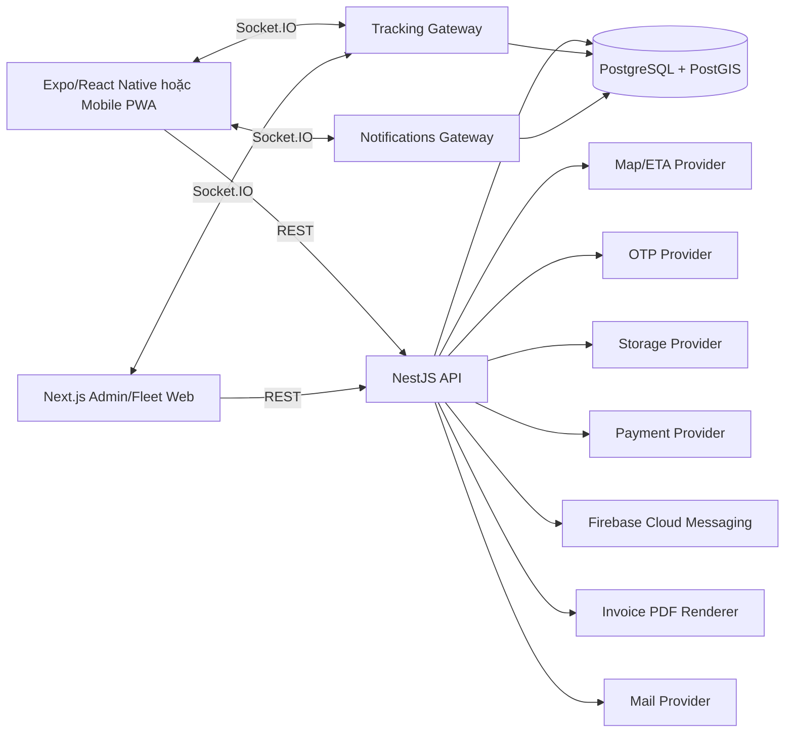

# Kiến trúc hệ thống

## Tổng quan

Frontend gồm mobile app/PWA cho Customer và Driver, cùng operations web cho Fleet Owner và Admin. Backend là modular monolith NestJS; Socket.IO gateway (tracking và notifications) chạy cùng deployment API trong pilot. PostgreSQL là nguồn dữ liệu chuẩn; provider ngoài được bọc qua interface và có demo implementation khi được cấu hình.

## Boundary

- Frontend quản lý presentation, form state và cache; không tự quyết định giá, lifecycle hoặc quyền.
- API quản lý business rules, authorization, transaction và provider orchestration.
- Database bảo đảm unique, foreign key và dữ liệu lịch sử.
- Socket gateway chỉ xác thực, nhận/phát event và gọi application service.

## Luồng đồng bộ

REST dùng prefix `/api/v1`. Response thành công trả resource trực tiếp hoặc pagination envelope. Lỗi dùng error envelope thống nhất trong `docs/api/03-error-codes.md`.

## Luồng realtime

Socket handshake dùng access token. Client join order room sau khi backend xác minh ownership/assignment/role. Tracking point được lưu trước khi broadcast.

Notifications dùng namespace Socket.IO riêng (`/notifications`, xem `NOTIFICATIONS_NAMESPACE` trong `packages/shared/src/socket.ts`). Khác với tracking, không có message nào client subscribe được sau khi kết nối — mỗi socket chỉ tự join room `user:<userId>` của chính mình khi xác thực thành công, nên không tồn tại đường nào để client join room của user khác. Ghi thông báo vào DB luôn xảy ra trước khi phát `notification:new`; client mất kết nối/offline không mất thông báo vì `GET /notifications` đọc thẳng từ DB, không phụ thuộc socket. Push (FCM) là kênh song song, không thay thế: gửi sau khi đã emit socket, thất bại của cả hai kênh đều bị log và nuốt, không bao giờ làm hỏng việc ghi thông báo đã persist trước đó. Push chỉ bật khi `FCM_ENABLED=true` và có `FIREBASE_PROJECT_ID`; mặc định tắt.

## Phát hành hóa đơn (invoice issuance)

Ngay sau khi transaction xác nhận thanh toán (`PaymentsService.confirmPayment`) commit chuyển `PaymentIntent` sang `PAID_MANUAL`, `PaymentsService` gọi `InvoiceIssuancePort.ensureInvoiceForPayment` — một port hẹp do `InvoicesModule` export, `PaymentsModule` chỉ phụ thuộc port này chứ không import trực tiếp `InvoicesController`/`InvoicesRepository` (giữ boundary một chiều, tránh circular module). Gọi này chạy **sau** commit, best-effort: lỗi phát hành hóa đơn (PDF render, storage, DB) không bao giờ làm hỏng một lần xác nhận thanh toán đã thành công — lỗi bị log và nuốt.

Mô hình phục hồi được chọn là **đồng bộ, thử lại khi replay** (pilot nhỏ, không dùng outbox/worker riêng): mọi lần gọi lại `confirmPayment` trên một `PaymentIntent` đã `PAID_MANUAL` (idempotent request hoặc admin xác nhận lại) đều gọi lại `ensureInvoiceForPayment`; nếu hóa đơn đã tồn tại thì trả về ngay (không tạo số/PDF thứ hai), nếu chưa có (lần phát hành đầu thất bại) thì thử phát hành lại. `GET /invoices/order/:orderId` áp dụng cùng cơ chế thử lại khi đọc.

`InvoicesService.ensureInvoice` không bao giờ giữ một DB transaction mở trong lúc upload PDF (cùng kỷ luật với `DriverContractService` ở tính năng hợp đồng tài xế): số hóa đơn được cấp phát nguyên tử trong một transaction ngắn riêng (`InvoiceSequence` upsert), PDF được render (`PdfService.renderInvoice`, cùng pipeline pdfkit/font tiếng Việt với hợp đồng tài xế) và upload lên `StorageProvider` **ngoài** transaction, rồi mới ghi dòng `Invoice`. Thua một race ghi (hai lần phát hành đồng thời cùng va vào unique constraint `orderId`) sẽ xóa file vừa upload và trả về dòng đã thắng race.

Gửi email là bước best-effort riêng, sau khi hóa đơn đã tồn tại: thất bại SMTP không làm mất hóa đơn, `emailSentAt` giữ `null` và khách hàng/hệ thống có thể gọi lại `POST /invoices/:id/send`. Không có email trên hồ sơ, `NotificationTriggers.notifyInvoiceEmailMissing` tạo một thông báo `SYSTEM` nhắc khách bổ sung email.

`InvoiceProvider` (`self` mặc định, hoặc `einvoice` — chưa triển khai, luôn ném lỗi rõ ràng khi được chọn) và `MailProvider` (`console` log link ở dev, hoặc `smtp` qua `nodemailer`) theo đúng pattern provider-abstraction sẵn có (`PaymentProvider`, `StorageProvider`).

## Quyết định pilot

- Modular monolith thay vì microservices.
- Một region và một primary database.
- Có thể scale API nhiều instance khi bổ sung Socket.IO Redis adapter; pilot mặc định một instance.
