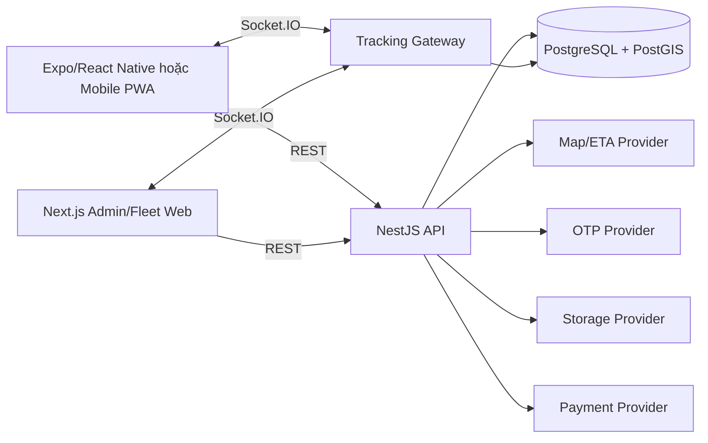

# Kiến trúc hệ thống

## Tổng quan

Frontend gồm mobile app/PWA cho Customer và Driver, cùng operations web cho Fleet Owner và Admin. Backend là modular monolith NestJS; Socket.IO gateway chạy cùng deployment API trong pilot. PostgreSQL là nguồn dữ liệu chuẩn; provider ngoài được bọc qua interface và có demo implementation khi được cấu hình.

## Boundary

- Frontend quản lý presentation, form state và cache; không tự quyết định giá, lifecycle hoặc quyền.
- API quản lý business rules, authorization, transaction và provider orchestration.
- Database bảo đảm unique, foreign key và dữ liệu lịch sử.
- Socket gateway chỉ xác thực, nhận/phát event và gọi application service.

## Luồng đồng bộ

REST dùng prefix `/api/v1`. Response thành công trả resource trực tiếp hoặc pagination envelope. Lỗi dùng error envelope thống nhất trong `docs/api/03-error-codes.md`.

## Luồng realtime

Socket handshake dùng access token. Client join order room sau khi backend xác minh ownership/assignment/role. Tracking point được lưu trước khi broadcast.

## Quyết định pilot

- Modular monolith thay vì microservices.
- Một region và một primary database.
- Có thể scale API nhiều instance khi bổ sung Socket.IO Redis adapter; pilot mặc định một instance.
