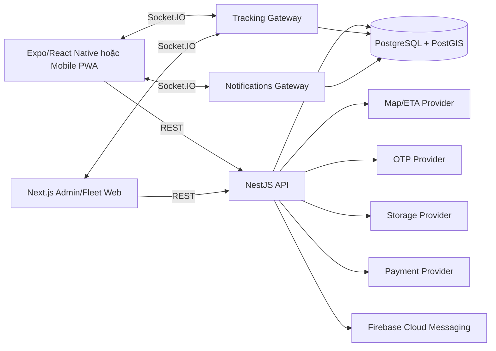

# Kiến trúc hệ thống

## Tổng quan

Frontend gồm mobile app/PWA cho Customer và Driver, cùng operations web cho Fleet Owner và Admin. Backend là modular monolith NestJS; Socket.IO gateway (tracking và notifications) chạy cùng deployment API trong pilot. PostgreSQL là nguồn dữ liệu chuẩn; provider ngoài được bọc qua interface và có demo implementation khi được cấu hình.

## Boundary

- Frontend quản lý presentation, form state và cache; không tự quyết định giá, lifecycle hoặc quyền.
- API quản lý business rules, authorization, transaction và provider orchestration.
- Database bảo đảm unique, foreign key và dữ liệu lịch sử.
- Socket gateway chỉ xác thực, nhận/phát event và gọi application service.

## Luồng đồng bộ

REST dùng prefix `/api/v1`. Response thành công trả resource trực tiếp hoặc pagination envelope. Lỗi dùng error envelope thống nhất trong `docs/api/03-error-codes.md`.

## Luồng realtime

Socket handshake dùng access token. Client join order room sau khi backend xác minh ownership/assignment/role. Tracking point được lưu trước khi broadcast.

Notifications dùng namespace Socket.IO riêng (`/notifications`, xem `NOTIFICATIONS_NAMESPACE` trong `packages/shared/src/socket.ts`). Khác với tracking, không có message nào client subscribe được sau khi kết nối — mỗi socket chỉ tự join room `user:<userId>` của chính mình khi xác thực thành công, nên không tồn tại đường nào để client join room của user khác. Ghi thông báo vào DB luôn xảy ra trước khi phát `notification:new`; client mất kết nối/offline không mất thông báo vì `GET /notifications` đọc thẳng từ DB, không phụ thuộc socket. Push (FCM) là kênh song song, không thay thế: gửi sau khi đã emit socket, thất bại của cả hai kênh đều bị log và nuốt, không bao giờ làm hỏng việc ghi thông báo đã persist trước đó. Push chỉ bật khi `FCM_ENABLED=true` và có `FIREBASE_PROJECT_ID`; mặc định tắt.

## Quyết định pilot

- Modular monolith thay vì microservices.
- Một region và một primary database.
- Có thể scale API nhiều instance khi bổ sung Socket.IO Redis adapter; pilot mặc định một instance.
