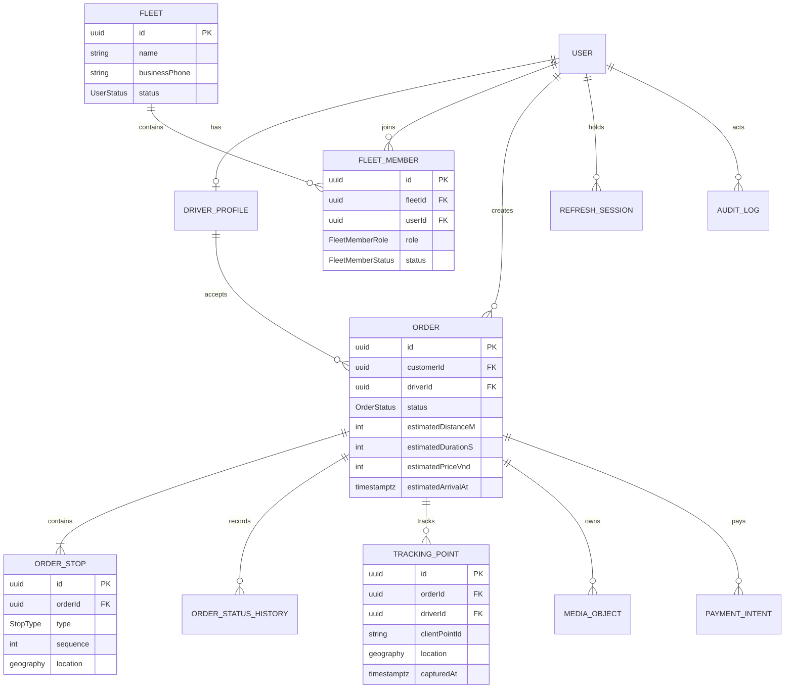

# Entity Relationship Diagram

```mermaid
erDiagram
  USER ||--o| DRIVER_PROFILE : has
  USER ||--o{ FLEET_MEMBER : joins
  FLEET ||--o{ FLEET_MEMBER : contains
  USER ||--o{ ORDER : creates
  DRIVER_PROFILE ||--o{ ORDER : accepts
  ORDER ||--|{ ORDER_STOP : contains
  ORDER ||--o{ ORDER_STATUS_HISTORY : records
  ORDER ||--o{ TRACKING_POINT : tracks
  ORDER ||--o{ MEDIA_OBJECT : owns
  ORDER ||--o{ PAYMENT_INTENT : pays
  USER ||--o{ REFRESH_SESSION : holds
  USER ||--o{ AUDIT_LOG : acts

  FLEET {
    uuid id PK
    string name
    string businessPhone
    UserStatus status
  }
  FLEET_MEMBER {
    uuid id PK
    uuid fleetId FK
    uuid userId FK
    FleetMemberRole role
    FleetMemberStatus status
  }
  ORDER {
    uuid id PK
    uuid customerId FK
    uuid driverId FK
    OrderStatus status
    int estimatedDistanceM
    int estimatedDurationS
    int estimatedPriceVnd
    timestamptz estimatedArrivalAt
  }
  ORDER_STOP {
    uuid id PK
    uuid orderId FK
    StopType type
    int sequence
    geography location
  }
  TRACKING_POINT {
    uuid id PK
    uuid orderId FK
    uuid driverId FK
    string clientPointId
    geography location
    timestamptz capturedAt
  }
```

Quan hệ và constraint chi tiết nằm trong `docs/data/01-database-design.md`. ERD này là mô hình logic; Prisma schema phải giữ nguyên enum và ownership đã định nghĩa.
