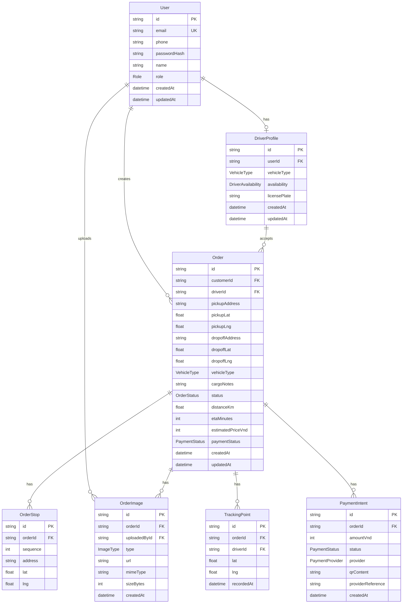

# LEOPARD Database Design and ERD

**Version:** 1.0  
**Date:** 2026-07-06  
**Source of truth:** `docs/srs-leopard-mvp.md`  
**Purpose:** Define database entities, relationships, enums, constraints, and seed data for implementation.

---

## 1. Database Goals

The database must support:

- Customer, Driver, Admin accounts.
- Shipment orders with pickup, dropoff, and up to 3 stops.
- Driver assignment and status lifecycle.
- Route summary and price estimate.
- Tracking point persistence.
- Cargo/delivery image metadata.
- QR payment intent metadata.
- Admin dashboard queries.

The MVP database must stay simple. Complex dispatch optimization, high-volume telemetry retention, and production analytics are out of scope.

---

## 2. Entity Relationship Diagram



---

## 3. Enums

### 3.1 Role

```text
CUSTOMER
DRIVER
ADMIN
```

### 3.2 VehicleType

```text
VAN
SMALL_TRUCK
MEDIUM_TRUCK
```

### 3.3 DriverAvailability

```text
AVAILABLE
BUSY
OFFLINE
```

### 3.4 OrderStatus

```text
REQUESTED
ACCEPTED
PICKING_UP
IN_TRANSIT
DELIVERED
CANCELLED
```

### 3.5 PaymentStatus

```text
UNPAID
QR_CREATED
PAID_DEMO
FAILED
```

### 3.6 ImageType

```text
CARGO
DELIVERY_CONFIRMATION
DOCUMENT
```

### 3.7 PaymentProvider

```text
DEMO
VIETQR
PAYOS
```

---

## 4. Table Specifications

### 4.1 User

| Column | Type | Required | Constraint | Notes |
| --- | --- | --- | --- | --- |
| id | String | Yes | Primary key | UUID/cuid. |
| email | String | Yes | Unique | Used for demo login. |
| phone | String | No | Unique when present | Used for OTP if enabled. |
| passwordHash | String | Yes | | Never store plaintext password. |
| name | String | Yes | | Display name. |
| role | Role | Yes | | CUSTOMER, DRIVER, ADMIN. |
| createdAt | DateTime | Yes | Default now | |
| updatedAt | DateTime | Yes | Auto update | |

Indexes:

- Unique `email`.
- Unique `phone` when present.
- Index `role`.

### 4.2 DriverProfile

| Column | Type | Required | Constraint | Notes |
| --- | --- | --- | --- | --- |
| id | String | Yes | Primary key | UUID/cuid. |
| userId | String | Yes | Unique FK User.id | One profile per driver user. |
| vehicleType | VehicleType | Yes | | MVP vehicle type. |
| availability | DriverAvailability | Yes | Default AVAILABLE | Driver operational state. |
| licensePlate | String | No | | Optional for demo. |
| createdAt | DateTime | Yes | Default now | |
| updatedAt | DateTime | Yes | Auto update | |

Indexes:

- Unique `userId`.
- Index `availability`.
- Index `vehicleType`.

### 4.3 Order

| Column | Type | Required | Constraint | Notes |
| --- | --- | --- | --- | --- |
| id | String | Yes | Primary key | UUID/cuid. |
| customerId | String | Yes | FK User.id | Creator must have CUSTOMER role. |
| driverId | String | No | FK DriverProfile.id | Null until accepted. |
| pickupAddress | String | Yes | | Human-readable address. |
| pickupLat | Decimal/Float | Yes | -90 to 90 | Latitude. |
| pickupLng | Decimal/Float | Yes | -180 to 180 | Longitude. |
| dropoffAddress | String | Yes | | Human-readable address. |
| dropoffLat | Decimal/Float | Yes | -90 to 90 | Latitude. |
| dropoffLng | Decimal/Float | Yes | -180 to 180 | Longitude. |
| vehicleType | VehicleType | Yes | | Requested vehicle. |
| cargoNotes | String | No | | Notes from customer. |
| status | OrderStatus | Yes | Default REQUESTED | Order lifecycle state. |
| distanceKm | Decimal/Float | Yes | >= 0 | MVP route distance. |
| etaMinutes | Int | Yes | >= 0 | MVP ETA. |
| estimatedPriceVnd | Int | Yes | >= 0 | MVP price estimate. |
| paymentStatus | PaymentStatus | Yes | Default UNPAID | Latest payment state. |
| createdAt | DateTime | Yes | Default now | |
| updatedAt | DateTime | Yes | Auto update | |

Indexes:

- Index `customerId`.
- Index `driverId`.
- Index `status`.
- Index `paymentStatus`.
- Index `createdAt`.

### 4.4 OrderStop

| Column | Type | Required | Constraint | Notes |
| --- | --- | --- | --- | --- |
| id | String | Yes | Primary key | UUID/cuid. |
| orderId | String | Yes | FK Order.id | Cascade delete with order if needed. |
| sequence | Int | Yes | 1 to 3 | Stop order. |
| address | String | Yes | | Human-readable address. |
| lat | Decimal/Float | Yes | -90 to 90 | Latitude. |
| lng | Decimal/Float | Yes | -180 to 180 | Longitude. |

Constraints:

- Unique `(orderId, sequence)`.
- Maximum 3 stops enforced in service layer.

### 4.5 OrderImage

| Column | Type | Required | Constraint | Notes |
| --- | --- | --- | --- | --- |
| id | String | Yes | Primary key | UUID/cuid. |
| orderId | String | Yes | FK Order.id | |
| uploadedById | String | Yes | FK User.id | |
| type | ImageType | Yes | | CARGO, DELIVERY_CONFIRMATION, DOCUMENT. |
| url | String | Yes | | Local path or S3 URL. |
| mimeType | String | Yes | | Example: image/jpeg. |
| sizeBytes | Int | Yes | > 0 | |
| createdAt | DateTime | Yes | Default now | |

Indexes:

- Index `orderId`.
- Index `uploadedById`.
- Index `type`.

### 4.6 TrackingPoint

| Column | Type | Required | Constraint | Notes |
| --- | --- | --- | --- | --- |
| id | String | Yes | Primary key | UUID/cuid. |
| orderId | String | Yes | FK Order.id | |
| driverId | String | Yes | FK DriverProfile.id | |
| lat | Decimal/Float | Yes | -90 to 90 | |
| lng | Decimal/Float | Yes | -180 to 180 | |
| recordedAt | DateTime | Yes | Default now | |

Indexes:

- Index `orderId`.
- Index `(orderId, recordedAt)`.
- Index `driverId`.

### 4.7 PaymentIntent

| Column | Type | Required | Constraint | Notes |
| --- | --- | --- | --- | --- |
| id | String | Yes | Primary key | UUID/cuid. |
| orderId | String | Yes | FK Order.id | |
| amountVnd | Int | Yes | > 0 | Usually equals estimated price. |
| status | PaymentStatus | Yes | | QR_CREATED for MVP creation. |
| provider | PaymentProvider | Yes | | DEMO, VIETQR, PAYOS. |
| qrContent | String | Yes | | QR payload or URL. |
| providerReference | String | No | | External provider ID if available. |
| createdAt | DateTime | Yes | Default now | |

Indexes:

- Index `orderId`.
- Index `status`.
- Index `provider`.

---

## 5. Prisma Schema Draft

```prisma
enum Role {
  CUSTOMER
  DRIVER
  ADMIN
}

enum VehicleType {
  VAN
  SMALL_TRUCK
  MEDIUM_TRUCK
}

enum DriverAvailability {
  AVAILABLE
  BUSY
  OFFLINE
}

enum OrderStatus {
  REQUESTED
  ACCEPTED
  PICKING_UP
  IN_TRANSIT
  DELIVERED
  CANCELLED
}

enum PaymentStatus {
  UNPAID
  QR_CREATED
  PAID_DEMO
  FAILED
}

enum ImageType {
  CARGO
  DELIVERY_CONFIRMATION
  DOCUMENT
}

enum PaymentProvider {
  DEMO
  VIETQR
  PAYOS
}

model User {
  id           String       @id @default(cuid())
  email        String       @unique
  phone        String?      @unique
  passwordHash String
  name         String
  role         Role
  driver       DriverProfile?
  orders       Order[]      @relation("CustomerOrders")
  uploads      OrderImage[]
  createdAt    DateTime     @default(now())
  updatedAt    DateTime     @updatedAt

  @@index([role])
}

model DriverProfile {
  id           String             @id @default(cuid())
  userId       String             @unique
  user         User               @relation(fields: [userId], references: [id])
  vehicleType  VehicleType
  availability DriverAvailability @default(AVAILABLE)
  licensePlate String?
  orders       Order[]
  tracking     TrackingPoint[]
  createdAt    DateTime           @default(now())
  updatedAt    DateTime           @updatedAt

  @@index([availability])
  @@index([vehicleType])
}

model Order {
  id                String          @id @default(cuid())
  customerId        String
  customer          User            @relation("CustomerOrders", fields: [customerId], references: [id])
  driverId          String?
  driver            DriverProfile?  @relation(fields: [driverId], references: [id])
  pickupAddress     String
  pickupLat         Float
  pickupLng         Float
  dropoffAddress    String
  dropoffLat        Float
  dropoffLng        Float
  vehicleType       VehicleType
  cargoNotes        String?
  status            OrderStatus     @default(REQUESTED)
  distanceKm        Float
  etaMinutes        Int
  estimatedPriceVnd Int
  paymentStatus     PaymentStatus   @default(UNPAID)
  stops             OrderStop[]
  images            OrderImage[]
  trackingPoints    TrackingPoint[]
  paymentIntents    PaymentIntent[]
  createdAt         DateTime        @default(now())
  updatedAt         DateTime        @updatedAt

  @@index([customerId])
  @@index([driverId])
  @@index([status])
  @@index([paymentStatus])
  @@index([createdAt])
}

model OrderStop {
  id       String @id @default(cuid())
  orderId  String
  order    Order  @relation(fields: [orderId], references: [id])
  sequence Int
  address  String
  lat      Float
  lng      Float

  @@unique([orderId, sequence])
}

model OrderImage {
  id           String    @id @default(cuid())
  orderId      String
  order        Order     @relation(fields: [orderId], references: [id])
  uploadedById String
  uploadedBy   User      @relation(fields: [uploadedById], references: [id])
  type         ImageType
  url          String
  mimeType     String
  sizeBytes    Int
  createdAt    DateTime  @default(now())

  @@index([orderId])
  @@index([uploadedById])
  @@index([type])
}

model TrackingPoint {
  id         String        @id @default(cuid())
  orderId    String
  order      Order         @relation(fields: [orderId], references: [id])
  driverId   String
  driver     DriverProfile @relation(fields: [driverId], references: [id])
  lat        Float
  lng        Float
  recordedAt DateTime      @default(now())

  @@index([orderId])
  @@index([orderId, recordedAt])
  @@index([driverId])
}

model PaymentIntent {
  id                String          @id @default(cuid())
  orderId           String
  order             Order           @relation(fields: [orderId], references: [id])
  amountVnd         Int
  status            PaymentStatus
  provider          PaymentProvider
  qrContent         String
  providerReference String?
  createdAt         DateTime        @default(now())

  @@index([orderId])
  @@index([status])
  @@index([provider])
}
```

---

## 6. Seed Data Requirements

Demo accounts:

| Role | Email | Password | Name |
| --- | --- | --- | --- |
| Customer | customer@leopard.demo | Password123! | Demo Customer |
| Driver | driver@leopard.demo | Password123! | Demo Driver |
| Admin | admin@leopard.demo | Password123! | Demo Admin |

Driver profile:

| Field | Value |
| --- | --- |
| vehicleType | SMALL_TRUCK |
| availability | AVAILABLE |
| licensePlate | 43C-12345 |

Demo addresses:

| Label | Address | Lat | Lng |
| --- | --- | --- | --- |
| FPT University Da Nang | Khu đô thị FPT City, Đà Nẵng | 15.9759 | 108.2529 |
| Dragon Bridge | Cầu Rồng, Đà Nẵng | 16.0610 | 108.2278 |
| Da Nang Airport | Sân bay Quốc tế Đà Nẵng | 16.0439 | 108.1994 |
| Han Market | Chợ Hàn, Đà Nẵng | 16.0682 | 108.2240 |

---

## 7. Data Access Rules

| Actor | Access |
| --- | --- |
| Customer | Read/write own orders; create payment intent for own orders; upload cargo image to own orders. |
| Driver | Read requested orders; read/update assigned orders; send tracking for assigned orders; upload delivery image for assigned orders. |
| Admin | Read all users, drivers, orders, images, tracking points, and payments. |

Rules:

- Backend must enforce access rules even if frontend hides buttons.
- Driver cannot update unassigned order.
- Customer cannot view another customer's order.
- Admin endpoints require Admin role.

---

## 8. Migration Rules

- Every schema change must be represented by Prisma migration.
- Seed script must be repeatable in local development.
- Demo passwords must be hashed in seed, not stored as plaintext.
- Migrations must not require third-party API credentials.

---

## 9. Query Patterns

Admin order list:

- Filter by `status`.
- Sort by `createdAt desc`.
- Include customer, driver, and payment status.

Customer order list:

- Filter by `customerId`.
- Sort by `createdAt desc`.

Driver available order list:

- Filter by `status = REQUESTED`.
- Sort by `createdAt asc` or `createdAt desc`.

Latest tracking point:

- Filter by `orderId`.
- Sort by `recordedAt desc`.
- Limit 1.

---

## 10. Data Validation Checklist

- Email format is valid.
- Password is hashed.
- Role is valid.
- Stop count is 0 to 3.
- Stop sequence is unique per order.
- Latitude and longitude are in valid ranges.
- Status transition is valid.
- File size is within configured limit.
- File MIME type is allowed.
- Payment amount is positive.

