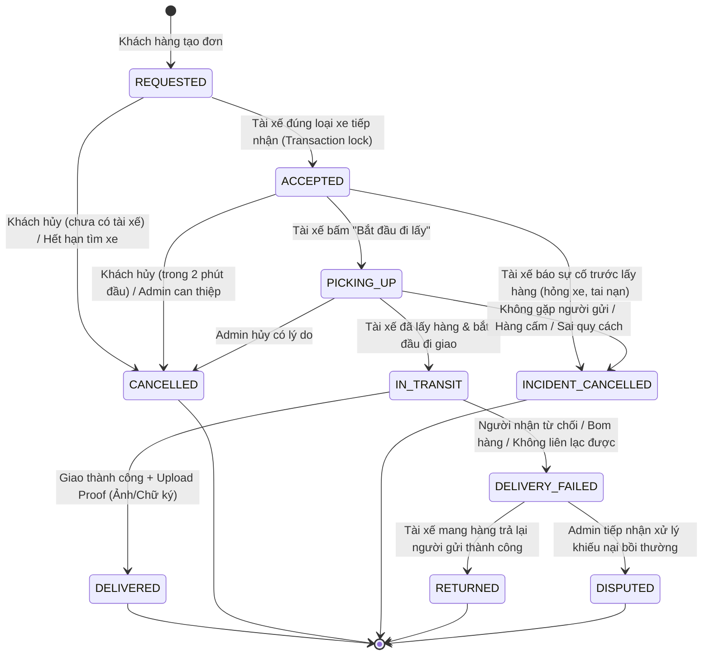

# ĐẶC TẢ NGHIỆP VỤ LOGISTICS CHUẨN HÓA & ĐỀ XUẤT ĐIỀU CHỈNH HỆ THỐNG
## (Logistics Business Logic & Operational Rules Specification)

> **Mã tài liệu:** `DOCS-REQ-06-LOGISTICS-SPEC`  
> **Phiên bản:** `1.0.0`  
> **Ngày ban hành:** 11/09/2026  
> **Dự án:** LEOPARD Logistics Platform (Mini-production Pilot)  
> **Căn cứ:** Đối chiếu từ Báo cáo kiểm toán `09-system-audit-loopholes-and-business-logic-flaws-report.md`, SRS `01-srs.md`, và thực tiễn vận hành logistics chặng cuối (Last-mile Delivery) tại Việt Nam.  
> **Trạng thái:** Sẵn sàng thực thi (Ready for Implementation)  

---

## 1. MỤC TIÊU VÀ NGUYÊN TẮC THIẾT KẾ NGHIỆP VỤ

Tài liệu này xác lập các chuẩn mực nghiệp vụ vận hành thực tế cho nền tảng LEOPARD, khắc phục toàn diện các điểm nghẽn, bẫy lỗi và lỗ hổng quy trình đã phát hiện trong quá trình kiểm toán.

### Nguyên tắc cốt lõi:
1. **Không có "ngõ cụt" vận hành (Zero Deadlock):** Mọi vai trò (đặc biệt là Tài xế ngoài đường) luôn có lối thoát hợp lệ khi gặp sự cố thực tế (nổ lốp, tai nạn, khách bom hàng, sai địa chỉ), không bị giam trạng thái vĩnh viễn.
2. **Toàn vẹn và chính xác về phương tiện (Vehicle Integrity):** Đơn hàng loại xe nào chỉ được điều phối và chỉ cho phép tài xế sở hữu đúng loại xe đó tiếp nhận. Tuyệt đối không để xe máy nhận hàng xe tải.
3. **Liên lạc thời gian thực trung thực (Real Identity & Telephony):** Mọi thông tin liên hệ giữa Người gửi, Tài xế và Người nhận phải là số điện thoại thật, địa chỉ thật. Tuyệt đối cấm sử dụng số giả định (`19001234`, `0901234567`) hoặc dữ liệu mẫu (`Xi măng 250kg`) trên môi trường sản xuất.
4. **Bảo vệ tài chính và tuân thủ hóa đơn (Financial Soundness):** Không chấp nhận thanh toán hoặc phát hành hóa đơn đỏ cho đơn hàng đã hủy; xử lý minh bạch các giao dịch lệch tiền.
5. **Cơ chế kiểm soát phân quyền nghiêm ngặt (Strict RBAC & Tenant Isolation):** Fleet Owner chỉ được đọc dữ liệu của tài xế thuộc đội xe của mình; cấm hoàn toàn hành vi khai thác IDOR để đọc dữ liệu chéo.

---

## 2. VÒNG ĐỜI ĐƠN HÀNG MỞ RỘNG (EXTENDED ORDER LIFECYCLE)

### 2.1. Sơ đồ trạng thái hoàn chỉnh có luồng xử lý sự cố (Complete State Machine)

### 2.2. Bảng ma trận chuyển trạng thái & Quyền hạn (State Transition Matrix)

| Trạng thái hiện tại | Trạng thái tiếp theo | Actor được phép | Điều kiện tiên quyết & Dữ liệu bắt buộc | Giải phóng Tài xế? |
| :--- | :--- | :--- | :--- | :---: |
| `REQUESTED` | `ACCEPTED` | `DRIVER` | Driver `AVAILABLE`, đúng `vehicleType`, không có đơn active. | Chuyển sang `BUSY` |
| `REQUESTED` | `CANCELLED` | `CUSTOMER`, `ADMIN` | Customer chỉ hủy được khi chưa có driver. Admin hủy phải có `reason`. | Không áp dụng |
| `ACCEPTED` | `PICKING_UP` | `DRIVER` | Phải là Assigned Driver. Kích hoạt live tracking. | Vẫn `BUSY` |
| `ACCEPTED` | `INCIDENT_CANCELLED` | `DRIVER` | Lý do sự cố bắt buộc (`VEHICLE_BREAKDOWN`, `ACCIDENT`, `FORCE_MAJEURE`). | Về `AVAILABLE`/`OFFLINE` |
| `ACCEPTED` | `CANCELLED` | `CUSTOMER` (giới hạn), `ADMIN` | Customer chỉ được hủy trong vòng 2 phút nếu tài xế chưa di chuyển quá 200m; Admin hủy có lý do. | Về `AVAILABLE` |
| `PICKING_UP` | `IN_TRANSIT` | `DRIVER` | Phải là Assigned Driver; xác nhận đã nhận hàng trên tay/xe. | Vẫn `BUSY` |
| `PICKING_UP` | `INCIDENT_CANCELLED` | `DRIVER` | Lý do bắt buộc (`SENDER_UNREACHABLE`, `PROHIBITED_CARGO`, `OVERWEIGHT`). | Về `AVAILABLE` |
| `PICKING_UP` | `CANCELLED` | `ADMIN` | Chỉ Admin sau khi gọi xác nhận với cả 2 bên. | Về `AVAILABLE` |
| `IN_TRANSIT` | `DELIVERED` | `DRIVER` | **Bắt buộc có ít nhất 1 ảnh Proof of Delivery (POD) hợp lệ**. | Về `AVAILABLE`/`OFFLINE` |
| `IN_TRANSIT` | `DELIVERY_FAILED` | `DRIVER` | Lý do bắt buộc (`RECEIVER_REJECTED`, `RECEIVER_UNREACHABLE_3_TIMES`, `WRONG_ADDRESS`). Bắt buộc chụp ảnh xác thực tại điểm giao. | Vẫn `BUSY` (chờ hoàn) |
| `DELIVERY_FAILED` | `RETURNED` | `DRIVER` | Mang hàng trả lại người gửi, chụp ảnh xác nhận trả hàng. | Về `AVAILABLE` |

---

## 3. CẤU TRÚC DỮ LIỆU ĐƠN HÀNG THỰC ĐỊA (FIELD DATA MODEL)

### 3.1. Phân định thông tin liên lạc đa bên (Multi-party Contacts)
Mỗi đơn hàng phải phân định rõ ràng 3 thực thể liên lạc độc lập:

1. **Khách hàng đặt đơn (Ordering Customer):** Người thanh toán và theo dõi tiến độ (`User.id`, `User.name`, `User.phone`).
2. **Người gửi hàng tại điểm lấy (Sender):**
   - `senderName`: Tên người trực tiếp giao kiện hàng cho tài xế.
   - `senderPhone`: Số điện thoại di động người gửi (định dạng chuẩn E.164 hoặc số nội địa Việt Nam 10 chữ số).
   - `pickupNote`: Ghi chú lấy hàng (ví dụ: *Vào ngõ rẽ trái, bấm chuông nhà màu xanh*).
3. **Người nhận hàng tại điểm giao (Recipient):**
   - `receiverName`: Tên người nhận hàng.
   - `receiverPhone`: Số điện thoại người nhận để tài xế gọi khi tới nơi.
   - `dropoffNote`: Ghi chú giao hàng (ví dụ: *Giao giờ hành chính, gọi trước 15 phút*).

### 3.2. Chuẩn hóa Loại phương tiện & Quy cách hàng hóa (Vehicle & Cargo Specs)
- **Loại phương tiện (`VehicleType`):** Bắt buộc phải lưu trong bảng `Order` (gồm: `MOTORBIKE`, `VAN`, `TRUCK`).
- **Thông số tải trọng:**
  - `MOTORBIKE`: Tối đa 30kg, kích thước tối đa 50x40x50 cm.
  - `VAN`: Tải trọng 500kg - 1000kg, phù hợp đồ đạc gia đình vừa phải.
  - `TRUCK`: Tải trọng 1.5 tấn - 5 tấn, chở hàng nặng, máy móc, vật liệu.
- **Dịch vụ đi kèm (`requiresLoadingSupport`):** Boolean. Nếu khách hàng chọn "Bốc xếp", cước phí phải tính phụ phí bốc xếp và ghi chú rõ ràng cho tài xế chuẩn bị thể lực/dụng cụ. Không tự ý hiển thị "Có bốc xếp 2 đầu" nếu khách không chọn.

### 3.3. Quản trị đơn hàng nhiều điểm dừng (Multi-Stop Execution Model)
Khi đơn có 1-3 điểm dừng trung gian (`OrderStop`):
- Mỗi điểm dừng có `sequence` (1, 2, 3) và `type` (`STOP`, `DROPOFF`).
- Mỗi điểm dừng có `recipientName`, `recipientPhone` riêng.
- Mỗi điểm dừng có trạng thái độc lập: `PENDING` -> `ARRIVED` -> `COMPLETED` / `FAILED`.
- Tài xế phải hoàn tất hoặc đánh dấu thất bại từng điểm dừng theo đúng thứ tự lộ trình (sequence).

---

## 4. QUY TẮC ĐIỀU PHỐI VÀ RADAR TÌM XE (DISPATCH & RADAR RULES)

### 4.1. Thuật toán Lọc Tài xế Ứng viên (Candidate Selection Algorithm)
Khi đơn hàng được tạo ở trạng thái `REQUESTED`, `DispatchService` phải quét tài xế thỏa mãn **đồng thời cả 4 điều kiện**:
1. **Trạng thái:** `driverProfile.availability = 'AVAILABLE'`.
2. **Khớp loại xe (Strict Vehicle Match):** `driverProfile.vehicleType === order.vehicleType`. Tuyệt đối không gửi đơn xe tải cho xe máy và ngược lại.
3. **Độ tươi mới của vị trí (Heartbeat Liveness):** `driverProfile.lastKnownAt >= NOW() - INTERVAL '90 seconds'`.
4. **Khoảng cách địa lý:** `ST_DWithin(driverProfile.lastKnownLocation, order.pickupLocation, 3000)` (trong bán kính 3km).

### 4.2. Cơ chế Định vị Kép của Tài xế (Heartbeat + Distance Threshold)
Để loại bỏ lỗi tài xế đứng yên bị "bốc hơi" khỏi radar sau 90 giây:
- Ứng dụng Driver chạy background/foreground ping với 2 điều kiện kích hoạt gửi tọa độ:
  - **Điều kiện Di chuyển:** Di chuyển trên 25 mét kể từ lần gửi gần nhất (`distance >= 25m`).
  - **Điều kiện Nhịp tim thời gian (Heartbeat):** Quá 45 giây kể từ lần gửi gần nhất (`timeSinceLastPing >= 45s`), dù đứng yên vẫn bắt buộc gửi ping để server cập nhật `lastKnownAt = NOW()`.

### 4.3. Quy trình Bắn đơn (Push Offer) & Nhận đơn an toàn
- Đơn được bắn qua WebSocket namespace `/dispatch` tới tối đa 6 tài xế phù hợp nhất.
- Thời gian hiển thị cuốc (Offer Timeout): **25 giây**.
- Giao diện nổ cuốc trên app tài xế hiển thị đầy đủ: Loại xe, Quãng đường lấy hàng, Quãng đường giao hàng, Cước thực nhận dự kiến, Khối lượng hàng.
- Nút bấm tiếp nhận: Thao tác 1 chạm có xác nhận, gửi lệnh `POST /driver/orders/:id/accept`.
- Database sử dụng row-lock transaction: Tài xế đầu tiên chuyển thành công `order.status = 'ACCEPTED'` và gán `driverProfile.availability = 'BUSY'` sẽ chiến thắng. Các tài xế sau nhận thông báo thân thiện: *"Đơn hàng đã được tài xế khác tiếp nhận"*.

---

## 5. QUY TẮC XÁC THỰC, ONBOARDING VÀ BẢO MẬT (AUTH & KYC SECURITY)

### 5.1. Cơ chế Tiếp tục nộp KYC khi gặp lỗi mạng (Resumable KYC Onboarding)
- Khi tài xế gửi hồ sơ đăng ký:
  - Lần 1: Gọi `POST /driver/apply` ghi nhận thông tin cơ bản và tạo hợp đồng ký điện tử -> Hồ sơ chuyển sang `PENDING_APPROVAL`.
  - Tiếp theo: Tải 3 ảnh tài liệu (`LICENSE`, `VEHICLE_REGISTRATION`, `ID_CARD`).
- **Cơ chế phục hồi (Recovery):** Nếu việc upload bất kỳ ảnh nào bị lỗi mạng:
  - Form không được gọi lại `POST /driver/apply` (tránh dính lỗi 409 Conflict).
  - Client kiểm tra các tài liệu đã tải lên thành công qua `GET /driver/documents`.
  - Nút "Thử lại" chỉ kích hoạt tải lên các tài liệu còn thiếu cho đến khi đủ 3/3 tài liệu.

### 5.2. Tiêu chuẩn Thẩm định Hồ sơ Tài xế của Admin (Mandatory KYC Approval Gate)
Admin chỉ được duyệt tài khoản tài xế sang `ACTIVE` khi hệ thống kiểm chứng thỏa mãn:
1. Đã ký hợp đồng điện tử (`contractSignedAt !== null`).
2. Có đủ tối thiểu 3 ảnh chứng từ trong bảng `DriverDocument`:
   - 1 ảnh Giấy phép lái xe (`LICENSE`).
   - 1 ảnh Cà-vẹt đăng ký xe (`VEHICLE_REGISTRATION`).
   - 1 ảnh Căn cước công dân (`ID_CARD`).
3. Đầy đủ biển số xe (`licensePlate`) và số giấy phép (`licenseNumber`).
Nếu thiếu bất kỳ tiêu chí nào, API `/admin/drivers/:id/approve` phải ném lỗi `422 DRIVER_DOCUMENTS_INCOMPLETE` và chặn thao tác duyệt.

### 5.3. Bảo toàn Phiên làm việc Tài xế (Driver Session Persistence)
- Khi mở ứng dụng Driver:
  1. Đọc `refreshToken` và `role` từ SecureStore qua `sessionStore.hydrate()`.
  2. Nếu có `refreshToken` hợp lệ nhưng chưa có `accessToken` trong RAM: Tự động gọi `refreshSession()` lấy cặp token mới.
  3. Chỉ điều hướng về màn hình Login khi refresh token bị hết hạn hoặc bị thu hồi (HTTP 401). Tuyệt đối không tự ý logout tài xế khi họ khởi động lại máy hoặc tắt mở app.

### 5.4. Chống Lỗ hổng IDOR Media của Fleet Owner
- Khi gọi `GET /media/:id/url`:
  - `CUSTOMER`: Chỉ được xem media thuộc đơn do chính mình đặt.
  - `DRIVER`: Chỉ được xem media thuộc đơn được phân công cho mình.
  - `FLEET_OWNER`: **Bắt buộc kiểm tra quyền sở hữu**: Đơn hàng phải có `driverId` đang là thành viên `ACTIVE` thuộc Fleet mà Fleet Owner đó đang sở hữu. Nếu không, trả về `403 FORBIDDEN`.
  - `ADMIN`: Xem toàn quyền cho mục đích giám sát vận hành.

---

## 6. QUY TẮC THANH TOÁN VÀ HÓA ĐƠN ĐIỆN TỬ (PAYMENTS & INVOICING)

### 6.1. Bất biến Trạng thái Thanh toán trên Đơn hàng (Payment State Invariants)
1. **Chặn thanh toán trên đơn hủy:** Cấm gọi `createPaymentIntent` trên bất kỳ đơn hàng nào có `status === 'CANCELLED'`.
2. **Chặn xác nhận thanh toán đơn hủy:** Cấm Admin gọi `confirmPayment` trên đơn hàng đã bị hủy. Nếu đơn hủy mà có intent thanh toán đang mở, tự động chuyển intent sang `CANCELLED`.
3. **Chặn xuất hóa đơn khống:** Hàm `dispatchInvoiceIssuance` chỉ phát hành hóa đơn cho các đơn hàng có `status === 'DELIVERED'` hoặc đơn hợp lệ đang vận chuyển, tuyệt đối không xuất hóa đơn cho đơn hủy.

### 6.2. Đối soát Webhook PayOS khi sai lệch số tiền (Amount Mismatch Reconciliation)
Khi nhận Webhook từ PayOS:
- Nếu số tiền khớp (`intent.amountVnd === verified.amount`): Chuyển trạng thái `intent.status = 'PAID_MANUAL'`, ghi nhận giao dịch thành công.
- **Nếu số tiền không khớp (`intent.amountVnd !== verified.amount`):**
  - Cập nhật `intent.status = 'FAILED'` kèm `providerSnapshot` chứa chi tiết số tiền thực nhận.
  - Ghi bản ghi `AuditLog` hành động `PAYMENT_AMOUNT_MISMATCH`.
  - Bắn thông báo Notification khẩn cấp loại `PAYMENT` tới Admin với nội dung: *"Thanh toán đơn LP-XXXX nhận được X đ, cước đơn là Y đ. Cần đối soát thủ công"*.
  - Tuyệt đối không nuốt lỗi âm thầm.

---

## 7. QUY TẮC TRẢI NGHIỆM NGƯỜI DÙNG & TƯƠNG TÁC THỜI GIAN THỰC (UX & REALTIME)

### 7.1. Điều hướng Bản đồ Google Maps Chính xác (Turn-by-turn Navigation)
Nút bản đồ trên app tài xế phải phản ứng thông minh theo tiến độ chuyến đi:
- Khi đơn ở trạng thái `ACCEPTED` hoặc `PICKING_UP`: Đích đến của bản đồ là **Điểm lấy hàng (Origin)**.
- Khi đơn ở trạng thái `IN_TRANSIT`: Đích đến của bản đồ là **Điểm giao hàng (Destination)**.
- Khi đơn có nhiều điểm dừng: Đích đến là tọa độ của điểm dừng tiếp theo cần đến.
- **Định dạng URL chỉ đường chuẩn:** Bắt buộc truyền tọa độ GPS số thập phân:
  `https://www.google.com/maps/dir/?api=1&destination=${latitude},${longitude}`  
  Không truyền chuỗi text nhãn địa chỉ để tránh Google Maps tìm sai vị trí.

### 7.2. Đồng bộ Tức thì khi có Tài xế nhận đơn (Realtime Match Notification)
- Màn hình chi tiết đơn của Khách hàng (`CustomerOrderDetailRuntime`) phải kết nối Socket và lắng nghe sự kiện `order:status-updated` ngay từ khi đơn ở trạng thái `REQUESTED`.
- Ngay khi tài xế bấm nhận đơn (`ACCEPTED`), màn hình khách hàng lập tức chuyển từ "Đang tìm tài xế" sang thẻ thông tin tài xế (Tên tài xế, Biển số xe, Nút gọi điện thật, Vị trí xe trên bản đồ).

### 7.3. Cập nhật Giao diện ngay sau khi Tải ảnh Proof (Instant Proof Remap)
- Trong `DriverOrderDetailRuntime`, khi tài xế upload ảnh POD thành công, client phải tự động tính toán lại `primaryTask` chuyển sang nút "XÁC NHẬN ĐÃ GIAO" ngay lập tức mà không yêu cầu tài xế phải back màn hình hay pull-to-refresh.

---

## 8. TIÊU CHÍ HOÀN TẤT & PHÊ DUYỆT (DEFINITION OF ACCEPTANCE)

Quy chuẩn này được xem là đạt khi hệ thống vượt qua toàn bộ các bài kiểm thử tương ứng:
- [ ] 100% các ca kiểm thử P0/P1 trong Báo cáo `09-system-audit-loopholes-and-business-logic-flaws-report.md` được sửa chữa và có test regression màu xanh (PASS).
- [ ] Tài xế có thể báo cáo sự cố và tự thoát khỏi đơn hàng, trạng thái trở về `AVAILABLE` bình thường.
- [ ] Đơn xe tải chỉ phát cho xe tải; xe máy không thể nhận đơn xe tải.
- [ ] Bấm nút gọi trên cả 2 app đều gọi đến số điện thoại thật của người liên quan.
- [ ] Mở lại app tài xế sau khi tắt hoàn toàn vẫn giữ phiên đăng nhập, không văng ra màn hình Login.
- [ ] Toàn bộ chuỗi mock data ("xi măng", "250kg", "bốc xếp 2 đầu") bị loại bỏ triệt để.
