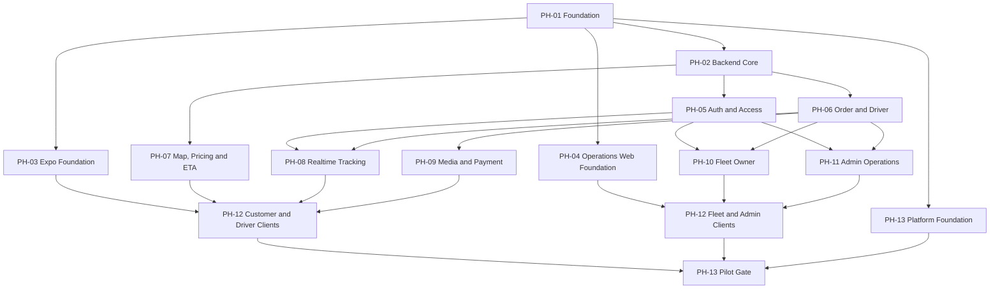

# LEOPARD Multi-Agent Master Orchestration Plan

> **For agentic workers:** REQUIRED SUB-SKILL: Use superpowers:subagent-driven-development (recommended) or superpowers:executing-plans to implement this plan task-by-task. Steps use checkbox (`- [ ]`) syntax for tracking.

**Goal:** Điều phối toàn bộ implementation LEOPARD qua các worktree và Codex session độc lập, có dependency, file ownership và integration gate rõ ràng.

**Architecture:** Một Foundation Gate khóa monorepo và shared contracts trước khi mở các lane Backend, Expo, Operations Web và Platform. Mỗi wave tích hợp vào branch riêng; chỉ baseline đã qua gate mới được dùng để tạo worktree cho wave tiếp theo.

**Tech Stack:** Node.js 24 LTS, pnpm 11.11.0, TypeScript 7.0.2, Turborepo 2.10.4, NestJS 11.1.28, Prisma 7.8.0, Expo 57.0.4, React Native 0.86.0, Next.js 16.2.10, React 19.2.7, Socket.IO 4.8.3, PostgreSQL 17 + PostGIS 3.5.

## Global Constraints

- Source of truth và thứ tự ưu tiên tuân thủ `AGENTS.md`.
- Mọi branch implementation tách từ baseline commit do Orchestrator công bố, không tách trực tiếp từ branch của agent khác.
- Không sửa `main` hoặc `develop`; phase branch dùng `codex/ph-XX-<short-name>`.
- API sở hữu business rule, authorization, pricing, ETA, lifecycle và provider orchestration.
- `packages/shared`, Prisma schema/migrations, root config, OpenAPI và stable error codes là controlled surfaces.
- Mobile dùng Expo SDK 57 cho Customer/Driver; Admin/Fleet Owner dùng Next.js operations web.
- Demo ETA deterministic và luôn trả/hiển thị `source=DEMO`, `isEstimate=true`, “Dữ liệu mô phỏng”.
- Mỗi task dùng TDD, commit atomic, không chứa secret và không thay đổi ngoài file scope.

---

## Baseline Registry

Orchestrator cập nhật bảng này ngay sau khi integration gate pass. Không dùng tên branch thay cho commit SHA.

| Wave | Integration branch | Baseline commit | Gate status |
| --- | --- | --- | --- |
| 0 | `codex/integration-wave-0` | Chưa tạo trước execution | `NOT_STARTED` |
| 1 | `codex/integration-wave-1` | Chưa tạo trước execution | `NOT_STARTED` |
| 2 | `codex/integration-wave-2` | Chưa tạo trước execution | `NOT_STARTED` |
| 3 | `codex/integration-wave-3` | Chưa tạo trước execution | `NOT_STARTED` |
| 4 | `codex/integration-wave-4` | Chưa tạo trước execution | `NOT_STARTED` |
| 5 | `codex/integration-wave-5` | Chưa tạo trước execution | `NOT_STARTED` |

## Dependency Graph



## Execution Waves

| Wave | Sessions có thể chạy song song | Gate owner |
| --- | --- | --- |
| 0 | PH-01 only | Foundation Owner |
| 1 | PH-02, PH-03, PH-04, PH-13 Platform Foundation | Integration Owner |
| 2 | PH-05, PH-06, PH-07, Mobile DS task, Web DS task | Integration Owner |
| 3 | PH-08, PH-09, PH-10, PH-11 | Integration Owner |
| 4 | PH-12 Customer, Driver, Fleet, Admin lanes | Client Integration Owner |
| 5 | PH-13 security, E2E, performance, deployment | Release Owner |

## Controlled Surface Lock

| Surface | Owning phase | Consumer rule |
| --- | --- | --- |
| Root `package.json`, `pnpm-workspace.yaml`, `pnpm-lock.yaml`, `turbo.json` | PH-01 | Feature phases không sửa |
| `packages/shared/src/contracts/**` | PH-01 Contract tasks | Contract change request bắt buộc |
| `apps/api/prisma/schema.prisma`, `apps/api/prisma/migrations/**` | PH-02 Data tasks | Một migration owner mỗi wave |
| `apps/api/openapi/openapi.yaml` | PH-02/contract owner | Endpoint phase chỉ implement contract |
| `apps/mobile/src/navigation/**` | PH-03 | Feature đăng ký qua route types đã khóa |
| `apps/admin/src/app/**/layout.tsx`, design tokens | PH-04 | Feature không sửa shell/tokens |
| `.github/workflows/**`, `infra/docker/**` | PH-13 Platform task | Feature chỉ dùng scripts đã có |

## Shared Contract Baseline

PH-01 phải tạo các public types sau và export từ `@leopard/shared`. Các plan con định nghĩa thêm request/response cụ thể nhưng không được đổi giá trị enum.

```ts
export type Role = 'CUSTOMER' | 'DRIVER' | 'FLEET_OWNER' | 'ADMIN';

export type OrderStatus =
  | 'REQUESTED'
  | 'ACCEPTED'
  | 'PICKING_UP'
  | 'IN_TRANSIT'
  | 'DELIVERED'
  | 'CANCELLED';

export type PaymentStatus =
  | 'UNPAID'
  | 'QR_CREATED'
  | 'PAID_MANUAL'
  | 'FAILED';

export type DriverAvailability = 'OFFLINE' | 'AVAILABLE' | 'BUSY';
export type FleetMemberStatus = 'ACTIVE' | 'INACTIVE';
export type ProviderSource = 'VIETMAP' | 'PAYOS' | 'VIETQR' | 'FIREBASE' | 'S3' | 'LOCAL' | 'DEMO';

export interface ApiErrorEnvelope {
  error: {
    code: string;
    message: string;
    details?: Record<string, unknown>;
    requestId: string;
  };
}

export interface PageMeta {
  page: number;
  pageSize: number;
  totalItems: number;
  totalPages: number;
}

export interface Page<T> {
  data: T[];
  meta: PageMeta;
}
```

## Task Registry

| Task | Plan | Wave | Dependencies | Agent | Status |
| --- | --- | --- | --- | --- | --- |
| PH-01-T01..T05 | `01-foundation.md` | 0 | None | Foundation/Contract | `NOT_STARTED` |
| PH-02-T01..T05 | `02-backend-core.md` | 1 | PH-01 | Backend/Data | `NOT_STARTED` |
| PH-03-T01..T04 | `03-expo-mobile-foundation.md` | 1 | PH-01 | Expo | `NOT_STARTED` |
| PH-04-T01..T04 | `04-operations-web-foundation.md` | 1 | PH-01 | Web | `NOT_STARTED` |
| PH-05-T01..T05 | `05-auth-and-access.md` | 2 | PH-02 | Security/Backend | `NOT_STARTED` |
| PH-06-T01..T06 | `06-order-and-driver.md` | 2 | PH-02 | Backend Domain | `NOT_STARTED` |
| PH-07-T01..T04 | `07-map-pricing-eta.md` | 2 | PH-02 | Integration/Backend | `NOT_STARTED` |
| PH-08-T01..T04 | `08-realtime-tracking.md` | 3 | PH-05, PH-06 | Realtime | `NOT_STARTED` |
| PH-09-T01..T05 | `09-media-and-payment.md` | 3 | PH-06 | Backend/Integration | `NOT_STARTED` |
| PH-10-T01..T04 | `10-fleet-owner.md` | 3 | PH-05, PH-06 | Fullstack Fleet | `NOT_STARTED` |
| PH-11-T01..T04 | `11-admin-operations.md` | 3 | PH-05, PH-06 | Fullstack Admin | `NOT_STARTED` |
| PH-12-T01..T06 | `12-cross-client-integration.md` | 4 | PH-03..PH-11 | Expo/Web | `NOT_STARTED` |
| PH-13-T01..T06 | `13-quality-security-pilot-release.md` | 1/5 | PH-01, PH-12 | Platform/QA/Security | `NOT_STARTED` |

## Feature Traceability

| Feature | Requirement / acceptance | Implementation tasks | Final evidence |
| --- | --- | --- | --- |
| F-01 Identity | FR-01 / AC-01 | PH-05-T01..T05 | PH-13-T04, PH-12-T06 |
| F-02 Customer orders | FR-02 / AC-02 | PH-06-T02, PH-12-T01 | PH-12-T01, PH-13-T06 |
| F-03 Order lifecycle | FR-02 / AC-03 | PH-06-T01, T04, T05 | PH-06-T06, PH-12-T04 |
| F-04 Driver operations | FR-03 / AC-03 | PH-06-T03..T05 | PH-12-T03, T04 |
| F-05 Tracking | FR-05 / AC-04 | PH-08-T01..T04 | PH-12-T02, T04; PH-13-T05 |
| F-06 Map/ETA | FR-06 / AC-02 | PH-07-T01..T04 | PH-12-T01, T02 |
| F-07 Media | FR-07 / AC-06 | PH-09-T01, T02 | PH-12-T04, PH-13-T04 |
| F-08 Payment | FR-08 / AC-06 | PH-09-T03..T05 | PH-12-T02, T06 |
| F-09 Fleet Owner Lite | FR-04 / AC-05 | PH-10-T01..T04 | PH-12-T05, PH-13-T04 |
| F-10 Admin | FR-09 / AC-07 | PH-11-T01..T04 | PH-12-T06, PH-13-T04 |
| F-11 Operations | FR-09 / AC-07 | PH-02-T03, T05; PH-13-T01..T06 | PH-13-T05, T06 |
| F-12 UX | NFR-09, NFR-10 / AC-07 | PH-03-T03, PH-04-T02, T03; PH-12-T01..T06 | PH-12-T06, PH-13-T06 |

## Session Startup

- [ ] **Step 1: Confirm readiness**

Read this master plan and the assigned phase plan. Verify every dependency status is `VERIFIED` and copy its baseline SHA.

- [ ] **Step 2: Create isolated worktree**

```bash
git fetch origin
git worktree add .worktrees/ph-XX-short-name -b codex/ph-XX-short-name <BASELINE_SHA>
```

Expected: worktree is created from the exact published baseline and `git status --short --branch` is clean.

- [ ] **Step 3: Start the session**

Fill `docs/superpowers/prompts/session-prompt-template.md` with one task only. Do not assign a full phase when tasks touch different controlled surfaces.

- [ ] **Step 4: Register ownership**

Orchestrator changes the task status to `IN_PROGRESS`, records session identifier, branch, worktree and owned files. No second task may claim an overlapping path.

## Review and Integration

- [ ] **Step 1: Spec compliance review**

Reviewer checks source documents, exact file scope, interfaces and pass criteria. Any scope expansion returns the task to `IN_PROGRESS`.

- [ ] **Step 2: Code quality review**

Fresh reviewer checks correctness, security, test design, error handling and maintainability after spec compliance passes.

- [ ] **Step 3: Integrate dependency order**

```bash
git switch codex/integration-wave-N
git merge --no-ff codex/ph-XX-short-name
```

Expected: merge succeeds without choosing between competing controlled-surface changes. A conflict means ownership/dependency design was violated and must be diagnosed before resolution.

- [ ] **Step 4: Run wave gate**

```bash
corepack pnpm install --frozen-lockfile
pnpm lint
pnpm typecheck
pnpm test
pnpm build
```

Expected: all commands exit 0. Database waves additionally run `pnpm db:migrate:test` and contract waves run `pnpm test:contract`.

## Blocker Report Format

```text
Task: PH-XX-TYY
Baseline: <commit SHA>
Blocked contract: <exact type/file/signature>
Requirement: <FR/AC/NFR identifier>
Minimal change: <specific proposed change>
Consumers affected: <task IDs>
Migration compatibility: <none/additive/breaking>
Tests required: <exact test files>
```

Agent must stop after reporting; it must not edit the blocked controlled surface.
