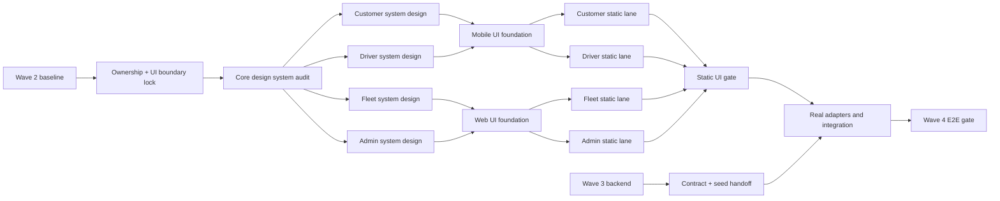

# Wave 4 Static UI/UX Parallel Execution Plan

> **Status:** `IN_PROGRESS`. Plan này cho phép làm sớm phần presentation của Wave 4 trong lúc Wave 3 hoàn thiện backend. Nó không thay đổi requirement và không được dùng để đánh dấu PH-12 `VERIFIED` trước khi tích hợp API/Socket thật và E2E đạt.

**Goal:** Hoàn thiện UI/UX tĩnh cho bốn journey Customer, Driver, Fleet Owner và Admin trên các role design systems đã duyệt và fixture xác định, sau đó nối backend Wave 3 qua adapter mà không viết lại màn hình.

**Architecture:** Một LEOPARD design language chung được triển khai thành Mobile Design System cho Customer/Driver và Operations Design System cho Fleet/Admin; mỗi role có system-design specification và pattern catalogue riêng. Screen/component chỉ phụ thuộc feature-local view model và port. Fixture adapter chỉ được inject trong test hoặc local preview có nhãn rõ; API/Socket/upload/location adapters được bổ sung sau contract handoff của Wave 3. Backend tiếp tục sở hữu authorization, lifecycle, pricing, ETA, payment và mọi business rule.

**Baseline đề xuất:** `bfe5a41` — Wave 2 đã đóng và CI xanh. Mỗi lane phải xác nhận lại SHA trước khi tạo worktree.

**Execution checkpoint 2026-08-15:** plan đã publish tại `198bd42` trên `develop`;
W4-S00, W4-DS00 và W4-DS01..DS04 đã qua independent review; W4-S01 và W4-S04
đang chạy song song. Static journey và runtime evidence vẫn pending.

**Plan liên quan:** `10-fleet-owner.md`, `11-admin-operations.md`, `12-cross-client-integration.md`.

## Quyết định thực thi

Có thể chạy Wave 4 UI/UX tĩnh song song Wave 3 nếu khóa đủ năm điều kiện sau:

1. Wave 3 sở hữu backend; Wave 4 sở hữu client. Thành viên Wave 3 không sửa các file Fleet/Admin frontend thuộc PH-10-T03, PH-11-T03 và phần web E2E của PH-10-T04/PH-11-T04.
2. Component không dùng trực tiếp draft DTO của Wave 3. Adapter sau cùng chịu trách nhiệm map DTO đã chốt sang view model ổn định của UI.
3. Fixture không nằm trong production path mặc định, không chứa PII thật và luôn hiện banner `Bản xem trước giao diện — dữ liệu mô phỏng` khi chạy local preview.
4. Nhánh static UI chỉ đạt milestone evidence `STATIC_GATE_PASSED`; PH-12 chỉ hoàn tất sau real integration, persistence check và E2E role journey.
5. Không lane nào bắt đầu screen implementation trước khi core design system và system-design specification của role đó được duyệt qua direction, component, state, responsive và accessibility gates.

Nếu Wave 3 đã có thay đổi trong `apps/mobile/**`, `apps/admin/**` hoặc `packages/ui/**`, Integration Owner phải dừng lane liên quan, đối chiếu diff và chuyển ownership trước khi tiếp tục.

## Phạm vi và ngoài phạm vi

### Làm trong static UI track

- Customer mobile: danh sách đơn, tạo đơn, chi tiết/tracking/payment/cancel states.
- Driver mobile: availability, đơn có thể nhận, active workflow, status/proof/tracking states.
- Fleet Owner web: overview, drivers, orders và order detail chỉ đọc.
- Admin web: overview, orders/detail, users, fleets, drivers và confirmation dialogs.
- Loading, empty, error, success, permission-denied; thêm offline/stale/reconnect/expired/conflict khi journey cần.
- Responsive, accessibility, copy tiếng Việt, component tests và visual evidence.
- Core tokens/patterns, bốn role system-design specifications và local component/state catalogues.

### Chưa làm trong static UI track

- Gọi API/Socket thật, upload file thật, GPS thật, QR có thể thanh toán hoặc persistence thật.
- Tự suy diễn authorization, order transition, price, ETA, payment state hay fleet scope ở client.
- Sửa Prisma, OpenAPI, shared contracts, backend modules, root dependencies hoặc lockfile.
- Background location, push notification, app-store release và các mục ngoài pilot.

## Luồng phụ thuộc



## Design system architecture bắt buộc

Không tạo bốn palette/token set độc lập. Chất lượng và tính nhất quán được giữ bằng ba tầng:

1. **LEOPARD Core:** semantic colors, typography, spacing, radius, border, elevation, motion, focus, status language, ETA/demo copy và state vocabulary.
2. **Platform systems:** Mobile dùng React Native `StyleSheet`, safe area, touch/Dynamic Type patterns; Operations Web dùng Tailwind/CSS tokens, semantic HTML, keyboard/focus và responsive table patterns.
3. **Role systems:** Customer, Driver, Fleet Owner và Admin định nghĩa riêng information hierarchy, density, component composition và interaction priorities nhưng chỉ consume core/platform tokens.

### Design direction theo role

| Role        | Purpose và audience                                | Tone/density                            | Ưu tiên thị giác                                            | Chi tiết nhận diện                                             |
| ----------- | -------------------------------------------------- | --------------------------------------- | ----------------------------------------------------------- | -------------------------------------------------------------- |
| Customer    | Hướng dẫn người gửi tạo và theo dõi đơn ít sai sót | Bình tĩnh, rõ ràng, density vừa         | Current order, route, giá và ETA                            | `Route Spine` nối pickup–stops–dropoff và timeline             |
| Driver      | Hỗ trợ thao tác nhanh ngoài hiện trường            | Action-first, tương phản cao, touch lớn | Trạng thái hiện tại, đúng một next action, tracking/offline | Active-trip rail luôn cho biết chuyến và trạng thái gửi vị trí |
| Fleet Owner | Quét nhanh tình trạng fleet ở chế độ chỉ đọc       | Cô đọng, yên tĩnh, exception-first      | Scope fleet, unavailable Drivers, active orders             | Fleet-scope marker luôn hiện tại list/detail                   |
| Admin       | Điều tra và xử lý ngoại lệ có audit                | Dense, kỹ thuật, filter-first           | Health, exception, ownership và audit context               | Audit rail liên kết action–reason–request ID                   |

`Route Spine` là motif chức năng dùng chung, không phải trang trí: bản đầy đủ ở mobile detail và bản cô đọng ở Fleet/Admin detail. Không dùng gradient tím, glassmorphism, nested decorative cards, oversized hero hoặc animation không truyền đạt state.

### Artifact bắt buộc

- Core source of truth: cập nhật `docs/ui/04-design-system.md`; implementation parity ở `apps/mobile/src/theme/tokens.ts` và `packages/ui/src/tokens.css` được bảo vệ bằng tests.
- Customer: tạo `docs/ui/07-customer-mobile-system-design.md`.
- Driver: tạo `docs/ui/08-driver-mobile-system-design.md`.
- Fleet Owner: tạo `docs/ui/09-fleet-owner-system-design.md`.
- Admin: tạo `docs/ui/10-admin-operations-system-design.md`.
- Quality scorecard: tạo `docs/ui/11-ui-quality-scorecard.md` và ghi evidence theo role trong handoff/PR.
- Mỗi role có local preview catalogue cho components, responsive compositions và toàn bộ state; preview phải tuân thủ production fixture guard.

Mỗi role system-design document phải có đủ: purpose/audience, design direction, information hierarchy, screen anatomy/grid, component inventory/variants, token mapping, interaction/motion, state matrix, responsive behavior, accessibility/copy rules, do/don't và preview evidence.

### Skill contract cho mọi UI task

| Skill                       | Khi bắt buộc dùng                               | Evidence phải bàn giao                                                                                                                 |
| --------------------------- | ----------------------------------------------- | -------------------------------------------------------------------------------------------------------------------------------------- |
| `design-system`             | Trước foundation và tại static gate             | Baseline audit, token/component inventory, parity check, 10-dimension score và AI-slop review                                          |
| `frontend-design-direction` | Trước khi code từng role                        | Purpose, audience, tone, density, memorable detail và constraints được ghi trong role spec                                             |
| `frontend-patterns`         | Mọi Fleet/Admin React/Next task                 | Component composition, thin routes, URL/form/server-state ownership, stable loading/error rendering và performance review              |
| `react-native-patterns`     | Mọi Customer/Driver Expo task                   | Thin routes, validated params, state separation, virtualized lists, `StyleSheet`, safe area/Dynamic Type và native API boundary review |
| `frontend-a11y`             | Mọi web form/dialog/filter/table và static gate | Semantic HTML, connected labels/errors, keyboard operation, focus restore/trap, live regions và reduced-motion evidence                |

Skill phải xuất hiện trong task prompt và handoff của agent; chỉ ghi tên skill trong plan nhưng không có evidence không được tính là đã áp dụng. Mobile accessibility dùng React Native roles/labels, touch target, Dynamic Type và screen-reader checks theo `react-native-patterns`; web dùng thêm gate chi tiết của `frontend-a11y`.

### UI quality scorecard

Mỗi role được chấm độc lập trên 10 tiêu chí: color consistency, typography hierarchy, spacing rhythm, component consistency, responsive behavior, motion/reduced motion, accessibility, information density, state completeness và polish/AI-slop. Static gate yêu cầu:

- Tổng điểm tối thiểu `85/100`.
- Không tiêu chí nào dưới `8/10`.
- Không còn lỗi accessibility nghiêm trọng, horizontal overflow ngoài table container chủ ý hoặc arbitrary color/spacing không có token.
- Mọi component tương tác có default, pressed/hover, focus, disabled, loading, error và success feedback khi phù hợp.
- Mọi deviation khỏi core token/pattern phải có rationale trong role spec và Design System Owner duyệt.

## Boundary dữ liệu để không phải viết lại UI

Mỗi feature dùng bốn lớp, đặt trong chính app thay vì thêm draft types vào `packages/shared`:

1. `model.ts`: view model đúng nhu cầu hiển thị, ví dụ `OrderListItemView`, `TrackingView`, `PaymentView`.
2. `port.ts`: interface query/command/event mà container cần, không chứa URL hoặc transport detail.
3. `fixtures.ts`: scenario xác định cho test/local preview, không giả dạng response backend.
4. `adapter.ts`: để trống hoặc chỉ có contract seam trong static track; sau Wave 3 sẽ map REST/Socket DTO thật sang view model.

Quy tắc:

- Presentational component nhận data và callback qua props; không import `httpClient`, `browserClient`, Socket.IO hoặc native location/storage SDK.
- Container/hook là nơi duy nhất biết port và query lifecycle.
- Fixture factory phải immutable, deterministic và tạo object mới cho mỗi scenario.
- Preview mode chỉ bật khi `NODE_ENV !== 'production'` và cờ local rõ ràng; production build phải fail closed nếu cố bật fixture.
- Error scenario dùng stable code từ `docs/api/03-error-codes.md`; copy hiển thị không lộ `details` nhạy cảm.
- ETA luôn ghi `ETA dự kiến`; source `DEMO` luôn ghi `Dữ liệu mô phỏng`.

## Ownership lock

| Surface                                                                                    | Owner khi chạy song song     | Ghi chú                                      |
| ------------------------------------------------------------------------------------------ | ---------------------------- | -------------------------------------------- |
| `apps/api/src/tracking/**`, `media/**`, `payments/**`, `fleets/**`, `admin/**`, `audit/**` | Wave 3                       | Bao gồm policy, persistence, REST và Socket  |
| `apps/api/test/**`, Prisma, migration, backend seed                                        | Wave 3                       | Wave 4 chỉ consume handoff                   |
| `apps/mobile/app/(customer)/**`, `src/features/customer/**`                                | Customer UI lane             | Không sửa navigation/auth foundation         |
| `apps/mobile/app/(driver)/**`, `src/features/driver/**`                                    | Driver UI lane               | Không sửa navigation/auth foundation         |
| `apps/admin/src/app/(fleet)/**`, `src/features/fleet/**`, Fleet Playwright                 | Fleet UI lane                | Nhận phần frontend của PH-10-T03/T04         |
| `apps/admin/src/app/(admin)/**`, `src/features/admin/**`, Admin Playwright                 | Admin UI lane                | Nhận phần frontend của PH-11-T03/T04         |
| `apps/mobile/src/ui/**`, `packages/ui/**`                                                  | UI Foundation Owner duy nhất | Merge trước khi mở bốn role lanes            |
| `docs/ui/04-design-system.md`, token parity, quality scorecard                             | Design System Owner duy nhất | Role lanes không tự thêm core token          |
| `docs/ui/07-*.md`..`10-*.md`, role preview catalogue                                       | Role UI owner                | Duyệt trước screen implementation            |
| layouts, shells, tokens, common API clients                                                | Integration Owner            | Chỉ sửa khi có blocker được ghi nhận         |
| `packages/shared/**`, OpenAPI, root config/lockfile                                        | Controlled-surface owner     | Bắt buộc change request; static UI không sửa |

## Scenario matrix tối thiểu

| Journey                      | Success data                                | States bổ sung bắt buộc                                        |
| ---------------------------- | ------------------------------------------- | -------------------------------------------------------------- |
| Customer order list          | Nhiều status, pagination                    | loading, empty, error, permission-denied                       |
| Customer create              | pickup, 0–3 stops, dropoff, estimate        | invalid field, estimate loading/error/expired, submit pending  |
| Customer detail              | timeline, route, Driver, media, payment     | no Driver, stale/no location, QR expired, cancel unavailable   |
| Driver orders                | availability, active banner, requested list | empty, offline, accept pending, 409 race conflict              |
| Driver workflow              | next valid state, tracking state, proof     | permission denied, upload error, proof required, reconnect     |
| Fleet dashboard              | KPI, alerts, recent orders                  | loading, empty, error, permission-denied                       |
| Fleet drivers/orders/detail  | filters, pagination, route/payment/tracking | no result, stale location, map fallback, foreign URL denial    |
| Admin dashboard/lists/detail | KPI, filters, audit/action affordances      | readiness warning, no result, command error, permission-denied |

## Static implementation tasks

### W4-S00 — Ownership, preview mode và contract seam

- **Owner:** Client Integration Owner
- **Dependencies:** Wave 2 `VERIFIED`

- [ ] Kiểm tra branch/diff đang chạy của Wave 3; xác nhận không có client path overlap.
- [ ] Ghi ownership theo bảng trên vào task registry/handoff trước khi agent bắt đầu.
- [ ] Định nghĩa feature-local view models, ports và `UiScenario` dùng chung trong từng app.
- [ ] Tạo preview composition root có production guard và banner dữ liệu mô phỏng.
- [ ] Viết test trước cho production guard, deterministic fixtures và adapter seam.
- [ ] Không thêm dependency hoặc sửa lockfile.

**Done when:** Hai app render được một smoke scenario qua injected fixture; production mode không thể chọn fixture; typecheck/test pass.

### W4-DS00 — Core design system audit và platform parity

- **Owner:** Design System Owner
- **Dependencies:** W4-S00
- **Required skills:** `design-system`, `frontend-design-direction`, `frontend-a11y`

- [ ] Audit `docs/ui/04-design-system.md`, mobile tokens/primitives, web tokens/primitives và inline styling theo 10-dimension scorecard.
- [ ] Benchmark ba giao diện logistics/operations phù hợp làm nguồn tham khảo phụ; chỉ ghi pattern có thể chuyển giao và không để benchmark lấn át source of truth LEOPARD.
- [ ] Lập inventory colors, typography, spacing, radius, border, shadow, breakpoints, status copy, focus và motion; đánh dấu duplicate/arbitrary values.
- [ ] Khóa LEOPARD direction là operational clarity: dense/scannable cho web, action-first cho Driver, guided flow cho Customer; ghi `Route Spine` pattern và anti-patterns.
- [ ] Ghi dark mode là `N/A` cho pilot trừ khi có change request; không để lại partial dark styles.
- [ ] Đồng bộ semantic meaning giữa mobile/web bằng parity tests; không ép hai platform dùng cùng implementation detail.
- [ ] Cập nhật core design-system doc và tạo quality scorecard template.
- [ ] Tạo local preview catalogue shell dùng production fixture guard; không thêm dependency chỉ để trang trí.

**Done when:** Core audit có before score/evidence, token vocabulary được duyệt, parity tests pass và không role lane nào cần tự phát minh token nền tảng.

### W4-DS01 — Customer mobile system design

- **Owner:** Expo Customer + Design System reviewer
- **Dependencies:** W4-DS00
- **Required skills:** `frontend-design-direction`, `react-native-patterns`, `design-system`

- [ ] Tạo `docs/ui/07-customer-mobile-system-design.md` theo artifact contract.
- [ ] Khóa anatomy cho order list, guided create flow và order detail; một primary action mỗi decision point.
- [ ] Định nghĩa Customer variants của Route Spine, address field, estimate panel, payment panel, tracking map và cancel confirmation.
- [ ] Preview long address/cargo copy, 0–3 stops, keyboard-visible form, sticky action/safe area và mọi state Customer.
- [ ] Review touch target, Dynamic Type, screen-reader labels và 360/390 px fit trước implementation.

**Done when:** Role spec, component/state catalogue và direction review được duyệt; không còn visual/business decision quan trọng bỏ ngỏ.

### W4-DS02 — Driver mobile system design

- **Owner:** Expo Driver + Design System reviewer
- **Dependencies:** W4-DS00
- **Required skills:** `frontend-design-direction`, `react-native-patterns`, `design-system`

- [ ] Tạo `docs/ui/08-driver-mobile-system-design.md` theo artifact contract.
- [ ] Khóa active-trip hierarchy: current status, exactly-one next action, tracking health và proof readiness.
- [ ] Định nghĩa high-contrast/outdoor variants cho availability, active banner, status action, offline/permission và upload states.
- [ ] Preview one-handed reach, safe-area sticky action, long route/cargo copy và accept-race conflict.
- [ ] Review list virtualization, touch/Dynamic Type và screen-reader announcement cho status thay đổi.

**Done when:** Role spec, component/state catalogue và direction review được duyệt; action priority không phụ thuộc fixture business logic.

### W4-DS03 — Fleet Owner operations system design

- **Owner:** Fleet UI + Design System reviewer
- **Dependencies:** W4-DS00
- **Required skills:** `frontend-design-direction`, `frontend-patterns`, `frontend-a11y`, `design-system`

- [ ] Tạo `docs/ui/09-fleet-owner-system-design.md` theo artifact contract.
- [ ] Khóa read-only density, fleet-scope marker, exception-first KPI, driver/order table và detail anatomy.
- [ ] Định nghĩa desktop table, tablet reduced columns và dưới 768 px row-detail composition.
- [ ] Preview keyboard filters, pagination, stale location, map fallback, no-result và foreign-resource denial.
- [ ] Review semantic landmarks/headings, focus order và absence of mutation affordances.

**Done when:** Role spec, component/state catalogue và direction/a11y review được duyệt; read-only rule nhìn thấy rõ trên mọi viewport.

### W4-DS04 — Admin operations system design

- **Owner:** Admin UI + Design System reviewer
- **Dependencies:** W4-DS00
- **Required skills:** `frontend-design-direction`, `frontend-patterns`, `frontend-a11y`, `design-system`

- [ ] Tạo `docs/ui/10-admin-operations-system-design.md` theo artifact contract.
- [ ] Khóa filter-first dashboard/list anatomy, exception severity, order investigation và audit rail.
- [ ] Định nghĩa command dialog variants với reason/note, irreversible warning, pending/error/success và focus return.
- [ ] Preview high-density tables, long identifiers, empty filters, readiness warning, permission denial và failed commands.
- [ ] Review semantic tables/forms/dialogs, keyboard-only journey, live-region feedback và reduced motion.

**Done when:** Role spec, component/state catalogue và direction/a11y review được duyệt; privileged action context không bị che hoặc giản lược.

### W4-S01 — Mobile presentation foundation

- **Owner:** Mobile UI Foundation
- **Dependencies:** W4-DS01, W4-DS02
- **Required skills:** `design-system`, `react-native-patterns`

- [ ] Bổ sung `ScreenScaffold`, section header, order summary, route summary, timeline, payment status, map/loading/fallback và preview banner bằng token hiện có.
- [ ] Chuẩn hóa status copy tiếng Việt nhưng giữ canonical enum trong accessibility label/test.
- [ ] Bảo đảm touch target tối thiểu 44 px, safe-area cho sticky action và stable layout khi loading/error.
- [ ] Test trước cho wrapping, permission privacy boundary, disabled/loading action và ETA demo label.

**Done when:** Primitives dùng được ở 360 px, không gọi network và coverage của file mới đạt tối thiểu 80%.

### W4-S02 — Customer static journey

- **Owner:** Expo Customer
- **Dependencies:** W4-S01, W4-DS01
- **Required skills:** `frontend-design-direction`, `react-native-patterns`, `design-system`

**Routes:** `/customer/orders`, `/customer/orders/new`, `/customer/orders/:id`.

- [ ] Order list có status filter, rows, pagination/load-more có kiểm soát và create action.
- [ ] Create flow có pickup, 0–3 stops, dropoff, vehicle, cargo, route estimate, price và ETA.
- [ ] Order detail có timeline, route/map, Driver/tracking, cargo media, payment và cancel affordance theo view model.
- [ ] Render và test toàn bộ scenario trong matrix; callback test xác nhận double-submit bị chặn.
- [ ] Không validate business rule thay backend ngoài form-shape validation phục vụ UX.

**Done when:** Ba screen/component suites pass, preview journey chạy được bằng fixture và không có horizontal overflow tại 360x800, 390x844.

### W4-S03 — Driver static journey

- **Owner:** Expo Driver
- **Dependencies:** W4-S01, W4-DS02
- **Required skills:** `frontend-design-direction`, `react-native-patterns`, `design-system`

**Routes:** `/driver/orders`, `/driver/orders/:id`.

- [ ] Order list có availability control, active-order banner và danh sách `REQUESTED`.
- [ ] Detail/workflow có route/cargo summary, accept affordance, đúng một next-state action do view model cung cấp, tracking state và delivery proof field.
- [ ] Mô phỏng rõ accept race 409, GPS permission denied, offline retry, proof required và upload failure.
- [ ] File picker/location sender chỉ là port callback; chưa thêm native SDK hoặc logic tracking thật.

**Done when:** Hai screen/component suites pass, mọi action có pending/disabled/error feedback và preview không tuyên bố dữ liệu đã persist.

### W4-S04 — Operations web presentation foundation

- **Owner:** Web UI Foundation
- **Dependencies:** W4-DS03, W4-DS04
- **Required skills:** `design-system`, `frontend-patterns`, `frontend-a11y`

- [ ] Hoàn thiện shared operational patterns còn thiếu: page header, KPI summary, timeline, read-only detail list, alert, permission-denied state, command dialog và preview banner.
- [ ] Nâng `DataTable`, `FilterBar`, `Pagination`, `MapPanel`, `ScreenState` chỉ trong phạm vi cần thiết; giữ API component tương thích nếu có thể.
- [ ] Tablet dưới 768 px dùng row-detail layout; 768–1023 px giữ Order/Status/Action và ẩn cột phụ có chủ ý.
- [ ] Test keyboard focus, dialog focus return, accessible name, clear filters và long-text wrapping.

**Done when:** Shared web tests pass, không có inline fake business data trong primitives và viewport 768/1024/1440 ổn định.

### W4-S05 — Fleet Owner static journey

- **Owner:** Fleet UI
- **Dependencies:** W4-S04, W4-DS03
- **Required skills:** `frontend-design-direction`, `frontend-patterns`, `frontend-a11y`, `design-system`

**Routes:** `/fleet`, `/fleet/drivers`, `/fleet/orders`, `/fleet/orders/:id`.

- [ ] Dashboard hiển thị KPI pilot, availability, active orders và cảnh báo cần chú ý.
- [ ] Drivers/orders có URL-shaped filter state, pagination và clear filters.
- [ ] Detail hiển thị route, status history, tracking, media và payment summary chỉ đọc.
- [ ] Không render lifecycle/payment/admin mutation actions trong bất kỳ fixture scenario nào.
- [ ] Test foreign URL permission state không render private children.

**Done when:** Bốn routes có đủ state matrix, Playwright component/page checks pass ở 768x1024, 1024x768 và 1440x900.

### W4-S06 — Admin static journey

- **Owner:** Admin UI
- **Dependencies:** W4-S04, W4-DS04
- **Required skills:** `frontend-design-direction`, `frontend-patterns`, `frontend-a11y`, `design-system`

**Routes:** `/admin`, `/admin/orders`, `/admin/orders/:id`, `/admin/users`, `/admin/fleets`, `/admin/drivers`.

- [ ] Dashboard có KPI vận hành, status distribution, recent orders và readiness warning.
- [ ] Lists có URL-shaped search/filter/sort/pagination và tablet row-detail fallback.
- [ ] Order detail có route, timeline, tracking, media, payment và audit timeline.
- [ ] Command dialogs cho manual payment, user status và cancel yêu cầu reason/note ở lớp form UX; callback vẫn là port.
- [ ] Test confirmation, cancel, pending, provider error và permission-denied focus flow.

**Done when:** Sáu routes có đủ state matrix, action không mutate fixture trực tiếp và web viewport gate pass.

### W4-S07 — Static UI quality gate

- **Owner:** Client Integration Owner + independent reviewer
- **Dependencies:** W4-S02, W4-S03, W4-S05, W4-S06
- **Required skills:** `design-system`, `frontend-design-direction`, `frontend-patterns`, `react-native-patterns`, `frontend-a11y`

- [ ] Chạy mobile/web lint, typecheck, unit/component tests, mobile export và web build.
- [ ] Coverage file mới/đổi đạt tối thiểu 80%; không hạ threshold hiện có.
- [ ] Chụp evidence tại 360x800, 390x844, 768x1024, 1024x768, 1440x900.
- [ ] Kiểm tra overflow, text wrapping, contrast, keyboard/focus, touch target và map aspect ratio tối thiểu 280 px trên mobile.
- [ ] Chấm lại 10-dimension scorecard cho từng role: tổng ít nhất 85/100, không tiêu chí dưới 8/10.
- [ ] Chạy design consistency và AI-slop review; đối chiếu từng screen với role system-design specification đã duyệt.
- [ ] Review diff: không API/schema/contract/root lockfile, không secret/PII, không fixture production default.
- [ ] Ghi milestone evidence `STATIC_GATE_PASSED`; giữ PH-12 ở `IN_PROGRESS`.

## Wave 3 handoff bắt buộc trước khi nối backend

Wave 3 phải bàn giao một packet duy nhất, có commit SHA, gồm:

- OpenAPI/DTO thực tế cho tracking, media, payment, Fleet và Admin queries/commands.
- Socket namespace, auth handshake, event/ack payload, reconnect và duplicate rules.
- Pagination/filter/sort allow-list và ISO/VND/meter/second semantics.
- Error matrix theo role/ownership, đặc biệt 401/403/404/409/413/415/422/429/502.
- Deterministic seed gồm bốn role, hai fleets, active/inactive membership, các order states, tracking, media và payment records.
- Demo-provider labels/source và provider-unavailable scenarios.
- Backend integration/authorization tests đã pass; CI Wave 3 xanh.

Contract mismatch phải dùng blocker format trong master plan. UI lane không tự sửa backend contract để khớp fixture.

## Real integration tasks sau Wave 3

### W4-I01 — Contract reconciliation

- [ ] So sánh field-by-field giữa Wave 3 DTO/events và từng UI port.
- [ ] Giữ view model nếu khác biệt chỉ là presentation; map tại adapter.
- [ ] Mở change request chỉ khi requirement không thể thực hiện với contract đã chốt.
- [ ] Thay fixture contract tests bằng recorded deterministic response examples, không chứa token/PII.

### W4-I02 — Customer/Driver REST adapters

- [ ] Nối map search/estimate, order list/detail/create/cancel, availability/list/accept/status.
- [ ] Nối query cache, invalidation, retry và 409 conflict refresh.
- [ ] Xác nhận refresh/relaunch đọc lại server state; không dùng local fake persistence.

### W4-I03 — Tracking, media và payment adapters

- [ ] Nối Socket.IO join/leave/reconnect/history reconciliation và duplicate suppression.
- [ ] Nối foreground tracking sender, permission/error states và throttling contract.
- [ ] Nối cargo/delivery-proof upload, signed media URL, QR/payment refresh và expiry.
- [ ] Xóa mọi fake success mutation khỏi runtime path.

### W4-I04 — Fleet/Admin web adapters

- [ ] Nối server-side pagination/filter/sort với URL state.
- [ ] Nối Fleet scope read APIs, tracking/payment summary và foreign resource denial.
- [ ] Nối Admin dashboard/lists/detail, health warning và audited commands.
- [ ] Xác nhận Fleet Owner không có mutation affordance lẫn callable command path.

### W4-I05 — Cross-client E2E gate

- [ ] Customer tạo đơn; Driver nhận, cập nhật và gửi tracking; Customer nhận event, tạo QR.
- [ ] Driver upload proof trước `DELIVERED`; Admin xác nhận payment với audit note.
- [ ] Fleet Owner xem đúng fleet; foreign IDs và forbidden commands bị từ chối.
- [ ] Refresh/relaunch vẫn thấy dữ liệu; reconnect bù tracking history.
- [ ] Chạy toàn bộ Maestro/Playwright role flows và repository release gate.
- [ ] Chỉ sau bước này mới đánh dấu PH-12 `VERIFIED` và cập nhật Wave 4 baseline.

## Branch và merge strategy

1. Tạo `codex/integration-wave-4-ui` từ baseline Wave 2 đã công bố; giữ Draft PR và chưa merge `develop`.
2. Chạy W4-S00 và W4-DS00; Design System Owner công bố core-design SHA trước khi role direction work bắt đầu.
3. Chạy W4-DS01..DS04 song song; mỗi role spec phải được duyệt trước khi mở implementation branch tương ứng.
4. Mở hai foundation branch mobile/web song song; merge foundation trước khi fork role lanes.
5. Fork bốn role worktree từ cùng static-foundation SHA; mỗi lane chỉ sửa file ownership của mình và ghi skill evidence trong handoff.
6. Integration Owner merge role lanes, chạy W4-S07, scorecard và lưu screenshot/test evidence.
7. Khi Wave 3 merge vào `develop`, Integration Owner đưa baseline mới vào Wave 4 branch và giải quyết chỉ các conflict thuộc controlled surface owner.
8. Chạy W4-I01..I05; review bảo mật/quyền riêng tư; chỉ chuyển Draft PR sang ready khi full gate xanh.

Không merge static preview vào `develop` nếu runtime còn phụ thuộc fixture hoặc action giả thành công.

## Verification commands

Static gate tối thiểu:

```bash
pnpm --filter mobile test
pnpm --filter mobile typecheck
pnpm --filter mobile lint
pnpm --filter mobile export
pnpm --filter @leopard/ui test
pnpm --filter @leopard/ui typecheck
pnpm --filter @leopard/ui lint
pnpm --filter web test
pnpm --filter web typecheck
pnpm --filter web lint
pnpm --filter web build
pnpm --filter web test:e2e
```

Integration gate sau Wave 3:

```bash
pnpm lint
pnpm typecheck
pnpm test
pnpm build
pnpm --filter mobile test:e2e
pnpm --filter web test:e2e
```

Nếu Maestro hoặc visual environment chưa sẵn sàng, task phải ghi blocker/evidence thay thế; không tự đánh dấu E2E pass.

## Definition of Done

### Static UI milestone

- Toàn bộ screen trong scope có success và các state bắt buộc, dùng fixture deterministic qua injected port.
- Core design system, bốn role system-design documents, preview catalogues và token parity tests đã được duyệt.
- UI đúng role direction và operational style, copy tiếng Việt, ETA/demo labels, responsive và accessibility rules.
- Mỗi role đạt UI quality score tối thiểu 85/100, không tiêu chí dưới 8/10 và không còn AI-slop/accessibility issue nghiêm trọng.
- Không có business rule, authorization decision hoặc fake persistence trong component.
- Production không thể bật fixture; static branch chưa được coi là Wave 4 hoàn tất.
- Static verification xanh, coverage file mới/đổi đạt 80%+ và visual evidence được lưu trong handoff/PR.

### Wave 4 hoàn tất

- Tất cả port dùng real adapters trong runtime; fixture chỉ còn ở test/local preview có guard.
- Customer, Driver, Fleet Owner và Admin journeys chạy qua API/Socket thật với deterministic seed.
- Dữ liệu persist qua refresh/relaunch; authorization matrix không có leak.
- Maestro, Playwright, lint, typecheck, test, build/export và CI đều xanh.
- Master registry, traceability và handoff được cập nhật bằng commit SHA/evidence thực tế.
