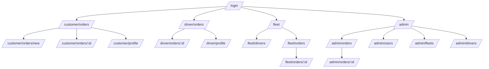

# Wave 6 Mobile Screens Completion Implementation Plan

> **For agentic workers:** REQUIRED SUB-SKILL: Use superpowers:subagent-driven-development (recommended) or superpowers:executing-plans to implement this plan task-by-task. Steps use checkbox (`- [ ]`) syntax for tracking.

**Goal:** Make Customer and Driver mobile screens actually call the real LEOPARD API in production (not just preview/fixture mode), fix the payment/media integration bugs found during audit, add the two missing Profile screens with a bottom tab bar, and add the one confirmed missing backend field (order media references).

**Architecture:** `apps/mobile` follows a strict port/adapter/model/Screen split per feature (`features/<role>/<feature>/{port,model,adapter,fixtures}.ts` + `<Name>Screen.tsx`). Screens are pure presentational components driven by a `view` prop; adapters implement the port against `httpClient` and always return a fully-formed view object (they catch errors internally, they don't throw for expected failure modes). The app currently only renders these screens in **preview/fixture mode** — the "runtime" (real) path renders a placeholder (`RuntimeBoundary`) because nothing wires the adapters to a live data-fetching layer. This plan adds that wiring using `@tanstack/react-query` (already a dependency, never used).

**Tech Stack:** Expo Router (React Native 0.86, React 19), `@tanstack/react-query` 5.101, Jest + `@testing-library/react-native`, NestJS + Prisma on the backend.

**Spec:** `docs/superpowers/specs/2026-08-23-mobile-screens-completion-design.md`

## Global Constraints

- Không có API backend mới ngoài phạm vi mục 1 (order media field) — mọi API khác đã tồn tại, chỉ sửa cách mobile gọi.
- Mọi màn hình chính giữ đủ state: `loading/empty/error/success/permission-denied` (đã có sẵn qua `ScreenState`/view kind — không tạo state vocabulary mới).
- Không thêm gradient, glassmorphism, card lồng card, decorative illustration — theo `docs/ui/04-design-system.md` mục 9 (đã chốt giữ nguyên design system này, không dùng hướng "Nhiệt Đới Xanh").
- ETA luôn dùng nhãn "ETA dự kiến"; nguồn `DEMO` luôn hiện "Dữ liệu mô phỏng" — không đổi copy đã có.
- Touch target tối thiểu 44×44 px; content max-width 768 px trên mobile — dùng token có sẵn (`spacing`, `control`, `layout` trong `theme/tokens.ts`), không tạo giá trị tùy tiện.
- Backend sở hữu business rule; mobile chỉ hiển thị permission/lifecycle/giá/ETA/payment state do backend trả về — không tính toán lại phía client.
- Mọi file mới tuân TypeScript rules: types tường minh trên public API, không dùng `any`, immutable update (spread, không mutate).
- Test: mỗi feature mới có `adapter.test.ts` theo đúng mock pattern đã dùng trong `customer/orders/adapter.test.ts` / `http-client.test.ts`.

---

## Task 1: Backend — include media references on order detail response

**Files:**
- Modify: `apps/api/src/orders/orders.repository.ts:157-164` (method `findById`)
- Modify: `apps/api/src/orders/order-response.mapper.ts`
- Test: `apps/api/src/orders/order-response.mapper.spec.ts` (create if it doesn't exist — check first with a Glob)

**Interfaces:**
- Produces: `MappedOrderResponse.media?: Array<{ id: string; type: 'CARGO' | 'DELIVERY_PROOF'; createdAt: string }>` — consumed by Task 6 (Customer cargo media) and Task 7 (Driver proof viewer).

- [ ] **Step 1: Check for an existing mapper spec file**

Run: `find apps/api/src/orders -iname "order-response.mapper*"`

If a `.spec.ts` file already exists, read it first so Step 2's test matches its existing style/imports instead of creating a duplicate describe block.

- [ ] **Step 2: Write the failing test**

Create or append to `apps/api/src/orders/order-response.mapper.spec.ts`:

```typescript
import { mapOrderResponse } from './order-response.mapper.js';

describe('mapOrderResponse', () => {
  it('omits media when the order has no mediaObjects relation loaded', () => {
    const order = {
      id: 'order-1',
      customerId: 'cust-1',
      driverId: null,
      status: 'REQUESTED',
      routeSnapshot: null,
      providerSource: null,
      distanceMeters: null,
      durationSeconds: null,
      priceVnd: null,
      etaSeconds: null,
      acceptedAt: null,
      pickingUpAt: null,
      inTransitAt: null,
      deliveredAt: null,
      cancelledAt: null,
      createdAt: new Date('2026-08-01T00:00:00.000Z'),
      updatedAt: new Date('2026-08-01T00:00:00.000Z'),
    } as never;

    const result = mapOrderResponse(order);

    expect(result.media).toBeUndefined();
  });

  it('maps mediaObjects to id, type, and ISO createdAt when the relation is loaded', () => {
    const order = {
      id: 'order-1',
      customerId: 'cust-1',
      driverId: 'drv-1',
      status: 'IN_TRANSIT',
      routeSnapshot: null,
      providerSource: null,
      distanceMeters: null,
      durationSeconds: null,
      priceVnd: null,
      etaSeconds: null,
      acceptedAt: null,
      pickingUpAt: null,
      inTransitAt: null,
      deliveredAt: null,
      cancelledAt: null,
      createdAt: new Date('2026-08-01T00:00:00.000Z'),
      updatedAt: new Date('2026-08-01T00:00:00.000Z'),
      mediaObjects: [
        {
          id: 'media-1',
          orderId: 'order-1',
          uploaderId: 'cust-1',
          type: 'CARGO',
          provider: 'LOCAL',
          storageKey: 'orders/order-1/cargo/x.jpg',
          contentType: 'image/jpeg',
          sizeBytes: 1024,
          checksumSha256: 'abc',
          clientRequestId: 'req-1',
          createdAt: new Date('2026-08-02T00:00:00.000Z'),
        },
      ],
    } as never;

    const result = mapOrderResponse(order);

    expect(result.media).toEqual([
      { id: 'media-1', type: 'CARGO', createdAt: '2026-08-02T00:00:00.000Z' },
    ]);
  });
});
```

- [ ] **Step 2: Run test to verify it fails**

Run: `pnpm --filter api test -- order-response.mapper.spec.ts`
Expected: FAIL — `result.media` is `undefined` in the second test (mapper doesn't map it yet), or the file doesn't exist yet as a runnable spec.

- [ ] **Step 3: Add `media` to the mapper**

In `apps/api/src/orders/order-response.mapper.ts`, add `MediaObject` to the type import, add `media` to `MappedOrderResponse`, and map it conditionally exactly like `stops`/`statusHistory` already are:

```typescript
import type { Order, OrderStop, OrderStatusHistory, MediaObject } from '@prisma/client';

// ... inside MappedOrderResponse interface, after statusHistory:
  media?: Array<{ id: string; type: string; createdAt: string }>;

// ... inside the function signature's input type, after statusHistory:
    mediaObjects?: MediaObject[];

// ... inside the returned object literal, after the statusHistory spread:
    ...(order.mediaObjects
      ? {
          media: order.mediaObjects.map((m) => ({
            id: m.id,
            type: m.type,
            createdAt: m.createdAt.toISOString(),
          })),
        }
      : {}),
```

- [ ] **Step 4: Include the relation in the repository query**

In `apps/api/src/orders/orders.repository.ts`, method `findById` (around line 157-164), add `mediaObjects: true` to the existing `include`:

```typescript
  async findById(id: string, tx?: OrdersPrismaClient): Promise<OrderWithRelations | null> {
    const db = tx ?? this.prisma;
    const order = await db.order.findUnique({
      where: { id },
      include: {
        statusHistory: { orderBy: { createdAt: 'desc' } },
        mediaObjects: true,
      },
    });
```

Also update the `OrderWithRelations` type definition (search the same file for `type OrderWithRelations` or wherever it's declared) to add `mediaObjects?: MediaObject[]`, importing `MediaObject` from `@prisma/client` if not already imported.

- [ ] **Step 5: Run test to verify it passes**

Run: `pnpm --filter api test -- order-response.mapper.spec.ts`
Expected: PASS

- [ ] **Step 6: Run the full orders test suite to check nothing else broke**

Run: `pnpm --filter api test -- orders`
Expected: PASS (existing tests that construct `Order` fixtures without `mediaObjects` still pass because the field is optional and the mapper only maps it `if (order.mediaObjects)`)

- [ ] **Step 7: Commit**

```bash
git add apps/api/src/orders/order-response.mapper.ts apps/api/src/orders/order-response.mapper.spec.ts apps/api/src/orders/orders.repository.ts
git commit -m "feat(api): include cargo and delivery-proof media on order detail response"
```

---

## Task 2: Wire QueryClientProvider at the app root

**Files:**
- Modify: `apps/mobile/app/_layout.tsx`
- Test: `apps/mobile/app/_layout.test.tsx` (new)

**Interfaces:**
- Consumes: `queryClient` exported from `apps/mobile/src/api/query-client.ts` (already exists, unused today).
- Produces: every screen rendered under `<Slot/>` now has access to `useQuery`/`useMutation` from `@tanstack/react-query`. Tasks 8 and 9 (runtime wiring) and Tasks 11-12 (Profile) depend on this.

- [ ] **Step 1: Write the failing test**

Create `apps/mobile/app/_layout.test.tsx`:

```tsx
import { render } from '@testing-library/react-native';
import { QueryClientProvider } from '@tanstack/react-query';
import React from 'react';

jest.mock('expo-router', () => ({
  Slot: () => null,
}));

describe('RootLayout providers', () => {
  it('wraps children in QueryClientProvider so useQuery is available', () => {
    // Import lazily so the expo-router mock above is registered first.
    const { default: RootLayout } = require('./_layout');
    const spy = jest.spyOn(QueryClientProvider.prototype ?? {}, 'render');
    expect(() => render(<RootLayout />)).not.toThrow();
    spy?.mockRestore();
  });
});
```

- [ ] **Step 2: Run test to verify current behavior**

Run: `pnpm --filter mobile test -- _layout.test.tsx`
Expected: PASS already (render doesn't throw today either) — this test is a smoke test, not a red/green gate on its own. Proceed to Step 3 regardless; the meaningful verification is Step 4's manual check that `RootProviders` now renders `QueryClientProvider`.

- [ ] **Step 3: Add QueryClientProvider to RootProviders**

In `apps/mobile/app/_layout.tsx`, import `QueryClientProvider` and the existing `queryClient` singleton, and wrap `SafeAreaProvider`'s children:

```tsx
import { QueryClientProvider } from '@tanstack/react-query';
import { Slot } from 'expo-router';
import { Component, type PropsWithChildren } from 'react';
import { StyleSheet, Text, View } from 'react-native';
import { SafeAreaProvider, SafeAreaView } from 'react-native-safe-area-context';

import { queryClient } from '../src/api/query-client';

// ... RootErrorBoundary unchanged ...

function RootProviders({ children }: PropsWithChildren) {
  return (
    <QueryClientProvider client={queryClient}>
      <SafeAreaProvider>{children}</SafeAreaProvider>
    </QueryClientProvider>
  );
}
```

Leave `RootLayout`, `RootErrorBoundary`, and `styles` unchanged.

- [ ] **Step 4: Run test to verify it passes**

Run: `pnpm --filter mobile test -- _layout.test.tsx`
Expected: PASS

- [ ] **Step 5: Commit**

```bash
git add apps/mobile/app/_layout.tsx apps/mobile/app/_layout.test.tsx
git commit -m "feat(mobile): wrap app root in QueryClientProvider"
```

---

## Task 3: Add multipart form-data support to httpClient

**Files:**
- Modify: `apps/mobile/src/api/http-client.ts`
- Test: `apps/mobile/src/api/http-client.test.ts` (existing — add cases)

**Interfaces:**
- Produces: `httpClient.postForm<T>(path: string, form: FormData): Promise<T>` — consumed by Task 5 (`MediaImage`-adjacent picker adapter) and Task 6/7 (cargo/proof upload).

- [ ] **Step 1: Write the failing tests**

Append to the `describe('http-client', ...)` block in `apps/mobile/src/api/http-client.test.ts`, right after the existing `'sets Content-Type: application/json by default'` test:

```typescript
  it('performs a postForm request without setting Content-Type manually', async () => {
    fetchMock().mockResolvedValue(createMockResponse(201, { id: 'media-1' }));

    const form = new FormData();
    form.append('file', 'fake-binary' as unknown as Blob);
    form.append('clientRequestId', 'req-1');

    const result = await httpClient.postForm<{ id: string }>('/orders/o1/media/cargo', form);

    const [url, init] = lastFetchArgs();
    expect(url).toContain('/orders/o1/media/cargo');
    expect(init?.method).toBe('POST');
    expect(init?.body).toBe(form);
    const headers = init?.headers as Record<string, string> | undefined;
    expect(headers?.['Content-Type']).toBeUndefined();
    expect(result.id).toBe('media-1');
  });

  it('still attaches Authorization and x-request-id on postForm requests', async () => {
    mocks().getAccessToken.mockReturnValue('test-token');
    fetchMock().mockResolvedValue(createMockResponse(201, { id: 'media-1' }));

    await httpClient.postForm('/orders/o1/media/cargo', new FormData());

    const [, init] = lastFetchArgs();
    const headers = init?.headers as Record<string, string> | undefined;
    expect(headers?.Authorization).toBe('Bearer test-token');
    expect(headers?.['x-request-id']).toBeDefined();
  });

  it('retries a postForm request through the 401 refresh flow', async () => {
    mocks().getAccessToken.mockReturnValue('expired-token');
    mocks().getRefreshToken.mockResolvedValue('refresh-token-1');

    fetchMock()
      .mockResolvedValueOnce(createMockResponse(401, { code: 'UNAUTHORIZED', message: 'Token expired' }))
      .mockResolvedValueOnce(createMockResponse(200, {
        accessToken: 'new-access-token',
        accessTokenExpiresAt: '2026-08-06T02:15:00.000Z',
        refreshToken: 'new-refresh-token',
        refreshTokenExpiresAt: '2026-08-13T02:15:00.000Z',
      }))
      .mockResolvedValueOnce(createMockResponse(201, { id: 'media-1' }));

    const form = new FormData();
    const result = await httpClient.postForm<{ id: string }>('/orders/o1/media/cargo', form);

    expect(result.id).toBe('media-1');
    expect(fetchMock()).toHaveBeenCalledTimes(3);
    const retryCall = fetchMock().mock.calls[2] as [string, RequestInit | undefined];
    expect(retryCall[1]?.body).toBe(form);
  });
```

- [ ] **Step 2: Run tests to verify they fail**

Run: `pnpm --filter mobile test -- http-client.test.ts`
Expected: FAIL with `httpClient.postForm is not a function`

- [ ] **Step 3: Implement postForm in http-client.ts**

In `apps/mobile/src/api/http-client.ts`, modify `buildHeaders` to accept a flag, modify `request` to detect `FormData` bodies and skip JSON encoding in both the initial and retry fetch calls, then add `postForm` to the exported `httpClient`:

```typescript
function buildHeaders(isForm: boolean): Record<string, string> {
  const headers: Record<string, string> = {
    'x-request-id': generateRequestId(),
  };

  if (!isForm) {
    headers['Content-Type'] = 'application/json';
  }

  const token = sessionStore.getAccessToken();
  if (token) {
    headers['Authorization'] = `Bearer ${token}`;
  }

  return headers;
}

function encodeBody(body: unknown): { isForm: boolean; encoded: BodyInit } {
  if (body instanceof FormData) {
    return { isForm: true, encoded: body };
  }
  return { isForm: false, encoded: JSON.stringify(body) };
}
```

Replace the two places inside `request()` that currently call `buildHeaders()` with no args and `JSON.stringify(options.body)`:

```typescript
async function request<T>(options: RequestOptions): Promise<T> {
  const isForm = options.body instanceof FormData;
  const headers = buildHeaders(isForm);
  const url = `${BASE_URL}${options.path}`;

  const init: RequestInit = {
    method: options.method,
    headers,
  };

  if (options.body !== undefined) {
    init.body = isForm ? (options.body as FormData) : JSON.stringify(options.body);
  }

  let response: Response;
  try {
    response = await fetch(url, init);
  } catch (networkError) {
    throw new ApiError(0, 'NETWORK_ERROR', 'Network request failed');
  }

  // 401 -> attempt token refresh
  if (response.status === 401) {
    const refreshed = await startRefresh();
    if (refreshed) {
      const retryHeaders = buildHeaders(isForm);
      const retryInit: RequestInit = {
        method: options.method,
        headers: retryHeaders,
      };
      if (options.body !== undefined) {
        retryInit.body = isForm ? (options.body as FormData) : JSON.stringify(options.body);
      }
```

(Leave the rest of the 401 branch, the non-OK branch, and the success return unchanged — only the header-building calls and body-encoding lines change.) The `encodeBody` helper above is not strictly required if you inline the ternary as shown; skip adding it if the inline form keeps the diff smaller — both are acceptable, but keep it consistent (don't leave a half-used helper).

Finally, add `postForm` next to the other methods on the exported client:

```typescript
export const httpClient = {
  get<T = unknown>(path: string): Promise<T> {
    return request<T>({ method: 'GET', path });
  },

  post<T = unknown>(path: string, body?: unknown): Promise<T> {
    return request<T>({ method: 'POST', path, body });
  },

  postForm<T = unknown>(path: string, form: FormData): Promise<T> {
    return request<T>({ method: 'POST', path, body: form });
  },

  put<T = unknown>(path: string, body?: unknown): Promise<T> {
    return request<T>({ method: 'PUT', path, body });
  },

  patch<T = unknown>(path: string, body?: unknown): Promise<T> {
    return request<T>({ method: 'PATCH', path, body });
  },

  delete<T = unknown>(path: string): Promise<T> {
    return request<T>({ method: 'DELETE', path });
  },
};
```

- [ ] **Step 4: Run tests to verify they pass**

Run: `pnpm --filter mobile test -- http-client.test.ts`
Expected: PASS (all tests, including the pre-existing ones — confirm no regression)

- [ ] **Step 5: Commit**

```bash
git add apps/mobile/src/api/http-client.ts apps/mobile/src/api/http-client.test.ts
git commit -m "feat(mobile): add multipart postForm to httpClient"
```

---

## Task 4: Fix Customer payment adapter to use the real endpoints

**Files:**
- Modify: `apps/mobile/src/features/customer/orders/adapter.ts:1159-1234`
- Modify: `apps/mobile/src/features/customer/orders/port.ts`
- Test: `apps/mobile/src/features/customer/orders/adapter.test.ts`

**Interfaces:**
- Consumes: `CustomerHttpClient` (already defined in `adapter.ts`).
- Produces: `CustomerOrdersPort.createPaymentQr(orderId: string): Promise<CustomerDetailView>` (drop the `amountVnd` parameter — the backend takes no amount, it's always server-derived). `getPaymentStatus` is removed from the port entirely; callers re-fetch order detail instead (order detail already includes `payment` embedded).

- [ ] **Step 1: Write the failing test**

Add to `apps/mobile/src/features/customer/orders/adapter.test.ts`, inside a new `describe('createPaymentQr', ...)` block (near the existing payment-related describe blocks):

```typescript
describe('createCustomerHttpAdapter — payment', () => {
  function makeClient(overrides: Partial<CustomerHttpClient> = {}): CustomerHttpClient {
    return {
      get: jest.fn(),
      post: jest.fn(),
      put: jest.fn(),
      delete: jest.fn(),
      ...overrides,
    };
  }

  it('creates a payment via POST orders/:id/payments with only clientRequestId', async () => {
    const validId = '11111111-1111-4111-8111-111111111001';
    const post = jest.fn(async (path: string) => {
      if (path === `/orders/${validId}/payments`) {
        return { id: 'pmt-1', orderId: validId, status: 'QR_CREATED', amountVnd: 100000, provider: 'DEMO' };
      }
      throw new Error(`unexpected POST ${path}`);
    });
    const get = jest.fn(async (path: string) => {
      if (path === `/orders/${validId}`) {
        return {
          id: validId,
          driverId: null,
          status: 'REQUESTED',
          providerSource: null,
          distanceMeters: null,
          durationSeconds: null,
          priceVnd: 100000,
          etaSeconds: null,
          createdAt: '2026-08-15T00:00:00.000Z',
          updatedAt: '2026-08-15T00:00:00.000Z',
        };
      }
      throw new Error(`unexpected GET ${path}`);
    });
    const client = makeClient({ post, get });
    const port = createCustomerHttpAdapter(client);

    const view = await port.createPaymentQr(validId);

    expect(post).toHaveBeenCalledWith(`/orders/${validId}/payments`, expect.objectContaining({
      clientRequestId: expect.any(String),
    }));
    expect(post).not.toHaveBeenCalledWith('/payments/qr', expect.anything());
    expect(view.kind).toBe('content');
  });

  it('does not call a per-payment status endpoint that does not exist on the backend', () => {
    const port = createCustomerHttpAdapter(makeClient());
    expect((port as unknown as { getPaymentStatus?: unknown }).getPaymentStatus).toBeUndefined();
  });
});
```

- [ ] **Step 2: Run test to verify it fails**

Run: `pnpm --filter mobile test -- customer/orders/adapter.test.ts`
Expected: FAIL — `post` mock throws `unexpected POST /payments/qr` because current code calls the wrong path.

- [ ] **Step 3: Fix the adapter**

In `apps/mobile/src/features/customer/orders/adapter.ts`, replace the `createPaymentQr` method (currently lines ~1159-1216) with:

```typescript
    async createPaymentQr(orderId: string): Promise<CustomerDetailView> {
      const activeClient = getClient();
      const validId = parseCustomerOrderId(orderId);
      if (!validId) {
        return deepFreeze<CustomerDetailView>({
          scenarioId: 'C-DETAIL-ERROR',
          kind: 'error',
          title: 'Mã đơn không hợp lệ',
          message:
            'Liên kết đơn hàng không đúng định dạng. Hãy quay lại danh sách đơn.',
        });
      }

      try {
        const clientRequestId =
          typeof crypto !== 'undefined' && 'randomUUID' in crypto
            ? crypto.randomUUID()
            : `req-${Date.now()}-${Math.random().toString(16).slice(2)}`;

        const paymentResponse = await activeClient.post<PaymentQrApiResponse>(
          `/orders/${validId}/payments`,
          { clientRequestId },
        );

        const orderResponse = await activeClient.get<MappedOrderResponse>(
          `/orders/${validId}`,
        );

        return deepFreeze<CustomerDetailContentView>({
          scenarioId: 'C-DETAIL-QR-READY',
          kind: 'content',
          notice:
            paymentResponse.provider === 'DEMO'
              ? 'Mã QR mô phỏng, không chứa payload thanh toán thật.'
              : null,
          order: mapOrderToDetail(orderResponse, null, paymentResponse),
          cancel: resolveCancelView(orderResponse),
          actions: [],
        });
      } catch (error) {
        if (isForbiddenError(error)) {
          return deepFreeze<CustomerDetailView>({
            scenarioId: 'C-DETAIL-PERMISSION',
            kind: 'permission-denied',
            title: 'Bạn không có quyền thanh toán đơn hàng này',
            message: 'Không thể tạo thanh toán cho đơn hàng khác.',
          });
        }

        return deepFreeze<CustomerDetailView>({
          scenarioId: 'C-DETAIL-PAYMENT-FAILED',
          kind: 'error',
          title: 'Chưa thể tạo thanh toán',
          message:
            error instanceof Error && error.message
              ? error.message
              : 'Chưa thể tạo thanh toán; không hiển thị chi tiết provider.',
        });
      }
    },
```

Delete the `getPaymentStatus` method entirely (currently right after `createPaymentQr`, around lines 1218-1234).

In `executeIntent`, find the block handling `'create-payment' | 'refresh-payment' | 'retry-payment'` (around line 1290-1309) and update the call to drop the second argument:

```typescript
        return this.createPaymentQr
          ? this.createPaymentQr(validId)
          : this.getOrderDetailView(validId);
```

(This line likely already matches — verify it doesn't pass an `amountVnd` second argument anywhere; if it does, remove it.)

- [ ] **Step 4: Update the port type**

In `apps/mobile/src/features/customer/orders/port.ts`, change:

```typescript
  createPaymentQr?: (
    orderId: string,
    amountVnd?: number,
  ) => Promise<CustomerDetailView>;
  getPaymentStatus?: (paymentId: string) => Promise<CustomerPaymentView>;
```

to:

```typescript
  createPaymentQr?: (orderId: string) => Promise<CustomerDetailView>;
```

Remove the now-unused `CustomerPaymentView` import from `port.ts` if it's no longer referenced anywhere else in that file (check with a grep before removing).

- [ ] **Step 5: Run tests to verify they pass**

Run: `pnpm --filter mobile test -- customer/orders/adapter.test.ts`
Expected: PASS

Also run: `pnpm --filter mobile typecheck` to confirm no callers still reference the removed `getPaymentStatus` or the old two-arg `createPaymentQr` signature.

- [ ] **Step 6: Commit**

```bash
git add apps/mobile/src/features/customer/orders/adapter.ts apps/mobile/src/features/customer/orders/port.ts apps/mobile/src/features/customer/orders/adapter.test.ts
git commit -m "fix(mobile): call the real payment endpoints instead of nonexistent /payments/* routes"
```

---

## Task 5: Device image picker + MediaImage viewer

**Files:**
- Create: `apps/mobile/src/media/device-image-picker.ts`
- Create: `apps/mobile/src/media/device-image-picker.test.ts`
- Create: `apps/mobile/src/ui/MediaImage.tsx`
- Modify: `apps/mobile/package.json`, `apps/mobile/app.json`

**Interfaces:**
- Produces: `pickDeviceImage(): Promise<DeviceImageAsset | null>`, `type DeviceImageAsset = Readonly<{ uri: string; name: string; mimeType: string; size: number }>` — consumed by Task 6 (Customer cargo picker) and Task 7 (Driver proof picker).
- Produces: `<MediaImage mediaId={string} />` — a self-contained component that calls `GET /media/:id/url` and renders the image. Consumed by Task 6 and Task 7.

- [ ] **Step 1: Add expo-image-picker**

Run: `pnpm --filter mobile exec expo install expo-image-picker`

This resolves and pins the version compatible with the installed Expo SDK 57 automatically — do not hand-pick a version number.

- [ ] **Step 2: Declare the permission plugin**

In `apps/mobile/app.json`, add the plugin's permission config to the existing `plugins` array:

```json
    "plugins": [
      "expo-router",
      [
        "expo-image-picker",
        {
          "photosPermission": "LEOPARD cần quyền truy cập thư viện ảnh để chọn ảnh hàng hóa hoặc ảnh xác nhận giao hàng."
        }
      ]
    ]
```

- [ ] **Step 3: Write the failing test for the picker helper**

Create `apps/mobile/src/media/device-image-picker.test.ts`:

```typescript
import { describe, expect, it, jest } from '@jest/globals';

jest.mock('expo-image-picker', () => ({
  requestMediaLibraryPermissionsAsync: jest.fn(),
  launchImageLibraryAsync: jest.fn(),
  MediaTypeOptions: { Images: 'Images' },
}));

import * as ImagePicker from 'expo-image-picker';
import { pickDeviceImage } from './device-image-picker';

describe('pickDeviceImage', () => {
  it('returns null when permission is denied', async () => {
    (ImagePicker.requestMediaLibraryPermissionsAsync as jest.Mock<any>).mockResolvedValue({
      granted: false,
    });

    const result = await pickDeviceImage();

    expect(result).toBeNull();
    expect(ImagePicker.launchImageLibraryAsync).not.toHaveBeenCalled();
  });

  it('returns null when the user cancels the picker', async () => {
    (ImagePicker.requestMediaLibraryPermissionsAsync as jest.Mock<any>).mockResolvedValue({
      granted: true,
    });
    (ImagePicker.launchImageLibraryAsync as jest.Mock<any>).mockResolvedValue({ canceled: true });

    const result = await pickDeviceImage();

    expect(result).toBeNull();
  });

  it('maps the selected asset to a DeviceImageAsset', async () => {
    (ImagePicker.requestMediaLibraryPermissionsAsync as jest.Mock<any>).mockResolvedValue({
      granted: true,
    });
    (ImagePicker.launchImageLibraryAsync as jest.Mock<any>).mockResolvedValue({
      canceled: false,
      assets: [
        {
          uri: 'file:///tmp/photo.jpg',
          mimeType: 'image/jpeg',
          fileSize: 204800,
          fileName: 'photo.jpg',
        },
      ],
    });

    const result = await pickDeviceImage();

    expect(result).toEqual({
      uri: 'file:///tmp/photo.jpg',
      name: 'photo.jpg',
      mimeType: 'image/jpeg',
      size: 204800,
    });
  });

  it('falls back to a generated name and default size when the asset omits them', async () => {
    (ImagePicker.requestMediaLibraryPermissionsAsync as jest.Mock<any>).mockResolvedValue({
      granted: true,
    });
    (ImagePicker.launchImageLibraryAsync as jest.Mock<any>).mockResolvedValue({
      canceled: false,
      assets: [{ uri: 'file:///tmp/x.jpg', mimeType: 'image/jpeg' }],
    });

    const result = await pickDeviceImage();

    expect(result?.name).toBe('x.jpg');
    expect(result?.size).toBe(0);
  });
});
```

- [ ] **Step 4: Run test to verify it fails**

Run: `pnpm --filter mobile test -- device-image-picker.test.ts`
Expected: FAIL — module `./device-image-picker` doesn't exist.

- [ ] **Step 5: Implement the picker helper**

Create `apps/mobile/src/media/device-image-picker.ts`:

```typescript
import * as ImagePicker from 'expo-image-picker';

export type DeviceImageAsset = Readonly<{
  uri: string;
  name: string;
  mimeType: string;
  size: number;
}>;

function deriveFileName(uri: string): string {
  const segments = uri.split('/');
  return segments[segments.length - 1] || `image-${Date.now()}.jpg`;
}

export async function pickDeviceImage(): Promise<DeviceImageAsset | null> {
  const permission = await ImagePicker.requestMediaLibraryPermissionsAsync();
  if (!permission.granted) {
    return null;
  }

  const result = await ImagePicker.launchImageLibraryAsync({
    mediaTypes: ImagePicker.MediaTypeOptions.Images,
    quality: 0.8,
  });

  if (result.canceled || result.assets.length === 0) {
    return null;
  }

  const asset = result.assets[0];
  return {
    uri: asset.uri,
    name: asset.fileName ?? deriveFileName(asset.uri),
    mimeType: asset.mimeType ?? 'image/jpeg',
    size: asset.fileSize ?? 0,
  };
}
```

- [ ] **Step 6: Run test to verify it passes**

Run: `pnpm --filter mobile test -- device-image-picker.test.ts`
Expected: PASS

- [ ] **Step 7: Write the failing test for MediaImage**

Create `apps/mobile/src/ui/MediaImage.test.tsx`:

```tsx
import { render, screen, waitFor } from '@testing-library/react-native';
import { describe, expect, it, jest } from '@jest/globals';
import React from 'react';

jest.mock('../api/http-client', () => ({
  httpClient: { get: jest.fn() },
}));

import { httpClient } from '../api/http-client';
import { MediaImage } from './MediaImage';

describe('MediaImage', () => {
  it('shows a loading state, then renders the image once the signed URL resolves', async () => {
    (httpClient.get as jest.Mock<any>).mockResolvedValue({
      url: 'https://cdn.example.com/signed/photo.jpg',
      expiresAt: '2026-08-23T00:00:00.000Z',
    });

    render(<MediaImage mediaId="media-1" />);

    expect(screen.getByText('Đang tải ảnh…')).toBeTruthy();

    await waitFor(() => {
      expect(httpClient.get).toHaveBeenCalledWith('/media/media-1/url');
    });
  });

  it('shows an error state when the signed URL request fails', async () => {
    (httpClient.get as jest.Mock<any>).mockRejectedValue(new Error('not found'));

    render(<MediaImage mediaId="media-missing" />);

    await waitFor(() => {
      expect(screen.getByText('Không thể tải ảnh')).toBeTruthy();
    });
  });
});
```

- [ ] **Step 8: Run test to verify it fails**

Run: `pnpm --filter mobile test -- MediaImage.test.tsx`
Expected: FAIL — module `./MediaImage` doesn't exist.

- [ ] **Step 9: Implement MediaImage**

Create `apps/mobile/src/ui/MediaImage.tsx`:

```tsx
import { useEffect, useState } from 'react';
import { Image, StyleSheet, Text, View } from 'react-native';

import { httpClient } from '../api/http-client';
import { colors, radius, spacing, typography } from '../theme/tokens';

type MediaImageState =
  | Readonly<{ kind: 'loading' }>
  | Readonly<{ kind: 'ready'; url: string }>
  | Readonly<{ kind: 'error' }>;

export type MediaImageProps = Readonly<{
  mediaId: string;
}>;

export function MediaImage({ mediaId }: MediaImageProps) {
  const [state, setState] = useState<MediaImageState>({ kind: 'loading' });

  useEffect(() => {
    let active = true;
    setState({ kind: 'loading' });

    httpClient
      .get<{ url: string; expiresAt: string }>(`/media/${mediaId}/url`)
      .then((response) => {
        if (active) setState({ kind: 'ready', url: response.url });
      })
      .catch(() => {
        if (active) setState({ kind: 'error' });
      });

    return () => {
      active = false;
    };
  }, [mediaId]);

  if (state.kind === 'loading') {
    return (
      <View accessibilityState={{ busy: true }} style={styles.placeholder}>
        <Text style={styles.helper}>Đang tải ảnh…</Text>
      </View>
    );
  }

  if (state.kind === 'error') {
    return (
      <View style={[styles.placeholder, styles.errorPlaceholder]}>
        <Text accessibilityRole="alert" style={styles.helper}>
          Không thể tải ảnh
        </Text>
      </View>
    );
  }

  return (
    <Image
      accessibilityRole="image"
      resizeMode="cover"
      source={{ uri: state.url }}
      style={styles.image}
    />
  );
}

const styles = StyleSheet.create({
  image: {
    aspectRatio: 4 / 3,
    borderRadius: radius.card,
    width: '100%',
  },
  placeholder: {
    alignItems: 'center',
    aspectRatio: 4 / 3,
    backgroundColor: colors.neutral.surface,
    borderRadius: radius.card,
    justifyContent: 'center',
    padding: spacing.sm,
    width: '100%',
  },
  errorPlaceholder: {
    backgroundColor: colors.danger.background,
  },
  helper: {
    ...typography.caption,
    color: colors.neutral.mutedText,
  },
});
```

- [ ] **Step 10: Run test to verify it passes**

Run: `pnpm --filter mobile test -- MediaImage.test.tsx`
Expected: PASS

- [ ] **Step 11: Commit**

```bash
git add apps/mobile/package.json apps/mobile/app.json apps/mobile/src/media apps/mobile/src/ui/MediaImage.tsx apps/mobile/src/ui/MediaImage.test.tsx
git commit -m "feat(mobile): add device image picker and signed-URL MediaImage viewer"
```

---

## Task 6: Wire Customer cargo media upload and viewer

**Files:**
- Modify: `apps/mobile/src/features/customer/orders/port.ts`
- Modify: `apps/mobile/src/features/customer/orders/model.ts`
- Modify: `apps/mobile/src/features/customer/orders/adapter.ts` (`mapOrderToDetail`)
- Create: `apps/mobile/src/features/customer/orders/media-picker-adapter.ts`
- Create: `apps/mobile/src/features/customer/orders/media-picker-adapter.test.ts`
- Modify: `apps/mobile/src/features/customer/orders/CustomerOrderDetailScreen.tsx` (`MediaLedger`, ~lines 113-131)

**Interfaces:**
- Consumes: `pickDeviceImage` and `MediaImage` from Task 5; `httpClient.postForm` from Task 3; `MappedOrderResponse.media` from Task 1.
- Produces: `CustomerMediaPickerPort.pickCargoImage(): Promise<DeviceImageAsset | null>`, `CustomerMediaPickerPort.uploadCargoImage(orderId: string): Promise<CustomerOrderDetailDataView['media']>`, `createCustomerMediaPickerAdapter(client?: CustomerHttpClient): CustomerMediaPickerPort`. Consumed by Task 8 (Customer detail runtime).

- [ ] **Step 1: Update the media view model**

In `apps/mobile/src/features/customer/orders/model.ts`, change `CustomerOrderDetailDataView.media`:

```typescript
  media: Readonly<{
    kind: 'available' | 'empty' | 'error';
    label: string;
    description: string;
    mediaId?: string | null;
  }>;
```

- [ ] **Step 2: Map the media field from the order response**

In `apps/mobile/src/features/customer/orders/adapter.ts`, add `media` to `MappedOrderResponse` (the mobile-side interface around line 229-252):

```typescript
  media?: Array<{ id: string; type: string; createdAt: string }>;
```

In `mapOrderToDetail` (around line 604-608), replace the hardcoded `media` object:

```typescript
  const cargoMedia = order.media?.find((m) => m.type === 'CARGO') ?? null;
  const media = cargoMedia
    ? {
        kind: 'available' as const,
        label: 'Ảnh hàng hóa',
        description: 'Ảnh hàng hóa đã tải lên.',
        mediaId: cargoMedia.id,
      }
    : {
        kind: 'empty' as const,
        label: 'Ảnh hàng hóa',
        description: 'Chưa có ảnh hàng hóa.',
        mediaId: null,
      };
```

- [ ] **Step 3: Update the media picker port**

In `apps/mobile/src/features/customer/orders/port.ts`, replace `CustomerMediaPickerPort`:

```typescript
export type CustomerMediaPickerPort = Readonly<{
  pickCargoImage: () => Promise<
    Readonly<{ name: string; mimeType: string; size: number; uri: string }> | null
  >;
  uploadCargoImage: (orderId: string) => Promise<CustomerOrderDetailDataView['media']>;
}>;
```

(Add `CustomerOrderDetailDataView` to the existing type-only import at the top of the file if it's not already imported.)

- [ ] **Step 4: Write the failing test**

Create `apps/mobile/src/features/customer/orders/media-picker-adapter.test.ts`:

```typescript
import { describe, expect, it, jest } from '@jest/globals';

jest.mock('../../../media/device-image-picker', () => ({
  pickDeviceImage: jest.fn(),
}));

import { pickDeviceImage } from '../../../media/device-image-picker';
import { createCustomerMediaPickerAdapter } from './media-picker-adapter';
import type { CustomerHttpClient } from './adapter';

describe('createCustomerMediaPickerAdapter', () => {
  function makeClient(overrides: Partial<CustomerHttpClient> = {}): CustomerHttpClient {
    return { get: jest.fn(), post: jest.fn(), put: jest.fn(), delete: jest.fn(), ...overrides };
  }

  it('pickCargoImage delegates to pickDeviceImage', async () => {
    (pickDeviceImage as jest.Mock<any>).mockResolvedValue({
      uri: 'file:///x.jpg',
      name: 'x.jpg',
      mimeType: 'image/jpeg',
      size: 1024,
    });
    const port = createCustomerMediaPickerAdapter(makeClient());

    const result = await port.pickCargoImage();

    expect(result?.name).toBe('x.jpg');
  });

  it('uploadCargoImage posts multipart form data to orders/:id/media/cargo and returns available media view', async () => {
    (pickDeviceImage as jest.Mock<any>).mockResolvedValue({
      uri: 'file:///x.jpg',
      name: 'x.jpg',
      mimeType: 'image/jpeg',
      size: 1024,
    });
    const postForm = jest.fn(async () => ({ id: 'media-9', orderId: 'o1', type: 'CARGO' }));
    const client = makeClient({ postForm } as unknown as Partial<CustomerHttpClient>);
    const port = createCustomerMediaPickerAdapter(client);

    await port.pickCargoImage();
    const media = await port.uploadCargoImage('11111111-1111-4111-8111-111111111001');

    expect(postForm).toHaveBeenCalledWith(
      '/orders/11111111-1111-4111-8111-111111111001/media/cargo',
      expect.any(FormData),
    );
    expect(media.kind).toBe('available');
    expect(media.mediaId).toBe('media-9');
  });

  it('uploadCargoImage returns an error view when no file was picked first', async () => {
    const port = createCustomerMediaPickerAdapter(makeClient());

    const media = await port.uploadCargoImage('11111111-1111-4111-8111-111111111001');

    expect(media.kind).toBe('error');
  });
});
```

- [ ] **Step 5: Run test to verify it fails**

Run: `pnpm --filter mobile test -- media-picker-adapter.test.ts`
Expected: FAIL — module doesn't exist yet.

- [ ] **Step 6: Implement the adapter**

`CustomerHttpClient` (defined in `adapter.ts`) doesn't declare `postForm` today — add it there first since Task 3 added `postForm` to the real `httpClient` but this local interface is a separate contract used for testability:

In `apps/mobile/src/features/customer/orders/adapter.ts`, add `postForm` to the `CustomerHttpClient` interface (around line 274-279):

```typescript
export interface CustomerHttpClient {
  get<T = unknown>(path: string): Promise<T>;
  post<T = unknown>(path: string, body?: unknown): Promise<T>;
  postForm<T = unknown>(path: string, form: FormData): Promise<T>;
  put<T = unknown>(path: string, body?: unknown): Promise<T>;
  delete<T = unknown>(path: string): Promise<T>;
}
```

Also export `parseCustomerOrderId` is already exported — reuse it.

Create `apps/mobile/src/features/customer/orders/media-picker-adapter.ts`:

```typescript
import { pickDeviceImage, type DeviceImageAsset } from '../../../media/device-image-picker';
import { getDefaultHttpClient } from './http-client-default';
import { parseCustomerOrderId } from './adapter';
import type { CustomerHttpClient } from './adapter';
import type { CustomerOrderDetailDataView } from './model';
import type { CustomerMediaPickerPort } from './port';

function generateClientRequestId(): string {
  if (typeof crypto !== 'undefined' && 'randomUUID' in crypto) {
    return crypto.randomUUID();
  }
  return `req-${Date.now()}-${Math.random().toString(16).slice(2)}`;
}

export function createCustomerMediaPickerAdapter(
  client?: CustomerHttpClient,
): CustomerMediaPickerPort {
  const getClient = (): CustomerHttpClient => client ?? getDefaultHttpClient();
  let selectedFile: DeviceImageAsset | null = null;

  return {
    async pickCargoImage() {
      const file = await pickDeviceImage();
      selectedFile = file;
      return file;
    },

    async uploadCargoImage(orderId): Promise<CustomerOrderDetailDataView['media']> {
      const validId = parseCustomerOrderId(orderId);
      if (!validId || !selectedFile) {
        return {
          kind: 'error',
          label: 'Ảnh hàng hóa',
          description: 'Chưa chọn ảnh hoặc mã đơn không hợp lệ.',
          mediaId: null,
        };
      }

      const form = new FormData();
      form.append('file', {
        uri: selectedFile.uri,
        name: selectedFile.name,
        type: selectedFile.mimeType,
      } as unknown as Blob);
      form.append('clientRequestId', generateClientRequestId());

      try {
        const response = await getClient().postForm<{ id: string }>(
          `/orders/${validId}/media/cargo`,
          form,
        );
        selectedFile = null;
        return {
          kind: 'available',
          label: 'Ảnh hàng hóa',
          description: 'Ảnh hàng hóa đã tải lên.',
          mediaId: response.id,
        };
      } catch {
        return {
          kind: 'error',
          label: 'Ảnh hàng hóa',
          description: 'Chưa thể tải ảnh; hãy thử lại.',
          mediaId: null,
        };
      }
    },
  };
}
```

This references a `getDefaultHttpClient` that must be importable — `adapter.ts` currently defines its own **module-private** `getDefaultHttpClient()` (line 27-30), not exported. Export it: in `apps/mobile/src/features/customer/orders/adapter.ts`, change

```typescript
function getDefaultHttpClient(): CustomerHttpClient {
```

to

```typescript
export function getDefaultHttpClient(): CustomerHttpClient {
```

and delete the `./http-client-default` import line in `media-picker-adapter.ts` above, importing `getDefaultHttpClient` from `./adapter` instead:

```typescript
import { getDefaultHttpClient, parseCustomerOrderId } from './adapter';
```

Also, `getDefaultHttpClient` in `adapter.ts` returns `httpClient` from `'../../../api/http-client'` which now has `postForm` (Task 3) — but its return type annotation is `CustomerHttpClient`, which after this task's Step 6 addition includes `postForm`. Since the real `httpClient` object satisfies that shape structurally, no further change is needed there.

- [ ] **Step 7: Run test to verify it passes**

Run: `pnpm --filter mobile test -- media-picker-adapter.test.ts`
Expected: PASS

- [ ] **Step 8: Wire the picker and viewer into CustomerOrderDetailScreen**

In `apps/mobile/src/features/customer/orders/CustomerOrderDetailScreen.tsx`, replace the `MediaLedger` function (lines 113-131) and its call site to accept upload/view handlers:

```tsx
function MediaLedger({
  media,
  onPickImage,
}: Readonly<{
  media: CustomerDetailContentView['order']['media'];
  onPickImage?: () => void;
}>) {
  return (
    <LedgerSection index="04" title={media.label}>
      {media.kind === 'available' && media.mediaId ? (
        <MediaImage mediaId={media.mediaId} />
      ) : null}
      <Text accessibilityRole={media.kind === 'error' ? 'alert' : undefined} style={styles.body}>
        {media.description}
      </Text>
      {media.kind !== 'available' ? (
        <Button label="Chọn ảnh hàng hóa" onPress={onPickImage} variant="secondary" />
      ) : null}
    </LedgerSection>
  );
}
```

Add the `MediaImage` import at the top of the file:

```tsx
import { MediaImage } from '../../../ui/MediaImage';
```

Find where `<MediaLedger media={order.media} />` (or similar) is called inside the main screen render and add an `onPickImage` prop that calls a new optional screen prop `onPickCargoImage`:

```tsx
<MediaLedger media={order.media} onPickImage={props.onPickCargoImage} />
```

Add `onPickCargoImage?: () => void;` to `CustomerOrderDetailScreenProps` (line 22-28).

- [ ] **Step 9: Run the screen's existing tests**

Run: `pnpm --filter mobile test -- CustomerScreens.test.tsx`
Expected: PASS — existing tests render `CustomerOrderDetailScreen` with fixture views; since `onPickCargoImage` is optional and `MediaImage` only renders when `mediaId` is present (fixtures currently produce `kind: 'empty'`, no `mediaId`), no existing assertion should break. If any fixture-based snapshot test fails on the new "Chọn ảnh hàng hóa" button text, that's expected — update the assertion to match, don't delete the button.

- [ ] **Step 10: Commit**

```bash
git add apps/mobile/src/features/customer/orders apps/mobile/src/features/customer/orders/media-picker-adapter.ts apps/mobile/src/features/customer/orders/media-picker-adapter.test.ts
git commit -m "feat(mobile): wire customer cargo image picker, upload, and viewer"
```

---

## Task 7: Fix Driver proof upload to multipart and wire the viewer

**Files:**
- Modify: `apps/mobile/src/features/driver/orders/model.ts` (`DriverProofView`)
- Modify: `apps/mobile/src/features/driver/orders/adapter.ts` (`uploadDeliveryProof`, `mapDriverProof`, `DriverHttpClient`)
- Modify: `apps/mobile/src/features/driver/orders/DriverOrderDetailScreen.tsx` (`ProofPanel`)
- Test: `apps/mobile/src/features/driver/orders/adapter.test.ts`

**Interfaces:**
- Consumes: `pickDeviceImage`, `MediaImage` from Task 5; `MappedOrderResponse.media` from Task 1 (mirrored on the driver side).

- [ ] **Step 1: Add mediaId to DriverProofView**

In `apps/mobile/src/features/driver/orders/model.ts`, add a field to `DriverProofView` (line 95-108):

```typescript
export type DriverProofView = Readonly<{
  kind:
    | 'empty'
    | 'required'
    | 'selected-local'
    | 'uploading'
    | 'persisted'
    | 'invalid-type'
    | 'too-large'
    | 'upload-retry';
  label: string;
  message: string;
  fileLabel: string | null;
  mediaId?: string | null;
}>;
```

- [ ] **Step 2: Write the failing test**

Add to `apps/mobile/src/features/driver/orders/adapter.test.ts` (find the existing `describe` for `uploadDeliveryProof` or create one near the proof-related tests):

```typescript
describe('uploadDeliveryProof — multipart', () => {
  it('posts a real multipart form via postForm, not a JSON body', async () => {
    const orderId = '11111111-1111-4111-8111-111111111001';
    const postForm = jest.fn(async () => ({ id: 'media-77' }));
    const client = {
      get: jest.fn(),
      post: jest.fn(),
      put: jest.fn(),
      patch: jest.fn(),
      delete: jest.fn(),
      postForm,
    } as unknown as DriverHttpClient;

    const result = await uploadDeliveryProof(client, orderId, {
      name: 'proof.jpg',
      mimeType: 'image/jpeg',
      size: 2048,
      uri: 'file:///proof.jpg',
    });

    expect(postForm).toHaveBeenCalledWith(
      `/orders/${orderId}/media/delivery-proof`,
      expect.any(FormData),
    );
    expect(result.kind).toBe('persisted');
    expect(result.mediaId).toBe('media-77');
  });

  it('does not fall back to the nonexistent /media/upload route on failure', async () => {
    const orderId = '11111111-1111-4111-8111-111111111001';
    const postForm = jest.fn(async () => {
      throw new Error('upload failed');
    });
    const post = jest.fn();
    const client = {
      get: jest.fn(),
      post,
      put: jest.fn(),
      patch: jest.fn(),
      delete: jest.fn(),
      postForm,
    } as unknown as DriverHttpClient;

    const result = await uploadDeliveryProof(client, orderId, {
      name: 'proof.jpg',
      mimeType: 'image/jpeg',
      size: 2048,
      uri: 'file:///proof.jpg',
    });

    expect(post).not.toHaveBeenCalledWith('/media/upload', expect.anything());
    expect(result.kind).toBe('upload-retry');
  });
});
```

- [ ] **Step 3: Run test to verify it fails**

Run: `pnpm --filter mobile test -- driver/orders/adapter.test.ts`
Expected: FAIL — `postForm` is not called (current code calls `client.post` with a JSON body), and `DriverHttpClient` doesn't declare `postForm`.

- [ ] **Step 4: Add postForm to DriverHttpClient and fix uploadDeliveryProof**

In `apps/mobile/src/features/driver/orders/adapter.ts`, add `postForm` to `DriverHttpClient` (line 276-282):

```typescript
export interface DriverHttpClient {
  get<T = unknown>(path: string): Promise<T>;
  post<T = unknown>(path: string, body?: unknown): Promise<T>;
  postForm<T = unknown>(path: string, form: FormData): Promise<T>;
  put<T = unknown>(path: string, body?: unknown): Promise<T>;
  patch<T = unknown>(path: string, body?: unknown): Promise<T>;
  delete<T = unknown>(path: string): Promise<T>;
}
```

Replace `uploadDeliveryProof` (line 1198-1280) entirely:

```typescript
export async function uploadDeliveryProof(
  client: DriverHttpClient,
  orderId: string,
  file: ProofFileMetadata,
): Promise<DriverProofView> {
  const validOrderId = parseDriverOrderId(orderId);
  if (!validOrderId) {
    return deepFreeze<DriverProofView>({
      kind: 'upload-retry',
      label: 'Mã đơn không hợp lệ',
      message: 'Không tìm thấy mã đơn hợp lệ để tải lên ảnh xác nhận.',
      fileLabel: file.name ?? null,
      mediaId: null,
    });
  }

  const validation = validateDeliveryProofFile(file);
  if (!validation.valid && validation.view) {
    return deepFreeze<DriverProofView>(validation.view);
  }

  const form = new FormData();
  form.append('file', {
    uri: file.uri,
    name: file.name,
    type: file.mimeType,
  } as unknown as Blob);
  form.append(
    'clientRequestId',
    typeof crypto !== 'undefined' && 'randomUUID' in crypto
      ? crypto.randomUUID()
      : `req-${Date.now()}-${Math.random().toString(16).slice(2)}`,
  );

  try {
    const response = await client.postForm<{ id: string }>(
      `/orders/${validOrderId}/media/delivery-proof`,
      form,
    );

    return deepFreeze<DriverProofView>({
      kind: 'persisted',
      label: 'Ảnh xác nhận đã tải lên',
      message: 'Proof đã có trong snapshot phản hồi từ hệ thống.',
      fileLabel: file.name,
      mediaId: response.id,
    });
  } catch {
    return deepFreeze<DriverProofView>({
      kind: 'upload-retry',
      label: 'Chưa tải được ảnh',
      message: 'Ảnh đã chọn vẫn được giữ; hãy thử lại.',
      fileLabel: file.name ?? null,
      mediaId: null,
    });
  }
}
```

This removes the dead `/media/upload` fallback entirely (no second `try`/`catch` layer).

`ProofFileMetadata` (line 1121-1127) already has `uri?: string` — make it required since the real flow always has one now:

```typescript
export interface ProofFileMetadata {
  name: string;
  mimeType: string;
  size: number;
  uri: string;
}
```

Remove the now-unused `data?: unknown` field if nothing else in the file references `file.data` after this change (grep to confirm before deleting).

Making `uri` required breaks one other literal in the same file: `createDriverProofAdapter`'s `uploadProof` method (around line 1321-1325) falls back to a default file object with no `uri` when nothing was selected:

```typescript
      const file = locallySelectedFile ?? options?.selectedFileProvider?.() ?? {
        name: 'xac-nhan-giao-hang.jpg',
        mimeType: 'image/jpeg',
        size: 1024 * 500,
      };
```

Fix it by adding a `uri`:

```typescript
      const file = locallySelectedFile ?? options?.selectedFileProvider?.() ?? {
        name: 'xac-nhan-giao-hang.jpg',
        mimeType: 'image/jpeg',
        size: 1024 * 500,
        uri: 'preview://xac-nhan-giao-hang.jpg',
      };
```

(This fallback only runs in preview/fixture flows where no real picker is wired — the fake `preview://` URI is never dereferenced there, only passed to the fixture-mode adapter that doesn't call `postForm`.)

- [ ] **Step 5: Map delivery-proof media from the order response**

`MappedDriverOrderResponse` (line 231-258) currently has `deliveryProofUrl?: string | null` which the real backend never populates. Add a `media` field mirroring the customer side, and derive proof presence from it. Add to the interface:

```typescript
  media?: Array<{ id: string; type: string; createdAt: string }>;
```

In `mapDriverProof` (line 435-469), replace the `order.deliveryProofUrl` checks:

```typescript
export function mapDriverProof(
  order: MappedDriverOrderResponse,
): DriverProofView {
  const status = order.status as OrderStatus;
  const proofMedia = order.media?.find((m) => m.type === 'DELIVERY_PROOF') ?? null;

  if (status === 'IN_TRANSIT') {
    if (proofMedia) {
      return {
        kind: 'persisted',
        label: 'Ảnh xác nhận đã tải lên',
        message: 'Proof đã có trong snapshot phản hồi từ hệ thống.',
        fileLabel: null,
        mediaId: proofMedia.id,
      };
    }
    return {
      kind: 'required',
      label: 'Cần ảnh xác nhận trước khi hoàn tất',
      message: 'Thêm một ảnh JPEG, PNG hoặc WebP tối đa 10 MB.',
      fileLabel: null,
      mediaId: null,
    };
  }
  if (status === 'DELIVERED') {
    return {
      kind: 'persisted',
      label: 'Ảnh xác nhận đã tải lên',
      message: 'Proof read-only từ snapshot đã hoàn tất.',
      fileLabel: null,
      mediaId: proofMedia?.id ?? null,
    };
  }
  return {
    kind: 'empty',
    label: 'Chưa có ảnh xác nhận',
    message: 'Proof chưa được yêu cầu ở task hiện tại.',
    fileLabel: null,
    mediaId: null,
  };
}
```

Also update the two other places in the same file that build a `DriverProofView` literal (`mapOrderToDriverDetailView`'s `REQUESTED` branch around line 548-553, and the `PROOF_REQUIRED` error branch around line 1057-1062) to add `mediaId: null` so every literal satisfies the widened type.

- [ ] **Step 6: Run tests to verify they pass**

Run: `pnpm --filter mobile test -- driver/orders/adapter.test.ts`
Expected: PASS. Also run `pnpm --filter mobile typecheck` — fix any remaining `DriverProofView` literal missing the new field (TypeScript will point at each one since `mediaId` is optional it won't actually error, but check for now-orphaned references to `order.deliveryProofUrl` and `file.data` — remove any that grep turns up).

- [ ] **Step 7: Wire the viewer into DriverOrderDetailScreen**

In `apps/mobile/src/features/driver/orders/DriverOrderDetailScreen.tsx`, update `ProofPanel` (lines 77-96):

```tsx
function ProofPanel({ proof }: Readonly<{ proof: DriverProofView }>) {
  const isError =
    proof.kind === 'invalid-type' || proof.kind === 'too-large' || proof.kind === 'upload-retry';
  return (
    <LedgerSection
      description="JPEG, PNG hoặc WebP; tối đa 10 MB. File picker được cung cấp qua port."
      index="05"
      title="Bằng chứng giao hàng"
    >
      <View style={[styles.proofPanel, isError ? styles.proofError : null]}>
        <Text accessibilityRole={isError ? 'alert' : undefined} style={styles.proofTitle}>
          {proof.label}
        </Text>
        <Text style={styles.body}>{proof.message}</Text>
        {proof.kind === 'persisted' && proof.mediaId ? (
          <MediaImage mediaId={proof.mediaId} />
        ) : null}
      </View>
    </LedgerSection>
  );
}
```

Add the import: `import { MediaImage } from '../../../ui/MediaImage';`

- [ ] **Step 8: Run the driver screen tests**

Run: `pnpm --filter mobile test -- driver/orders`
Expected: PASS. Fixture-based tests should still pass since `mediaId` is optional and fixtures without it simply skip rendering `MediaImage`.

- [ ] **Step 9: Commit**

```bash
git add apps/mobile/src/features/driver/orders
git commit -m "fix(mobile): upload delivery proof as real multipart and remove dead fallback route"
```

---

## Task 8: Wire Customer Orders runtime (list, create, detail)

**Files:**
- Create: `apps/mobile/src/features/customer/orders/CustomerOrdersListRuntime.tsx`
- Create: `apps/mobile/src/features/customer/orders/CustomerCreateOrderRuntime.tsx`
- Create: `apps/mobile/src/features/customer/orders/CustomerOrderDetailRuntime.tsx`
- Modify: `apps/mobile/src/features/customer/orders/preview/CustomerPreviewRoute.tsx`
- Test: `apps/mobile/src/features/customer/orders/CustomerOrdersListRuntime.test.tsx`

**Interfaces:**
- Consumes: `createCustomerHttpAdapter` (existing, from `adapter.ts`), `createCustomerMediaPickerAdapter` (Task 6), `CustomerOrdersScreen`/`CustomerCreateOrderScreen`/`CustomerOrderDetailScreen` (existing, prop signatures documented in this task).
- Produces: `<CustomerOrdersListRuntime onCreate={...} onOpenOrder={...} />`, `<CustomerCreateOrderRuntime onCreated={(orderId) => void} />`, `<CustomerOrderDetailRuntime orderId={string} />` — consumed by `CustomerPreviewRoute`'s `renderRuntime`.

- [ ] **Step 1: Write the failing test for the list runtime**

Create `apps/mobile/src/features/customer/orders/CustomerOrdersListRuntime.test.tsx`:

```tsx
import { QueryClient, QueryClientProvider } from '@tanstack/react-query';
import { render, screen, waitFor } from '@testing-library/react-native';
import { describe, expect, it, jest } from '@jest/globals';
import React from 'react';

jest.mock('./adapter', () => {
  const actual = jest.requireActual('./adapter') as object;
  return {
    ...actual,
    createCustomerHttpAdapter: jest.fn(),
  };
});

import { createCustomerHttpAdapter } from './adapter';
import { CustomerOrdersListRuntime } from './CustomerOrdersListRuntime';

function renderWithClient(ui: React.ReactElement) {
  const client = new QueryClient({ defaultOptions: { queries: { retry: false } } });
  return render(<QueryClientProvider client={client}>{ui}</QueryClientProvider>);
}

describe('CustomerOrdersListRuntime', () => {
  it('renders the resolved view from the adapter', async () => {
    (createCustomerHttpAdapter as jest.Mock<any>).mockReturnValue({
      getOrdersView: jest.fn(async () => ({
        scenarioId: 'C-LIST-EMPTY',
        kind: 'empty',
        title: 'Bạn chưa có đơn hàng nào',
        message: 'Tạo đơn đầu tiên khi bạn đã sẵn sàng gửi hàng.',
      })),
    });

    renderWithClient(<CustomerOrdersListRuntime onCreate={jest.fn()} onOpenOrder={jest.fn()} />);

    await waitFor(() => {
      expect(screen.getByText('Bạn chưa có đơn hàng nào')).toBeTruthy();
    });
  });
});
```

- [ ] **Step 2: Run test to verify it fails**

Run: `pnpm --filter mobile test -- CustomerOrdersListRuntime.test.tsx`
Expected: FAIL — module doesn't exist.

- [ ] **Step 3: Implement CustomerOrdersListRuntime**

Create `apps/mobile/src/features/customer/orders/CustomerOrdersListRuntime.tsx`:

```tsx
import { useQuery } from '@tanstack/react-query';
import { useMemo, useState } from 'react';

import { ScreenScaffold } from '../../../ui/ScreenScaffold';
import { ScreenState } from '../../../ui/ScreenState';
import { createCustomerHttpAdapter } from './adapter';
import { CustomerOrdersScreen } from './CustomerOrdersScreen';
import type { CustomerOrderFilter } from './model';

export type CustomerOrdersListRuntimeProps = Readonly<{
  onCreate: () => void;
  onOpenOrder: (orderId: string) => void;
}>;

export function CustomerOrdersListRuntime({ onCreate, onOpenOrder }: CustomerOrdersListRuntimeProps) {
  const port = useMemo(() => createCustomerHttpAdapter(), []);
  const [filter, setFilter] = useState<CustomerOrderFilter>('ALL');

  const query = useQuery({
    queryKey: ['customer', 'orders', filter],
    queryFn: () => port.getOrdersView(filter),
  });

  if (query.isPending) {
    return (
      <ScreenScaffold eyebrow="CUSTOMER · JOURNEY SHEET" title="Đơn hàng của tôi">
        <ScreenState state="loading" />
      </ScreenScaffold>
    );
  }

  if (query.isError || !query.data) {
    return (
      <ScreenScaffold eyebrow="CUSTOMER · JOURNEY SHEET" title="Đơn hàng của tôi">
        <ScreenState
          actionLabel="Thử lại"
          onAction={() => query.refetch()}
          state="error"
        />
      </ScreenScaffold>
    );
  }

  return (
    <CustomerOrdersScreen
      onClearFilters={() => setFilter('ALL')}
      onCreate={onCreate}
      onLoadMore={undefined}
      onOpenOrder={onOpenOrder}
      onRetry={() => query.refetch()}
      onSelectStatus={setFilter}
      view={query.data}
    />
  );
}
```

- [ ] **Step 4: Run test to verify it passes**

Run: `pnpm --filter mobile test -- CustomerOrdersListRuntime.test.tsx`
Expected: PASS

- [ ] **Step 5: Implement CustomerCreateOrderRuntime (no separate test — covered by the manual smoke check in Step 9)**

Create `apps/mobile/src/features/customer/orders/CustomerCreateOrderRuntime.tsx`:

```tsx
import { useEffect, useMemo, useState } from 'react';

import { ScreenScaffold } from '../../../ui/ScreenScaffold';
import { ScreenState } from '../../../ui/ScreenState';
import { createCustomerHttpAdapter } from './adapter';
import { CustomerCreateOrderScreen } from './CustomerCreateOrderScreen';
import type { CustomerCreateFormView, CustomerCreateView } from './model';

export type CustomerCreateOrderRuntimeProps = Readonly<{
  onCreated: (orderId: string) => void;
}>;

export function CustomerCreateOrderRuntime({ onCreated }: CustomerCreateOrderRuntimeProps) {
  const port = useMemo(() => createCustomerHttpAdapter(), []);
  const [view, setView] = useState<CustomerCreateView | null>(null);

  useEffect(() => {
    let active = true;
    void port.getCreateView().then((v) => {
      if (active) setView(v);
    });
    return () => {
      active = false;
    };
  }, [port]);

  if (!view) {
    return (
      <ScreenScaffold eyebrow="CUSTOMER · NEW JOURNEY" title="Tạo đơn">
        <ScreenState state="loading" />
      </ScreenScaffold>
    );
  }

  const currentForm: CustomerCreateFormView | null = view.kind === 'form' ? view.form : null;

  function applyFormChange(next: CustomerCreateFormView) {
    if (view && view.kind === 'form') {
      setView({ ...view, form: next });
    }
  }

  function handleFieldChange(field: string, value: string) {
    if (!currentForm) return;
    if (field.startsWith('stop:')) {
      const stopId = field.slice('stop:'.length);
      applyFormChange({
        ...currentForm,
        stops: currentForm.stops.map((s) => (s.id === stopId ? { ...s, value } : s)),
      });
      return;
    }
    applyFormChange({ ...currentForm, [field]: value } as CustomerCreateFormView);
  }

  function handleAddStop() {
    if (!currentForm || currentForm.stops.length >= 3) return;
    applyFormChange({
      ...currentForm,
      stops: [...currentForm.stops, { id: `stop-${Date.now()}`, value: '' }],
    });
  }

  function handleRemoveStop(stopId: string) {
    if (!currentForm) return;
    applyFormChange({
      ...currentForm,
      stops: currentForm.stops.filter((s) => s.id !== stopId),
    });
  }

  function handleSelectVehicle(vehicle: 'MOTORBIKE' | 'VAN' | 'TRUCK') {
    if (!currentForm) return;
    applyFormChange({ ...currentForm, vehicleType: vehicle });
  }

  async function handlePrimaryAction(actionId: string) {
    if (!currentForm) return;
    if (actionId === 'estimate-order') {
      const next = await port.estimateOrder(currentForm);
      setView(next);
      return;
    }
    if (actionId === 'create-order') {
      const detail = await port.createOrder(currentForm);
      if (detail.kind === 'content') {
        onCreated(detail.order.id);
      }
    }
  }

  return (
    <CustomerCreateOrderScreen
      onAddStop={handleAddStop}
      onFieldChange={handleFieldChange}
      onPrimaryAction={(id) => void handlePrimaryAction(id)}
      onRemoveStop={handleRemoveStop}
      onRetry={() => void port.getCreateView().then(setView)}
      onSelectVehicle={handleSelectVehicle}
      view={view}
    />
  );
}
```

- [ ] **Step 6: Implement CustomerOrderDetailRuntime**

Create `apps/mobile/src/features/customer/orders/CustomerOrderDetailRuntime.tsx`:

```tsx
import { useQuery, useQueryClient } from '@tanstack/react-query';
import { useMemo } from 'react';

import { ScreenScaffold } from '../../../ui/ScreenScaffold';
import { ScreenState } from '../../../ui/ScreenState';
import { createCustomerHttpAdapter } from './adapter';
import { createCustomerMediaPickerAdapter } from './media-picker-adapter';
import { CustomerOrderDetailScreen } from './CustomerOrderDetailScreen';
import type { CustomerOrderIntent } from './model';

export type CustomerOrderDetailRuntimeProps = Readonly<{
  orderId: string;
}>;

export function CustomerOrderDetailRuntime({ orderId }: CustomerOrderDetailRuntimeProps) {
  const port = useMemo(() => createCustomerHttpAdapter(), []);
  const mediaPort = useMemo(() => createCustomerMediaPickerAdapter(), []);
  const queryClient = useQueryClient();
  const queryKey = ['customer', 'order', orderId];

  const query = useQuery({
    queryKey,
    queryFn: () => port.getOrderDetailView(orderId),
  });

  if (query.isPending) {
    return (
      <ScreenScaffold eyebrow="CUSTOMER · JOURNEY SHEET" title="Chi tiết đơn">
        <ScreenState state="loading" />
      </ScreenScaffold>
    );
  }

  if (query.isError || !query.data) {
    return (
      <ScreenScaffold eyebrow="CUSTOMER · JOURNEY SHEET" title="Chi tiết đơn">
        <ScreenState actionLabel="Thử lại" onAction={() => query.refetch()} state="error" />
      </ScreenScaffold>
    );
  }

  async function runIntent(intent: CustomerOrderIntent) {
    const next = await port.executeIntent(intent);
    queryClient.setQueryData(queryKey, next);
  }

  async function handlePickCargoImage() {
    const picked = await mediaPort.pickCargoImage();
    if (!picked) return;
    const media = await mediaPort.uploadCargoImage(orderId);
    queryClient.setQueryData(queryKey, (current: typeof query.data) => {
      if (!current || current.kind !== 'content') return current;
      return { ...current, order: { ...current.order, media } };
    });
  }

  return (
    <CustomerOrderDetailScreen
      onCancel={(actionId) => void runIntent({ actionId, orderId })}
      onPaymentAction={(actionId) => void runIntent({ actionId, orderId })}
      onPickCargoImage={() => void handlePickCargoImage()}
      onPrimaryAction={(actionId) => void runIntent({ actionId, orderId })}
      onRetry={() => query.refetch()}
      view={query.data}
    />
  );
}
```

- [ ] **Step 7: Wire the three runtime components into CustomerPreviewRoute**

In `apps/mobile/src/features/customer/orders/preview/CustomerPreviewRoute.tsx`, replace the `RuntimeBoundary` function and its usage:

```tsx
import { CustomerCreateOrderRuntime } from '../CustomerCreateOrderRuntime';
import { CustomerOrderDetailRuntime } from '../CustomerOrderDetailRuntime';
import { CustomerOrdersListRuntime } from '../CustomerOrdersListRuntime';

function RuntimeScreen({
  screen,
  orderId,
  onCreate,
  onOpenOrder,
}: Readonly<{
  screen: CustomerPreviewScreen;
  orderId: string | null;
  onCreate?: () => void;
  onOpenOrder?: (orderId: string) => void;
}>) {
  if (screen === 'list') {
    return (
      <CustomerOrdersListRuntime
        onCreate={onCreate ?? (() => {})}
        onOpenOrder={onOpenOrder ?? (() => {})}
      />
    );
  }
  if (screen === 'create') {
    return <CustomerCreateOrderRuntime onCreated={onOpenOrder ?? (() => {})} />;
  }
  if (!orderId) {
    return (
      <ScreenScaffold title="Chi tiết đơn">
        <ScreenState message="Thiếu mã đơn hàng." state="error" title="Không thể mở đơn" />
      </ScreenScaffold>
    );
  }
  return <CustomerOrderDetailRuntime orderId={orderId} />;
}
```

Delete the old `RuntimeBoundary` function entirely. Replace `renderRuntime={() => <RuntimeBoundary screen={screen} />}` in the final `<MobilePreviewComposition>` call with:

```tsx
      renderRuntime={() => (
        <RuntimeScreen onCreate={onCreate} onOpenOrder={onOpenOrder} orderId={orderId} screen={screen} />
      )}
```

- [ ] **Step 8: Run the full customer feature test suite**

Run: `pnpm --filter mobile test -- customer`
Expected: PASS

- [ ] **Step 9: Manual smoke check**

Run: `pnpm --filter mobile start`, open the app without any `?preview=` query param (default runtime mode), log in via the demo Customer account, and confirm: the orders list loads (not the old "Chưa kết nối nguồn dữ liệu" placeholder), creating an order navigates to its detail screen, and the detail screen renders real data.

- [ ] **Step 10: Commit**

```bash
git add apps/mobile/src/features/customer/orders
git commit -m "feat(mobile): wire customer orders list, create, and detail to the real API via React Query"
```

---

## Task 9: Wire Driver Orders runtime (list, detail)

**Files:**
- Create: `apps/mobile/src/features/driver/orders/DriverOrdersListRuntime.tsx`
- Create: `apps/mobile/src/features/driver/orders/DriverOrderDetailRuntime.tsx`
- Modify: `apps/mobile/src/features/driver/orders/preview/DriverPreviewRoute.tsx`
- Test: `apps/mobile/src/features/driver/orders/DriverOrdersListRuntime.test.tsx`

**Interfaces:**
- Consumes: `createDriverHttpAdapter`, `createDriverProofAdapter` (existing, from `adapter.ts`), `pickDeviceImage` (Task 5).
- Produces: `<DriverOrdersListRuntime onOpenOrder={...} />`, `<DriverOrderDetailRuntime orderId={string} />` — consumed by `DriverPreviewRoute`'s `renderRuntime`.

- [ ] **Step 1: Write the failing test**

Create `apps/mobile/src/features/driver/orders/DriverOrdersListRuntime.test.tsx`:

```tsx
import { QueryClient, QueryClientProvider } from '@tanstack/react-query';
import { render, screen, waitFor } from '@testing-library/react-native';
import { describe, expect, it, jest } from '@jest/globals';
import React from 'react';

jest.mock('./adapter', () => {
  const actual = jest.requireActual('./adapter') as object;
  return {
    ...actual,
    createDriverHttpAdapter: jest.fn(),
  };
});

import { createDriverHttpAdapter } from './adapter';
import { DriverOrdersListRuntime } from './DriverOrdersListRuntime';

function renderWithClient(ui: React.ReactElement) {
  const client = new QueryClient({ defaultOptions: { queries: { retry: false } } });
  return render(<QueryClientProvider client={client}>{ui}</QueryClientProvider>);
}

describe('DriverOrdersListRuntime', () => {
  it('renders the resolved view from the adapter', async () => {
    (createDriverHttpAdapter as jest.Mock<any>).mockReturnValue({
      getOrdersView: jest.fn(async () => ({
        scenarioId: 'D-LIST-EMPTY',
        kind: 'content',
        availability: {
          status: 'OFFLINE',
          action: { id: 'set-availability-available', label: 'Bật sẵn sàng', target: 'AVAILABLE' },
          error: null,
        },
        activeTrip: null,
        requestedOrders: [],
        notice: { tone: 'info', message: 'Hiện chưa có đơn có thể nhận; trạng thái nhận đơn vẫn được giữ.' },
        refreshedAtLabel: '00:00 · 01/01/2026',
        isEmpty: true,
      })),
    });

    renderWithClient(<DriverOrdersListRuntime onOpenOrder={jest.fn()} />);

    await waitFor(() => {
      expect(
        screen.getByText('Hiện chưa có đơn có thể nhận; trạng thái nhận đơn vẫn được giữ.'),
      ).toBeTruthy();
    });
  });
});
```

- [ ] **Step 2: Run test to verify it fails**

Run: `pnpm --filter mobile test -- DriverOrdersListRuntime.test.tsx`
Expected: FAIL — module doesn't exist.

- [ ] **Step 3: Implement DriverOrdersListRuntime**

Create `apps/mobile/src/features/driver/orders/DriverOrdersListRuntime.tsx`:

```tsx
import { useQuery, useQueryClient } from '@tanstack/react-query';
import { useMemo } from 'react';

import { ScreenScaffold } from '../../../ui/ScreenScaffold';
import { ScreenState } from '../../../ui/ScreenState';
import { createDriverHttpAdapter } from './adapter';
import { DriverOrdersScreen } from './DriverOrdersScreen';

export type DriverOrdersListRuntimeProps = Readonly<{
  onOpenOrder: (orderId: string) => void;
}>;

export function DriverOrdersListRuntime({ onOpenOrder }: DriverOrdersListRuntimeProps) {
  const port = useMemo(() => createDriverHttpAdapter(), []);
  const queryClient = useQueryClient();
  const queryKey = ['driver', 'orders'];

  const query = useQuery({
    queryKey,
    queryFn: () => port.getOrdersView(),
  });

  if (query.isPending) {
    return (
      <ScreenScaffold eyebrow="DRIVER · FIELD COCKPIT" headerTone="ink" title="Đơn của tài xế">
        <ScreenState state="loading" />
      </ScreenScaffold>
    );
  }

  if (query.isError || !query.data) {
    return (
      <ScreenScaffold eyebrow="DRIVER · FIELD COCKPIT" headerTone="ink" title="Đơn của tài xế">
        <ScreenState actionLabel="Thử lại" onAction={() => query.refetch()} state="error" />
      </ScreenScaffold>
    );
  }

  async function handleSetAvailability(commandId: string) {
    await port.setAvailability(commandId);
    void queryClient.invalidateQueries({ queryKey });
  }

  return (
    <DriverOrdersScreen
      onOpenOrder={onOpenOrder}
      onRetry={() => query.refetch()}
      onSetAvailability={(commandId) => void handleSetAvailability(commandId)}
      view={query.data}
    />
  );
}
```

- [ ] **Step 4: Run test to verify it passes**

Run: `pnpm --filter mobile test -- DriverOrdersListRuntime.test.tsx`
Expected: PASS

- [ ] **Step 5: Implement DriverOrderDetailRuntime**

Create `apps/mobile/src/features/driver/orders/DriverOrderDetailRuntime.tsx`:

```tsx
import { useQuery, useQueryClient } from '@tanstack/react-query';
import { useMemo } from 'react';

import { pickDeviceImage } from '../../../media/device-image-picker';
import { ScreenScaffold } from '../../../ui/ScreenScaffold';
import { ScreenState } from '../../../ui/ScreenState';
import { createDriverHttpAdapter, createDriverProofAdapter } from './adapter';
import { DriverOrderDetailScreen } from './DriverOrderDetailScreen';

export type DriverOrderDetailRuntimeProps = Readonly<{
  orderId: string;
}>;

export function DriverOrderDetailRuntime({ orderId }: DriverOrderDetailRuntimeProps) {
  const port = useMemo(() => createDriverHttpAdapter(), []);
  const proofPort = useMemo(
    () => createDriverProofAdapter(undefined, { filePicker: pickDeviceImage }),
    [],
  );
  const queryClient = useQueryClient();
  const queryKey = ['driver', 'order', orderId];

  const query = useQuery({
    queryKey,
    queryFn: () => port.getOrderDetailView(orderId),
  });

  if (query.isPending) {
    return (
      <ScreenScaffold eyebrow="DRIVER · FIELD COCKPIT" headerTone="ink" title="Chi tiết đơn">
        <ScreenState state="loading" />
      </ScreenScaffold>
    );
  }

  if (query.isError || !query.data) {
    return (
      <ScreenScaffold eyebrow="DRIVER · FIELD COCKPIT" headerTone="ink" title="Chi tiết đơn">
        <ScreenState actionLabel="Thử lại" onAction={() => query.refetch()} state="error" />
      </ScreenScaffold>
    );
  }

  async function handleExecuteTask(commandId: string) {
    const next = await port.executeLifecycle(commandId);
    queryClient.setQueryData(queryKey, next);
  }

  async function handleSelectProof() {
    const file = await proofPort.selectProof();
    if (!file) return;
    const commandId = `cmd-select-proof-${orderId}`;
    const proof = await proofPort.uploadProof(commandId);
    queryClient.setQueryData(queryKey, (current: typeof query.data) => {
      if (!current || current.kind !== 'content') return current;
      return { ...current, proof };
    });
  }

  return (
    <DriverOrderDetailScreen
      onExecuteTask={(commandId) => void handleExecuteTask(commandId)}
      onRetry={() => query.refetch()}
      onRetryProof={(commandId) => void handleExecuteTask(commandId)}
      onSelectProof={() => void handleSelectProof()}
      view={query.data}
    />
  );
}
```

- [ ] **Step 6: Wire both runtime components into DriverPreviewRoute**

In `apps/mobile/src/features/driver/orders/preview/DriverPreviewRoute.tsx`, replace `RuntimeBoundary` and its usage:

```tsx
import { DriverOrderDetailRuntime } from '../DriverOrderDetailRuntime';
import { DriverOrdersListRuntime } from '../DriverOrdersListRuntime';

function RuntimeScreen({
  screen,
  orderId,
  onOpenOrder,
}: Readonly<{
  screen: DriverPreviewScreen;
  orderId: string | null;
  onOpenOrder?: (orderId: string) => void;
}>) {
  if (screen === 'list') {
    return <DriverOrdersListRuntime onOpenOrder={onOpenOrder ?? (() => {})} />;
  }
  if (!orderId) {
    return (
      <ScreenScaffold title="Chi tiết đơn">
        <ScreenState message="Thiếu mã đơn hàng." state="error" title="Không thể mở đơn" />
      </ScreenScaffold>
    );
  }
  return <DriverOrderDetailRuntime orderId={orderId} />;
}
```

Delete `RuntimeBoundary`. Replace `renderRuntime={() => <RuntimeBoundary screen={screen} />}` with:

```tsx
      renderRuntime={() => <RuntimeScreen onOpenOrder={onOpenOrder} orderId={orderId} screen={screen} />}
```

- [ ] **Step 7: Run the full driver feature test suite**

Run: `pnpm --filter mobile test -- driver`
Expected: PASS

- [ ] **Step 8: Manual smoke check**

Same as Task 8 Step 9 but for the Driver demo account: confirm availability toggle, accept order, and lifecycle transitions work against the real API in runtime mode.

- [ ] **Step 9: Commit**

```bash
git add apps/mobile/src/features/driver/orders
git commit -m "feat(mobile): wire driver orders list and detail to the real API via React Query"
```

---

## Task 10: Bottom tab bar component

**Files:**
- Create: `apps/mobile/src/navigation/TabBar.tsx`
- Create: `apps/mobile/src/navigation/TabBar.test.tsx`

**Interfaces:**
- Produces: `<TabBar items={readonly TabBarItem[]} />`, `type TabBarItem = Readonly<{ id: string; label: string; route: string }>` — consumed by Task 13 (layout wiring).

- [ ] **Step 1: Write the failing test**

Create `apps/mobile/src/navigation/TabBar.test.tsx`:

```tsx
import { fireEvent, render, screen } from '@testing-library/react-native';
import { describe, expect, it, jest } from '@jest/globals';
import React from 'react';

const mockPush = jest.fn();
jest.mock('expo-router', () => ({
  usePathname: () => '/customer/orders',
  useRouter: () => ({ push: mockPush }),
}));

import { TabBar } from './TabBar';

describe('TabBar', () => {
  const items = [
    { id: 'orders', label: 'Đơn hàng', route: '/customer/orders' },
    { id: 'profile', label: 'Hồ sơ', route: '/customer/profile' },
  ] as const;

  it('renders a tab for every item with an accessible role', () => {
    render(<TabBar items={items} />);

    expect(screen.getByRole('tab', { name: 'Đơn hàng' })).toBeTruthy();
    expect(screen.getByRole('tab', { name: 'Hồ sơ' })).toBeTruthy();
  });

  it('marks the tab matching the current route as selected', () => {
    render(<TabBar items={items} />);

    const ordersTab = screen.getByRole('tab', { name: 'Đơn hàng' });
    expect(ordersTab.props.accessibilityState?.selected).toBe(true);
    const profileTab = screen.getByRole('tab', { name: 'Hồ sơ' });
    expect(profileTab.props.accessibilityState?.selected).toBe(false);
  });

  it('navigates to the tab route on press', () => {
    render(<TabBar items={items} />);

    fireEvent.press(screen.getByRole('tab', { name: 'Hồ sơ' }));

    expect(mockPush).toHaveBeenCalledWith('/customer/profile');
  });
});
```

- [ ] **Step 2: Run test to verify it fails**

Run: `pnpm --filter mobile test -- TabBar.test.tsx`
Expected: FAIL — module doesn't exist.

- [ ] **Step 3: Implement TabBar**

Create `apps/mobile/src/navigation/TabBar.tsx`:

```tsx
import { usePathname, useRouter } from 'expo-router';
import { Pressable, StyleSheet, Text, View } from 'react-native';

import { colors, control, spacing, typography } from '../theme/tokens';

export type TabBarItem = Readonly<{
  id: string;
  label: string;
  route: string;
}>;

export type TabBarProps = Readonly<{
  items: readonly TabBarItem[];
}>;

export function TabBar({ items }: TabBarProps) {
  const pathname = usePathname();
  const router = useRouter();

  return (
    <View accessibilityRole="tablist" style={styles.container}>
      {items.map((item) => {
        const isActive = pathname === item.route;
        return (
          <Pressable
            accessibilityLabel={item.label}
            accessibilityRole="tab"
            accessibilityState={{ selected: isActive }}
            key={item.id}
            onPress={() => router.push(item.route)}
            style={styles.tab}
          >
            <Text style={[styles.label, isActive ? styles.labelActive : null]}>{item.label}</Text>
          </Pressable>
        );
      })}
    </View>
  );
}

const styles = StyleSheet.create({
  container: {
    borderTopColor: colors.neutral.subtleBorder,
    borderTopWidth: 1,
    flexDirection: 'row',
  },
  tab: {
    alignItems: 'center',
    flex: 1,
    justifyContent: 'center',
    minHeight: control.minimumTouchHeight,
    paddingVertical: spacing.xs,
  },
  label: {
    ...typography.label,
    color: colors.neutral.mutedText,
  },
  labelActive: {
    color: colors.brand.background,
  },
});
```

- [ ] **Step 4: Run test to verify it passes**

Run: `pnpm --filter mobile test -- TabBar.test.tsx`
Expected: PASS

- [ ] **Step 5: Commit**

```bash
git add apps/mobile/src/navigation/TabBar.tsx apps/mobile/src/navigation/TabBar.test.tsx
git commit -m "feat(mobile): add bottom TabBar navigation component"
```

---

## Task 11: Customer Profile feature

**Files:**
- Create: `apps/mobile/src/features/customer/profile/port.ts`
- Create: `apps/mobile/src/features/customer/profile/model.ts`
- Create: `apps/mobile/src/features/customer/profile/adapter.ts`
- Create: `apps/mobile/src/features/customer/profile/adapter.test.ts`
- Create: `apps/mobile/src/features/customer/profile/ProfileScreen.tsx`
- Create: `apps/mobile/src/features/customer/profile/ProfileRuntime.tsx`
- Create: `apps/mobile/app/customer/profile.tsx`

**Interfaces:**
- Consumes: `httpClient` (`api/http-client.ts`), `sessionStore` (`auth/session-store.ts`), `ScreenScaffold`/`ScreenState`/`Button` (`ui/*`).
- Produces: `CustomerProfilePort`, `createCustomerProfileHttpAdapter`, `<CustomerProfileScreen view={...} onLogout={...} />`, `<CustomerProfileRuntime />` — the last one is what the new route renders.

- [ ] **Step 1: Define the model**

Create `apps/mobile/src/features/customer/profile/model.ts`:

```typescript
export type ProfileContentView = Readonly<{
  scenarioId: string;
  kind: 'content';
  phone: string;
  roleLabel: string;
  statusLabel: string;
  statusTone: 'active' | 'danger';
  appVersion: string;
  isLoggingOut: boolean;
}>;

export type ProfileBoundaryView = Readonly<{
  scenarioId: string;
  kind: 'loading' | 'error' | 'session-expired';
  title: string;
  message: string;
}>;

export type CustomerProfileView = ProfileContentView | ProfileBoundaryView;
```

- [ ] **Step 2: Define the port**

Create `apps/mobile/src/features/customer/profile/port.ts`:

```typescript
import type { CustomerProfileView } from './model';

export type CustomerProfilePort = Readonly<{
  getProfileView: () => Promise<CustomerProfileView>;
  logout: () => Promise<void>;
}>;
```

- [ ] **Step 3: Write the failing test**

Create `apps/mobile/src/features/customer/profile/adapter.test.ts`:

```typescript
import { describe, expect, it, jest } from '@jest/globals';

import { createCustomerProfileHttpAdapter, type ProfileHttpClient } from './adapter';

function makeClient(overrides: Partial<ProfileHttpClient> = {}): ProfileHttpClient {
  return { get: jest.fn(), post: jest.fn(), ...overrides };
}

describe('createCustomerProfileHttpAdapter', () => {
  it('maps GET /me to a content view with a Vietnamese role/status label', async () => {
    const get = jest.fn(async () => ({
      id: 'u1',
      phone: '0900000001',
      role: 'CUSTOMER',
      status: 'ACTIVE',
    }));
    const port = createCustomerProfileHttpAdapter(makeClient({ get }));

    const view = await port.getProfileView();

    expect(get).toHaveBeenCalledWith('/me');
    expect(view).toMatchObject({
      kind: 'content',
      phone: '0900000001',
      roleLabel: 'Khách hàng',
      statusLabel: 'Đang hoạt động',
      statusTone: 'active',
    });
  });

  it('maps a DISABLED status to a danger tone', async () => {
    const get = jest.fn(async () => ({
      id: 'u1',
      phone: '0900000001',
      role: 'CUSTOMER',
      status: 'DISABLED',
    }));
    const port = createCustomerProfileHttpAdapter(makeClient({ get }));

    const view = await port.getProfileView();

    expect(view).toMatchObject({ statusLabel: 'Đã vô hiệu hóa', statusTone: 'danger' });
  });

  it('returns an error view when the profile request fails', async () => {
    const get = jest.fn(async () => {
      throw new Error('network down');
    });
    const port = createCustomerProfileHttpAdapter(makeClient({ get }));

    const view = await port.getProfileView();

    expect(view.kind).toBe('error');
  });

  it('logout calls POST /auth/logout', async () => {
    const post = jest.fn(async () => undefined);
    const port = createCustomerProfileHttpAdapter(makeClient({ post }));

    await port.logout();

    expect(post).toHaveBeenCalledWith('/auth/logout');
  });

  it('logout does not throw even when the API call fails, so the client can always clear its session', async () => {
    const post = jest.fn(async () => {
      throw new Error('server unreachable');
    });
    const port = createCustomerProfileHttpAdapter(makeClient({ post }));

    await expect(port.logout()).resolves.toBeUndefined();
  });
});
```

- [ ] **Step 4: Run test to verify it fails**

Run: `pnpm --filter mobile test -- customer/profile/adapter.test.ts`
Expected: FAIL — module doesn't exist.

- [ ] **Step 5: Implement the adapter**

Create `apps/mobile/src/features/customer/profile/adapter.ts`:

```typescript
import type { Role } from '@leopard/shared';

import type { CustomerProfileView } from './model';
import type { CustomerProfilePort } from './port';

export interface ProfileHttpClient {
  get<T = unknown>(path: string): Promise<T>;
  post<T = unknown>(path: string, body?: unknown): Promise<T>;
}

interface AuthUserResponse {
  id: string;
  phone: string;
  role: Role;
  status: string;
}

const APP_VERSION = '0.0.0';

function getDefaultHttpClient(): ProfileHttpClient {
  const { httpClient } = require('../../../api/http-client');
  return httpClient as ProfileHttpClient;
}

function roleLabel(role: Role): string {
  return role === 'DRIVER' ? 'Tài xế' : 'Khách hàng';
}

function statusView(status: string): Readonly<{ label: string; tone: 'active' | 'danger' }> {
  if (status === 'DISABLED') {
    return { label: 'Đã vô hiệu hóa', tone: 'danger' };
  }
  return { label: 'Đang hoạt động', tone: 'active' };
}

export function createCustomerProfileHttpAdapter(
  client?: ProfileHttpClient,
): CustomerProfilePort {
  const getClient = (): ProfileHttpClient => client ?? getDefaultHttpClient();

  return {
    async getProfileView(): Promise<CustomerProfileView> {
      try {
        const user = await getClient().get<AuthUserResponse>('/me');
        const status = statusView(user.status);
        return {
          scenarioId: 'CP-PROFILE-SUCCESS',
          kind: 'content',
          phone: user.phone,
          roleLabel: roleLabel(user.role),
          statusLabel: status.label,
          statusTone: status.tone,
          appVersion: APP_VERSION,
          isLoggingOut: false,
        };
      } catch (error) {
        return {
          scenarioId: 'CP-PROFILE-ERROR',
          kind: 'error',
          title: 'Không thể tải hồ sơ',
          message:
            error instanceof Error && error.message ? error.message : 'Hãy thử lại sau.',
        };
      }
    },

    async logout(): Promise<void> {
      try {
        await getClient().post('/auth/logout');
      } catch {
        // Logout must always succeed on the client even if the server call fails —
        // the session is cleared by the caller regardless (see ProfileRuntime).
      }
    },
  };
}
```

- [ ] **Step 6: Run test to verify it passes**

Run: `pnpm --filter mobile test -- customer/profile/adapter.test.ts`
Expected: PASS

- [ ] **Step 7: Implement the Screen**

Create `apps/mobile/src/features/customer/profile/ProfileScreen.tsx`:

```tsx
import { StyleSheet, Text, View } from 'react-native';

import { colors, radius, spacing, typography } from '../../../theme/tokens';
import { Button } from '../../../ui/Button';
import { ScreenScaffold } from '../../../ui/ScreenScaffold';
import { ScreenState } from '../../../ui/ScreenState';
import type { CustomerProfileView } from './model';

export type CustomerProfileScreenProps = Readonly<{
  view: CustomerProfileView;
  onLogout?: () => void;
  onRetry?: () => void;
}>;

function InfoRow({ label, value }: Readonly<{ label: string; value: string }>) {
  return (
    <View style={styles.row}>
      <Text style={styles.rowLabel}>{label}</Text>
      <Text style={styles.rowValue}>{value}</Text>
    </View>
  );
}

export function CustomerProfileScreen({ view, onLogout, onRetry }: CustomerProfileScreenProps) {
  if (view.kind !== 'content') {
    return (
      <ScreenScaffold eyebrow="CUSTOMER · JOURNEY SHEET" title="Hồ sơ">
        <ScreenState
          actionLabel={view.kind === 'error' ? 'Thử lại' : undefined}
          message={view.message}
          onAction={onRetry}
          state={view.kind}
          title={view.title}
        />
      </ScreenScaffold>
    );
  }

  return (
    <ScreenScaffold
      eyebrow="CUSTOMER · JOURNEY SHEET"
      stickyFooter={
        <Button
          disabledLabel="Đăng xuất"
          isLoading={view.isLoggingOut}
          label="Đăng xuất"
          loadingLabel="Đang đăng xuất…"
          onPress={onLogout}
          variant="destructive"
        />
      }
      title="Hồ sơ"
    >
      <View style={styles.card}>
        <InfoRow label="Số điện thoại" value={view.phone} />
        <InfoRow label="Vai trò" value={view.roleLabel} />
        <InfoRow label="Trạng thái tài khoản" value={view.statusLabel} />
        <InfoRow label="Phiên bản ứng dụng" value={view.appVersion} />
      </View>
    </ScreenScaffold>
  );
}

const styles = StyleSheet.create({
  card: {
    backgroundColor: colors.neutral.background,
    borderColor: colors.neutral.subtleBorder,
    borderRadius: radius.card,
    borderWidth: 1,
    gap: spacing.sm,
    padding: spacing.md,
  },
  row: {
    borderBottomColor: colors.neutral.subtleBorder,
    borderBottomWidth: 1,
    gap: spacing.xxs,
    paddingBottom: spacing.sm,
  },
  rowLabel: {
    ...typography.caption,
    color: colors.neutral.mutedText,
  },
  rowValue: {
    ...typography.body,
    color: colors.neutral.text,
  },
});
```

- [ ] **Step 8: Implement the Runtime**

Create `apps/mobile/src/features/customer/profile/ProfileRuntime.tsx`:

```tsx
import { useQuery } from '@tanstack/react-query';
import { useRouter } from 'expo-router';
import { useMemo, useState } from 'react';

import { sessionStore } from '../../../auth/session-store';
import { createCustomerProfileHttpAdapter } from './adapter';
import { CustomerProfileScreen } from './ProfileScreen';

export function CustomerProfileRuntime() {
  const port = useMemo(() => createCustomerProfileHttpAdapter(), []);
  const router = useRouter();
  const [isLoggingOut, setIsLoggingOut] = useState(false);

  const query = useQuery({
    queryKey: ['customer', 'profile'],
    queryFn: () => port.getProfileView(),
  });

  async function handleLogout() {
    setIsLoggingOut(true);
    await port.logout();
    await sessionStore.clearSession();
    setIsLoggingOut(false);
    router.replace('/(public)/login');
  }

  const view = query.data;
  const displayView =
    view && view.kind === 'content' ? { ...view, isLoggingOut } : (view ?? {
      scenarioId: 'CP-PROFILE-LOADING',
      kind: 'loading' as const,
      title: 'Đang tải hồ sơ',
      message: 'Vui lòng chờ trong giây lát.',
    });

  return (
    <CustomerProfileScreen
      onLogout={() => void handleLogout()}
      onRetry={() => query.refetch()}
      view={displayView}
    />
  );
}
```

- [ ] **Step 9: Wire the route**

Create `apps/mobile/app/customer/profile.tsx`:

```tsx
import { CustomerProfileRuntime } from '../../src/features/customer/profile/ProfileRuntime';

export default function CustomerProfilePage() {
  return <CustomerProfileRuntime />;
}
```

- [ ] **Step 10: Run all customer profile tests**

Run: `pnpm --filter mobile test -- customer/profile`
Expected: PASS

- [ ] **Step 11: Commit**

```bash
git add apps/mobile/src/features/customer/profile apps/mobile/app/customer/profile.tsx
git commit -m "feat(mobile): add Customer profile screen with logout"
```

---

## Task 12: Driver Profile feature

**Files:**
- Create: `apps/mobile/src/features/driver/profile/port.ts`
- Create: `apps/mobile/src/features/driver/profile/model.ts`
- Create: `apps/mobile/src/features/driver/profile/adapter.ts`
- Create: `apps/mobile/src/features/driver/profile/adapter.test.ts`
- Create: `apps/mobile/src/features/driver/profile/ProfileScreen.tsx`
- Create: `apps/mobile/src/features/driver/profile/ProfileRuntime.tsx`
- Create: `apps/mobile/app/driver/profile.tsx`

**Interfaces:**
- Identical shape to Task 11, `Driver` prefix instead of `Customer`. `roleLabel` will read "Tài xế" for these accounts (same `roleLabel` helper logic, role is always `DRIVER` here).

- [ ] **Step 1: Copy the Customer profile feature files and rename**

This feature is structurally identical to Task 11 — same model shape, same port shape, same adapter logic (only the export names and the `headerTone`/`eyebrow` on the Screen differ, matching Driver's existing "Field Cockpit" convention used in `DriverOrdersScreen.tsx`/`DriverOrderDetailScreen.tsx`).

Create `apps/mobile/src/features/driver/profile/model.ts` (identical to customer's, renamed):

```typescript
export type ProfileContentView = Readonly<{
  scenarioId: string;
  kind: 'content';
  phone: string;
  roleLabel: string;
  statusLabel: string;
  statusTone: 'active' | 'danger';
  appVersion: string;
  isLoggingOut: boolean;
}>;

export type ProfileBoundaryView = Readonly<{
  scenarioId: string;
  kind: 'loading' | 'error' | 'session-expired';
  title: string;
  message: string;
}>;

export type DriverProfileView = ProfileContentView | ProfileBoundaryView;
```

Create `apps/mobile/src/features/driver/profile/port.ts`:

```typescript
import type { DriverProfileView } from './model';

export type DriverProfilePort = Readonly<{
  getProfileView: () => Promise<DriverProfileView>;
  logout: () => Promise<void>;
}>;
```

- [ ] **Step 2: Write the failing test**

Create `apps/mobile/src/features/driver/profile/adapter.test.ts` — same four cases as Task 11 Step 3, importing from `./adapter` and asserting `roleLabel: 'Tài xế'`:

```typescript
import { describe, expect, it, jest } from '@jest/globals';

import { createDriverProfileHttpAdapter, type ProfileHttpClient } from './adapter';

function makeClient(overrides: Partial<ProfileHttpClient> = {}): ProfileHttpClient {
  return { get: jest.fn(), post: jest.fn(), ...overrides };
}

describe('createDriverProfileHttpAdapter', () => {
  it('maps GET /me to a content view with a Vietnamese role/status label', async () => {
    const get = jest.fn(async () => ({
      id: 'u1',
      phone: '0900000002',
      role: 'DRIVER',
      status: 'ACTIVE',
    }));
    const port = createDriverProfileHttpAdapter(makeClient({ get }));

    const view = await port.getProfileView();

    expect(get).toHaveBeenCalledWith('/me');
    expect(view).toMatchObject({
      kind: 'content',
      phone: '0900000002',
      roleLabel: 'Tài xế',
      statusLabel: 'Đang hoạt động',
      statusTone: 'active',
    });
  });

  it('returns an error view when the profile request fails', async () => {
    const get = jest.fn(async () => {
      throw new Error('network down');
    });
    const port = createDriverProfileHttpAdapter(makeClient({ get }));

    const view = await port.getProfileView();

    expect(view.kind).toBe('error');
  });

  it('logout calls POST /auth/logout and never throws', async () => {
    const post = jest.fn(async () => {
      throw new Error('server unreachable');
    });
    const port = createDriverProfileHttpAdapter(makeClient({ post }));

    await expect(port.logout()).resolves.toBeUndefined();
    expect(post).toHaveBeenCalledWith('/auth/logout');
  });
});
```

- [ ] **Step 3: Run test to verify it fails**

Run: `pnpm --filter mobile test -- driver/profile/adapter.test.ts`
Expected: FAIL — module doesn't exist.

- [ ] **Step 4: Implement the adapter**

Create `apps/mobile/src/features/driver/profile/adapter.ts` (identical logic to Task 11 Step 5, renamed types/exports):

```typescript
import type { Role } from '@leopard/shared';

import type { DriverProfileView } from './model';
import type { DriverProfilePort } from './port';

export interface ProfileHttpClient {
  get<T = unknown>(path: string): Promise<T>;
  post<T = unknown>(path: string, body?: unknown): Promise<T>;
}

interface AuthUserResponse {
  id: string;
  phone: string;
  role: Role;
  status: string;
}

const APP_VERSION = '0.0.0';

function getDefaultHttpClient(): ProfileHttpClient {
  const { httpClient } = require('../../../api/http-client');
  return httpClient as ProfileHttpClient;
}

function roleLabel(role: Role): string {
  return role === 'DRIVER' ? 'Tài xế' : 'Khách hàng';
}

function statusView(status: string): Readonly<{ label: string; tone: 'active' | 'danger' }> {
  if (status === 'DISABLED') {
    return { label: 'Đã vô hiệu hóa', tone: 'danger' };
  }
  return { label: 'Đang hoạt động', tone: 'active' };
}

export function createDriverProfileHttpAdapter(client?: ProfileHttpClient): DriverProfilePort {
  const getClient = (): ProfileHttpClient => client ?? getDefaultHttpClient();

  return {
    async getProfileView(): Promise<DriverProfileView> {
      try {
        const user = await getClient().get<AuthUserResponse>('/me');
        const status = statusView(user.status);
        return {
          scenarioId: 'DP-PROFILE-SUCCESS',
          kind: 'content',
          phone: user.phone,
          roleLabel: roleLabel(user.role),
          statusLabel: status.label,
          statusTone: status.tone,
          appVersion: APP_VERSION,
          isLoggingOut: false,
        };
      } catch (error) {
        return {
          scenarioId: 'DP-PROFILE-ERROR',
          kind: 'error',
          title: 'Không thể tải hồ sơ',
          message:
            error instanceof Error && error.message ? error.message : 'Hãy thử lại sau.',
        };
      }
    },

    async logout(): Promise<void> {
      try {
        await getClient().post('/auth/logout');
      } catch {
        // Logout must always succeed on the client even if the server call fails.
      }
    },
  };
}
```

- [ ] **Step 5: Run test to verify it passes**

Run: `pnpm --filter mobile test -- driver/profile/adapter.test.ts`
Expected: PASS

- [ ] **Step 6: Implement the Screen (Driver "Field Cockpit" tone)**

Create `apps/mobile/src/features/driver/profile/ProfileScreen.tsx` — same structure as Task 11 Step 7's `CustomerProfileScreen`, but with `eyebrow="DRIVER · FIELD COCKPIT"` and `headerTone="ink"` on `ScreenScaffold`, matching `DriverOrdersScreen.tsx`'s existing convention:

```tsx
import { StyleSheet, Text, View } from 'react-native';

import { colors, radius, spacing, typography } from '../../../theme/tokens';
import { Button } from '../../../ui/Button';
import { ScreenScaffold } from '../../../ui/ScreenScaffold';
import { ScreenState } from '../../../ui/ScreenState';
import type { DriverProfileView } from './model';

export type DriverProfileScreenProps = Readonly<{
  view: DriverProfileView;
  onLogout?: () => void;
  onRetry?: () => void;
}>;

function InfoRow({ label, value }: Readonly<{ label: string; value: string }>) {
  return (
    <View style={styles.row}>
      <Text style={styles.rowLabel}>{label}</Text>
      <Text style={styles.rowValue}>{value}</Text>
    </View>
  );
}

export function DriverProfileScreen({ view, onLogout, onRetry }: DriverProfileScreenProps) {
  if (view.kind !== 'content') {
    return (
      <ScreenScaffold eyebrow="DRIVER · FIELD COCKPIT" headerTone="ink" title="Hồ sơ">
        <ScreenState
          actionLabel={view.kind === 'error' ? 'Thử lại' : undefined}
          message={view.message}
          onAction={onRetry}
          state={view.kind}
          title={view.title}
        />
      </ScreenScaffold>
    );
  }

  return (
    <ScreenScaffold
      eyebrow="DRIVER · FIELD COCKPIT"
      headerTone="ink"
      stickyFooter={
        <Button
          disabledLabel="Đăng xuất"
          isLoading={view.isLoggingOut}
          label="Đăng xuất"
          loadingLabel="Đang đăng xuất…"
          onPress={onLogout}
          variant="destructive"
        />
      }
      title="Hồ sơ"
    >
      <View style={styles.card}>
        <InfoRow label="Số điện thoại" value={view.phone} />
        <InfoRow label="Vai trò" value={view.roleLabel} />
        <InfoRow label="Trạng thái tài khoản" value={view.statusLabel} />
        <InfoRow label="Phiên bản ứng dụng" value={view.appVersion} />
      </View>
    </ScreenScaffold>
  );
}

const styles = StyleSheet.create({
  card: {
    backgroundColor: colors.neutral.background,
    borderColor: colors.neutral.subtleBorder,
    borderRadius: radius.card,
    borderWidth: 1,
    gap: spacing.sm,
    padding: spacing.md,
  },
  row: {
    borderBottomColor: colors.neutral.subtleBorder,
    borderBottomWidth: 1,
    gap: spacing.xxs,
    paddingBottom: spacing.sm,
  },
  rowLabel: {
    ...typography.caption,
    color: colors.neutral.mutedText,
  },
  rowValue: {
    ...typography.body,
    color: colors.neutral.text,
  },
});
```

- [ ] **Step 7: Implement the Runtime**

Create `apps/mobile/src/features/driver/profile/ProfileRuntime.tsx` — identical to Task 11 Step 8, renamed:

```tsx
import { useQuery } from '@tanstack/react-query';
import { useRouter } from 'expo-router';
import { useMemo, useState } from 'react';

import { sessionStore } from '../../../auth/session-store';
import { createDriverProfileHttpAdapter } from './adapter';
import { DriverProfileScreen } from './ProfileScreen';

export function DriverProfileRuntime() {
  const port = useMemo(() => createDriverProfileHttpAdapter(), []);
  const router = useRouter();
  const [isLoggingOut, setIsLoggingOut] = useState(false);

  const query = useQuery({
    queryKey: ['driver', 'profile'],
    queryFn: () => port.getProfileView(),
  });

  async function handleLogout() {
    setIsLoggingOut(true);
    await port.logout();
    await sessionStore.clearSession();
    setIsLoggingOut(false);
    router.replace('/(public)/login');
  }

  const view = query.data;
  const displayView =
    view && view.kind === 'content' ? { ...view, isLoggingOut } : (view ?? {
      scenarioId: 'DP-PROFILE-LOADING',
      kind: 'loading' as const,
      title: 'Đang tải hồ sơ',
      message: 'Vui lòng chờ trong giây lát.',
    });

  return (
    <DriverProfileScreen
      onLogout={() => void handleLogout()}
      onRetry={() => query.refetch()}
      view={displayView}
    />
  );
}
```

- [ ] **Step 8: Wire the route**

Create `apps/mobile/app/driver/profile.tsx`:

```tsx
import { DriverProfileRuntime } from '../../src/features/driver/profile/ProfileRuntime';

export default function DriverProfilePage() {
  return <DriverProfileRuntime />;
}
```

- [ ] **Step 9: Run all driver profile tests**

Run: `pnpm --filter mobile test -- driver/profile`
Expected: PASS

- [ ] **Step 10: Commit**

```bash
git add apps/mobile/src/features/driver/profile apps/mobile/app/driver/profile.tsx
git commit -m "feat(mobile): add Driver profile screen with logout"
```

---

## Task 13: Wire TabBar into Customer and Driver layouts

**Files:**
- Modify: `apps/mobile/app/customer/_layout.tsx`
- Modify: `apps/mobile/app/driver/_layout.tsx`
- Test: `apps/mobile/app/customer/_layout.test.tsx` (new)

**Interfaces:**
- Consumes: `TabBar` from Task 10.

- [ ] **Step 1: Write the failing test**

Create `apps/mobile/app/customer/_layout.test.tsx`:

```tsx
import { render, screen } from '@testing-library/react-native';
import { describe, expect, it, jest } from '@jest/globals';
import React from 'react';

jest.mock('expo-router', () => ({
  Slot: () => null,
  usePathname: () => '/customer/orders',
  useRouter: () => ({ push: jest.fn(), replace: jest.fn() }),
}));

jest.mock('../../src/navigation/role-router', () => ({
  useProtectedLayout: () => ({ canRenderProtectedContent: true, kind: 'authorized' }),
}));

describe('Customer layout', () => {
  it('renders a tab for Orders and a tab for Profile', () => {
    const { default: CustomerLayout } = require('./_layout');
    render(<CustomerLayout />);

    expect(screen.getByRole('tab', { name: 'Đơn hàng' })).toBeTruthy();
    expect(screen.getByRole('tab', { name: 'Hồ sơ' })).toBeTruthy();
  });
});
```

- [ ] **Step 2: Run test to verify it fails**

Run: `pnpm --filter mobile test -- customer/_layout.test.tsx`
Expected: FAIL — no `tab` role elements rendered yet (layout is just `<Slot/>`).

- [ ] **Step 3: Add TabBar to the Customer layout**

In `apps/mobile/app/customer/_layout.tsx`, import `TabBar` and render it alongside `<Slot/>` only when authorized:

```tsx
import { Slot, useRouter } from 'expo-router';
import { useEffect } from 'react';
import { StyleSheet, Text, View } from 'react-native';

import { TabBar } from '../../src/navigation/TabBar';
import { useProtectedLayout } from '../../src/navigation/role-router';

const CUSTOMER_TABS = [
  { id: 'orders', label: 'Đơn hàng', route: '/customer/orders' },
  { id: 'profile', label: 'Hồ sơ', route: '/customer/profile' },
] as const;

export default function CustomerLayout() {
  const decision = useProtectedLayout('customer');
  const router = useRouter();
  const redirectTo = decision.kind === 'denied' ? decision.redirectTo : null;

  useEffect(() => {
    if (redirectTo) {
      router.replace(redirectTo);
    }
  }, [redirectTo, router]);

  if (decision.kind === 'loading') {
    return (
      <View style={styles.container}>
        <Text accessibilityLiveRegion="polite">Đang kiểm tra phiên và quyền truy cập.</Text>
      </View>
    );
  }

  if (decision.kind === 'denied') return null;

  return (
    <View style={styles.flex}>
      <View style={styles.flex}>
        <Slot />
      </View>
      <TabBar items={CUSTOMER_TABS} />
    </View>
  );
}

const styles = StyleSheet.create({
  container: {
    flex: 1,
    justifyContent: 'center',
    paddingHorizontal: 24,
    paddingVertical: 16,
  },
  flex: {
    flex: 1,
  },
});
```

- [ ] **Step 4: Run test to verify it passes**

Run: `pnpm --filter mobile test -- customer/_layout.test.tsx`
Expected: PASS

- [ ] **Step 5: Apply the same change to the Driver layout**

In `apps/mobile/app/driver/_layout.tsx`, apply the identical change with `DRIVER_TABS`:

```tsx
const DRIVER_TABS = [
  { id: 'orders', label: 'Đơn hàng', route: '/driver/orders' },
  { id: 'profile', label: 'Hồ sơ', route: '/driver/profile' },
] as const;
```

(Same `TabBar` import, same `View`-wrapping structure as Step 3, using `useProtectedLayout('driver')` which is already there.)

- [ ] **Step 6: Run the full layout test suite**

Run: `pnpm --filter mobile test -- _layout`
Expected: PASS

- [ ] **Step 7: Manual check on both breakpoints**

Per `docs/ui/05-responsive-rules.md`, check the tab bar at `360×800` and `390×844` — confirm no horizontal overflow and both tabs stay at minimum 44×44 px touch target (already guaranteed by `TabBar`'s `control.minimumTouchHeight` style, but verify visually).

- [ ] **Step 8: Commit**

```bash
git add apps/mobile/app/customer/_layout.tsx apps/mobile/app/driver/_layout.tsx apps/mobile/app/customer/_layout.test.tsx
git commit -m "feat(mobile): add bottom tab navigation to Customer and Driver layouts"
```

---

## Task 14: Update screen specs documentation

**Files:**
- Modify: `docs/ui/03-screen-specs.md`
- Modify: `docs/ui/02-navigation-map.md`

**Interfaces:** None (docs-only).

- [ ] **Step 1: Add the two new screens to screen-specs.md**

In `docs/ui/03-screen-specs.md`, under the `## Customer` section, add after the existing `/customer/orders/:id` line:

```markdown
- `/customer/profile`: số điện thoại, vai trò, trạng thái tài khoản, phiên bản ứng dụng, đăng xuất.
```

Under `## Driver`, add after the existing `/driver/orders/:id` line:

```markdown
- `/driver/profile`: số điện thoại, vai trò, trạng thái tài khoản, phiên bản ứng dụng, đăng xuất.
```

- [ ] **Step 2: Update the navigation map**

In `docs/ui/02-navigation-map.md`, update the mermaid diagram to add the two new nodes and update the "Navigation theo role" bullet list to match what was actually built (bottom tabs, not a bullet list of destinations):

```markdown

```

Update the `## Navigation theo role` section's Customer/Driver lines:

```markdown
- Customer: bottom tab Đơn hàng (Orders, Create Order action) và Hồ sơ (Profile).
- Driver: bottom tab Đơn hàng (Available Orders, Active Order) và Hồ sơ (Profile).
```

- [ ] **Step 3: Commit**

```bash
git add docs/ui/03-screen-specs.md docs/ui/02-navigation-map.md
git commit -m "docs(ui): document the new customer/driver profile screens and tab navigation"
```

---

## Task 15: Full verification pass

**Files:** None (verification only).

- [ ] **Step 1: Backend checks**

```bash
pnpm --filter api test
pnpm --filter api typecheck
pnpm --filter api lint
```

Expected: all PASS.

- [ ] **Step 2: Mobile checks**

```bash
pnpm --filter mobile test
pnpm --filter mobile typecheck
pnpm --filter mobile lint
```

Expected: all PASS. Pay particular attention to typecheck — this task touched many shared types (`DriverProofView`, `CustomerOrderDetailDataView`, `CustomerHttpClient`, `DriverHttpClient`); any missed literal update from earlier tasks will surface here.

- [ ] **Step 3: Full workspace build**

```bash
pnpm build
```

Expected: PASS.

- [ ] **Step 4: Manual end-to-end walkthrough**

With the API running locally (`docker compose up` per `docs/development/01-local-setup.md` if not already running) and the mobile app started without any `preview` query param:

1. Log in as demo Customer → land on `/customer/orders` with the new bottom tab bar visible.
2. Create an order end to end (estimate → create) → confirm navigation to the real detail screen.
3. On the detail screen, tap "Chọn ảnh hàng hóa", pick a photo → confirm it uploads and renders via `MediaImage`.
4. Tap "Tạo mã QR thanh toán" → confirm it succeeds (no 404) and shows a QR state.
5. Switch to the Hồ sơ tab → confirm phone/role/status render, tap Đăng xuất → confirm redirect to `/login` and that a subsequent app reload does not silently re-authenticate.
6. Log in as demo Driver → confirm availability toggle, accept order, lifecycle transitions, and delivery-proof photo upload/viewing all work against the real API.
7. Confirm the Driver Hồ sơ tab renders and logout works.

- [ ] **Step 5: Update AGENTS.md/CONTRIBUTING.md doc references if behavior changed beyond what Task 14 covered**

Re-read `docs/api/01-rest-api-spec.md`'s payment section (line 82-90) — confirm it already matches the `orders/:id/payments` endpoint this plan wires up (it does; only the mobile client was wrong, not the doc — no change needed there).

- [ ] **Step 6: Final commit if any fixups were needed**

```bash
git add -A
git commit -m "chore(mobile): fix verification-pass findings"
```

(Skip this step entirely if Steps 1-3 passed clean with no fixups.)
