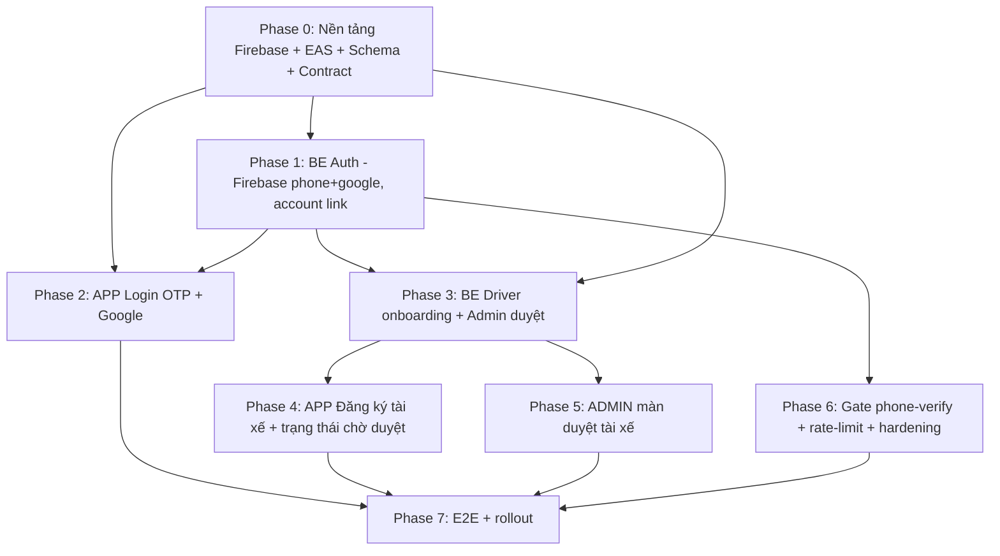

# Auth Identity — Phone OTP + Google + Driver Onboarding (Execution Plan)

> **Status:** `IN_PROGRESS` — quyết định đã chốt (2026-09-01): đội làm cả `[BE]` + `[ADMIN]`; mobile chuyển **Dev Client/EAS** (bỏ Expo Go); dùng **Firebase Auth** cho Phone OTP + Google (chấp nhận SMS không brandname).
>
> **Spec:** [`docs/superpowers/specs/2026-09-01-auth-identity-otp-google-driver-onboarding-design.md`](../specs/2026-09-01-auth-identity-otp-google-driver-onboarding-design.md)
>
> **Goal:** Thay luồng đăng nhập demo bằng đăng nhập thật (Phone OTP + Google) và luồng đăng ký–duyệt tài xế, giữ phone là neo vận hành.
>
> **Ownership:** `[APP]` mobile (phần của bạn) · `[BE]` backend · `[ADMIN]` admin web · `[INFRA]` Firebase/EAS.
>
> **Branch:** `feature/auth-otp-google-driver-onboarding`. Baseline: xác nhận SHA + CI xanh trước khi bắt đầu.

## Nhật ký tiến độ

- **2026-09-01** — ✅ **P0-T4 (schema)** hoàn tất: migration `20260901000000_auth_identity_otp_google_driver_onboarding` đã apply (User: `firebaseUid`/`email`/`phoneVerifiedAt`/`emailVerifiedAt`, `phone` nullable + backfill; `UserStatus` +3 giá trị; `DriverProfile` +KYC fields; model mới `DriverDocument`). Build API xanh (`tsc` exit 0); `AuthUser.phone` chuyển nullable; coalesce phone/name ở admin-query + fleet-owner service (tech-debt: xử lý đúng khi làm UI duyệt tài xế). Test `otp-provider.spec` xanh.
- **2026-09-01** — ✅ **Phase 1 (backend auth)** hoàn tất (TDD):
  - `OtpIdentity` +`email`, `phoneNumber` optional; `FirebaseOtpProvider.mapDecodedToken` chấp nhận token Google (email, không phone).
  - `auth.service`: `upsertIdentityUser` key theo `firebaseUid` → link theo phone → email; **bỏ hard-code CUSTOMER** (giữ role cũ, user mới mặc định CUSTOMER); set `phoneVerifiedAt`/`emailVerifiedAt` theo kênh đã verify.
  - Endpoint mới `POST /auth/phone/link` (gắn phone đã verify vào tài khoản đang đăng nhập, chặn phone trùng chủ khác → 409).
  - Test xanh: `otp-provider.spec` 12/12, `login.e2e-spec` 10/10 (+3 case: Google, account-link theo phone, phone/link), `refresh.e2e-spec` 10/10. Nâng cấp prisma double 2 file e2e hỗ trợ `firebaseUid`/`email`/`update`.
- **2026-09-01** — ✅ **P0-T5 (seed)**: seed chạy sạch với schema mới (`node prisma/seed.ts` → 8 users/2 fleets/6 orders, exit 0). Manifest không đổi (schema mới chỉ thêm cột optional, không đổi giá trị seed).
  - ⚠️ **Cảnh báo vận hành:** `test/seed-determinism.spec.ts` chạy qua `jest.config.cjs` là **phá hủy** — nó reset/wipe DB trỏ bởi `DATABASE_URL`. Chạy nó với `DATABASE_URL` của dev đã xoá sạch dev DB (đã khôi phục bằng `prisma migrate deploy`). **KHÔNG chạy seed-determinism trên dev DB**; chỉ chạy qua pipeline DB test chuyên dụng/CI.
- **2026-09-01** — 🔄 **Phase 3 (đang làm)**: pivot phân phối sang **Web/PWA only** (cập nhật quyết định #2, P0-T3, Phase 2). Đã set `FIREBASE_PROJECT_ID=leopard-pilot` + `GOOGLE_APPLICATION_CREDENTIALS` path trong `apps/api/.env`.
  - ✅ **P3-T1a** (apply + xem hồ sơ): `DriverApplicationService.apply` (CUSTOMER/DRIVER-REJECTED → DRIVER/PENDING_APPROVAL, upsert `DriverProfile` với vehicleType/licensePlate/licenseNumber/submittedAt) + `getMyApplication`; DTO `ApplyDriverDto`; endpoint `POST driver/apply` + `GET driver/application` (không cần role DRIVER). Unit test 5/5 xanh, tsc exit 0.
  - ✅ **Phase 3 admin duyệt + gate** (2026-09-01): `AdminDriverReviewService` (`listApplications`/`approve`/`reject` + audit log `APPROVE_DRIVER`/`REJECT_DRIVER`); endpoint `GET /admin/drivers/applications`, `POST /admin/drivers/:id/approve`, `POST /admin/drivers/:id/reject` (RoleGuard ADMIN); DTO `Approve/RejectDriverDto`. **Gate accept**: `accept-order.service` + `drivers.service.updateAvailability` chặn tài xế `status != ACTIVE` → `403 DRIVER_NOT_APPROVED`. Unit 11/11 xanh; e2e availability + order-lifecycle 15/15, security 43/43 xanh (không hồi quy). tsc exit 0.
  - ⏳ Còn lại: upload KYC (`DriverDocument` + endpoint), bỏ auto-create profile `drivers.repository.ts:27` (P3-T2, optional).
  - **Lưu ý chạy e2e:** dùng `node --env-file=.env ./node_modules/jest/bin/jest.js --config jest-e2e.config.cjs ...` (KHÔNG `source .env` — hỏng biến JSON `PRICING_VEHICLE_RATES_JSON`).
- **2026-09-01** — 🔄 **Phase 2 (mobile web, đang làm)**: nhận `firebaseConfig` từ user → set `EXPO_PUBLIC_FIREBASE_*` trong `apps/mobile/.env`; cài `firebase@^12.18.0` (pnpm).
  - ✅ **P2-T1/T2** (core auth): `src/auth/firebase.ts` (init từ env), `src/auth/phone.ts` (`toE164Vn`/`isLikelyVnPhone`, tests 7/7), `src/auth/firebase-auth.ts` (adapter: `sendPhoneOtp` + reCAPTCHA invisible, `signInWithGoogle` popup, `resetRecaptcha`). tsc mobile exit 0.
  - ✅ **P2-T3/T4** (UI): rework `src/auth/LoginScreen.tsx` theo phase — ô SĐT → `Gửi mã OTP` → màn nhập OTP 6 số → `Xác nhận` → `POST /auth/firebase`; nút **Đăng nhập với Google**; container reCAPTCHA (`<View nativeID>`). Viết lại `LoginScreen.test.tsx` + `login-route.test.tsx` cho luồng mới (mock `./firebase`+`./firebase-auth`). **Full mobile suite: 44 suites / 420 tests xanh**, tsc exit 0.
  - ⏳ Kế tiếp **P2-T6** (PWA: `app.json` web + manifest, `expo export -p web`) và kiểm chứng trên browser thật với số test `+84900000001/123456`.

## Nguyên tắc thực thi

1. **TDD:** mỗi task backend/logic viết test trước (RED → GREEN → REFACTOR), coverage ≥ 80% (theo `common/testing.md`).
2. **Contract-first:** chốt hợp đồng API (§6 spec) trước khi `[APP]` và `[BE]` chạy song song, để mobile code theo view model ổn định.
3. **Không đánh dấu task `DONE`** khi chưa có test + evidence integration thật (không chỉ fixture).
4. Firebase/EAS là điều kiện chặn cho phần OTP native → làm Phase 0 trước.

## Luồng phụ thuộc

`[APP]` (phần của bạn) tập trung ở **Phase 2 + Phase 4**, phụ thuộc contract từ Phase 0/1 và driver API từ Phase 3.

---

## Phase 0 — Nền tảng `[INFRA]` `[BE]` `[APP]`

| ID | Task | Owner | Acceptance |
|---|---|---|---|
| P0-T1 | Tạo Firebase project, bật **Phone** + **Google** provider, bật billing Blaze, thêm số điện thoại test | `[INFRA]` | Đăng nhập test bằng số test nhận được OTP ở môi trường dev |
| P0-T2 | Cấu hình `FIREBASE_PROJECT_ID` + service account (`GOOGLE_APPLICATION_CREDENTIALS`) cho API | `[INFRA]` | `createProductionFirebaseVerifier` (`firebase-admin.verifier.ts:36`) verify được token thật |
| P0-T3 | ~~EAS/dev client~~ **(BỎ — web pilot)**. Thay bằng: cấu hình **Expo Web** + PWA (`app.json` web block, manifest, `expo export -p web` deploy được lên host tĩnh) | `[APP]` | `npx expo export -p web` build ra bundle web; mở chạy trên browser |
| P0-T4 | Migration Prisma: `User.firebaseUid/email` (+unique), `phone` → nullable, `phoneVerifiedAt/emailVerifiedAt`; `UserStatus` thêm `PENDING_APPROVAL/REJECTED/SUSPENDED`; `DriverProfile` thêm field KYC (spec §5) | `[BE]` | `prisma migrate` chạy; backfill user cũ `phoneVerifiedAt=now()` |
| P0-T5 | Cập nhật seed + `seed-determinism.spec.ts` (`ManifestUser`) theo schema mới | `[BE]` | Seed determinism test xanh |
| P0-T6 | Chốt & viết hợp đồng API vào `docs/api/01-rest-api-spec.md` (các route spec §6) | `[BE]` | Contract review approved; mobile bắt đầu code theo view model |

## Phase 1 — Backend Auth `[BE]`

| ID | Task | Acceptance |
|---|---|---|
| P1-T1 | Mở rộng `OtpIdentity` (`otp-provider.ts:3`) thêm `email?`, `phoneNumber?` optional | Unit test compile + provider trả email |
| P1-T2 | Nới `mapDecodedToken` (`firebase-otp.provider.ts:63`): chấp nhận token chỉ có `email` (Google) hoặc chỉ có `phone_number` | Test: token google pass, token thiếu cả hai → reject |
| P1-T3 | Rewrite `loginIdentity`/`loginFirebase` (`auth.service.ts:62,116`): key theo `firebaseUid`, upsert, set email/phone, **bỏ hard-code CUSTOMER** (`:67`), account-linking theo phone/email trùng | Test: user mới→CUSTOMER; user cũ giữ role; google+phone cùng uid→1 tài khoản |
| P1-T4 | Endpoint `POST /auth/phone/link`: user đã auth gửi phone-idToken → set `phoneVerifiedAt`, gắn phone | E2E: google user link phone thành công; phone trùng user khác → 409 |
| P1-T5 | Cập nhật `login.e2e-spec.ts`/`refresh.e2e-spec.ts` cho luồng mới | Auth e2e xanh |

## Phase 2 — Mobile **Web** Login OTP + Google `[APP]` ⭐ (phần của bạn)

> Web pilot: dùng **Firebase JS SDK** (`firebase/auth`), KHÔNG native. Chờ `firebaseConfig` từ user.

| ID | Task | Acceptance |
|---|---|---|
| P2-T1 | Thêm dep `firebase` (JS SDK); module `src/auth/firebase.ts` khởi tạo `initializeApp(firebaseConfig)` đọc từ `EXPO_PUBLIC_FIREBASE_*` | Firebase init OK trong browser |
| P2-T2 | Adapter auth: phone → `RecaptchaVerifier` (invisible) + `signInWithPhoneNumber`; Google → `signInWithPopup(GoogleAuthProvider)` | Lấy được `idToken` từ 2 luồng |
| P2-T3 | Rework `src/auth/LoginScreen.tsx`: ô SĐT (+84) + màn nhập OTP 6 số + nút Google; `getIdToken()` → `POST /auth/firebase` | Số test `+84900000001`/`123456` → vào app đúng role; sai/hết hạn → lỗi rõ |
| P2-T4 | Container reCAPTCHA cho web (DOM element ẩn) + xử lý `Platform.OS === 'web'` | reCAPTCHA invisible hoạt động, không chặn UI |
| P2-T5 | Lưu token `expo-secure-store` (web: fallback an toàn); cập nhật `session-store` | Reload giữ phiên |
| P2-T6 | Config **PWA** (`app.json` web + manifest, icon) → `expo export -p web` deploy | Cài "Add to Home Screen", chạy fullscreen |
| P2-T7 | Component test cho login + OTP (mock `firebase/auth`) | Coverage ≥ 80% phần mới |

## Phase 3 — Backend Driver Onboarding + Admin `[BE]`

| ID | Task | Acceptance |
|---|---|---|
| P3-T1 | `POST /drivers/apply`: tạo `DriverProfile` (vehicleType, licensePlate, licenseNumber, media ids), set `role=DRIVER`, `status=PENDING_APPROVAL` | E2E: nộp hồ sơ → user PENDING, profile tạo |
| P3-T2 | Bỏ auto-create driver mặc định (`drivers.repository.ts:27`) — chỉ tạo qua apply | Bật availability khi chưa duyệt → 403 |
| P3-T3 | `GET /drivers/me/application` trạng thái hồ sơ | Trả đúng status + rejectionReason |
| P3-T4 | `GET/POST /admin/drivers/applications`, `/approve`, `/reject` (RoleGuard ADMIN) | Duyệt → ACTIVE; từ chối → REJECTED + lý do |
| P3-T5 | Gate `POST orders/:id/accept` yêu cầu driver `ACTIVE` | Driver PENDING accept đơn → 403 DRIVER_NOT_APPROVED |

## Phase 4 — Mobile Đăng ký tài xế `[APP]` ⭐ (phần của bạn)

| ID | Task | Acceptance |
|---|---|---|
| P4-T1 | Thay stub `app/(public)/register.tsx:21` bằng luồng multi-step thật gọi `POST /drivers/apply` | Nộp hồ sơ thật → nhận PENDING |
| P4-T2 | Upload GPLX + cà-vẹt + CCCD qua media pipeline sẵn có | Ảnh giấy tờ lưu & xem lại được |
| P4-T3 | Màn "Hồ sơ đang chờ duyệt" (poll `/drivers/me/application`), khóa UI nhận đơn khi PENDING/REJECTED | Driver PENDING không thấy nút nhận đơn |
| P4-T4 | Trạng thái REJECTED hiện lý do + cho nộp lại | Nộp lại chuyển về PENDING |
| P4-T5 | Bổ sung nhãn status mới ở `StatusBadge.tsx:140` | Hiển thị đúng PENDING/REJECTED/SUSPENDED |

## Phase 5 — Admin duyệt tài xế `[ADMIN]` ✅ (2026-09-01)

| ID | Task | Trạng thái |
|---|---|---|
| P5-T1 | Màn danh sách hồ sơ chờ duyệt | ✅ `DriverApplicationsScreen` (client) fetch `/admin/drivers/applications` qua browserClient + BFF proxy; route `app/(admin)/admin/driver-applications`; nav item "Duyệt tài xế"; loading/error/empty states |
| P5-T2 | Duyệt/Từ chối (kèm lý do) gọi API Phase 3 | ✅ nút Duyệt → `POST approve`; Từ chối → nhập lý do (≥5 ký tự) → `POST reject`; refetch sau hành động. Test 4/4; nhóm admin 8 suites/98 tests xanh; tsc exit 0 |
| P5-T3 | Xem chi tiết KYC (ảnh giấy tờ) | ⏳ chờ KYC upload (DriverDocument) |

## Nhật ký tiến độ (bổ sung 2026-09-01)

- ✅ **Phase 6 rate-limit** (`[BE]`): `AuthRateLimiter` (in-memory fixed-window, tái dùng pattern `TrackingRateLimiter`, KHÔNG thêm `@nestjs/throttler`) + `AuthThrottleGuard` (key theo IP) áp vào `POST /auth/login/demo|firebase|phone/link|refresh` (không throttle `/me`,`/logout`). Provider qua `useFactory`. Unit 4/4; auth e2e login+refresh 20/20 xanh; tsc 0.
- 🔄 **Field `name` (tên tài xế)**: thêm `User.name VARCHAR(120)` (schema + migration `20260901010000_add_user_name` **đã tạo, CHƯA apply** — Docker/DB down khi đang làm); wire vào `ApplyDriverDto.name` (required) → lưu `User.name` khi apply; `AdminDriverReviewService` summary +`name`; admin web screen hiển thị "Tên tài xế". Client regen; tsc API+admin 0; unit driver/admin/screen xanh.
  - ✅ Migration `name` đã apply (Docker/postgres bật lại); e2e sweep 61/61 xanh (auth+driver+order+security).
- ✅ **KYC backend** (2026-09-01): `image-validation.ts` (magic-bytes + size, tách dùng chung); `DriverDocumentService` (upload → StorageProvider + `DriverDocument`, idempotent theo clientRequestId; `listMyDocuments`; `listDocumentsForUser` cho admin, kèm signed URL). Endpoint `POST /driver/documents` (multipart), `GET /driver/documents`, `GET /admin/drivers/:id/documents`. Export `StorageProvider` từ MediaModule; DriversModule provide qua factory; AdminModule import DriversModule. Unit 6/6; DriversModule boot e2e 5/5; tsc 0.
- ✅ **Phase 4 mobile register redesign** (2026-09-01): rework `app/(public)/register.tsx` — **driver-only** (bỏ toggle customer), đồng bộ palette + card/input/CTA của login; fields: Họ tên, loại xe (chips), biển số, **số GPLX**; **upload KYC** 3 slot (GPLX/cà-vẹt/CCCD) qua `pickDeviceImage` + `httpClient.postForm`. Nối `POST /driver/apply` → upload từng ảnh `POST /driver/documents`. Có **auth gate** (chưa đăng nhập → mời login), màn "chờ duyệt" khi thành công. Endpoint đúng là `/driver/*` (controller `@Controller('driver')`). Test 3/3; tsc 0. (Full mobile suite: 2 suite nặng flaky khi chạy song song — pass sạch khi `--runInBand`/isolation, không phải hồi quy.)
- ✅ **Admin viewer KYC** (2026-09-01): DriverApplicationsScreen thêm nút "Xem giấy tờ" → fetch `GET /admin/drivers/:id/documents` → hiển thị thumbnail ảnh (nhãn GPLX/Cà-vẹt/CCCD), mở tab mới. Test 5/5; tsc admin 0. *Caveat dev:* API chưa serve `/files/` tĩnh nên ảnh local-storage không hiển thị ở dev (gap chung mọi media); production S3 (URL tuyệt đối) hoạt động.
- ✅ **Phase 2 PWA** (2026-09-01): `app.json` web + `icon`/`favicon` (leopard-emblem) + `backgroundColor`; `expo config` resolve đúng (name/shortName/lang vi/themeColor #1E5BB8/display standalone/orientation/startUrl/scope) → "Add to Home Screen" hoạt động.
- ✅ **Màn "chờ duyệt" + kiểm tra trạng thái** (2026-09-02): register success card thêm nút **"Kiểm tra lại"** → `GET /driver/application` → phản ánh ACTIVE (Bắt đầu nhận đơn) / REJECTED (lý do + Nộp lại) / PENDING. Test 3/3 (bỏ auto-interval để tránh open-handle/flaky). tsc 0.
- ✅ **Serve `/files/` tĩnh (dev)** (2026-09-02): `main.ts` `useStaticAssets(uploads, '/files')` khi không phải S3; `LocalStorageProvider.createReadUrl` trả URL tuyệt đối qua `PUBLIC_FILES_BASE_URL` (default relative, backward-compat) → admin web hiển thị ảnh KYC local dev. media e2e 5/5, unit media/driver 14/14, tsc 0.

## ✅ Toàn bộ phạm vi kế hoạch đã hoàn thành (2026-09-02).

## Phase 6 — Gate phone-verify + Hardening `[BE]` `[APP]`

| ID | Task | Acceptance |
|---|---|---|
| P6-T1 | `[BE]` Gate `POST orders` yêu cầu `phoneVerifiedAt != null` | Google user chưa verify tạo đơn → 403 PHONE_VERIFICATION_REQUIRED |
| P6-T2 | `[APP]` Màn gate verify phone khi customer Google bấm tạo đơn → OTP → `POST /auth/phone/link` | Sau verify tạo đơn được |
| P6-T3 | `[BE]` Thêm `@nestjs/throttler`, rate-limit `/auth/*` + `/auth/phone/link` | Vượt ngưỡng → 429; test throttle |
| P6-T4 | `[APP]` Token secure-store audit + không log token | Không có secret trong log/bundle |

## Phase 7 — E2E + Rollout

| ID | Task | Owner | Acceptance |
|---|---|---|---|
| P7-T1 | E2E journey: customer phone-OTP, customer google→verify phone→đặt đơn, driver đăng ký→admin duyệt→nhận đơn | `[APP]` `[BE]` | Các flow chính pass trên build thật |
| P7-T2 | Kiểm thử trên thiết bị iOS + Android thật (không chỉ simulator) | `[APP]` | OTP + Google chạy trên cả 2 nền |
| P7-T3 | Cập nhật `docs/api/04-auth-and-permissions.md`, `docs/ui/02-navigation-map.md` | `[BE]` `[APP]` | Docs khớp hành vi mới |
| P7-T4 | Pre-release gate: `tsc --noEmit`, `expo lint`, tests xanh, `expo-doctor`, không secret trong bundle | `[APP]` | Toàn bộ gate xanh |

---

## Tổng hợp phần của bạn `[APP]`

Nếu bạn chỉ làm mobile, trọng tâm là: **P0-T3** (EAS/dev client), **Phase 2** (login OTP + Google), **Phase 4** (đăng ký tài xế + chờ duyệt), **P4-T5 / P6-T2 / P6-T4 / P7-T1,2,4**. Các phase này **phụ thuộc contract Phase 0-T6 và API Phase 1/3** — cần `[BE]` chốt trước hoặc bạn kiêm luôn backend.

## Quyết định đã chốt (2026-09-01)

1. ✅ Đội làm cả `[BE]` + `[ADMIN]` + `[APP]` — không bị chặn vì thiếu backend.
2. ✅ **Phân phối: Web/PWA only** (không lên CH Play/App Store trong pilot). Hệ quả:
   - Mobile chạy **Expo Web** → dùng **Firebase JS SDK** (`firebase/auth`) + **reCAPTCHA** (phone) + `signInWithPopup` (Google).
   - **KHÔNG** dùng `@react-native-firebase`, **KHÔNG** cần EAS/Dev Client, **bỏ** SHA-256/APNs (Part E), **bỏ** `google-services.json`/`GoogleService-Info.plist`.
   - Cấu hình web = **`firebaseConfig`** của Firebase Web app (đặt vào `EXPO_PUBLIC_FIREBASE_*`).
3. ✅ Chốt **Firebase Auth** cho Phone OTP + Google (SMS không brandname). Backend Admin SDK verify idToken **không đổi** dù client là web.

### Cấu hình Firebase đã có (2026-09-01)
- `FIREBASE_PROJECT_ID = leopard-pilot` (đã set `apps/api/.env`).
- Web OAuth client ID: `21432131328-...r822.apps.googleusercontent.com`; project number/messagingSenderId `21432131328`.
- Số test: `+84900000001 → 123456`.
- ⏳ Chờ bạn: đăng ký **Firebase Web app** → gửi `firebaseConfig` (apiKey/appId…); thêm domain deploy vào **Authorized domains**.

## Ghi chú thực thi

- **Ảnh KYC tài xế:** dùng model mới `DriverDocument` (không tái dùng `MediaObject` vì model đó bắt buộc `orderId`). Xem P0-T4.
- **Firebase console + billing + EAS credentials** (P0-T1/T2, credentials của P0-T3) là thao tác trên tài khoản chủ dự án — không thuộc phần code. Backend TDD được không cần Firebase thật nhờ fixture `AUTH_FIREBASE_TEST_TOKENS` (`auth.module.ts:41`).
