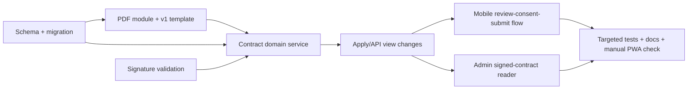

# Driver Contract Signing — Execution Plan

> **Status:** `READY`
> **Design input:** [driver-contract-signing design](../specs/2026-09-05-driver-contract-signing-design.md)
> **Scope:** NestJS API, Prisma, shared PDF infrastructure, Expo Web/PWA driver registration, and API/UI documentation.

## Goal and implementation boundaries

Before a customer becomes a pending driver, they must read contract version `v1`, explicitly accept it, and provide a typed-name or image signature. The system must persist a versioned, signed PDF and the associated audit data before it transitions the account to `DRIVER/PENDING_APPROVAL`.

This plan deliberately excludes legal e-signature verification, contract renewal/amendment, and contract variants for fleet owners or admins. It preserves the existing owner/role gates, KYC upload flow, and driver approval flow.

**Implementation decision for an ambiguity in the design:** `GET /driver/contract` returns a version and an authenticated route URL such as `/driver/contract/pdf?version=v1`; that route streams a generic, unsigned PDF generated from the built-in versioned template. It does not persist a per-user unsigned copy. `POST /driver/apply` produces and persists the personalised signed PDF. This fulfills the read-before-agree requirement without creating disposable storage objects or exposing draft personal data.

## Current implementation seams

| Concern | Existing seam to extend |
| --- | --- |
| Apply + application view | `apps/api/src/drivers/driver-application.service.ts`, `apps/api/src/drivers/dto/apply-driver.dto.ts`, `apps/api/src/drivers/drivers.controller.ts` |
| Document image validation/storage/cleanup | `apps/api/src/media/image-validation.ts`, `apps/api/src/media/storage.provider.ts`, `apps/api/src/drivers/driver-document.service.ts` |
| Driver module composition | `apps/api/src/drivers/drivers.module.ts`; it already imports `MediaModule`, which exports `StorageProvider` |
| Schema and generated client | `apps/api/prisma/schema.prisma` plus a new timestamped migration |
| Driver registration UI | `apps/mobile/app/(public)/driver-register.tsx` |
| Driver registration route test | `apps/mobile/src/auth/driver-register-route.test.tsx` |
| Existing specification surfaces | `docs/api/01-rest-api-spec.md`, `docs/data/01-database-design.md`, `docs/ui/03-screen-specs.md` |

## Dependency order

## Phase 1 — Contract data and reusable PDF foundation

1. Add `DriverContract`, its `DriverProfile` audit columns, relations, indexes, and `(driverProfileId, version)` uniqueness to `apps/api/prisma/schema.prisma`; generate a committed Prisma migration named from the actual creation timestamp. Do not edit an existing migration.
2. Add `apps/api/src/pdf/` with a focused `PdfModule`, `PdfService`, input types, and a contract-oriented render function. Add `pdfkit` plus its TypeScript types to `apps/api/package.json`. Keep rendering deterministic: explicit page margins, Vietnamese-safe embedded font strategy, fixed metadata/date formatting, and no reads from HTTP or database inside `PdfService`.
3. Add `apps/api/src/drivers/driver-contract-template.ts` with `CONTRACT_VERSION = 'v1'`, structured template data, and the approved Vietnamese legal content. Keep legal copy separate from orchestration so a future `v2` is additive rather than a mutation of evidence.
4. Unit-test `PdfService` before wiring it: the unsigned template and a typed/image signed contract each produce a non-empty buffer beginning with the `%PDF-` signature. Include Vietnamese diacritics and long customer/vehicle fields to catch layout overflow.
5. Import `PdfModule` into `DriversModule`; export only `PdfService` from the PDF module so invoices can reuse it later without importing driver-domain services.

## Phase 2 — Backend contract lifecycle, API, and administration

1. Extend `ApplyDriverDto` with a required boolean `contractAccepted` and optional `signature`. Use a custom validator/parser at the boundary rather than trusting a declared MIME type:
   - reject any value other than literal `true` with `CONTRACT_NOT_ACCEPTED`/422;
   - a non-data-URI is a trimmed typed signature, limited to 120 characters and non-empty;
   - a data-URI must decode safely, be at most `MAX_IMAGE_SIZE_BYTES` (10 MB, already exported from `image-validation.ts`), pass `detectImageMime` and `isAllowedImageMime`, and map to `IMAGE_MIME_TO_EXT`; otherwise return `SIGNATURE_INVALID`/422.
2. Add `DriverContractService` in `apps/api/src/drivers/`. It owns generic-PDF generation, signed-PDF generation, contract persistence, and signed URL projection. It receives `PrismaService`, `StorageProvider`, and `PdfService`; it must never construct storage providers directly.
3. Add a `GET /driver/contract` response DTO and a `GET /driver/contract/pdf` streaming action in `DriversController`, both protected by the same authenticated onboarding statuses as `apply`. Restrict accepted version values to the current supported contract version. Set `Content-Type: application/pdf` and a safe attachment/inline filename; generate no database row for this read-only preview.
4. Refactor `DriverApplicationService.apply` so its business checks happen before writes; it then delegates a single transactional application operation that creates/updates the profile, stores `DriverContract`, sets `contractVersion`/`contractSignedAt`, and applies the existing role/status transition. `DriverApplicationService` currently injects only `PrismaService`; add `DriverContractService` (and transitively `StorageProvider`/`PdfService`) to its constructor. Preserve the existing rejected-driver reapplication behaviour: re-signing `v1` overwrites the one row for that profile/version and refreshes the profile audit fields.
5. Do not hold a database transaction open while uploading an image or PDF. Generate and upload the signature/PDF first, then execute the database transaction; on transaction failure, best-effort delete every newly-created key. On an update, only delete superseded files after the transaction succeeds; a delete failure is logged with contract/profile context and never loses the committed record.
6. Extend `DriverApplicationView` and `GET /driver/application` with ISO-formatted `contractVersion` and `contractSignedAt`.
7. Add `GET /admin/drivers/:id/contract` in the existing admin driver-review surface (`apps/api/src/admin/admin-driver-review.service.ts` + controller). Require `ADMIN`; look up the requested driver's profile/contract, return 404 for absent evidence, and return metadata plus short-lived URLs for the signed PDF and optional signature. Do not return raw storage keys or cross-user files. Update the admin controller/module/test wiring as needed.
8. Add or extend tests before each service/controller change:
   - `contractAccepted: false` never changes user/profile state;
   - typed and valid image signatures create the correct storage entries and data rows;
   - invalid/deceptive image data and oversized payloads return 422;
   - transaction failure invokes best-effort storage cleanup;
   - rejected reapplication produces fresh evidence without duplicate same-version rows;
   - application/admin response projections enforce identity and admin authorization.

## Phase 3 — Driver PWA flow

1. Extend the existing registration state in `apps/mobile/app/(public)/driver-register.tsx` (or extract a small feature-local runtime/adapter only if it keeps the route focused) with a contract step after the driver/KYC details are valid and before final submission.
2. Fetch the contract descriptor through the authenticated HTTP client, render an accessible **“Xem hợp đồng”** link using the returned PDF URL, and require an explicit consent checkbox. The submit CTA remains disabled until both form/KYC requirements and consent are satisfied.
3. Implement typed-name signing as the required launch path. It pre-fills from the driver name but requires an explicit editable confirmation and sends that string as `signature`. A drawn PNG signature is optional and should only be added with a supported web canvas/image-picker path; it must serialize as the validated data URI described above.
4. Submit the existing application fields plus `contractAccepted: true` and `signature`. Preserve API error mapping so contract refusal or invalid signature is actionable rather than a generic failed registration state.
5. In the pending/rejected application view, display the signed version and signing time when available. Preserve loading, error, success, and permission/auth-required states at 360 px without horizontal overflow or a hidden keyboard target.
6. Update `apps/mobile/src/auth/driver-register-route.test.tsx` (and extracted feature tests, if any) to cover: preview fetch/link, disabled submit before consent, typed signature inclusion, server rejection presentation, and pending-state metadata.

## Phase 4 — Contracts, documentation, and verification

1. Update `docs/api/01-rest-api-spec.md` with the three driver-facing/admin routes, request constraints, response data, and 422 error contract. Update `docs/data/01-database-design.md` and `docs/ui/03-screen-specs.md` with the persisted evidence and registration contract step.
2. Add OpenAPI/e2e coverage for route auth, data validation, and application state transition; use test storage and fake PDF output where the test is not exercising rendering.
3. Run the narrow gates: `pnpm --filter api test`, `pnpm --filter api typecheck`, `pnpm --filter api lint`, `pnpm --filter mobile test -- --runInBand`, `pnpm --filter mobile typecheck`, and `pnpm --filter mobile lint`. If an exact script is absent, record the closest command and reason.
4. Manually verify in the PWA at 360 px and desktop width: template opens, consent gate works, typed signature submits, admin can open the signed PDF, reapplication does not expose stale evidence, and local/S3 URLs remain private/short-lived as applicable.

## Done when

- Schema migration and regenerated Prisma client are committed; one contract row exists per profile/version.
- A driver cannot enter `PENDING_APPROVAL` without explicit consent and a valid typed or image signature.
- Signed evidence contains the versioned contract and relevant application facts, is readable by the driver/admin only through authorized routes, and is safely cleaned up on failed persistence.
- Existing onboarding, KYC, approval, and authorization tests remain green; new unit, route-contract, and mobile tests cover the new conditions.
- API/data/UI documentation matches the delivered routes and behaviour.
