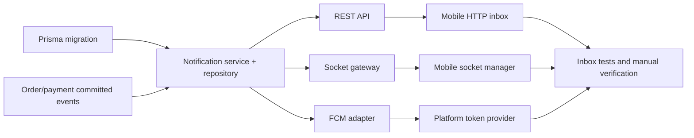

# Notifications — Execution Plan

> **Status:** `READY AFTER PUSH-TOKEN DECISION`
> **Design input:** [notifications design](../specs/2026-09-05-notifications-design.md)
> **Scope:** Persisted in-app notifications, Socket.IO delivery, device-token registration, optional FCM push, backend trigger wiring, and customer mobile inbox.

## Goal and boundaries

Replace the mock customer notification inbox with an authenticated, paginated server inbox. Persist first, then best-effort fan out through a `/notifications` Socket.IO namespace and FCM. Events are limited to order lifecycle/acceptance and confirmed manual payments; no preference centre, campaigns, or retry queue is introduced in this slice.

The durable database record is the source of truth. A missed Socket.IO or FCM message must be recoverable through `GET /notifications`; transport errors must never roll back the domain event that caused it.

## Current seams

| Concern | Existing seam to extend |
| --- | --- |
| In-process order events | `apps/api/src/orders/order-events.publisher.ts`, consumed by `apps/api/src/tracking/tracking.gateway.ts` |
| Socket authentication pattern | `apps/api/src/tracking/tracking.gateway.ts` and its `apps/api/src/tracking/socket-auth.adapter.ts` |
| Order status/acceptance | `apps/api/src/orders/update-order-status.service.ts`, `apps/api/src/orders/accept-order.service.ts`, `apps/api/src/orders/orders.service.ts` |
| Payment confirmation | `apps/api/src/payments/payments.service.ts` |
| Shared socket constants | `packages/shared/src/socket.ts` |
| Mock inbox | `apps/mobile/src/features/customer/notifications/NotificationsScreen.tsx` |
| Existing client socket factory | `apps/mobile/src/api/socket-client.ts` and tracking-socket manager pattern |
| Firebase Admin | `firebase-admin@14.2.0` under `apps/api/src/auth/providers/firebase-admin.verifier.ts` |
| Firebase Web (mobile) | `firebase@^12.18.0` already used for auth (`apps/mobile/src/auth/firebase.ts`) |

## Delivery sequence

## Phase 0 — Resolve the push-token compatibility gate

`firebase-admin.messaging()` accepts an FCM registration token. An Expo push token is not an FCM token and cannot be sent directly through that API. Because the current product direction is Expo Web/PWA, choose and document one of these before enabling push delivery:

1. **Recommended for this repository:** Firebase Web Messaging. Add a feature-local token provider using `firebase/messaging` (already available — `firebase@^12.18.0` is a dependency used by mobile auth), a `firebase-messaging-sw.js` PWA service worker, notification permission UX, and an `EXPO_PUBLIC_FIREBASE_VAPID_KEY` configuration value. Register the resulting FCM token with this API.
2. **Defer push:** ship persisted inbox + Socket.IO only, keep `FCM_ENABLED=false`, and do not register device tokens until a native/Expo Push adapter is explicitly designed.

Do not register an Expo token as `DeviceToken.token`. The existing design must be amended if option 1 adds the required VAPID setting; this is a real deployment dependency, not a runtime default to invent.

## Phase 1 — Persisted notification domain and HTTP contract

1. Add `NotificationType`, `Notification`, `DeviceToken`, and `User` back-relations in `apps/api/prisma/schema.prisma`, followed by a new immutable migration. Use the specified user/read/time indexes and unique token constraint.
2. Create a focused `apps/api/src/notifications/` module containing a repository and `NotificationsService`. Its command API accepts a typed immutable input, writes the row, then independently invokes socket and push fan-out after persistence. Its query API implements newest-first cursor/page semantics consistent with the repository's existing page envelope.
3. Implement ownership-safe methods: `list`, `unreadCount`, `markRead`, `markAllRead`, `registerToken`, and `removeToken`. `markRead` uses `where: { id, userId }` semantics and returns a non-disclosing 404; read operations cannot mutate another user's record.
4. Add DTOs for pagination and `{ token, platform }`. Validate token length/format conservatively, allow only `IOS`, `ANDROID`, or `WEB`, and update `lastUsedAt` on conflict. The remove endpoint removes only the requesting user's supplied/current token, never arbitrary user tokens.
5. Add `NotificationsController` with all authenticated endpoints from the design. Explicitly place the static `unread-count`, `read-all`, and `register-token` routes before parameterized `:id/read` routes to avoid routing ambiguity. Update OpenAPI responses and error examples.
6. Build service/controller tests first: paginate in a stable descending order, unread count, idempotent read/all-read, other-user non-disclosure, and token upsert/removal isolation.

## Phase 2 — Realtime and FCM adapters

1. Add `NOTIFICATIONS_NAMESPACE` and typed `NotificationSocketEvent` constants to `packages/shared/src/socket.ts`. Add corresponding payload types, avoiding raw Prisma models and storage keys in event data.
2. Create `NotificationsGateway`, modeled on the tracking gateway: authenticate with `SocketAuthAdapter`, join only `user:<actor.userId>`, remove the connection on auth/session error, and offer no client event that can target another room.
3. Inject the gateway (or a narrow `NotificationRealtimePublisher` port) into `NotificationsService`; after database success, emit `notification:new` only to the recipient's user room. Socket emit exceptions are logged with notification ID and swallowed.
4. Create `FirebaseMessagingService` behind an injectable port. Reuse the initialized Firebase Admin app rather than initializing a second app. When `FCM_ENABLED` is false or credentials are unavailable in the configured environment, make send a safe no-op with structured diagnostic logging.
5. Send the push payload with string-only data (`notificationId`, `type`, and optional `orderId`), title, and body. For each token, await isolated delivery; delete only that user's token when Firebase returns a known permanent-invalid-token error. Log/transient failures without deleting tokens or failing `NotificationsService.create`.
6. Add unit tests for room routing/authentication and for create → persist → socket/push ordering. Cover disabled FCM, a permanent-token failure pruning one token, and transient failure retaining it.

## Phase 3 — Trigger only committed business events

1. Extend `OrderEventsPublisher` event types rather than adding controller-level notifications. The current `OrderStatusChangedEvent` carries only `orderId`/statuses/`eventId`/`occurredAt` — it has **no** `customerId` or `driverId`. Decide before coding: **(a)** add recipient ids to the event, or **(b, recommended)** keep the event payload minimal and have `NotificationTriggers` look up the order's `customerId`/`driverId` after the event fires. Option (b) keeps personal data off the in-process event bus and touches fewer producers; use it unless a later requirement needs (a).
2. In `UpdateOrderStatusService` (the one place that already publishes post-commit at `update-order-status.service.ts:134`), publish notification work only after its status/history transaction has succeeded. Add title/body mapping in a small `NotificationTriggers` service; its handlers turn accepted/status events into `ORDER` notifications for the customer and, when assigned, the driver.
3. `AcceptOrderService` (`accept-order.service.ts`) currently does **not** inject or publish through `OrderEventsPublisher`. Add the publisher injection and publish a distinct accepted/status event once the assignment transaction commits. Prevent a double customer message when an accepted event and a generic status event represent the same transition; select one canonical event or a stable deduplication key before coding.
4. In `PaymentsService.confirmPayment`, invoke the payment trigger only after the confirmation transaction commits. Reuse the same idempotency guard: a replayed confirmation must not create an additional `PAYMENT` notification.
5. Subscribe/register trigger handlers through `NotificationsModule` with explicit module imports; avoid circular imports by depending on the event publisher interface or a narrow exported event service. `OrderEventsPublisher` is already exported from `OrdersModule`, and `TrackingGateway` subscribes in its constructor — mirror that wiring. Add integration tests that assert one persisted notification for each committed source event and none for a rolled-back/unauthorized command.

## Phase 4 — Customer PWA inbox and token registration

1. Split the mock-only data/state from `NotificationsScreen.tsx` into `model.ts`, `port.ts`, and `adapter.ts`, following the customer orders adapter boundary. The current screen's `NotificationItem.type` is lowercase (`'order' | 'payment' | 'promo' | 'system'`); the backend enum is uppercase (`ORDER | PAYMENT | PROMO | SYSTEM`). The adapter must map server enum values to the lowercase mobile union (or the model must adopt the server enum) and keep the mapping under test. Format server UTC timestamps locally rather than treating display labels as data.
2. Add `NotificationsRuntime` with React Query keys for list and unread count. Implement loading, empty, retry/error, pagination/load-more, one-read, and mark-all-read behaviour; optimistically update only after handling a request rollback/refetch path.
3. Add a notification socket manager based on the existing client factory and tracking socket manager. Connect only in the authenticated customer layout, prepend a `notification:new` payload by notification ID/data, invalidate/refetch unread count, and clean up listeners on unmount/token change. Do not create a socket connection on the public/auth routes.
4. Register/remove device tokens after login and logout only after the Phase 0 decision. Permission denial is a non-error: leave Socket.IO/in-app notifications working and do not repeatedly prompt on every screen render.
5. When a notification contains an `orderId`, navigate to that customer order. Mark it read with a failure-tolerant update; generic/system records stay in the inbox. Preserve accessibility labels, focus order, and 360 px layout.
6. Replace `NotificationsScreen` mock tests with HTTP/socket fakes. Cover API render/empty/error, receiving a live record, unread-badge update, mark-one/all, safe cleanup, and order deep link.

## Phase 5 — Documentation and verification

1. Update `docs/api/01-rest-api-spec.md`, `docs/data/01-database-design.md`, `docs/architecture/01-system-architecture.md`, and the customer notification screen entry in `docs/ui/03-screen-specs.md`.
2. Add `FCM_ENABLED` to **both** the zod schema and the `parseEnv(...)` mapping in `apps/api/src/config/env.schema.ts` (the parser builds an explicit object literal — a key absent from that mapping is never validated or exposed), plus the repo-root `.env.example` and the chosen Phase 0 client configuration. Validate production choices explicitly; do not silently enable Firebase credentials.
3. Run API/mobile test, typecheck, and lint scripts, then manually verify two distinct authenticated users: user A cannot see/read/register/remove user B's notifications/tokens; A receives its persisted notification via REST after a disconnected socket; real-time delivery updates a connected inbox. Verify push only on the chosen target platform/permission state.

## Done when

- Notifications are durable, user-scoped, paginated, and readable after reconnect/refresh.
- Socket and FCM fan-out happen only after persistence and never break order/payment processing.
- Payment and order triggers are post-commit and idempotency-safe.
- Mobile contains no hardcoded notification data, handles all primary states, and cleans up live listeners.
- FCM is either correctly configured with compatible tokens or explicitly disabled/deferred; no Expo push token is sent to Firebase Admin.
