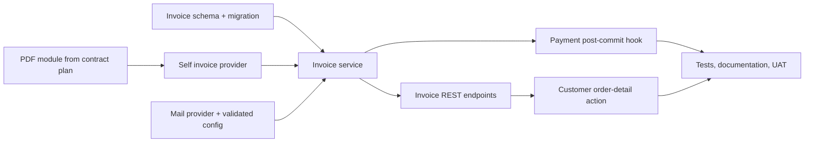

# VAT Invoice + Email Delivery — Execution Plan

> **Status:** `READY WITH ISSUANCE-RETRY DECISION`
> **Design input:** [VAT invoice design](../specs/2026-09-05-vat-invoice-design.md)
> **Scope:** Invoice persistence and PDF generation after manual payment confirmation, provider abstractions, email link delivery, customer in-app access, and API/data/UI documentation.

## Goal and boundaries

After a payment becomes `PAID_MANUAL`, issue one immutable VAT-style invoice for its order/payment intent, store its PDF privately, and attempt to send the customer a short-lived view/download link. The customer and an admin can retrieve the invoice; a customer without a usable email can submit one and retry delivery.

This is not an authority-issued e-invoice, tax filing, PayOS/VietQR expansion, credit-note workflow, or general mail system. `VOIDED` is a storage status only until a separately approved lifecycle is designed.

## Current seams

| Concern | Existing seam to extend |
| --- | --- |
| Payment transition/idempotency/audit | `apps/api/src/payments/payments.service.ts`, repository/controller/module |
| Order/payment ownership | `apps/api/src/orders/orders.repository.ts` and existing payment history authorization checks |
| Storage | `apps/api/src/media/storage.provider.ts`, exported by `MediaModule` |
| Shared PDF dependency | `apps/api/src/pdf/` from the driver-contract plan |
| Config schema | `apps/api/src/config/env.schema.ts` (zod schema **and** `parseEnv(...)` object literal) |
| Env example | `.env.example` (repo root — there is no `apps/api/.env.example`) |
| Customer order UI | `apps/mobile/src/features/customer/orders/CustomerOrderDetailRuntime.tsx`, screen/model/port/adapter |

## Mandatory cross-plan order

The PDF module from the contract plan is a shared prerequisite. Implement it once in a small `PdfModule`; invoices import that module, not driver services/templates. Invoice code can proceed in parallel up to its service interfaces/schema, but it must not introduce a second PDF library or renderer.

## Phase 0 — Close the post-commit issuance/retry contract

Payment confirmation is already committed before invoice generation can safely call storage or SMTP. If PDF/storage generation fails after that commit, returning an error alone leaves a paid order without a retry path because subsequent idempotent confirmation calls currently return early.

Before implementation, select and document one of these bounded behaviours:

1. **Recommended:** add a durable invoice-issuance outbox/attempt state written in the same payment-confirmation transaction; a worker/service retries until the invoice exists. This keeps payment confirmation responsive and makes automatic issuance recoverable.
2. **Smaller pilot alternative:** run `ensureInvoice` synchronously after commit; every `PAID_MANUAL` idempotent/replay read path calls it again when no invoice exists, and the API returns payment success while structured logs/operations surface the retry requirement.

Do not start provider implementation until this is chosen: the design currently promises automatic generation but has no recovery mechanism for the most important failure class.

## Phase 1 — Schema, numbering, and provider contracts

1. Add `InvoiceStatus`, `Invoice`, `Order.invoice`, and `PaymentIntent.invoice` to `apps/api/prisma/schema.prisma`, with the stated uniques, restrictive relations, and indexes. Add a timestamped migration; do not combine it with the driver-contract migration.
2. Add a transaction-safe invoice-number sequence. Prefer an explicit `InvoiceSequence` model keyed by year/series with a transactional atomic increment; do not derive numbers from `max(invoiceNumber)`, which races under concurrent confirmations. Decide and document the stable format (`LP/YYYY/NNNNNN`) and zero-padding boundary.
3. Create `apps/api/src/invoices/` with immutable `InvoiceInput`/`GeneratedInvoice` types and an abstract `InvoiceProvider`. `SelfGeneratedInvoiceProvider` computes integer VND values only. **Money source:** the authoritative amount is `PaymentIntent.amountVnd` (a non-null `Int` snapshotted at payment creation from `order.priceVnd ?? 0`); `Order.priceVnd` is nullable and must not be the primary input. Validate non-negative amount, calculate `vatRateVnd` from the agreed 10% rule with explicit rounding, calculate total, reserve the sequence inside the issuance transaction, and ask `PdfService` to render the fixed Vietnamese invoice template.
4. Add an abstract `MailProvider`, `ConsoleMailProvider`, and `SmtpMailProvider`. Install and type `nodemailer` only when this phase is implemented. Do not log recipient email or signed URL at info level in production; console-mail must be disallowed in production unless the explicit safety flag permits it.
5. Add `INVOICE_PROVIDER`, `MAIL_PROVIDER`, `ALLOW_CONSOLE_MAIL_PROVIDER`, and conditional SMTP/`MAIL_FROM` validation to `apps/api/src/config/env.schema.ts` — **both** the zod schema definition **and** the explicit `parseEnv(...)` mapping (the parser builds an object literal; a key omitted there is never validated or surfaced). Mirror them in the repo-root `.env.example` (the only env example file — there is no `apps/api/.env.example`). Configure providers through a factory in `InvoicesModule`, following the existing payment/storage module pattern, with explicit failure for unsupported `einvoice` until a real provider is supplied.
6. Write provider tests first: exact VAT/total boundary values, no floating-point arithmetic, unique sequential numbers under concurrent calls, valid PDF buffer, console/smtp configuration gating, and no secret-bearing logs.

## Phase 2 — Idempotent issuance and secure email delivery

1. Implement `InvoicesRepository` and `InvoicesService.ensureInvoice(orderId, paymentIntentId)`. It must load authoritative persisted order/payment/user data, enforce that the intent is the confirmed payment for that order, and return the existing invoice before allocating a number or writing a second file.
2. Use a unique invoice ID/key generated before storage. Render/store the PDF at `invoices/<invoiceId>.pdf`; persist only the storage key after successful upload. If DB persistence fails, best-effort delete that new object. If a conflicting invoice row wins a race, delete the losing object and return the existing row.
3. Implement the chosen Phase 0 recovery behaviour. Email is a separate best-effort operation after invoice issuance: create a short-lived read URL, send through the mail provider, and set `emailSentAt` only after send succeeds. An SMTP failure leaves a valid invoice and `emailSentAt=null`; it must not undo payment/issuance.
4. Add `InvoicesController` endpoints:
   - `GET /invoices/order/:orderId`: owner or admin; return safe metadata and a short-lived read URL.
   - `GET /invoices/:id/download`: owner or admin; confirm invoice ownership before redirecting to a generated URL.
   - `POST /invoices/:id/send`: owner or admin; validate email with a shared server-side validator, update invoice email and only a null `User.email`, send a fresh link, then set `emailSentAt`.
5. Map absent/inaccessible records to a non-disclosing 404. Use a clear response/error policy for SMTP failure: it may return `MAIL_PROVIDER_FAILED`/502 after retaining the invoice, so the UI can offer retry. Do not expose the storage key, SMTP configuration, raw exception, or another customer's email.
6. Unit and integration-test: first issuance, concurrent duplicate requests, existing invoice idempotency, storage cleanup on failed write, email-absent issuance, valid resend, invalid email, SMTP failure retention, owner/admin access, and cross-customer denial.

## Phase 3 — Payment and notifications integration

1. Inject a narrow `InvoiceIssuancePort` into the payment module instead of importing controller code. After `confirmPayment` has committed its status/audit transaction, invoke it according to the selected recovery model. Preserve the existing return shape and manual-payment idempotency.
2. Ensure both immediate confirmation and replay/existing `PAID_MANUAL` paths obey the chosen retry model; verify a failed first issuance never results in two rows, two invoice numbers, or a permanently skipped invoice.
3. After an invoice exists, call the notification trigger from the notifications plan. For a missing email, create the specified customer prompt notification. For a send failure, notification is fallback only; it must not claim email was delivered.
4. Add integration coverage around actual payment confirmation rather than testing `ensureInvoice` in isolation only: exactly one invoice and at most one notification per confirmed payment, even under replay.

## Phase 4 — Customer PWA experience

1. Extend the customer order detail API projection/model/port/adapter to represent invoice availability independently of QR/payment state. Keep compatibility with order fixtures/preview models by adding explicit `invoice: null | InvoiceView` rather than overloading payment fields.
2. In `CustomerOrderDetailScreen`, show **“Xem hóa đơn”** only when an invoice exists. Use the existing platform-safe linking method to open its server-authorized URL; retain loading/error/permission states and a visible success/error result for resend.
3. If `emailSentAt` is null, present an accessible email input/action. Validate client-side for immediate feedback but rely on server validation; call `POST /invoices/:id/send`, update local data immutably, and leave the retry action available after an SMTP error.
4. Update screen/runtime/adapter tests for no invoice, invoice view link, no-email prompt, successful send state, invalid email, and send failure. Check mobile web keyboard/focus at 360 px.

## Phase 5 — Documentation and release checks

1. Update API, data, architecture/provider, UI screen, environment, and payment-flow documentation. Clearly label the artefact as self-generated VAT-style invoice, not a legally registered e-invoice.
2. Run targeted API/mobile test, typecheck, and lint commands. Add real-DB migration verification, provider fake integration coverage, and a manual check with local storage/console mail plus an SMTP staging account that has no production credentials.
3. Verify all money values are integer VND, access links expire, invoice customer data is a snapshot, and no SMTP credentials/signed links/PII appear in fixtures or logs.

## Done when

- Every confirmed manual payment follows the selected recoverable issuance contract and produces no more than one invoice for its order/payment.
- The PDF is stored privately, reflects persisted money/tax data, uses a concurrency-safe internal number, and is retrievable only by its customer/admin.
- Email delivery is provider-gated, retryable, and cannot reverse a confirmed payment or issued invoice.
- The customer order-detail experience clearly exposes the invoice or asks for/retries email delivery without a mock state.
- API/data/UI/configuration docs and test evidence match the implemented behaviour.
