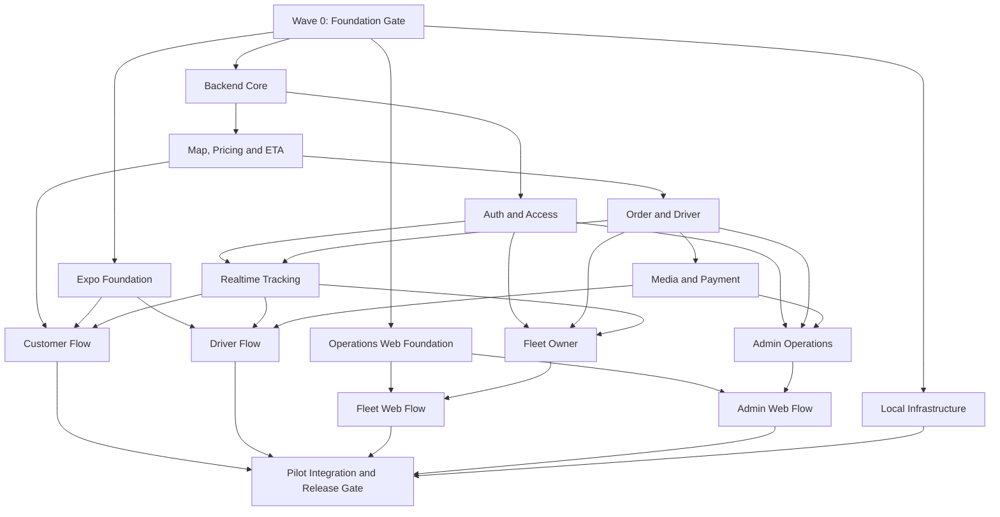

# Thiết kế triển khai multi-agent cho LEOPARD

## 1. Mục tiêu

Thiết kế này chuyển bộ đặc tả SDLC hiện tại thành một hệ thống implementation plan có thể giao cho nhiều Codex session chạy đồng thời mà vẫn giữ đúng contract, giới hạn file ownership và quy trình tích hợp. Kết quả cuối cùng phải đưa LEOPARD từ repository chỉ có tài liệu thành mini-production pilot có Expo mobile app cho Customer/Driver, operations web cho Fleet Owner/Admin, NestJS API, PostgreSQL/PostGIS và các provider demo có tính xác định.

Thiết kế không thay đổi product scope. Mọi phase phải truy vết về feature, requirement, acceptance criteria và test scenario đã có trong `docs/`.

## 2. Quyết định đã khóa

- Mobile runtime là Expo/React Native với TypeScript cho Customer và Driver.
- Operations web là Next.js, React, TypeScript và Tailwind CSS cho Fleet Owner và Admin.
- Backend là NestJS modular monolith, Prisma và PostgreSQL/PostGIS.
- Package manager là pnpm workspace; repository dùng monorepo theo runtime.
- REST contract dùng prefix `/api/v1`; realtime dùng Socket.IO.
- API sở hữu authorization, pricing, ETA, lifecycle và provider orchestration.
- Shared contract và Prisma schema là controlled surfaces, không để nhiều agent sửa đồng thời.
- Mỗi implementation phase chạy trên branch/worktree riêng tách từ integration baseline của wave gần nhất.
- Testing nằm trong từng phase theo TDD; quality phase chỉ bổ sung cross-system validation, không thay thế test của feature.
- Local và CI dùng deterministic demo providers; provider thật chỉ được smoke test khi có credential hợp lệ.

## 3. Phương án tổ chức

### 3.1 Phương án được chọn: Foundation Gate và Parallel Lanes

Một foundation phase tuần tự tạo monorepo, version pinning, scripts, shared contracts, Prisma baseline và CI tối thiểu. Sau gate này, các lane Backend, Mobile, Operations Web và Infrastructure có thể phát triển đồng thời. Các feature phase tiếp theo chỉ được chạy song song khi file ownership không giao nhau và contract cần dùng đã được merge vào integration baseline.

Ưu điểm:

- Giảm conflict ở root config, Prisma schema, shared enums và API contracts.
- Cho phép nhận feedback sớm ở cả API, Expo và operations web.
- Mỗi session có đầu vào, đầu ra và pass criteria độc lập.
- Có checkpoint sau từng wave để phát hiện contract drift trước khi lan sang phase khác.

Chi phí:

- Foundation owner và Integration owner là điểm tuần tự bắt buộc.
- Feature cần đổi contract phải dừng và gửi contract change request thay vì tự sửa.

### 3.2 Phương án không chọn

Tổ chức hoàn toàn theo technical layer sẽ giảm conflict nhưng khiến mobile/web chờ backend quá lâu và integration feedback đến muộn. Tổ chức hoàn toàn theo vertical feature tăng tốc ban đầu nhưng nhiều agent sẽ cùng sửa Prisma, `packages/shared`, navigation và root scripts. Hai phương án này không phù hợp mục tiêu chạy nhiều session với conflict thấp.

## 4. Cấu trúc implementation mục tiêu

```text
apps/
  api/                    # NestJS REST API, Socket.IO, Prisma access
  mobile/                 # Expo app cho Customer và Driver
  admin/                  # Next.js operations web cho Fleet Owner và Admin
packages/
  shared/                 # enum, DTO type, error code, pure utility
  validators/             # schema validation dùng chung khi contract cho phép
  ui/                     # web UI primitives không chứa business rule
  config/                 # TypeScript, ESLint, Prettier, Tailwind presets
infra/
  docker/                 # local containers và image definitions
  scripts/                # migration, seed, smoke và operational scripts
  seed/                   # deterministic demo assets
docs/
  superpowers/
    specs/                # thiết kế đã duyệt
    plans/                # master plan và plan theo subsystem
    prompts/              # prompt khởi chạy session và integration gate
```

## 5. Controlled surfaces và ownership

| Surface | Owner | Quy tắc thay đổi |
| --- | --- | --- |
| Root workspace, lockfile, root scripts | Foundation Owner | Agent khác chỉ gửi blocker/change request |
| `packages/shared` và `packages/validators` public contracts | Contract Owner | Thay đổi phải merge trước feature consumer |
| `apps/api/prisma/schema.prisma` và migrations | Data Contract Owner | Một migration owner tại một thời điểm |
| OpenAPI document và stable error codes | API Contract Owner | Không thêm endpoint ngoài contract đã duyệt |
| Expo navigation root và auth boundary | Mobile Foundation Owner | Feature chỉ đăng ký screen qua extension point đã định nghĩa |
| Admin navigation root và design tokens | Web Foundation Owner | Feature dùng token/component có sẵn |
| CI workflow và deployment manifest | Platform Owner | Feature chỉ bổ sung script cục bộ theo interface đã khóa |
| Product/SRS/API/Data/UI source documents | Documentation Owner | Behavior change phải có traceability và review riêng |

Không phase nào được sở hữu cùng một controlled surface trong cùng execution wave.

## 6. Execution waves



### Wave 0: Foundation Gate

Chạy tuần tự. Tạo workspace có thể install, lint, typecheck, test và build; khóa shared contract nền và CI tối thiểu. Database migration baseline thuộc Backend Core ở Wave 1. Không khởi chạy runtime session trước khi gate pass.

### Wave 1: Runtime Foundations

Backend Core, Expo Foundation, Operations Web Foundation, Local Infrastructure và CI Matrix có thể chạy song song. Mobile/Web design-system tasks nằm trong chính foundation phase tương ứng. Seed/migration task chờ Backend Core được tích hợp.

### Wave 2: Core Domain

Wave 2A chạy Auth and Access, Map/Pricing/ETA và deterministic seed song song sau Backend Core. Wave 2B chạy Order and Driver sau khi Map phát hành `EstimateTokenService`; Order phase sở hữu integration wiring và `DeliveryProofReader` interface.

### Wave 3: Supporting Features

Wave 3A chạy Realtime Tracking và Media/Payment song song. Wave 3B chỉ bắt đầu sau integration gate: Fleet Owner tiêu thụ Tracking service, còn Admin tiêu thụ Payment service; hai consumer phase có thể chạy song song.

### Wave 4: Client Vertical Flows

Wave 4A chạy Customer base, Driver base, Fleet Web và Admin Web trên bốn worktree riêng. Wave 4B tiếp tục Customer tracking/payment sau Customer base và Driver delivery sau Driver base. Các task tích hợp API contract đã phát hành, không thay đổi backend business rule.

### Wave 5: Pilot Integration and Release Gate

Chạy tuần tự trên integration branch. Merge theo thứ tự dependency, chạy migration trên database sạch và database có baseline, full test/build/E2E, authorization matrix, responsive viewport, security review, provider failure test, backup/restore drill và deployment smoke test.

## 7. Loại agent và trách nhiệm

| Agent | Trách nhiệm | Không được làm |
| --- | --- | --- |
| Orchestrator | Cấp phase, theo dõi dependency, khóa controlled surface, điều phối integration | Không tự sửa feature trong lúc agent đang sở hữu |
| Foundation Agent | Workspace, versions, scripts, contracts baseline | Không xây business feature |
| Backend Domain Agent | Một NestJS module hoặc bounded domain | Không sửa UI/root config ngoài scope |
| Expo Agent | Customer/Driver screen và mobile state | Không quyết định business rule phía client |
| Web Agent | Fleet Owner/Admin screen và web state | Không mở rộng quyền API |
| Platform Agent | Docker, CI, runtime config, deployment | Không đưa secret hoặc provider credential vào repo |
| Test/Review Agent | Fresh-context spec review, security review, integration evidence | Không sửa implementation khi chưa được giao remediation phase |
| Integration Agent | Merge phase theo dependency, resolve integration-only conflict, chạy gate | Không thay đổi feature behavior để làm test pass |

Mỗi implementation phase cần một implementer và hai review gates: spec compliance trước, code quality sau. Reviewer không dùng lại context của implementer.

## 8. Branch, worktree và integration model

Mỗi task dùng branch `codex/ph-XX-tYY-<short-name>` tách từ commit baseline được ghi trong progress tracker. Worktree đặt tại `.worktrees/ph-XX-tYY-<short-name>` sau khi xác nhận `.worktrees/` được ignore. Các task branch được merge theo thứ tự vào `codex/phase-ph-XX`; phase branch đã qua gate mới được merge vào `codex/integration-wave-N`. Không branch nào merge trực tiếp vào `develop`.

Luồng tích hợp:

1. Orchestrator ghi baseline commit cho wave.
2. Agent tạo task worktree/branch từ đúng phase baseline.
3. Agent chạy test theo TDD, commit atomic và ghi verification evidence.
4. Spec reviewer kiểm tra scope, contract và pass criteria.
5. Quality reviewer kiểm tra correctness, security, maintainability và test quality.
6. Phase owner merge task đã duyệt vào `codex/phase-ph-XX`; Integration owner merge phase đã duyệt vào `codex/integration-wave-N` theo dependency.
7. Integration gate chạy toàn bộ script của wave.
8. Baseline mới chỉ được công bố khi gate pass.

Nếu hai phase cần cùng controlled surface, chúng không chạy song song. Orchestrator tạo một contract phase đi trước, sau đó rebase consumer phases lên baseline mới.

## 9. Contract change protocol

Agent phải dừng khi phát hiện cần thay đổi shared enum, public DTO, OpenAPI schema, Prisma model, migration đã phát hành, stable error code hoặc root tooling. Blocker report bắt buộc có:

- Phase ID và baseline commit.
- Contract hiện tại không đáp ứng điểm nào trong SRS/acceptance criteria.
- Thay đổi tối thiểu được đề xuất với consumer bị ảnh hưởng.
- Migration/backward compatibility impact.
- Test cần cập nhật.

Orchestrator giao thay đổi cho Contract Owner thành phase riêng. Consumer chỉ tiếp tục sau khi contract phase merge và baseline mới được công bố.

## 10. Cấu trúc bộ plan

```text
docs/superpowers/plans/
  00-master-orchestration.md
  01-foundation.md
  02-backend-core.md
  03-expo-mobile-foundation.md
  04-operations-web-foundation.md
  05-auth-and-access.md
  06-order-and-driver.md
  07-map-pricing-eta.md
  08-realtime-tracking.md
  09-media-and-payment.md
  10-fleet-owner.md
  11-admin-operations.md
  12-cross-client-integration.md
  13-quality-security-pilot-release.md
docs/superpowers/prompts/
  session-prompt-template.md
  wave-integration-prompt.md
```

`00-master-orchestration.md` là nguồn điều phối: phase registry, dependency graph, baseline commit, controlled surface lock, session assignment và progress. Các file còn lại là implementation plan theo subsystem; mỗi task có exact files, interfaces, TDD steps, expected command output, commit message, boundary rules và integration notes.

## 11. Session contract

Mỗi session prompt phải chứa đủ:

- Phase ID, task ID, agent type và objective.
- Baseline branch/commit và dependency đã merge.
- Source-of-truth documents cần đọc.
- File scope và controlled surfaces bị cấm.
- Interfaces consumes/produces với signature chính xác.
- Acceptance criteria và test scenario liên quan.
- TDD sequence, verification commands và expected results.
- Commit format và completion report format.
- Quy tắc dừng khi contract mismatch hoặc phát hiện thay đổi ngoài scope.

Agent không được dựa vào hội thoại trước đó. Prompt phải đủ để một session mới thực hiện mà không có tribal knowledge.

## 12. Quality gates

### Task gate

- Test mới phải được quan sát fail đúng lý do trước implementation và pass sau implementation.
- Scoped lint, typecheck và test pass.
- Diff chỉ chứa file được cấp quyền.
- Không có secret, dữ liệu cá nhân, placeholder hoặc generated output ngoài quy ước.

### Phase gate

- Toàn bộ acceptance criteria của phase có evidence.
- Module/app build pass.
- Authorization và ownership test pass khi có dữ liệu riêng tư.
- API/data/UI documentation được cập nhật nếu behavior thay đổi.
- Spec compliance và code quality review đều approved.

### Wave gate

- Full workspace install dùng frozen lockfile.
- Lint, typecheck, unit và integration test của workspace pass.
- Migration chạy được trên database sạch và upgrade path của wave.
- Contract consumer test pass giữa API, Expo và operations web khi liên quan.
- Không có conflict hoặc commit chưa được truy vết trong integration branch.

### Pilot release gate

- E2E P0 cho Customer, Driver, Fleet Owner và Admin pass.
- Authorization matrix và fleet membership isolation pass.
- Tracking event đến subscriber trong giới hạn NFR ở môi trường staging-like.
- P95 API nội bộ, responsive viewport, accessibility và provider failure scenarios đạt yêu cầu tài liệu.
- Health, structured log, audit trail, backup/restore và rollback được kiểm chứng.

## 13. Progress và điều phối session

Master plan dùng một hàng cho mỗi task, không chỉ mỗi subsystem. Trạng thái hợp lệ là `NOT_STARTED`, `READY`, `IN_PROGRESS`, `IN_REVIEW`, `BLOCKED`, `INTEGRATED`, `VERIFIED`. Chỉ Orchestrator cập nhật baseline, controlled surface lock và trạng thái `INTEGRATED`/`VERIFIED`.

Số session song song tối đa được quyết định theo file ownership, không theo số agent sẵn có. Mặc định tối đa bốn implementation session và hai reviewer session trong một wave. Integration owner không chạy đồng thời hai merge có chung consumer test.

## 14. Failure và recovery

- Test nền fail trước khi agent sửa code: dừng và báo Orchestrator; không gộp remediation vào feature phase.
- Dependency thiếu: chuyển `BLOCKED`, ghi exact contract/file/commit cần thiết.
- Agent sửa ngoài scope: reviewer từ chối phase; tách thay đổi hợp lệ sang phase khác.
- Merge conflict: Integration owner xác định ownership; không chọn cả hai phía theo cảm tính.
- Provider ngoài lỗi: dùng demo provider chỉ khi config cho phép và UI/API phải giữ source label.
- Migration lỗi: không sửa migration đã tích hợp; tạo corrective migration và test cả clean/upgrade path.
- Integration gate fail: không công bố baseline mới; mở remediation task nhỏ theo root cause.

## 15. Tiêu chí hoàn thành bộ kế hoạch

Bộ kế hoạch chỉ sẵn sàng để thực thi khi:

- Mọi feature `F-01` đến `F-12` ánh xạ tới ít nhất một task và acceptance criterion.
- Không task song song nào sở hữu cùng file hoặc controlled surface.
- Mọi dependency và interface giữa task được ghi bằng tên/type cụ thể.
- Mọi bước implementation có test-first action, command và expected result.
- Không có `TODO`, `TBD`, placeholder hoặc quyết định stack chưa khóa.
- Master dependency graph, plan files và session prompts dùng cùng phase/task ID.
- Lệnh verification phản ánh scripts thực tế do Foundation plan tạo ra.
- Có hướng dẫn tạo worktree, review hai tầng, tích hợp wave và recovery khi blocker.
