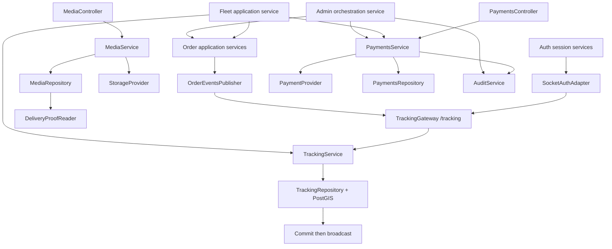

# LEOPARD Wave 3 Delivery Design

**Status:** Proposed for execution  
**Updated:** 2026-08-15  
**Planning baseline:** `origin/develop` at `ae8e5a5` at the time of writing  
**Scope:** Wave 3A (`PH-08`, `PH-09`) and Wave 3B (`PH-10`, `PH-11`)

> ## ⚠️ Ownership boundary — Wave 3 is backend-only (2026-08-15)
>
> Thành viên Wave 3 chỉ sở hữu **backend**. Frontend và web E2E thuộc **Wave 4**:
>
> - PH-10-T03 (Fleet Operations Pages) và PH-11-T03 (Admin Dashboard Pages) → **Wave 4**.
> - Web E2E, Playwright viewport (768/1024/1440), component/a11y web tests → **Wave 4**.
> - Wave 3 chỉ giao backend: PH-08, PH-09, PH-10-T01/T02 + REST/socket isolation (T04), PH-11-T01/T02 + audit backend gate (T04).

## 1. Goal

Thiết kế execution baseline cho tracking realtime, media/payment, Fleet Owner Lite và Admin Operations theo đúng SRS, acceptance criteria, permission matrix và module boundary của LEOPARD.

Wave 3 phải tạo ra bốn vertical capability:

1. Tracking point được xác thực, persist bằng PostGIS rồi mới broadcast.
2. Media riêng tư và payment QR/manual confirmation chạy sau provider interfaces.
3. Fleet Owner chỉ đọc dữ liệu thuộc active fleet scope.
4. Admin vận hành qua application services và mọi privileged command đều có audit atomically.

## 2. Execution Override

Theo quyết định ngày 2026-08-09, các remediation còn lại của Wave 2 được **defer** và không chặn việc lập kế hoạch hoặc triển khai Wave 3.

Quy tắc của override:

- Không đánh dấu các remediation Wave 2 là đã hoàn tất.
- Wave 3 branch từ baseline `develop` đã chọn, không branch từ working tree đang dirty.
- Lỗi Wave 2 gây trực tiếp compile/runtime/test failure cho task Wave 3 phải được sửa hẹp trong integration task và ghi rõ traceability.
- Wave 3 có thể đạt phase gate riêng nhưng không được dùng để tuyên bố pilot release-ready khi release gate tổng chưa pass.
- Không mở rộng scope sang dispatch, auto payment reconciliation, Redis adapter, commission hoặc generic superuser.

## 3. Source of Truth

Thứ tự ưu tiên:

1. `docs/requirements/01-srs.md`
2. `docs/requirements/03-acceptance-criteria.md`
3. `docs/architecture/01-system-architecture.md`
4. `docs/architecture/03-integration-provider-design.md`
5. `docs/data/01-database-design.md`
6. `docs/api/01-rest-api-spec.md`
7. `docs/api/02-socket-events.md`
8. `docs/api/04-auth-and-permissions.md`
9. Phase plans `08` đến `11`
10. Existing code behavior

Khi Wave 3 cố ý thay đổi contract/data behavior, implementation task phải cập nhật tài liệu liên quan trong cùng commit hoặc controlled-surface commit đi trước.

## 4. Scope

### Wave 3A

- PH-08 authenticated realtime tracking.
- PH-09 secure media upload and signed access.
- PH-09 QR payment provider boundary and payment lifecycle.
- Delivery proof integration với Order lifecycle.
- Append-only `AuditService` tối thiểu cho manual payment confirmation.

### Wave 3B

- PH-10 Fleet Owner membership policy, read APIs và operations pages.
- PH-11 Admin query APIs, audited commands và operations pages.
- Cross-fleet, privileged-action và audit gates.

### Out of scope

- Dispatch hoặc Fleet Owner nhận/gán order.
- Automated payment callback/reconciliation.
- Public media URLs.
- Redis Socket.IO adapter hoặc multi-region realtime.
- Fleet revenue, commission, branches hoặc configurable roles.
- Hard delete operational data.

## 5. Architecture



### Module boundaries

- Controller chỉ parse transport input và gọi application service.
- Policy/service quyết định role, ownership, assignment và membership.
- Repository sở hữu persistence/query details.
- Provider adapter sở hữu SDK/HTTP/filesystem integration.
- Không truyền raw provider payload ra controller; chỉ lưu sanitized provider snapshot.
- Fleet/Admin reuse public application services hoặc query ports, không mutate repository của module khác trực tiếp.

## 6. Controlled-Surface Preflight

Trước khi mở PH-08/PH-09 implementation, Integration Owner phát hành một controlled-surface commit gồm:

- Shared tracking/socket/media/payment DTO cần thiết.
- OpenAPI delta cho tracking/media/payment.
- Stable Wave 3 error codes.
- Một forward Prisma migration Wave 3.
- Dependency versions và lockfile.
- App-level provider configuration schema.

Không để feature agents tự sửa đồng thời:

- `packages/shared/**`
- `apps/api/prisma/schema.prisma`
- `apps/api/prisma/migrations/**`
- `apps/api/openapi/openapi.yaml`
- `apps/api/src/app.module.ts`
- Root/package lock configuration

## 7. Tracking Contract

### REST

`GET /api/v1/orders/:id/tracking?from&to&page&pageSize`

Response dùng page envelope chuẩn:

```ts
interface TrackingPointDto {
  id: string;
  orderId: string;
  driverId: string;
  clientPointId: string;
  latitude: number;
  longitude: number;
  accuracyM?: number;
  capturedAt: string;
  createdAt: string;
}
```

`from` và `to` là ISO UTC timestamp. Query sắp xếp deterministic theo `capturedAt DESC, id DESC`; `pageSize` tối đa 100.

### Socket

Namespace `/tracking`, handshake `auth: {token}`.

Client events:

- `tracking:join-order`
- `tracking:leave-order`
- `tracking:send-point`

Server events:

- `tracking:point-updated`
- `order:status-updated`
- `session:error`

Mọi server event có `eventId` và `occurredAt`. Persisted point ID hoặc status-history ID được dùng làm deterministic event ID.

### Tracking policy

- Chỉ assigned Driver gửi point cho order ở `ACCEPTED`, `PICKING_UP` hoặc `IN_TRANSIT`.
- Customer chỉ xem order của mình.
- Driver chỉ xem order được assigned.
- Fleet Owner chỉ xem khi bản thân có active OWNER membership và assigned Driver có active DRIVER membership trong cùng fleet.
- Admin được xem nhưng không được gửi point.
- Invalid/rate-limited event trả ack error mà không disconnect socket.

### Stable tracking errors

- `TRACKING_FORBIDDEN`
- `TRACKING_INVALID_POINT`
- `TRACKING_RATE_LIMITED`
- `TRACKING_ORDER_INACTIVE`
- `TRACKING_POINT_CONFLICT`

## 8. Tracking Persistence and Delivery Semantics

- Add optional `TrackingPoint.accuracyM` through the Wave 3 migration.
- Unique `(orderId, clientPointId)` là idempotency boundary.
- Record point và update `DriverProfile.lastKnownLocation/lastKnownAt` trong cùng transaction.
- Broadcast chỉ xảy ra sau khi transaction commit.
- Duplicate `clientPointId` trả persisted point nếu payload tương đương; payload khác trả conflict.
- Captured time không được quá xa tương lai và không được cũ hơn giới hạn cấu hình.
- Rate limiter in-memory được chấp nhận cho single-instance pilot; multi-instance/Redis chỉ được document như scale path.
- Broadcast failure không rollback persisted point; client có thể recover qua history REST.

## 9. Socket Authentication

HTTP `AccessTokenGuard` không được reuse trực tiếp vì phụ thuộc HTTP execution context.

Tách reusable `SessionAuthenticator`:

```ts
authenticateAccessToken(token: string): Promise<AuthenticatedActor>
```

Service này thực hiện:

- Verify signature và expiry.
- Verify refresh session tồn tại, chưa revoked và chưa expired.
- Load current user status và role phía server.
- Không tin role từ token nếu database role đã thay đổi.

`AccessTokenGuard` và `SocketAuthAdapter` cùng gọi service này. Socket expired phát `session:error`; client refresh bằng REST và reconnect.

## 10. Order Event Integration

PH-08 phát hành `OrderEventsPublisher` port. Order status service gọi publisher **sau** transaction thành công.

Event:

```ts
interface OrderStatusUpdatedEvent {
  eventId: string;
  occurredAt: string;
  orderId: string;
  previousStatus: OrderStatus;
  currentStatus: OrderStatus;
}
```

Publisher failure được log có request/event correlation nhưng không đảo ngược order commit.

## 11. Media Contract and Storage

### Endpoints

- `POST /orders/:id/media/cargo`
- `POST /orders/:id/media/delivery-proof`
- `GET /media/:id/url`

Multipart request gồm `file` và `clientRequestId` UUID. Chỉ JPEG, PNG, WebP; tối đa 10 MB.

### Storage flow

1. Authenticate actor.
2. Authorize order/type trước khi nhận toàn bộ stream.
3. Enforce byte limit trong lúc stream.
4. Validate extension, declared MIME và magic bytes.
5. Compute SHA-256 trong lúc stream.
6. `StorageProvider.put`.
7. Persist metadata transactionally.
8. Nếu DB fail, gọi compensating `delete`.

Local provider ghi file tạm rồi atomic rename. S3 provider dùng private object, không public ACL. Signed read URL chỉ được tạo sau authorization và có expiry cấu hình.

### Media data delta

- Add `checksumSha256`.
- Add optional `clientRequestId`.
- Add unique idempotency boundary trên `(orderId, uploaderId, type, clientRequestId)`.
- Không lưu signed URL vào database.

## 12. Delivery Proof Integration

`DeliveryProofReader` vẫn là port thuộc Order domain. Chỉ có một provider binding tại runtime.

Media repository cung cấp implementation/query port kiểm tra ít nhất một persisted `DELIVERY_PROOF`. Integration Owner chịu trách nhiệm wiring để tránh circular dependency hoặc duplicate provider.

Chỉ assigned Driver được upload proof. Order chỉ chuyển `DELIVERED` sau khi proof metadata đã commit thành công.

## 13. Payment Aggregate

### Initial state

Order có thể có payment record `UNPAID` chưa gắn provider. Không dùng Map provider source làm Payment provider.

Wave 3 migration cho phép `PaymentIntent.provider` nullable khi `UNPAID`; provider trở thành bắt buộc khi `QR_CREATED`, `PAID_MANUAL` hoặc provider attempt đã diễn ra.

### Data delta

- `clientRequestId String?`
- `providerReference String?`
- `confirmedById String?`
- `confirmedAt DateTime?`
- `confirmationNote String?`
- `confirmationRequestId String?`
- Unique `(orderId, clientRequestId)` khi key tồn tại.
- Unique provider reference trong provider scope.
- Unique confirmation request ID khi tồn tại.
- Giữ partial unique active intent cho `UNPAID`/`QR_CREATED`.

### QR creation

`POST /orders/:id/payments {clientRequestId}`.

- Customer owner hoặc Admin.
- Amount luôn lấy từ persisted order price.
- Reserve/reuse active `UNPAID` intent transactionally.
- Provider call dùng deterministic idempotency key và chạy ngoài DB transaction.
- Finalize `QR_CREATED` trong transaction.
- Provider failure chuyển reserved intent sang `FAILED` và không tạo paid state.
- Same request key trả cùng record.
- Different request key khi còn active intent trả stable conflict.

Response QR gồm amount, reference, expiry, provider source và QR payload/representation đã khóa trong OpenAPI.

### Manual confirmation

`POST /admin/payments/:id/confirm {note,clientRequestId}`.

- Chỉ Admin.
- Note trim, 5-500 ký tự.
- Conditional transition sang `PAID_MANUAL` và append AuditLog trong cùng transaction.
- Same `clientRequestId` trả kết quả cũ.
- Failed transaction không tạo payment mutation hoặc audit record.
- Không infer paid state từ QR generation hoặc provider callback.

## 14. Audit Boundary

`AuditModule` và `AuditService.append(input, tx)` phải có từ Wave 3A vì PH-09 dùng cho manual confirmation.

Audit record gồm:

- actor ID
- action
- resource type/ID
- request ID
- idempotency request ID nếu có
- sanitized metadata
- created timestamp

Audit append-only; không có update/delete API. PH-11 reuse cùng service, không tạo audit implementation thứ hai.

## 15. Fleet Owner Boundary

- Fleet scope resolve hoàn toàn từ authenticated actor và active `FleetMember`.
- Client không được chọn `fleetId` làm authority.
- Fleet Owner chỉ thấy order đã assigned cho active Driver membership trong fleet.
- Fleet APIs trả bounded projections; không trả phone/address/private provider payload nếu UI không cần.
- Tracking/payment summary reuse authorized query ports từ PH-08/PH-09.
- Không có mutation endpoint cho lifecycle, tracking, payment confirmation hoặc user status.

Temporal policy cho pilot: quyền xem yêu cầu membership của Owner và Driver đều `ACTIVE` tại thời điểm request. Historical membership không tiếp tục cấp quyền sau khi `REMOVED`.

## 16. Admin Boundary

- Mọi Admin endpoint khai báo explicit `ADMIN`.
- Query filter/sort/pagination chạy server-side và dùng allow-list.
- Admin module orchestrates Order/Payment/Fleet/User services; không direct cross-module mutation.
- Self-disable bị cấm.
- Account status change, Admin cancel và payment confirmation bắt buộc reason/note, idempotency và audit transaction.
- Không hard delete order, media, payment, audit hoặc user operational record.

## 17. Frontend Operations Rules

> ⚠️ Phần này thuộc **Wave 4** (Wave 3 = backend-only). Giữ nguyên như reference cho Wave 4; Wave 3 không implement web UI hay web E2E.

- Fleet/Admin UI dùng `apps/admin` Next.js shell hiện có.
- Filter/page/sort nằm trong URL.
- Mỗi page có loading, empty, error, success và permission-denied state.
- Fleet Owner UI không render mutation actions.
- Admin destructive/sensitive action dùng confirmation dialog và bắt buộc reason/note.
- ETA hiển thị “ETA dự kiến”; demo source hiển thị “Dữ liệu mô phỏng”.
- Verify 768, 1024 và 1440 px; không overflow, overlap hoặc mất keyboard focus.

## 18. Ownership

| Surface                                        | Owner                                              |
| ---------------------------------------------- | -------------------------------------------------- |
| Shared DTO, OpenAPI, error codes               | Wave 3 Contract Owner                              |
| Prisma schema/migration, seed manifest         | Wave 3 Data Owner                                  |
| `apps/api/src/tracking/**`                     | PH-08 Owner                                        |
| `apps/api/src/media/**`                        | PH-09 Media Owner                                  |
| `apps/api/src/payments/**`                     | PH-09 Payment Owner                                |
| Audit module/service                           | Wave 3 Integration Owner, first published in PH-09 |
| Fleet **API** (`apps/api/src/fleets/**`)       | PH-10 Backend Owner (Wave 3)                       |
| Fleet **web** (`apps/admin/src/app/(fleet)/**`) | PH-10 Web Owner (**Wave 4**)                       |
| Admin **API** (`apps/api/src/admin/**`)        | PH-11 Backend Owner (Wave 3)                       |
| Admin **web** (`apps/admin/src/app/(admin)/**`) | PH-11 Web Owner (**Wave 4**)                       |
| `app.module.ts`, lockfile, cross-module wiring | Wave 3 Integration Owner                           |

## 19. Branch and Merge Strategy

- Integration branch: `codex/integration-wave-3`.
- Task branches: `codex/ph-08-tXX-*`, `codex/ph-09-tXX-*`, `codex/ph-10-tXX-*`, `codex/ph-11-tXX-*`.
- Tất cả task branch tách từ SHA do Integration Owner công bố.
- Feature agents không mutate integration branch trực tiếp.
- Merge theo dependency và chạy scoped gate sau mỗi merge.
- Wave 3B branch chỉ tách sau Wave 3A integration gate.

## 20. Quality and Security Gates

- TDD: test RED trước implementation, GREEN tối thiểu, refactor rồi rerun.
- Coverage module mới tối thiểu 80%; policy/state-machine critical branches hướng tới 100%.
- Real PostgreSQL/PostGIS tests cho tracking/idempotency/payment transaction.
- Real in-process Socket.IO integration tests.
- Upload malicious input suite và orphan cleanup assertions.
- Provider tests dùng mock; không gọi Firebase, S3, payOS, VietQR hoặc Vietmap thật.
- Authorization matrices kiểm tra role + ownership/assignment/membership.
- No secret/PII trong code, fixture, provider snapshot hoặc log.
- Không còn P0/P1 trong phase scope trước gate.

## 21. Wave Gates

### Wave 3A complete

- PH-08-T01..T04 verified.
- PH-09-T01..T05 verified.
- Tracking latency p95 dưới 3 giây cho 100 local events.
- Không leaked socket events hoặc cross-order tracking history.
- Upload security, private URLs và compensating cleanup pass.
- Payment idempotency, active-intent constraint và audited confirmation pass.
- API test/E2E/contract/typecheck/lint/build pass.

### Wave 3B complete

- PH-10-T01..T04 verified.
- PH-11-T01..T04 verified.
- Cross-fleet isolation và forbidden-command tests pass.
- Privileged command audit is exactly-once và rollback-safe.
- Fleet/Admin component, a11y và Playwright viewport gates pass.
- API/Admin full gates pass.
