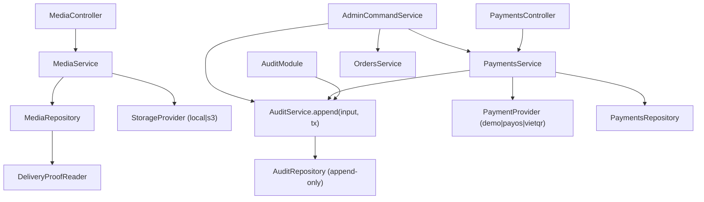

# LEOPARD Wave 3 Completion Design

**Status:** Approved for planning
**Updated:** 2026-08-15
**Supersedes (fills gaps in):** `2026-08-09-wave-3-delivery-design.md` (delivery design), `2026-08-09-wave-3a-execution-plan.md`, `2026-08-09-wave-3b-execution-plan.md`
**Baseline:** `codex/integration-wave-3` at `8749d11` (working tree holds the half-applied Wave 3 code)
**Scope:** Complete Wave 3 backend to a passing gate (PH-08, PH-09, AuditService, PH-10 backend, PH-11 backend)

> ## ⚠️ Ownership boundary — Wave 3 is backend-only
>
> Thành viên Wave 3 chỉ sở hữu **backend**. Các surface sau thuộc **Wave 4** và nằm ngoài scope của tài liệu này:
>
> - PH-10-T03 Fleet Operations Pages (`apps/admin/src/app/(fleet)/**`)
> - PH-11-T03 Admin Dashboard Pages (`apps/admin/src/app/(admin)/**`)
> - Web E2E / Playwright viewport (768/1024/1440) / component + a11y web tests
>
> Bất kỳ file `apps/admin/**` hoặc `apps/mobile/**` nào cũng không được sửa trong Wave 3.

---

## 1. Purpose

Wave 3 delivery design và các execution plan 3A/3B đã tồn tại, nhưng code hiện tại chưa theo kịp. Báo cáo audit `2026-08-15-wave-3-delivery-summary.md` xác định các gap sau:

1. **PH-09 (Media + Payment) hoàn toàn chưa được viết** — không có `apps/api/src/media/` hay `apps/api/src/payments/`.
2. **AuditModule/AuditService không tồn tại** — vi phạm design §14 (bắt buộc từ Wave 3A).
3. **Wave 3 data migration trống rỗng** — thư mục `20260809000000_wave3_contract_data_preflight/` không có `migration.sql`; toàn bộ delta schema (accuracyM, checksum, payment reference/confirmation, audit request IDs) chưa migrate vào DB.
4. **PH-10/PH-11 backend ở mức bản nháp** — không test, dùng `any`, thiếu self-disable prevention / idempotency / note validation.
5. **PH-08 chưa được verify lại** sau khi khôi phục source.
6. **Blocker môi trường** — dependency chưa cài đầy đủ, Prisma client chưa generate.

Tài liệu này là bản thiết kế "completion" để đóng các gap trên, không viết lại thiết kế gốc. Nơi nào tài liệu này im lặng, `2026-08-09-wave-3-delivery-design.md` vẫn là source of truth.

## 2. Success criteria (Wave 3 complete)

Tất cả các điều kiện sau đồng thời đúng:

1. PH-08-T01..T04 verified (real PostGIS + real in-process Socket.IO re-run xanh).
2. PH-09-T01..T05 verified (media upload, private signed URL, payment idempotency, audited confirmation).
3. `AuditModule` + `AuditService.append(input, tx)` tồn tại, append-only, được PH-09 và PH-11 dùng chung (không có implementation thứ hai).
4. PH-10-T01/T02 verified (fleet policy + read APIs, 2-fleet isolation REST/socket).
5. PH-11-T01/T02 verified (admin query + audited commands, self-disable prevention, exactly-once audit, rollback-safe).
6. Wave 3 migration có `migration.sql` thật: clean install + upgrade từ Wave 2 + normalize legacy UNPAID map placeholders + fail-fast invalid provider rows.
7. Gate commands pass: `test`, `test:e2e`, `test:contract`, `typecheck`, `lint`, `build`, `git diff --check`, seed determinism, 100-event tracking p95 < 3s, secret scan.
8. Có ít nhất một commit; ghi nhận baseline SHA sau khi gate xanh.
9. Không đụng `apps/admin/**`, `apps/mobile/**`, web E2E (Wave 4).

## 3. Scope

### In scope (Wave 3 backend)

- `apps/api/src/audit/**` — AuditModule/AuditService/AuditRepository (mới).
- `apps/api/src/media/**` — StorageProvider + local/S3 adapters, upload policy, media module/controller/service/repository, DeliveryProofReader binding (mới).
- `apps/api/src/payments/**` — PaymentProvider + demo/payOS/VietQR adapters, payments module/controller/service/repository (mới).
- `apps/api/src/tracking/**` — verify + fix DI cho `OrderEventsPublisher`.
- `apps/api/src/fleets/**` — bổ spec, xóa `any`, hoàn thiện `assertOrderInFleet`.
- `apps/api/src/admin/**` — đi qua AuditService, self-disable prevention, note/idempotency.
- `apps/api/prisma/**` — migration SQL thật + schema finalize.
- `apps/api/src/app.module.ts` + `orders.module.ts` + `update-order-status.service.ts` — wiring integration.
- `packages/shared/src/**` — finalize media/payment contract (thay stub), fleet/admin DTO hoàn thiện.

### Out of scope

- Dispatch / Fleet Owner nhận-gán order.
- Automated payment callback / reconciliation.
- Public media URLs; Redis Socket.IO adapter / multi-region.
- Fleet revenue/commission/branches/configurable roles.
- Hard delete operational data.
- Mọi frontend + web E2E (Wave 4).

## 4. Architecture

Giữ nguyên kiến trúc delivery design §5. Bổ sung các quyết định cho phần còn thiếu:



### Module boundaries (kế thừa design §5, bổ sung)

- **AuditModule** là append-only; không có update/delete API. `AuditService.append(input, tx)` nhận Prisma transaction client do caller cung cấp (không tự mở transaction) để PH-09 và PH-11 có thể gộp audit vào cùng transaction với mutation.
- **Media/Payments** tuân theo controller → service → repository → provider; controller không biết provider payload thô.
- **Fleet/Admin** reuse public application services / query ports; không mutate repository của module khác trực tiếp.

## 5. Audit boundary (mới — lấp gap #2)

Tạo `apps/api/src/audit/`:

- `audit.module.ts` — `@Global()` module, exports `AuditService`.
- `audit.service.ts` — `append(input: AuditInput, tx: Prisma.TransactionClient): Promise<AuditLog>`.
- `audit.repository.ts` — chỉ `create` (append), không `update`/`delete`.

```ts
interface AuditInput {
  actorId: string;
  action: string;
  resourceType: string;
  resourceId?: string;
  requestId?: string;
  idempotencyRequestId?: string;
  metadata?: Record<string, unknown>; // sanitized — no phone/token/credential/provider snapshot
}
```

**Bắt buộc:**
- Append-only: không expose endpoint hay method để sửa/xóa audit record.
- PH-11 và PH-09 gọi `AuditService.append` — không gọi `tx.auditLog.create` trực tiếp.
- Failed transaction tạo zero audit (append nằm trong cùng `$transaction` với mutation).
- Metadata phải được sanitize trước khi append; không chứa secret, token, phone, hoặc raw provider snapshot.

## 6. Data migration (mới — lấp gap #3)

Migration hiện tại trống; phải tạo `migration.sql` thật cho `20260809000000_wave3_contract_data_preflight/` (hoặc migration mới nếu cần giữ lịch sử). Nội dung bắt buộc:

1. `TrackingPoint.accuracyM FLOAT` nullable.
2. `MediaObject.checksumSha256 TEXT NOT NULL` (backfill placeholder cho rows cũ nếu có — seed demo nên không có rows thật) + `clientRequestId TEXT` nullable + unique idempotency `(orderId, uploaderId, type, clientRequestId)`.
3. `PaymentIntent.provider` nullable; thêm `clientRequestId`, `providerReference`, `confirmedById` (FK RESTRICT → User), `confirmedAt`, `confirmationNote`, `confirmationRequestId`.
4. Unique constraints PaymentIntent: `(orderId, clientRequestId)` khi key tồn tại; provider-scoped unique `providerReference` khi tồn tại; unique `confirmationRequestId` khi tồn tại; giữ partial unique active intent `(orderId) WHERE status IN ('UNPAID','QR_CREATED')`.
5. `AuditLog.requestId TEXT` + `idempotencyRequestId TEXT`.
6. Normalize legacy `UNPAID` PaymentIntent có `provider` là map source (VIETMAP/DEMO) → NULL; fail-fast (raise) nếu có non-UNPAID row với provider không hợp lệ.
7. Không drop hoặc tạo trùng partial unique active index hiện có.

**Ghi chú PostgreSQL:** nullable UNIQUE cho phép nhiều NULL (idempotency key optional) là chủ ý; phải xác minh bằng real-DB test.

## 7. Media boundary (PH-09 — lấp gap #1a)

### Endpoints (đã khai báo trong OpenAPI)

- `POST /orders/:id/media/cargo` — multipart `file` + `clientRequestId` (UUID); chỉ Customer owner.
- `POST /orders/:id/media/delivery-proof` — chỉ assigned Driver.
- `GET /media/:id/url` — signed read URL sau authorization; có expiry cấu hình.

### Provider interface

```ts
interface StorageProvider {
  put(input: UploadInput): Promise<StoredObject>;
  createReadUrl(key: string, expiresInSeconds: number): Promise<string>;
  delete(key: string): Promise<void>;
}
```

- `LocalStorageProvider`: ghi file tạm rồi atomic rename; key deterministic; không dùng cho production.
- `S3StorageProvider`: private object, không public ACL; dùng S3 client đã pin, mock trong test.

### Upload flow (design §11)

1. Authenticate actor; authorize order/type **trước** khi nhận full stream.
2. Enforce byte limit (10 MB) trong lúc stream.
3. Validate extension, declared MIME, magic bytes (JPEG/PNG/WebP).
4. Compute SHA-256 trong lúc stream (không buffer full file).
5. `StorageProvider.put`.
6. Persist metadata transactionally (`checksumSha256`, `contentType`, `sizeBytes`, `provider`, `storageKey`).
7. DB fail → compensating `delete`.

### Delivery proof integration

- `DeliveryProofReader` là port thuộc Order domain; chỉ một binding runtime (wiring do Integration Owner để tránh circular dependency).
- Media repository cung cấp query kiểm tra ≥1 persisted `DELIVERY_PROOF`.
- Chỉ assigned Driver upload proof; order chỉ chuyển `DELIVERED` sau khi proof metadata commit.

## 8. Payment boundary (PH-09 — lấp gap #1b)

### Provider interface

```ts
interface PaymentProvider {
  createQr(input: PaymentRequest): Promise<PaymentQr>;
}
```

- `DemoPaymentProvider`: deterministic QR + stable reference; không xác nhận tiền về.
- `PayOsProvider` / `VietQrProvider`: mock HTTP SDK trong test; không call thật.
- Timeout 5 giây; tối đa một retry khi provider contract bảo đảm cùng idempotency key; không retry call non-idempotent.
- Secret/API response redaction: không log token/secret/provider snapshot thô.

### Endpoints

- `POST /orders/:id/payments {clientRequestId}` — Customer owner hoặc Admin.
- `GET /orders/:id/payments` — payment history (Customer owner / Fleet Owner scoped / Admin).
- `POST /admin/payments/:id/confirm {note,clientRequestId}` — chỉ Admin.

### Create QR flow (design §13)

1. Authorize (Customer owner / Admin).
2. Amount luôn từ persisted order price — **không tin client amount**.
3. Reserve/reuse active `UNPAID` intent trong transaction.
4. Provider call dùng deterministic idempotency key, chạy **ngoài** DB transaction.
5. Finalize `QR_CREATED` trong transaction.
6. Provider failure → reserved intent sang `FAILED`; không tạo paid state.
7. Same `clientRequestId` → trả cùng record; different key khi còn active intent → stable conflict.

### Manual confirmation flow (design §13)

- Chỉ Admin; note trim 5–500 ký tự.
- Conditional transition `UNPAID`/`QR_CREATED` → `PAID_MANUAL` + `AuditService.append` **cùng transaction**.
- Same `clientRequestId` → trả kết quả cũ (idempotent).
- Failed transaction → không mutation, không audit.
- Không infer paid state từ QR generation hoặc provider callback.

## 9. Tracking verify + fix (PH-08 — lấp gap #5)

Code PH-08 đã có mặt (khôi phục). Công việc còn lại:

1. Fix DI: `TrackingGateway` đang `new OrderEventsPublisher()` trong constructor default — đổi sang inject qua provider để đảm bảo cùng instance với `OrdersModule`.
2. Verify real PostGIS suite (`LEOPARD_TRACKING_DB_TEST=true`) và real in-process Socket.IO suite chạy lại xanh.
3. Verify 100-event p95 < 3s và authorization matrix (no leaked events).
4. Chạy lại contract/typecheck sau khi migration + Prisma client được generate.

## 10. Fleet backend hoàn thiện (PH-10 — lấp gap #4a)

Code đã có `fleet-membership.policy.ts`, `fleet-scope.repository.ts`, `fleet-owner.{controller,service}.ts`. Công việc:

1. Bổ spec: policy matrix (active/invited/removed owner, no fleet, wrong fleet, assigned driver membership), `fleet-owner.e2e-spec.ts` (2-fleet isolation, pagination/filter/sort allow-list, payment summary qua PH-09 query port, tracking qua PH-08 query port).
2. Xóa `any` trong `fleet-owner.service.ts` (thay bằng Prisma typed `where`).
3. Hoàn thiện `assertOrderInFleet` — resolve từ `resolveFleetScope`, không nhận `fleetId` từ client làm authority.
4. Đảm bảo `getOrder` (detail) không lộ phone/address/provider snapshot khi UI không cần.
5. Isolation gate: wrong-fleet IDs qua REST + socket join → 404 non-disclosure; forbidden status/payment/admin commands → 403.

## 11. Admin backend hoàn thiện (PH-11 — lấp gap #4b)

Code đã có `admin.{module,controller,query.service,command.service}.ts`. Công việc:

1. Bổ spec: `admin-query.e2e-spec.ts` (admin-only, page bounds, allowlisted sort, filters, aggregate/list consistency, no N+1), `admin-command.integration-spec.ts` (reason required, self-disable prevention, rollback, exactly-once audit, idempotency).
2. `updateUserStatus` đi qua `AuditService.append` thay vì `tx.auditLog.create` trực tiếp.
3. **Self-disable prevention**: từ chối khi `userId === actor.userId`.
4. **Note/reason validation**: trim 5–500 ký tự.
5. **Idempotency**: same `clientRequestId` → trả cùng kết quả; concurrent duplicate → một mutation + một audit.
6. Xóa `any` trong `admin-query.service.ts`.
7. Query endpoint không trả refresh session, credential, hoặc provider snapshot.

## 12. Contract finalize (shared)

- `packages/shared/src/media.ts` + `payment.ts`: thay stub 14 dòng bằng contract đầy đủ khớp design §11/§13 (DTO upload, QR projection, confirm command, provider enum hẹp).
- `packages/shared/src/errors.ts`: đồng bộ stable error codes (tracking + payment + media).
- `fleet.ts` / `admin.ts`: hoàn thiện DTO (thêm bounded field, sort allow-list type).
- Giữ `index.ts` export nhất quán; shared typecheck + contract test phải xanh.

## 13. Environment unblock (lấp gap #6)

- Giải quyết `pnpm install` EPERM trên Windows (unlink `apps/admin/node_modules/.bin/next.*`) an toàn; cài đầy đủ `@nestjs/websockets`, `socket.io`, S3 client, `file-type`, `argon2`.
- Chạy `prisma generate` để sinh client khớp schema (nullable provider + field mới).
- Ghi nhận rõ nếu vẫn còn baseline/harness failure ngoài diff (không hạ strictness để biến fail thành pass).

## 14. Quality and security gates (kế thừa design §20)

- TDD: RED trước, GREEN tối thiểu, refactor rồi rerun.
- Coverage module mới ≥ 80%; policy/state-machine critical branches → 100%.
- Real PostgreSQL/PostGIS test cho tracking/idempotency/payment transaction.
- Real in-process Socket.IO integration test.
- Upload malicious input suite + orphan cleanup assertions.
- Provider tests dùng mock; không gọi Firebase/S3/payOS/VietQR/Vietmap thật.
- Authorization matrices: role + ownership/assignment/membership.
- Không secret/PII trong code/fixture/snapshot/log.
- Không còn P0/P1 trong scope trước gate.

## 15. Verification commands

```bash
pnpm --filter shared test
pnpm --filter shared typecheck
pnpm --filter api prisma generate
pnpm --filter api test
pnpm --filter api test:e2e
pnpm --filter api test:contract
pnpm --filter api typecheck
pnpm --filter api lint
pnpm --filter api build
git diff --check
```

Additional gates: clean + upgrade migration, deterministic seed ×2, real PostGIS tracking, real payment/idempotency transaction, in-process Socket.IO, 100-event p95 < 3s, secret scan + dependency audit, independent correctness/security review không có P0/P1.

## 16. Ownership (kế thừa design §18, backend-only)

| Surface | Owner |
|---|---|
| `apps/api/src/audit/**` | Wave 3 Integration Owner (tạo sớm, dùng chung) |
| `apps/api/src/media/**` | PH-09 Media Owner |
| `apps/api/src/payments/**` | PH-09 Payment Owner |
| `apps/api/src/tracking/**` | PH-08 Owner |
| `apps/api/src/fleets/**` (API) | PH-10 Backend Owner |
| `apps/api/src/admin/**` (API) | PH-11 Backend Owner |
| Prisma schema/migration, seed manifest | Wave 3 Data Owner |
| `packages/shared/src/**`, OpenAPI, error codes | Wave 3 Contract Owner |
| `app.module.ts`, lockfile, cross-module wiring | Wave 3 Integration Owner |

## 17. Branch and merge

- Integration branch: `codex/integration-wave-3` (giữ nguyên).
- Task branches: `codex/ph-XX-tXX-*` từ baseline SHA do Integration Owner công bố sau khi unblock.
- Không mutate integration branch trực tiếp từ feature agent.
- Merge theo dependency; chạy scoped gate sau mỗi merge.
- Chỉ mở PH-10/PH-11 backend sau khi PH-09 + AuditService đạt gate (phụ thuộc query port + audit).
