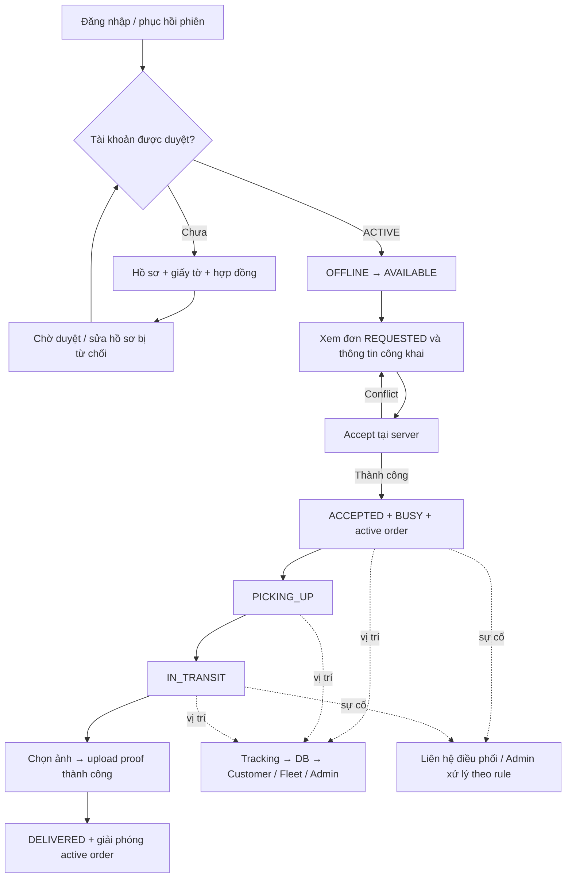

# Driver: nghiên cứu UX, đối chiếu hệ thống và kế hoạch kiểm thử FE → BE

Ngày nghiên cứu: 11/09/2026. Snapshot: `feature/mobile-ui-refactor`, HEAD `122ca36`.

Mục tiêu: xác định luồng Driver thực tế, sai lệch/thiếu sót và kế hoạch test có thể thực thi xuyên app Driver, shared mobile-core, REST/Socket, PostgreSQL/PostGIS, media và các màn hình quan sát Customer/Fleet/Admin. Đây là báo cáo nghiên cứu và test plan; chưa sửa behavior sản phẩm.

## 1. Kết luận và giới hạn bằng chứng

- Luồng chính có implementation: availability → nhận đơn → cập nhật tiến trình → tracking → upload proof → hoàn tất. Backend có kiểm tra assignment, transaction, idempotency và proof gate.
- Có sai lệch contract lifecycle, rủi ro kẹt đăng ký sau lỗi upload KYC, cùng một số action/dữ liệu UI cần sửa hoặc xác minh trước pilot.
- Đã chạy Jest trực tiếp từ dependency cài sẵn: app `driver` **22 suites / 188 tests pass**; `@leopard/mobile-core` **12 suites / 137 tests pass**. Tổng 325 tests. Không chạy coverage nên không kết luận đạt 80%.
- Chưa chạy API suite, database race suite, trình duyệt xuyên API thật, emulator hoặc thiết bị thật trong đợt này. Các test case bên dưới chưa được đánh dấu PASS chỉ vì đọc thấy implementation.
- Lệnh qua `pnpm.cmd` ban đầu không trả output trong thời gian quan sát và được dừng; chạy Jest cài sẵn thành công. Không xác định nguyên nhân pnpm trong phạm vi nghiên cứu.
- Tài liệu công khai của ứng dụng tham chiếu chứng minh quy trình được công bố, không chứng minh giao diện bản app mới nhất đã được thao tác trực tiếp. Nguồn Grab năm 2022 được dùng làm mẫu quy trình lịch sử, không mặc định là chính sách 2026.

## 2. Nghiên cứu các ứng dụng giao hàng

| Ứng dụng / nguồn chính thức | Điều quan sát được từ tài liệu | Suy luận áp dụng cho LEOPARD |
| --- | --- | --- |
| [Ahamove – Quy trình giao hàng hóa](https://ahamove.com/quytrinhthuchiendonhang) | Nhận đơn; liên hệ người gửi; đến lấy; kiểm tra/xác thực lấy hàng; giao và xác thực giao; có nhánh giao thất bại và hoàn trả. Trang có cập nhật áp dụng từ 05/08/2026. | Mỗi bước phải nói rõ tài xế đã đến, đã nhận hàng hay đã bắt đầu giao. Cần đường thoát vận hành khi không giao được; không dùng “hoàn tất” thay cho thất bại. |
| [GrabExpress – Hướng dẫn thao tác giao/nhận, 09/05/2022](https://www.grab.com/vn/blog/driver/gequytrinhgiaonhandonhang22/) | Phân biệt xác nhận lấy, xác nhận giao; báo cáo sự cố và hoàn hàng có bằng chứng riêng; đối chiếu mã đơn ở điểm lấy. | Mã đơn, điểm giao và hành động tiếp theo cần rõ. Lỗi/ngừng chuyến cần reason và lịch sử để điều phối có thể xử lý. |
| [Lalamove – FAQ tài xế/POD](https://www.lalamove.com/vi-vn/faq) | Tài xế chọn đơn; thông tin liên hệ xuất hiện sau nhận; POD có hướng dẫn chất lượng ảnh; có thể tải ảnh hoặc chữ ký trong flow được hỗ trợ; trường hợp khách chưa sẵn sàng chuyển tới hỗ trợ. | Phân tách dữ liệu công khai trước accept và dữ liệu riêng sau accept. POD cần hướng dẫn, preview, retry; chỉ có file tồn tại chưa đồng nghĩa ảnh đủ giá trị vận hành. |

Các suy luận UX ở cột cuối là đề xuất của báo cáo. Không sao chép quy tắc COD, phí, số lần gọi, ghép đơn hoặc thời gian chờ của đối thủ thành requirement LEOPARD.

## 3. Phạm vi và source of truth LEOPARD

Đối chiếu SRS FR-01/03/05/07/08, US-01/05/06/07/09/11/13/16, AC-01/03/04/05/06/07 và các tài liệu product, business process, architecture, data, API, UI, DoD/test strategy.

- App tài xế thực tế nằm ở `apps/driver`; `apps/mobile` là surface Customer có liên quan khi quan sát kết quả chuyến. Dùng chung `packages/mobile-core`; không chỉ chạy test của package `mobile` rồi coi như đã test Driver.
- Một Driver phải AVAILABLE và không có đơn active để nhận đơn. Driver chỉ thao tác lifecycle/tracking/proof của đơn được giao.
- Lifecycle BE/Prisma hiện tại: REQUESTED → ACCEPTED → PICKING_UP → IN_TRANSIT → DELIVERED; CANCELLED là terminal.
- Không yêu cầu trả tiền mới cho DELIVERED: delivery status và payment status là hai trục độc lập; chỉ Admin xác nhận PAID_MANUAL.
- Pickup có 0–3 stops trước dropoff; phải test 0, 1 và 3 stops dù không làm tối ưu/ghép nhiều đơn.
- Chat, ví/hoa hồng, dispatch tự động, COD/hoàn tiền và native permission nâng cao không được mặc định mở rộng trong test plan. Tài liệu kiến trúc hiện đã mô tả notifications/FCM trong khi out-of-scope còn ghi push ngoài phạm vi; cần PO xác nhận phạm vi chuẩn. Feature đã tồn tại vẫn phải kiểm tra route không gây hiểu nhầm hoặc làm lộ dữ liệu.

## 4. Luồng mục tiêu và điểm kiểm chứng



Đường tracking từ ACCEPTED là kỳ vọng cần làm rõ: BE cho phép nhưng sender hiện chỉ chạy PICKING_UP/IN_TRANSIT. Không tự thêm PICKED_UP/ARRIVED/RETURNED vào API khi chưa thống nhất contract.

## 5. Findings từ source code

Mức ưu tiên là đề xuất triage: P0 cho vi phạm quyền/mất toàn vẹn dữ liệu; P1 cho kẹt luồng chính hoặc thông tin vận hành sai; P2 cho sai lệch ít nghiêm trọng. “Xác nhận bằng code” chưa có nghĩa đã tái hiện trên thiết bị thật.

| ID | Mức / loại | Bằng chứng và tác động | Cách kiểm chứng / hướng xử lý |
| --- | --- | --- | --- |
| F01 | P1, lệch contract đã xác nhận | [Shared enum](../../packages/shared/src/domain/order/order-status.ts) có PICKED_UP ở dòng 5; [shared transitions](../../packages/shared/src/domain/order/order-state-machine.ts) cho ACCEPTED → PICKED_UP. [Prisma](../../apps/api/prisma/schema.prisma) dòng 47 và [BE state machine](../../apps/api/src/orders/domain/order-state-machine.ts) dòng 45 không có đường này. Adapter Driver hiện vẫn gửi PICKING_UP/IN_TRANSIT/DELIVERED. | Contract test so enum và transition theo actor ở shared, DTO/OpenAPI, Prisma và adapter. Không kết luận mọi lần bấm hiện tại đều fail; rủi ro nằm ở consumers dùng shared state machine, filter và presentation. Chốt một lifecycle chuẩn. |
| F02 | P1, nhánh retry KYC sai xác nhận bằng code | [driver-register](../../apps/driver/app/(public)/driver-register.tsx) dòng 214–255 gọi apply trước vòng upload ba giấy tờ. Apply commit chuyển PENDING_APPROVAL; [application service](../../apps/api/src/drivers/driver-application.service.ts) dòng 134 chặn apply lần nữa bằng 409. Lỗi upload giữ màn hình form, lần gửi lại vẫn gọi apply. | Cho apply thành công rồi fail upload thứ hai; retry và reload. Kỳ vọng có khả năng tiếp tục giấy tờ thiếu, không tạo/ký lại hồ sơ đã commit. Cần kiểm tra thêm approve có chặn hồ sơ thiếu giấy tờ hay không. |
| F03 | P2, action không được nối đã xác nhận | [DriverOrdersScreen](../../apps/driver/src/features/orders/DriverOrdersScreen.tsx) dòng 213: “Bỏ qua” không có onPress; dòng 223 “NHẬN ĐƠN” gọi onOpenOrder. | Test click từng CTA. Bỏ qua phải có nghĩa được định nghĩa hoặc bỏ khỏi live UI; nút chỉ mở chi tiết nên có copy phù hợp, hoặc mô tả rõ bước xác nhận kế tiếp. |
| F04 | P1, fallback/copy vận hành cần xử lý | Cùng screen dòng 147 có fallback “Cách bạn 1.2 km”, dòng 155 ghi “CƯỚC THỰC NHẬN DỰ KIẾN”, dòng 156 fallback giá. Dòng 377 khởi tạo địa chỉ Depot Tân Bình khi chưa có vị trí. Đây không phải bằng chứng server trả khoảng cách/thu nhập thực. | Feed thiếu field, GPS denied, provider fail. UI phải hiện chưa xác định/dữ liệu mô phỏng đúng ngữ cảnh; không biến giá cước đơn thành cam kết tiền tài xế nhận. Xác minh fallback nào reachable qua adapter. |
| F05 | P1, fallback liên hệ có thể gọi nhầm | [DriverOrderDetailScreen](../../apps/driver/src/features/orders/DriverOrderDetailScreen.tsx) dòng 39–42 dùng số 19001234 khi contact không match regex. openExternalNavigation dòng 33 dùng label, không tọa độ. | Contact thiếu/có dấu cách; địa chỉ trùng tên và stops. Không bấm gọi thật khi test. Mock Linking và assert đúng số/toạ độ đã được phép; thiếu contact phải có giải thích. |
| F06 | Cần test, chưa xác nhận lỗi invariant | [AcceptOrderService](../../apps/api/src/orders/accept-order.service.ts) dòng 54 condition AVAILABLE → BUSY rồi conditional assign dòng 73. Chưa thấy check độc lập active order tại service này. | Seed trạng thái bất nhất AVAILABLE + active order vào DB test; accept đơn khác phải bị từ chối hoặc DB constraint giữ invariant. Kiểm tra migration/index và repair path trước khi kết luận có thể nhận hai đơn. |
| F07 | Khoảng trống quyết định UX | [tracking-sender](../../apps/driver/src/features/orders/tracking-sender.ts) dòng 103 chỉ bắt đầu khi PICKING_UP/IN_TRANSIT; [tracking policy](../../apps/api/src/tracking/tracking.policy.ts) dòng 6 cho ACCEPTED. | Test lúc vừa accept, rời detail, đổi tab, khóa màn hình, quay lại. Chốt thời điểm bắt đầu và giới hạn foreground của pilot; last updated phải phản ánh ngừng tracking. |
| F08 | Khoảng trống quyết định nghiệp vụ | [MediaService](../../apps/api/src/media/media.service.ts) kiểm tra assignment/file/idempotency nhưng không giới hạn proof theo lifecycle. | Upload trước giao, sau DELIVERED/CANCELLED, replay key với nội dung khác. Chốt cho phép bổ sung proof hay bất biến sau terminal; không gọi đây là vi phạm SRS khi SRS chưa cấm. |
| F09 | P1, lỗi cấu hình tích hợp theo đường code | [HTTP client](../../packages/mobile-core/src/api/http-client.ts) dòng 6 dùng EXPO_PUBLIC_API_URL làm REST base có /api/v1. [tracking-sender](../../apps/driver/src/features/orders/tracking-sender.ts) dòng 141/188 và [dispatch listener](../../apps/driver/src/features/orders/dispatch-offer-listener.ts) dòng 49/59 nối trực tiếp /tracking hoặc /dispatch vào cùng biến. Socket factory gọi io trực tiếp, không normalize. | Khi env là https://host/api/v1, client tạo namespace /api/v1/tracking thay vì /tracking. Test URL constructor và handshake với cấu hình triển khai thật; tách REST base và Socket origin/path đúng reverse proxy. Chưa có smoke kết nối thật trong audit. |
| F10 | P2, error contract không khớp | [adapter](../../apps/driver/src/features/orders/adapter.ts) dòng 1076 nhận proof-required qua PROOF_REQUIRED/DELIVERY_PROOF_REQUIRED hoặc HTTP 400. BE trả ORDER_INVALID_TRANSITION/409 khi thiếu proof. | Test FE bằng response lỗi BE thật, không chỉ mock mã 400 tự đặt. Chốt UX nhắc upload hoặc refetch conflict; không hiển thị recovery sai. |
| F11 | P1, thiếu trạng thái mutation ở runtime | [detail runtime](../../apps/driver/src/features/orders/DriverOrderDetailRuntime.tsx) dòng 131 chỉ await rồi thay cache; chưa đặt pending trước request. [list runtime](../../apps/driver/src/features/orders/DriverOrdersListRuntime.tsx) dòng 57/62 tương tự cho availability/offer accept. Adapter status dòng 1065 chỉ gửi status, không truyền clientRequestId. | Double tap khi latency cao, response mất sau commit, retry. Xác minh chống gửi trùng ở live runtime, không chỉ fixture pending. BE có idempotency không có nghĩa FE đã dùng nó. |
| F12 | P1, proof thành công chưa cập nhật next action theo code | [detail runtime](../../apps/driver/src/features/orders/DriverOrderDetailRuntime.tsx) dòng 136–144 cập nhật riêng proof, giữ primaryTask/offeredLifecycleCommand cũ. [adapter](../../apps/driver/src/features/orders/adapter.ts) dòng 545–565 chỉ tạo nút DELIVERED khi map lại với proof persisted. [detail screen](../../apps/driver/src/features/orders/DriverOrderDetailScreen.tsx) dòng 648 dùng view.primaryTask. | IN_TRANSIT chưa proof → upload thành công, không reload/đổi màn hình: phải xuất hiện Xác nhận đã giao và gọi status đúng. Test thêm upload fail→retry→success. Đây là nhánh có khả năng kẹt completion cho đến khi refetch; cần runtime regression. |

Điểm BE đã có để bảo vệ regression: [status service](../../apps/api/src/orders/update-order-status.service.ts) kiểm tra assigned Driver, clientRequestId, cập nhật optimistic và publish sau commit; delivery proof gate tồn tại. [Tracking service](../../apps/api/src/tracking/tracking.service.ts) và policy giới hạn assignment/active order. [Media service](../../apps/api/src/media/media.service.ts) có kiểm tra magic bytes và quyền upload.

## 6. Ma trận kiểm thử đề xuất

Mỗi hàng là một nhóm test cần tách thành các ca độc lập. P0/P1 đều là release gate. Assert API gồm HTTP status + domain code theo error contract; không chỉ assert có toast. Assert DB gồm giá trị và số bản ghi trước/sau.

| ID / ưu tiên / trace | Thao tác FE và tình huống | Oracle API / DB / observer |
| --- | --- | --- |
| D01 P0 · AC01 | Login đúng/sai; token hết hạn; nhiều request đồng thời refresh; logout rồi Back/deep link; đổi tài khoản | Một refresh rotation hợp lệ; token cũ không tái dùng; cache/private screen bị xóa; 401/403 đúng role; socket ngừng khi logout |
| D02 P1 · FR01, UI đăng ký | Customer nộp hồ sơ/hợp đồng/3 KYC → pending → Admin approve/reject → kiểm tra lại/reload → reapply | Role/status/profile/contract và documents đúng; pending/rejected không nhận đơn; PDF có auth; không leak KYC; không hiển thị hợp đồng cũ như lần ký mới |
| D03 P1 · F02 | Fail từng upload KYC, fail sau apply commit, mất response, reload giữa upload | Resume được phần thiếu; không kẹt do 409 pending; không tạo bản ký/file dư; Admin không duyệt nhầm hồ sơ chưa đủ theo rule được chốt |
| D04 P1 · US05 | OFFLINE ↔ AVAILABLE; toggle nhanh; mất mạng; app khởi động lại; BUSY thử đổi trạng thái | UI khớp GET dữ liệu server; rollback lỗi; không cho BUSY nhận thêm; trạng thái persist sau refresh |
| D05 P0 · FR03 | List và detail trước accept; thử order của driver khác; pagination; request không còn REQUESTED | Chỉ projection được phép; không lộ contact/media/payment riêng; scope server giữ nguyên khi sửa id/query |
| D06 P0 · AC03 | D1/D2 cùng accept O1; D1 accept O1/O2 đồng thời; response accept bị mất rồi retry | Đúng một assignment thắng; tối đa một active/driver; một history cho transition; loser conflict; UI refetch active và list |
| D07 P0 · FR03, F06 | Seed AVAILABLE + active order; accept đơn khác; disable Driver trong lúc thao tác | Reject/constraint bảo vệ, transaction rollback không bỏ BUSY sai; account không hợp lệ bị chặn |
| D08 P1 · AC03 | Happy path từ list → accept → PICKING_UP → IN_TRANSIT → proof → DELIVERED | Đúng endpoint, next state duy nhất, history có actor/time; proof gắn đúng order; active trống và availability đúng sau hoàn tất; Customer/Fleet/Admin đọc cùng trạng thái |
| D09 P0 · AC03, F01 | Mọi cặp transition × actor; gửi PICKED_UP/LOADING/ARRIVED; replay key; hai thiết bị update cùng lúc | State sai bị reject, DB không đổi; idempotency không thêm history; shared enum/DTO/Prisma/OpenAPI thống nhất; FE sửa stale state bằng refetch |
| D10 P1 · AC02/07 | Đơn 0/1/3 stops; địa chỉ dài/trùng tên; đổi app bản đồ rồi quay lại; contact thiếu | Đúng thứ tự và tọa độ; không bỏ stops; Linking không gọi số fallback; label bước lấy/giao không gây nhầm |
| D11 P0 · AC04 | Driver gửi location; Customer C1/Fleet F1/Admin join; C2/F2/D2 truy cập trái quyền | Point persist trước emit; unauthorized không đọc/gửi; đúng room; dữ liệu observer khớp order và driver |
| D12 P1 · FR05 | GPS denied/thu hồi; accuracy kém; socket đứt; offline→online; duplicate/out-of-order/future point; rate limit | Bounded queue theo policy, không duplicate clientPointId; invalid point bị từ chối mà phiên còn dùng được; timestamp/last known location không lùi sai; hiển thị stale rõ |
| D13 P1 · F07 | Accept nhưng chưa mở detail; đổi tab; background/lock; restart; terminal và logout | Xác định khi nào sender sống; không gửi vào đơn cũ sau terminal/logout; foreground limitations được thể hiện, không hứa tracking liên tục khi đã dừng |
| D14 P0 · AC03/06 | Complete chưa proof; file giả MIME; JPEG/PNG/WebP; quá 10 MB; D2 upload/đọc proof O1 | Chặn complete thiếu proof; file không hợp lệ không ghi metadata/object; đúng ownership; response URL không vượt scope |
| D15 P1 · AC06 | Cancel picker; upload chậm/timeout/signed URL hết hạn; retry cùng request; ảnh đổi nhưng key cũ | Không complete trước ACK; retry theo idempotency contract; không mất ảnh chỉ vì mất response; reload vẫn thấy proof đã persist; key-content mismatch có expected rõ |
| D16 P0 · AC03 | Customer cancel REQUESTED race Driver accept; Customer cancel sau accept; Admin cancel có/không reason; cancel race status | Một kết quả hợp lệ, history/audit nhất quán, không đơn terminal còn giữ active sai; Driver thấy trạng thái mới và dừng thao tác |
| D17 P1 · vận hành ngoại lệ | Không gặp người gửi/nhận, hàng sai/hỏng, không giao được, chờ quá lâu | Có hướng dẫn liên hệ điều phối và rule kết thúc rõ; không phải fake DELIVERED để thoát chuyến. FAILED/RETURNED là CR nếu cần state mới |
| D18 P0 · AC05/06 | Driver thử tạo QR/confirm payment; Customer tạo intent; Admin confirm note; reload các role | Driver/Fleet không có quyền ghi tiền; audit chỉ hợp lệ với Admin; payment không bị suy ra từ DELIVERED và ngược lại |
| D19 P1 · AC07 | Loading/empty/error/permission/session-expired/success ở list/detail/profile/KYC; API offline | Có recovery action thật, không spinner vô hạn, không flash dữ liệu user trước, không hardcode số liệu giả làm kết quả thật |
| D20 P1 · AC07 | 360×800, 390×844, 768×1024; font lớn, bàn phím, safe-area, focus, screen reader | Không overflow/che CTA; target ≥44×44; contrast WCAG AA; nhãn ETA dự kiến và Dữ liệu mô phỏng đúng nguồn |
| D21 P1 · pilot persistence | Hoàn tất một đơn, reload app và restart API trong test env; mở lại chi tiết | DB giữ status/proof/history/payment/tracking; không phụ thuộc fixture/local memory; Driver có đường xem lại kết quả hoặc route được định nghĩa |
| D22 P1 · F09 | EXPO_PUBLIC_API_URL có /api/v1, có/không dấu / cuối, reverse proxy; tracking và dispatch connect bằng token thật | Đúng Socket namespace/path, ACK/join và event nhận thực tế; REST vẫn hoạt động. Không coi websocket transport connected là đã join đúng room |
| D23 P1 · F12 | IN_TRANSIT chưa proof → chọn ảnh → upload thành công, giữ nguyên màn hình → xác nhận đã giao | primaryTask được tính lại ngay từ proof đã persist; không cần reload để hoàn tất; chỉ một upload/mutation hợp lệ và Customer thấy DELIVERED |
| D24 P2 · navigation | Mở/đóng drawer, Back/deep link, từ history về order; hai lần tap menu | Một drawer và focus đúng. Source hiện có drawer ở provider và local screen; cần test runtime để xác định có render chồng hoặc che CTA |

## 7. Dữ liệu và môi trường

- Bộ tài khoản tổng hợp: C1/C2; D1/D2 AVAILABLE; D3 OFFLINE; D4 BUSY; tài khoản pending/rejected/disabled; F1/F2 với membership ACTIVE/REMOVED; Admin. Không dùng PII thật.
- Orders có đủ REQUESTED/ACCEPTED/PICKING_UP/IN_TRANSIT/DELIVERED/CANCELLED; loại xe MOTORBIKE/VAN/TRUCK; giá 0/null/giá bình thường nếu contract cho phép; 0/1/3 stops; proof có/không; payment chưa trả/QR/paid.
- API thật + PostgreSQL/PostGIS tách biệt đã migrate + object storage test + map/OTP/payment demo deterministic. Không mock HTTP business endpoints ở happy-path E2E; chỉ dùng fault injection cho lỗi mạng/provider và dữ liệu GPS có gắn nhãn.
- PWA: ít nhất hai browser contexts Driver/Customer, thêm Fleet/Admin để quan sát. Native: smoke camera/GPS/background/deep link trên emulator hoặc thiết bị. PWA viewport pass không chứng minh native permissions pass.
- Real DB race suite có gate riêng: `LEOPARD_REAL_DB_RACE_TEST=true`, DATABASE_URL trỏ đúng database dùng bỏ được tên `leopard_real_db_race_test`; xem `apps/api/test/real-db-race-gate.ts`. Chạy suite bị skip không được tính là race pass.
- Mỗi test có namespace fixture riêng; dùng UUID/requestId xác định theo test; clock kiểm soát được. Cleanup chỉ dữ liệu của fixture trong test DB.

## 8. Coverage hiện có và thiếu

| Lớp | Bằng chứng hiện có | Việc cần bổ sung |
| --- | --- | --- |
| Driver UI/runtime/adapter | 22 suites, 188 tests pass; có DriverOrdersListRuntime, DriverOrderDetailRoute, DriverScreens, tracking-sender, registration, preview | Test F02 partial KYC, CTA không nối, resume/reload, multi-screen integration dùng server thật |
| Shared mobile-core | 12 suites, 137 tests pass; HTTP client/session store/form-data/image picker/UI | Cross-app account switch/refresh + socket + upload retry trong runtime thật |
| API | Có order-lifecycle.e2e-spec, accept-order.integration-spec, media.e2e-spec, authorization matrix/security, tracking policy, real-db-race-condition.integration-spec | Thực thi và ghi pass/skip thực tế; phân biệt suite dùng InMemoryPrismaService với suite DB thật |
| E2E giao diện Driver | `apps/driver/package.json` chưa có test:e2e; không thấy apps/driver/e2e. `apps/mobile` có script Maestro trỏ e2e nhưng thư mục đó chưa tồn tại khi rà soát | Bổ sung harness Driver PWA/API/DB và native smoke. Playwright config hiện ở apps/admin không tự bao phủ app Driver |
| Contract | API OpenAPI test đang kỳ vọng sáu status | Thêm gate xuyên shared/mobile-core/Driver adapter/Prisma/API, không chỉ snapshot enum từng package |

## 9. Thứ tự thực hiện

1. **Pha A – Chốt contract và baseline:** giải quyết F01; chốt tên/ý nghĩa PICKING_UP, thời điểm tracking, rule proof terminal, fallback incident và các surface demo/live. Ghi version API/DB/app và chạy bộ test hiện có. Output: contract matrix + báo cáo baseline có pass/fail/skip.
2. **Pha B – Khóa các lỗi chính:** ưu tiên regression RED cho F09/F12 (tracking và completion), F02 (onboarding), tiếp theo F03/F05/F10/F11 và test dữ liệu F04; sửa từng vertical slice sau khi task implementation được mở. Output: tái hiện được lỗi, bản sửa và test pass.
3. **Pha C – Tích hợp BE thật:** D01/D05–D09/D11/D14/D16/D18 với DB test, storage và socket; chạy race có barrier/concurrent requests. Output: request/response, DB assertions và event trace.
4. **Pha D – E2E Driver + observer:** D04/D08/D10/D12–D15/D19–D21; không stub API ở flow thành công. Output: trace/video, screenshot state quan trọng, correlation IDs, persisted state sau refresh.
5. **Pha E – UAT thực địa nhỏ:** người đóng vai tài xế thao tác khi đã dừng xe; test gọi/map bằng dữ liệu test, camera và GPS thật, mạng yếu; Admin xử lý một ngoại lệ. Output: checklist UAT và quyết định go/no-go.

QA sở hữu scenario/evidence; FE sở hữu interaction và recovery; BE sở hữu invariants/auth/transaction; PO chốt các rule chưa có. Không dùng estimate ngày cứng trước khi biết môi trường thiết bị và harness hiện có.

## 10. Lệnh và tiêu chí hoàn tất

Các lệnh đề xuất sau khi môi trường đã sẵn sàng, chạy từ root:

```powershell
pnpm.cmd --filter driver test
pnpm.cmd --filter driver typecheck
pnpm.cmd --filter driver lint
pnpm.cmd --filter @leopard/mobile-core test
pnpm.cmd --filter @leopard/mobile-core typecheck
pnpm.cmd --filter api test -- --runInBand
pnpm.cmd --filter api test:contract
pnpm.cmd --filter api test:e2e
pnpm.cmd --filter api typecheck
pnpm.cmd --filter api lint
pnpm.cmd --filter driver export
```

API/DB tests chỉ chạy khi env test riêng đã được xác minh; không chạy migration/seed trên database người dùng. Driver chưa có test:e2e nên cần tạo harness trước, không đưa một lệnh chưa tồn tại vào checklist PASS. Root build chưa thay thế được `driver export` vì Driver không có script build.

Lệnh baseline thực tế đã chạy:

```powershell
# cwd: apps/driver
.\node_modules\.bin\jest.cmd --runInBand --watch=false
# cwd: packages/mobile-core
.\node_modules\.bin\jest.cmd --runInBand --config jest.config.cjs --watch=false
```

Release gate: toàn bộ P0/P1 pass, không skip authorization/race/critical E2E; không còn contract drift; dữ liệu persist sau reload/restart; không leak role/fleet; fallback không tạo thông tin giả; retry không tạo bản ghi kép hoặc kẹt workflow. Coverage unit/integration mục tiêu ≥80% theo quy ước dự án, đo riêng và không dùng để thay thế E2E.

Mẫu evidence mỗi ca: ID; commit; environment; fixture IDs; preconditions; thao tác; expected/actual UI + HTTP/Socket + DB; pass/fail/blocked; trace/log đã che token; issue liên quan. Mọi test chưa chạy phải giữ trạng thái NOT RUN.
