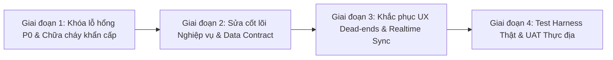

# BÁO CÁO TOÀN DIỆN VỀ CÁC LỖ HỔNG HỆ THỐNG, SAI LỆCH LOGIC NGHIỆP VỤ THỰC TẾ VÀ KẾ HOẠCH ĐIỀU CHỈNH (LEOPARD AUDIT REPORT)

> **Mã tài liệu:** `DOCS-TEST-09-AUDIT-REPORT`  
> **Ngày lập:** 11/09/2026  
> **Phiên bản hệ thống:** `feature/mobile-ui-refactor` (HEAD snapshot: `122ca36`)  
> **Phạm vi kiểm toán:** Mobile Driver (`apps/driver`), Mobile Customer (`apps/mobile`), Shared Core (`packages/mobile-core`, `packages/shared`), Backend API NestJS (`apps/api`), Database PostgreSQL/PostGIS (`prisma/schema.prisma`), Realtime Socket Gateway, Storage & Payment Providers.  
> **Người thực hiện:** Antigravity Pairing Agent  

---

## 1. TỔNG QUAN VÀ ĐÁNH GIÁ ĐIỀU HÀNH (EXECUTIVE SUMMARY)

LEOPARD được định vị là nền tảng kết nối logistics thông minh mini-production pilot tại Việt Nam với 4 vai trò: Khách hàng (Customer), Tài xế (Driver), Chủ đội xe (Fleet Owner) và Quản trị viên (Admin).

Sau khi rà soát chuyên sâu từ tài liệu UX research (`07-driver-ux-research-and-e2e-plan.md`), handoff prompt (`08-driver-test-handoff-prompt.md`), đối chiếu trực tiếp với mã nguồn thực tế trên cả Frontend, Backend, Schema DB, Socket Gateway và các bộ test regression:

**Kết luận chung:**  
Hệ thống đã xây dựng được khung kiến trúc đa tầng (Clean Architecture / NestJS / Prisma / React Native Expo) và luồng đi lý tưởng cơ bản (happy-path). Tuy nhiên, **hệ thống hiện tại CHƯA ĐỦ ĐIỀU KIỆN ĐỂ TRIỂN KHAI PILOT THỰC TẾ NGOÀI ĐƯỜNG PHỐ**. 

Tồn tại **24 điểm nghẽn, lỗ hổng bảo mật và sai lệch nghiệp vụ nghiêm trọng** giữa logic lập trình và thực tế vận hành logistics tại Việt Nam. Nếu đưa vào chạy thử nghiệm với tài xế và khách hàng thật, hệ thống sẽ ngay lập tức đối mặt với:
1. **Rủi ro vận hành (Deadlock):** Tài xế bị giam đơn vĩnh viễn khi gặp sự cố; tài xế đứng chờ đơn bị radar xóa sổ; app tự động logout văng ra màn hình đăng nhập mỗi khi tắt mở lại.
2. **Rủi ro nghiệp vụ & Khách hàng:** Xe máy nhận nhầm hàng 2 tấn của xe tải; khách hàng bấm gọi tài xế bị nối máy vào số ảo `0901234567`; tài xế bấm gọi khách hàng bị nối vào tổng đài tính cước `19001234`; khách hàng không thể hủy cuốc hoặc liên hệ ai khi tài xế bỏ chạy.
3. **Rủi ro bảo mật & Thất thoát tài chính:** Rò rỉ IDOR cho phép Fleet Owner xem chứng từ hàng hóa bí mật của đối thủ; phê duyệt tài xế không cần bất kỳ giấy tờ KYC nào; tiền thanh toán qua PayOS bị lệch số tiền thì bị treo vô thời hạn mà không có cảnh báo; cho phép thanh toán và xuất hóa đơn đỏ trên đơn hàng đã bị hủy.

### Bảng tổng hợp mức độ nghiêm trọng (Severity Matrix)

| Mức độ | Số lượng | Định nghĩa & Tác động thực tế |
| :--- | :---: | :--- |
| **P0 - Nguy cấp (Critical)** | **6** | Lỗ hổng bảo mật (IDOR), vi phạm toàn vẹn dữ liệu, thất thoát tiền bạc, phê duyệt gian lận, mất session làm tài xế mất liên lạc khi đang lái xe. |
| **P1 - Nghiêm trọng (High)** | **10** | Sai lệch logic nghiệp vụ cốt lõi, deadlock quy trình không có lối thoát (kẹt tài xế, kẹt đăng ký KYC), điều phối nhầm loại phương tiện, mất kết nối Socket thời gian thực, số điện thoại liên lạc giả mạo. |
| **P2 - Trung bình (Medium)** | **6** | Lỗi trải nghiệm người dùng (UX Dead-ends), chỉ đường GPS sai vị trí, dữ liệu mock giả mạo hiển thị như thật (xi măng, 250kg, bốc xếp), multi-stop không có quản lý chặng. |
| **P3 - Kỹ thuật (Low/Tech Debt)** | **2** | Lỗi ngữ cảnh AsyncLocalStorage trong audit logging, lỗi cấu hình body-parser socket reset (`ECONNRESET`). |
| **TỔNG CỘNG** | **24** | **Cần xử lý dứt điểm theo lộ trình trước khi mở rộng Pilot.** |

---

## 2. DANH MỤC CHI TIẾT 24 LỖ HỔNG & ĐIỂM SAI NGHIỆP VỤ THỰC TẾ

---

### PHẦN I: NHÓM P0 - LỖ HỔNG BẢO MẬT, PHÂN QUYỀN & THẤT THOÁT TÀI CHÍNH

#### 🚨 SEC-01 [P0]: Lỗ hổng IDOR tại Media Service — Fleet Owner đọc trộm hình ảnh hàng hóa và Proof của đối thủ
- **Vị trí code:** [`apps/api/src/media/media.service.ts`](file:///d:/leopard/apps/api/src/media/media.service.ts#L101-L125) (hàm `getSignedUrl`), [`apps/api/src/media/media.controller.ts`](file:///d:/leopard/apps/api/src/media/media.controller.ts#L53-L60).
- **Hiện trạng code:**
  ```typescript
  // media.service.ts
  if (actor.role === 'CUSTOMER' && order.customerId !== actor.userId) {
    throw new DomainError('FORBIDDEN', 403, 'Không có quyền truy cập media này');
  }
  if (actor.role === 'DRIVER' && order.driverId !== actor.userId) {
    throw new DomainError('FORBIDDEN', 403, 'Không có quyền truy cập media này');
  }
  // Hoàn toàn KHÔNG kiểm tra FLEET_OWNER!
  const url = await this.storageProvider.createReadUrl(media.storageKey, expiresInSeconds);
  return { url, expiresAt };
  ```
- **Bối cảnh thực tế & Rủi ro:** Bất kỳ ai có tài khoản `FLEET_OWNER` đều có thể gọi `GET /media/:id/url` để lấy link xem hình ảnh hàng hóa bí mật (mặt hàng giá trị, hoá đơn thương mại) hoặc ảnh chữ ký/bằng chứng giao hàng của khách hàng thuộc fleet khác hoặc tài xế tự do. Vi phạm nghiêm trọng nguyên tắc bảo mật và vi phạm Rule trong `AGENTS.md`: *"Fleet Owner chỉ truy cập dữ liệu qua FleetMember hợp lệ; không được kế thừa quyền Admin"*.
- **Giải pháp điều chỉnh:** Bổ sung kiểm tra quyền Fleet Owner: Order phải có `driverId` thuộc danh sách thành viên `ACTIVE` của Fleet mà Fleet Owner đang sở hữu.

---

#### 🚨 SEC-02 [P0]: Quy trình Onboarding lỏng lẻo — Admin có thể duyệt tài xế không có bất kỳ giấy tờ nào (KYC Bypass)
- **Vị trí code:** [`apps/api/src/admin/admin-driver-review.service.ts`](file:///d:/leopard/apps/api/src/admin/admin-driver-review.service.ts#L63-L92) (hàm `approve`).
- **Hiện trạng code:**
  Hàm `approve` chỉ kiểm tra `user.status === 'PENDING_APPROVAL'`, sau đó lập tức cập nhật `user.status = 'ACTIVE'` và `driverProfile.reviewedAt = now`. Hàm này **hoàn toàn không kiểm tra xem tài xế đã tải lên đủ 3 giấy tờ bắt buộc hay chưa** (GPLX, Cà-vẹt xe, CCCD/CMND).
- **Bối cảnh thực tế & Rủi ro:** Một tài xế ảo chỉ cần đăng ký tài khoản và gửi `POST /driver/apply`, không nộp ảnh bằng lái hay giấy đăng ký xe. Admin do sơ suất hoặc thao tác nhầm trên web bấm "Duyệt" -> tài xế ngay lập tức trở thành `ACTIVE`, bật `AVAILABLE` và đi nhận hàng chở tài sản của khách. Hậu quả pháp lý cực lớn nếu xảy ra tai nạn giao thông hoặc chiếm đoạt tài sản.
- **Giải pháp điều chỉnh:** Trong `AdminDriverReviewService.approve`, bắt buộc đếm số lượng `DriverDocument` theo các loại bắt buộc (`LICENSE`, `VEHICLE_REGISTRATION`, `ID_CARD`). Nếu thiếu, ném lỗi `422 Unprocessable Entity - DRIVER_DOCUMENTS_INCOMPLETE`.

---

#### 🚨 SEC-03 [P0]: Cho phép tạo thanh toán và xác nhận tiền trên đơn hàng đã bị hủy (Cancelled Order Payment)
- **Vị trí code:** [`apps/api/src/payments/payments.service.ts`](file:///d:/leopard/apps/api/src/payments/payments.service.ts#L26-L92) (hàm `createPaymentIntent`), dòng 94-157 (hàm `confirmPayment`).
- **Hiện trạng code:**
  Trong `createPaymentIntent`: chỉ kiểm tra quyền sở hữu đơn (`order.customerId !== actor.userId`), **không hề kiểm tra `order.status`**.
  Trong `confirmPayment`: Admin có thể xác nhận bất kỳ thanh toán nào nếu intent ở trạng thái `UNPAID`/`QR_CREATED`, không kiểm tra xem đơn hàng đó đã bị `CANCELLED` hay chưa.
- **Bối cảnh thực tế & Rủi ro:** 
  - Đơn hàng đã bị hủy do không tìm thấy xe hoặc khách đổi ý. Khách hàng vẫn mở được mã VietQR Napas247 và chuyển khoản tiền cước.
  - Admin bấm xác nhận thanh toán thủ công trên một đơn đã hủy. Hệ thống tự động kích hoạt `dispatchInvoiceIssuance` -> **Hệ thống tự động phát hành hóa đơn thuế điện tử VAT hợp lệ cho một đơn hàng đã bị hủy bỏ**! Vi phạm nghiêm trọng về hóa đơn chứng từ kế toán.
- **Giải pháp điều chỉnh:** Chặn tạo thanh toán nếu `order.status === 'CANCELLED'`. Chặn xác nhận thanh toán và hủy ngay `PaymentIntent` nếu đơn hàng đã ở trạng thái hủy.

---

#### 🚨 SEC-04 [P0]: Lỗi nuốt lỗi Webhook PayOS khi sai lệch số tiền (Silent Payment Mismatch)
- **Vị trí code:** [`apps/api/src/payments/payment-webhook.service.ts`](file:///d:/leopard/apps/api/src/payments/payment-webhook.service.ts#L42-L47).
- **Hiện trạng code:**
  ```typescript
  if (intent.amountVnd !== verified.amount) {
    this.logger.error(
      `payOS webhook amount mismatch for PaymentIntent ${intent.id}: expected ${intent.amountVnd}, got ${verified.amount}`,
    );
    return; // Trả về void (HTTP 200 OK cho webhook) và kết thúc âm thầm!
  }
  ```
- **Bối cảnh thực tế & Rủi ro:** Khách hàng chuyển khoản thiếu tiền (ví dụ cước 150.000đ nhưng chuyển 140.000đ) hoặc thừa tiền. PayOS gửi webhook xác nhận tiền đã vào tài khoản ngân hàng của công ty. Backend LEOPARD thấy số tiền không khớp thì... chỉ ghi log rồi bỏ qua! Tiền thật đã vào tài khoản ngân hàng, nhưng đơn hàng trên hệ thống vẫn vĩnh viễn là `QR_CREATED`/`UNPAID`. Khách hàng bị mất tiền mà không được giao hàng, Admin không nhận được bất kỳ thông báo hay task xử lý chênh lệch tiền nào.
- **Giải pháp điều chỉnh:** Cập nhật trạng thái `intent.status = 'AMOUNT_MISMATCH'` hoặc tạo bản ghi `AuditLog`/bắn thông báo Notification khẩn cấp cho Admin để đối soát hoàn tiền hoặc thu bổ sung.

---

#### 🚨 SEC-05 [P0]: Mất phiên đăng nhập vĩnh viễn khi tài xế khởi động lại App (Driver Session Drop)
- **Vị trí code:** [`apps/driver/app/index.tsx`](file:///d:/leopard/apps/driver/app/index.tsx#L12-L24), [`packages/mobile-core/src/auth/session-store.ts`](file:///d:/leopard/packages/mobile-core/src/auth/session-store.ts#L13-L14).
- **Hiện trạng code:**
  ```typescript
  // apps/driver/app/index.tsx
  await sessionStore.hydrate();
  const isAuthenticated = Boolean(sessionStore.getAccessToken()); // LUÔN LUÔN LÀ NULL!
  const role = sessionStore.getRole();
  const outcome = resolveDriverLogin({ isAuthenticated, role });
  if (outcome.kind === 'enter') router.replace('/orders');
  else router.replace('/(public)/login'); // LUÔN LUÔN VĂNG VỀ LOGIN!
  ```
- **Bối cảnh thực tế & Rủi ro:** Trong `SessionStore`, `accessToken` chỉ được lưu trong RAM chứ không lưu vào SecureStore (đúng chuẩn bảo mật). `hydrate()` chỉ phục hồi `refreshToken` và `role`. Trong khi bên app Customer (`role-router.ts`) có đoạn kiểm tra: *nếu có refresh token mà chưa có access token thì tự động gọi `refreshSession()`*, thì bên app Driver lập tức kiểm tra `getAccessToken()`! 
  Hậu quả: **Mỗi khi tài xế tắt app mở lại, hoặc hệ điều hành Android giải phóng RAM khi tài xế đang chạy xe trên đường, app Driver tự động đá tài xế ra màn hình Đăng nhập!** Tài xế đang lái xe phải dừng lại đăng nhập lại, có nguy cơ gây tai nạn và gián đoạn toàn bộ việc theo dõi đơn hàng.
- **Giải pháp điều chỉnh:** Bổ sung logic `refreshSession()` ngay trong `apps/driver/app/index.tsx` tương tự như `apps/mobile/src/navigation/role-router.ts` trước khi đánh giá `resolveDriverLogin`.

---

#### 🚨 SEC-06 [P0]: Thiếu `clientRequestId` / Idempotency ở các thao tác quan trọng
- **Vị trí code:** 
  - Customer tạo đơn: [`apps/mobile/src/features/customer/orders/adapter.ts`](file:///d:/leopard/apps/mobile/src/features/customer/orders/adapter.ts#L1096-L1125) (hàm `createOrder` không truyền `clientRequestId`).
  - Driver cập nhật trạng thái: [`apps/driver/src/features/orders/adapter.ts`](file:///d:/leopard/apps/driver/src/features/orders/adapter.ts#L1065) (chỉ gửi `{ status }`).
  - Mobile Runtime thiếu khóa double-tap: [`DriverOrderDetailRuntime.tsx`](file:///d:/leopard/apps/driver/src/features/orders/DriverOrderDetailRuntime.tsx#L131) và [`DriverOrdersListRuntime.tsx`](file:///d:/leopard/apps/driver/src/features/orders/DriverOrdersListRuntime.tsx#L57).
- **Bối cảnh thực tế & Rủi ro:** Khi mạng di động 4G ngoài đường bị chập chờn, tài xế hoặc khách hàng bấm nút 2 lần liên tiếp (double-tap):
  - Khách hàng bị tạo thành 2 đơn hàng giống hệt nhau (`Order`), sinh 2 mã QR và bị trừ tiền 2 lần.
  - Runtime không set trạng thái `isPending` trước khi gửi request, cho phép 2 request mutation bay đồng thời lên server. Dù Backend có kiểm tra idempotency, nhưng Frontend không sinh `clientRequestId` thì cơ chế chống trùng lặp của Backend hoàn toàn vô dụng!
- **Giải pháp điều chỉnh:** Tự động tạo UUIDv4 `clientRequestId` tại tầng adapter cho mỗi thao tác tạo đơn và đổi trạng thái; vô hiệu hóa nút bấm (disable button) ngay khi người dùng nhấn lần đầu.

---

### PHẦN II: NHÓM P1 - ĐIỂM SAI NGHIỆP VỤ LOGIC THỰC TẾ & DEADLOCK QUY TRÌNH

#### ⚠️ BIZ-01 [P1]: Tài xế bị giam đơn vĩnh viễn khi gặp sự cố — Zero Incident / Reject / Return Lifecycle
- **Vị trí code:** [`apps/api/src/orders/domain/order-state-machine.ts`](file:///d:/leopard/apps/api/src/orders/domain/order-state-machine.ts#L45-L66).
- **Hiện trạng code:**
  Tài xế CHỈ CÓ DUY NHẤT các bước chuyển trạng thái sau:
  `REQUESTED -> ACCEPTED -> PICKING_UP -> IN_TRANSIT -> DELIVERED`.
  Tài xế **KHÔNG CÓ BẤT KỲ CƠ CHẾ NÀO ĐỂ**:
  - Hủy đơn khi xe bị nổ lốp, hỏng động cơ hoặc tai nạn giao thông.
  - Báo cáo không liên lạc được với người gửi hàng hoặc người gửi không có nhà.
  - Từ chối nhận hàng do hàng cấm, hàng quá khổ quá tải so với quy định.
  - Báo cáo giao hàng thất bại khi người nhận từ chối nhận (bom hàng) hoặc tắt máy.
- **Bối cảnh thực tế & Rủi ro:** 
  Thực tế giao hàng tại Việt Nam (theo quy trình Ahamove, Grab, Lalamove), tỷ lệ gặp sự cố giao nhận chiếm 3-7%. Trong LEOPARD, một khi tài xế đã bấm "Nhận đơn":
  - Nếu khách hàng bom hàng hoặc người gửi không có mặt, tài xế **KHÔNG THỂ HỦY ĐƠN**.
  - Tài xế cũng **KHÔNG THỂ BẤM DELIVERED** vì bước này bắt buộc phải có ảnh chứng từ giao hàng (`hasDeliveryProof`).
  - Trạng thái tài xế bị khóa chặt ở `BUSY`. Vì `BUSY`, tài xế không bao giờ nhận được đơn khác.
  - Tài xế bị kẹt vĩnh viễn cho đến khi có Admin mở máy tính vào console Admin hủy thủ công! Nếu sự cố xảy ra vào ban đêm hoặc ngày nghỉ không có Admin trực, tài xế hoàn toàn bị tê liệt công việc.
- **Giải pháp điều chỉnh:** Bổ sung nghiệp vụ báo cáo sự cố cho Driver (`REPORT_INCIDENT` / `CANCEL_WITH_REASON` trước khi lấy hàng, và luồng `DELIVERY_FAILED` / trả hàng hoàn tiền khi đang đi giao).

---

#### ⚠️ BIZ-02 [P1]: Thuật toán Radar Dispatch lỗi ngược — Tài xế đứng yên chờ đơn bị "bốc hơi" khỏi hệ thống
- **Vị trí code:** 
  - Client ping: [`apps/driver/src/features/orders/idle-location-ping.ts`](file:///d:/leopard/apps/driver/src/features/orders/idle-location-ping.ts#L84-L86).
  - Server query: [`apps/api/src/drivers/drivers.repository.ts`](file:///d:/leopard/apps/api/src/drivers/drivers.repository.ts#L124).
- **Hiện trạng code:**
  - Client logic: 
    ```typescript
    if (this.lastSent && distanceMeters(this.lastSent, next) < MIN_MOVE_METERS) {
      return; // Nếu di chuyển dưới 25 mét thì KHÔNG GỬI TỌA ĐỘ LÊN SERVER!
    }
    ```
  - Server logic:
    ```sql
    WHERE availability = 'AVAILABLE'
      AND "lastKnownAt" > NOW() - INTERVAL '90 seconds' -- Chỉ tìm tài xế có cập nhật vị trí trong 90 giây qua!
      AND ST_DWithin("lastKnownLocation", ..., 3000)
    ```
- **Bối cảnh thực tế & Rủi ro:** 
  Tài xế bật chế độ sẵn sàng (`AVAILABLE`) và đỗ xe tại ngã tư, quán cà phê hoặc bãi xe để chờ nổ cuốc.
  Vì tài xế đứng yên một chỗ, `distanceMeters < 25m` nên app Driver **ngừng gửi ping vị trí**.
  Chỉ sau đúng **90 giây (1.5 phút)**, cột `lastKnownAt` trong database bị quá hạn 90s.
  **Tài xế lập tức biến mất hoàn toàn khỏi radar điều phối của Backend!** Khách hàng đặt đơn ngay bên cạnh cũng không tài xế nào nhận được tín hiệu. Muốn nhận được đơn, tài xế buộc phải... liên tục chạy lòng vòng trên 25 mét cứ mỗi 1 phút!
- **Giải pháp điều chỉnh:** Sửa `idle-location-ping.ts`: Bổ sung điều kiện thời gian: *Nếu di chuyển > 25m HOẶC đã quá 45 giây kể từ lần ping trước thì bắt buộc gửi ping cập nhật `lastKnownAt`*.

---

#### ⚠️ BIZ-03 [P1]: Điều phối "mù" loại phương tiện — Đơn hàng xe tải 2 tấn bị phát cho xe máy
- **Vị trí code:** 
  - Dispatch gateway: [`apps/api/src/dispatch/dispatch.gateway.ts`](file:///d:/leopard/apps/api/src/dispatch/dispatch.gateway.ts#L47).
  - Dispatch service: [`apps/api/src/dispatch/dispatch.service.ts`](file:///d:/leopard/apps/api/src/dispatch/dispatch.service.ts#L16).
  - Database schema: [`apps/api/prisma/schema.prisma`](file:///d:/leopard/apps/api/prisma/schema.prisma#L229) (model `Order`).
  - Accept service: [`apps/api/src/orders/accept-order.service.ts`](file:///d:/leopard/apps/api/src/orders/accept-order.service.ts#L25-L70).
- **Hiện trạng code:**
  1. `Order` trong database Prisma **HOÀN TOÀN KHÔNG CÓ CỘT `vehicleType`**! (Chỉ có trong DTO lúc tạo đơn, rồi bị vứt bỏ, không lưu xuống DB).
  2. `dispatch.findCandidates(event.pickup)` gọi tìm tài xế lân cận mà **không truyền `vehicleType`**.
  3. Query `findNearbyAvailableDrivers` tìm tất cả tài xế trong 3km bất kể loại xe của tài xế là `MOTORBIKE`, `VAN` hay `TRUCK`.
  4. Khi tài xế bấm nhận đơn, `AcceptOrderService` **không kiểm tra xem loại xe của tài xế có khớp với loại xe khách yêu cầu hay không**.
- **Bối cảnh thực tế & Rủi ro:** Khách hàng cần chuyển văn phòng hoặc chở 2 tấn sắt thép, chọn đặt xe tải `TRUCK` với giá cước 1.200.000đ. Hệ thống phát tín hiệu này cho một bác tài chạy xe máy Honda Wave Alpha ở cách đó 200m. Tài xế xe máy thấy cuốc hơn 1 triệu bấm nhận ngay! Khi tài xế xe máy đến nơi thì khách hàng tá hỏa vì không thể chở hàng. Hủy đơn gây tranh cãi, mất uy tín nền tảng.
- **Giải pháp điều chỉnh:** 
  1. Thêm cột `vehicleType VehicleType` vào model `Order` trong `schema.prisma`.
  2. Truyền `vehicleType` vào `DispatchService` và query SQL `WHERE "vehicleType" = $vehicleType`.
  3. Bắt buộc kiểm tra `driverProfile.vehicleType === order.vehicleType` trong `AcceptOrderService`.

---

#### ⚠️ BIZ-04 [P1]: Hệ thống liên lạc viễn thông ảo — Tự động gọi số 19001234 và 0901234567
- **Vị trí code:**
  - Driver gọi Khách: [`apps/driver/src/features/orders/DriverOrderDetailScreen.tsx`](file:///d:/leopard/apps/driver/src/features/orders/DriverOrderDetailScreen.tsx#L39-L43), [`apps/driver/src/features/orders/adapter.ts`](file:///d:/leopard/apps/driver/src/features/orders/adapter.ts#L638-L640), [`apps/api/src/orders/order-response.mapper.ts`](file:///d:/leopard/apps/api/src/orders/order-response.mapper.ts#L44-L105).
  - Khách gọi Tài xế: [`apps/mobile/src/features/customer/orders/CustomerOrderDetailScreen.tsx`](file:///d:/leopard/apps/mobile/src/features/customer/orders/CustomerOrderDetailScreen.tsx#L128-L132).
- **Hiện trạng code:**
  1. Phía API: `mapOrderResponse` **không trả về số điện thoại khách hàng** (`phone` của Customer).
  2. Phía Driver Adapter: Vì API không trả về, `customerContact` bị gán chuỗi text: `'Thông tin liên hệ khách hàng · chỉ hiện sau phân công'`.
  3. Phía Driver UI: Hàm `callPhoneNumber` dùng regex kiểm tra số điện thoại. Do chuỗi text trên không khớp regex, hàm nhảy vào nhánh fallback:
     ```typescript
     function callPhoneNumber(contact: string) {
       const match = contact.match(/[\d+]{8,15}/);
       const phone = match ? match[0] : '19001234'; // TỰ ĐỘNG GỌI 19001234!
       void Linking.openURL(`tel:${phone}`).catch(() => {});
     }
     ```
  4. Phía Customer UI: Khi khách hàng nhấn nút gọi tài xế:
     ```typescript
     const handleCall = () => {
       void Linking.openURL('tel:0901234567'); // HARDCODE CỐ ĐỊNH 0901234567!
     };
     ```
- **Bối cảnh thực tế & Rủi ro:** 
  - Tài xế đến điểm lấy hàng, bấm nút "Gọi cho người nhận" -> điện thoại tài xế tự động quay số vào tổng đài dịch vụ `19001234` và bị trừ cước viễn thông mà không gặp được ai!
  - Khách hàng sốt ruột gọi tài xế hỏi vị trí -> điện thoại quay số vào số ma `0901234567`!
  - Hai bên hoàn toàn mất liên lạc ngoài thực địa.
- **Giải pháp điều chỉnh:** 
  1. Lưu số điện thoại người gửi (`senderPhone`) và người nhận (`receiverPhone`) vào bảng `Order`.
  2. Trả đúng số điện thoại trong API sau khi đơn đã `ACCEPTED`.
  3. Bỏ toàn bộ số điện thoại hardcode `19001234` và `0901234567`. Nếu thiếu số thì hiển thị thông báo lỗi rõ ràng trên UI thay vì tự động gọi số lạ.

---

#### ⚠️ BIZ-05 [P1]: Xung đột Contract trạng thái đơn hàng — Lệch chuẩn `PICKED_UP` giữa Shared và Backend
- **Vị trí code:** [`packages/shared/src/domain/order/order-status.ts`](file:///d:/leopard/packages/shared/src/domain/order/order-status.ts#L5), [`packages/shared/src/domain/order/order-state-machine.ts`](file:///d:/leopard/packages/shared/src/domain/order/order-state-machine.ts#L5), [`apps/api/prisma/schema.prisma`](file:///d:/leopard/apps/api/prisma/schema.prisma#L47-L54), [`apps/driver/src/features/orders/socket-contract.audit.test.ts`](file:///d:/leopard/apps/driver/src/features/orders/socket-contract.audit.test.ts#L86-L92).
- **Hiện trạng code:**
  - `packages/shared`: Có enum `PICKED_UP`, cho phép chuyển đổi `ACCEPTED -> PICKED_UP -> IN_TRANSIT`.
  - `Prisma schema` & `apps/api`: Hoàn toàn KHÔNG CÓ trạng thái `PICKED_UP` (chỉ có `REQUESTED -> ACCEPTED -> PICKING_UP -> IN_TRANSIT -> DELIVERED`).
- **Bối cảnh thực tế & Rủi ro:** Kiểm thử `socket-contract.audit.test.ts` bị FAIL đỏ vì sự bất nhất này. Nếu mobile dùng enum của shared gửi trạng thái `PICKED_UP` lên API, backend sẽ ném lỗi `400 Bad Request` hoặc `409 Conflict`. Ngược lại, việc thiếu bước "Đã lấy hàng" khiến tài xế không phân biệt được rõ ràng giữa "Đang trên đường đến lấy" (`PICKING_UP`) và "Đã bốc hàng lên xe, đang chuyển bánh đi giao" (`IN_TRANSIT`).
- **Giải pháp điều chỉnh:** Thống nhất contract toàn hệ thống. Trong phạm vi pilot lean: loại bỏ `PICKED_UP` khỏi `@leopard/shared` để đồng bộ tuyệt đối với Prisma và SRS hiện tại; nếu Product Owner muốn tách biệt bước lấy hàng, cần tạo migration Prisma và cập nhật đồng bộ API/Web/Mobile.

---

#### ⚠️ BIZ-06 [P1]: Bẫy xung đột 409 Conflict khi tải giấy tờ KYC bị gián đoạn (KYC Retry Trap)
- **Vị trí code:** [`apps/driver/app/(public)/driver-register.tsx`](file:///d:/leopard/apps/driver/app/(public)/driver-register.tsx#L214-L255), [`apps/api/src/drivers/driver-application.service.ts`](file:///d:/leopard/apps/api/src/drivers/driver-application.service.ts#L134-L140), [`apps/driver/src/auth/driver-register-recovery.audit.test.tsx`](file:///d:/leopard/apps/driver/src/auth/driver-register-recovery.audit.test.tsx#L81-L94).
- **Hiện trạng code:**
  Quy trình đăng ký trên mobile:
  1. Gửi `POST /driver/apply` tạo hồ sơ (status chuyển sang `PENDING_APPROVAL`).
  2. Lần lượt gửi `POST /driver/documents` tải 3 ảnh giấy tờ.
  3. Nếu ảnh thứ 2 bị rớt mạng, form hiển thị lỗi cho phép tài xế bấm "Gửi lại".
  4. Nhưng khi bấm gửi lại, hàm lại gọi lại từ đầu `POST /driver/apply`!
  5. Backend thấy tài khoản đã là `PENDING_APPROVAL` lập tức ném lỗi: `409 DRIVER_APPLICATION_PENDING` ("Hồ sơ tài xế đang chờ duyệt")!
- **Bối cảnh thực tế & Rủi ro:** Tài xế đăng ký ngoài đường bị mạng yếu khiến 1 ảnh tải thất bại. Khi bấm gửi lại thì liên tục bị báo lỗi 409. Tài xế không thể nào nộp nốt các giấy tờ còn thiếu, cũng không thể tạo hồ sơ mới, bị mắc kẹt hoàn toàn tại màn hình đăng ký. Test audit `driver-register-recovery.audit.test.tsx` chứng minh lỗi này 100% tái hiện.
- **Giải pháp điều chỉnh:** Thiết kế lại luồng đăng ký: Nếu hồ sơ đã commit thành công ở bước 1, lần bấm gửi lại chỉ tải tiếp các giấy tờ chưa hoàn tất (`resume missing documents`), không gọi lại endpoint apply.

---

#### ⚠️ BIZ-07 [P1]: Tự động ép tài xế sang `AVAILABLE` sau khi hoàn tất chuyến hoặc hủy đơn
- **Vị trí code:** [`apps/api/src/orders/update-order-status.service.ts`](file:///d:/leopard/apps/api/src/orders/update-order-status.service.ts#L100-L105), [`apps/api/src/orders/cancel-order.service.ts`](file:///d:/leopard/apps/api/src/orders/cancel-order.service.ts#L69-L74).
- **Hiện trạng code:**
  ```typescript
  if (dto.status === 'DELIVERED') {
    await tx.driverProfile.update({
      where: { userId: actor.userId },
      data: { availability: 'AVAILABLE' }, // Tự động ép AVAILABLE!
    });
  }
  ```
- **Bối cảnh thực tế & Rủi ro:** 
  Tài xế nhận cuốc cuối cùng của ngày lúc 22h đêm, hoặc xe bị thủng lốp, điện thoại sắp hết pin. Tài xế vừa bấm "Xác nhận đã giao" xong thì hệ thống tự động bật tài xế sang `AVAILABLE`! 
  Ngay lập tức, hệ thống dispatch tiếp đơn mới cho tài xế. Tài xế không nhận thì bị tính trôi đơn/giảm tỷ lệ nhận, hoặc nếu tài xế tắt app đi ngủ thì đơn hàng của khách hàng sau bị treo vì tài xế không chạy. 
- **Giải pháp điều chỉnh:** Cho phép tài xế có cấu hình "Tự động tắt nhận đơn sau chuyến này" (Auto-offline after trip), hoặc chỉ chuyển về trạng thái availability trước đó của tài xế.

---

#### ⚠️ BIZ-08 [P1]: Thiếu trạng thái và quản trị cho đơn hàng nhiều điểm dừng (Multi-Stop Blindness)
- **Vị trí code:** [`apps/api/prisma/schema.prisma`](file:///d:/leopard/apps/api/prisma/schema.prisma#L262-L274) (model `OrderStop`), [`apps/driver/src/features/orders/DriverOrderDetailScreen.tsx`](file:///d:/leopard/apps/driver/src/features/orders/DriverOrderDetailScreen.tsx).
- **Hiện trạng code:**
  Bảng `OrderStop` chỉ lưu: `type`, `sequence`, `address`, `location`. **Không có trường trạng thái (`status`), không có thời gian đến (`arrivedAt`), không có người nhận tại điểm dừng (`recipientPhone`), không có chứng từ giao hàng riêng cho từng điểm dừng**.
- **Bối cảnh thực tế & Rủi ro:** Khách hàng đặt đơn giao 3 điểm (Stop 1: Quận 1, Stop 2: Bình Thạnh, Stop 3: Thủ Đức). Toàn bộ đơn hàng chỉ có duy nhất 1 trạng thái chung là `IN_TRANSIT` rồi đùng một cái sang `DELIVERED`. Tài xế không có nút "Đã hoàn thành điểm 1", không có số điện thoại để gọi người nhận ở điểm 1, và cũng không chụp ảnh chứng từ riêng cho điểm 1. Nếu điểm 2 bị thất bại thì toàn bộ đơn hàng bị treo không biết xử lý ra sao.
- **Giải pháp điều chỉnh:** Bổ sung trường `status` (`PENDING`, `COMPLETED`, `FAILED`), `contactName`, `contactPhone`, và liên kết media chứng từ vào từng `OrderStop`.

---

#### ⚠️ BIZ-09 [P1]: Mất toàn bộ Socket thời gian thực do cấu hình sai URL Base `/api/v1`
- **Vị trí code:** [`packages/mobile-core/src/api/http-client.ts`](file:///d:/leopard/packages/mobile-core/src/api/http-client.ts#L6), [`apps/driver/src/features/orders/tracking-sender.ts`](file:///d:/leopard/apps/driver/src/features/orders/tracking-sender.ts#L141), [`apps/driver/src/features/orders/dispatch-offer-listener.ts`](file:///d:/leopard/apps/driver/src/features/orders/dispatch-offer-listener.ts#L49), [`apps/driver/src/features/orders/socket-contract.audit.test.ts`](file:///d:/leopard/apps/driver/src/features/orders/socket-contract.audit.test.ts#L48-L62).
- **Hiện trạng code:**
  `EXPO_PUBLIC_API_URL` được cấu hình là `http://localhost:3000/api/v1`.
  Các socket listener nối chuỗi trực tiếp: `${API_URL}/tracking` -> sinh ra URL kết nối là `http://localhost:3000/api/v1/tracking` và `.../api/v1/dispatch`.
  Trong khi đó, NestJS Gateway lắng nghe ở namespace `/tracking` và `/dispatch` tại origin `http://localhost:3000`.
- **Bối cảnh thực tế & Rủi ro:** Test audit `socket-contract.audit.test.ts` bị FAIL 3/4 ca. Khi chạy trên môi trường staging/production thật, toàn bộ kết nối WebSocket tracking vị trí và nhận phát cuốc (dispatch offers) đều bị lỗi 404/handshake failure! App hoàn toàn mất khả năng theo dõi xe trực tiếp và mất khả năng nổ cuốc tự động.
- **Giải pháp điều chỉnh:** Viết hàm chuẩn hóa URL `resolveSocketOrigin(apiUrl)` tách bỏ path `/api/v1`, chỉ lấy origin `protocol://host:port` để kết nối Socket.IO namespace.

---

#### ⚠️ BIZ-10 [P1]: Hành động hủy đơn không phát sự kiện Socket (Silent Order Cancellation)
- **Vị trí code:** [`apps/api/src/orders/cancel-order.service.ts`](file:///d:/leopard/apps/api/src/orders/cancel-order.service.ts#L12-L16).
- **Hiện trạng code:**
  Trong khi `AcceptOrderService` và `UpdateOrderStatusService` đều inject `OrderEventsPublisher` và gọi `publishStatusChanged(...)`, thì `CancelOrderService` **HOÀN TOÀN KHÔNG INJECT VÀ KHÔNG PHÁT SỰ KIỆN NÀO**!
- **Bối cảnh thực tế & Rủi ro:** Admin hoặc Khách hàng hủy một đơn hàng đang di chuyển (`ACCEPTED` hoặc `PICKING_UP`). Server cập nhật DB nhưng **không phát socket event tới phòng tracking**. Tài xế đang lái xe ngoài đường vẫn đinh ninh đơn còn hiệu lực, tiếp tục lái xe 5-10km tới điểm lấy hàng. Đến nơi mở app mới biết đơn đã bị hủy từ lâu. Gây ức chế cực lớn cho tài xế và tranh chấp chi phí xăng xe.
- **Giải pháp điều chỉnh:** Inject `OrderEventsPublisher` vào `CancelOrderService` và gọi `publishStatusChanged` ngay sau khi commit transaction hủy đơn.

---

### PHẦN III: NHÓM P1/P2 - LỖ HỔNG ĐỒNG BỘ TRẠNG THÁI & TRẢI NGHIỆM NGƯỜI DÙNG (UX DEAD-ENDS)

#### ⚠️ UX-01 [P1]: Khách hàng không nhận được thông báo khi tài xế nhận đơn (Customer Stuck on Searching)
- **Vị trí code:** [`apps/mobile/src/features/customer/orders/CustomerOrderDetailRuntime.tsx`](file:///d:/leopard/apps/mobile/src/features/customer/orders/CustomerOrderDetailRuntime.tsx#L17-L19), dòng 50-52.
- **Hiện trạng code:**
  ```typescript
  function isTrackingEligibleStatus(status: string | null): boolean {
    return status === 'PICKING_UP' || status === 'IN_TRANSIT';
  }
  useEffect(() => {
    if (!isTrackingEligibleStatus(status)) return undefined; // REQUESTED và ACCEPTED không bật socket!
    socketManager.joinOrder(orderId);
    ...
  ```
  Và `refetchInterval` chỉ bật khi đang chờ quét mã VietQR (`payment.status === 'QR_CREATED'`).
- **Bối cảnh thực tế & Rủi ro:** Khách hàng tạo đơn xong, ngồi nhìn màn hình chi tiết đơn hiển thị "Đang tìm tài xế...". Khi có tài xế bấm nhận đơn (`ACCEPTED`), vì Socket không kết nối và Polling không chạy, **màn hình của khách hàng hoàn toàn không nhúc nhích**! Khách tưởng không có ai nhận đơn nên thoát app hoặc đặt app khác, trong khi tài xế đã nhận cuốc và đang chạy tới.
- **Giải pháp điều chỉnh:** Cho phép kết nối Socket theo dõi trạng thái ngay từ khi đơn ở trạng thái `REQUESTED`, hoặc bổ sung short-polling (3-5s) khi đơn chưa có tài xế nhận.

---

#### ⚠️ UX-02 [P1]: Nút dẫn đường Google Maps chỉ đường ngược — Dẫn tới điểm GIAO khi chưa LẤY hàng
- **Vị trí code:** [`apps/driver/src/features/orders/DriverOrderDetailScreen.tsx`](file:///d:/leopard/apps/driver/src/features/orders/DriverOrderDetailScreen.tsx#L33-L37), dòng 641.
- **Hiện trạng code:**
  ```typescript
  <Pressable
    accessibilityLabel="Mở Google Maps chỉ đường"
    onPress={() => openExternalNavigation(view.order.route.destination.label)} // LUÔN LUÔN DẪN ĐẾN DESTINATION!
  >
  ```
  Và hàm `openExternalNavigation` chỉ truyền chuỗi text `destination.label` vào URL search Google Maps, không dùng tọa độ lat/lng.
- **Bối cảnh thực tế & Rủi ro:** 
  - Tài xế vừa bấm nhận đơn (`ACCEPTED` hoặc `PICKING_UP`), cần tìm đường đến nhà người gửi để lấy hàng. Bấm nút bản đồ chỉ đường -> **Google Maps chỉ đường thẳng tới nhà người nhận ở đầu bên kia thành phố**!
  - Chỉ đường bằng chuỗi địa chỉ text ở Việt Nam (ví dụ hẻm nhiều xẹt) thường xuyên bị Google Maps định vị sai sang phường/quận khác, trong khi hệ thống đã có tọa độ GPS chính xác `lat, lng` thì lại không truyền vào URL dẫn đường.
- **Giải pháp điều chỉnh:** Kiểm tra trạng thái đơn hàng: Nếu đang `ACCEPTED`/`PICKING_UP`, đích đến phải là `route.origin`. Chỉ khi `IN_TRANSIT` mới dẫn đến `route.destination`. Đồng thời truyền trực tiếp tọa độ `destination=${lat},${lng}` vào URL Google Maps.

---

#### ⚠️ UX-03 [P1]: Tải ảnh Proof xong bị kẹt — Không xuất hiện nút "Xác nhận đã giao"
- **Vị trí code:** [`apps/driver/src/features/orders/DriverOrderDetailRuntime.tsx`](file:///d:/leopard/apps/driver/src/features/orders/DriverOrderDetailRuntime.tsx#L136-L144), [`apps/driver/src/features/orders/adapter.ts`](file:///d:/leopard/apps/driver/src/features/orders/adapter.ts#L545-L565), [`apps/driver/src/features/orders/DriverOrderDetailRuntime.audit.test.tsx`](file:///d:/leopard/apps/driver/src/features/orders/DriverOrderDetailRuntime.audit.test.tsx#L71-L84).
- **Hiện trạng code:**
  Khi tài xế đang `IN_TRANSIT` và tải lên ảnh chứng từ giao hàng thành công: `DriverOrderDetailRuntime` chỉ cập nhật trường `proof` trong React Query cache. Nó không tính toán lại `primaryTask` và `offeredLifecycleCommand`. Màn hình render dựa trên `view.primaryTask` cũ nên vẫn hiển thị nút "Thêm ảnh" thay vì đổi sang "Xác nhận đã giao".
- **Bối cảnh thực tế & Rủi ro:** Test audit `DriverOrderDetailRuntime.audit.test.tsx` bị FAIL đỏ. Tài xế giao hàng xong, chụp ảnh tải lên thành công nhưng không thấy nút hoàn tất đơn xuất hiện. Tài xế tưởng lỗi mạng bấm tải lại liên tục hoặc buộc phải back ra màn hình danh sách rồi vào lại mới thấy nút.
- **Giải pháp điều chỉnh:** Trong `DriverOrderDetailRuntime`, sau khi upload proof thành công, cập nhật cache với `primaryTask` chuyển sang lệnh hoàn tất `DELIVERED`.

---

#### ⚠️ UX-04 [P2]: Ô nhiễm dữ liệu giả mạo hiển thị như thật (Fake & Fallback Data Pollution)
- **Vị trí code:** 
  - Driver Screen: [`apps/driver/src/features/orders/DriverOrdersScreen.tsx`](file:///d:/leopard/apps/driver/src/features/orders/DriverOrdersScreen.tsx#L147-L156), dòng 377 ("Depot Tân Bình", "Cách bạn 1.2 km", giá cước giả định).
  - Customer Screen: [`apps/mobile/src/features/customer/orders/CustomerOrderDetailScreen.tsx`](file:///d:/leopard/apps/mobile/src/features/customer/orders/CustomerOrderDetailScreen.tsx#L148-L151), dòng 561-572 ("Xi măng (VLXD)", "250 kg", "Có bốc xếp 2 đầu", rating "★ 4.9", loại xe "Xe tải 1.25T").
- **Bối cảnh thực tế & Rủi ro:** Vi phạm nghiêm trọng UI Rules trong `AGENTS.md`: *"Dữ liệu hiển thị phải phản ánh đúng phạm vi pilot; ETA và dữ liệu mô phỏng phải hiển thị rõ Dữ liệu mô phỏng"*.
  - Khách gửi chiếc áo thun nhưng màn hình hiển thị: "MẶT HÀNG: Xi măng (VLXD) - 250 kg - Có bốc xếp 2 đầu". Khách hàng hoang mang tưởng bị nhầm đơn.
  - Tài xế thấy dòng "Có bốc xếp 2 đầu" sẽ yêu cầu khách trả thêm tiền hoặc từ chối chở vì không ai bốc vác.
  - Cước hiển thị cho tài xế dựa trên fallback khiến tài xế hiểu nhầm là cam kết thu nhập thực tế.
- **Giải pháp điều chỉnh:** Xóa bỏ toàn bộ chuỗi hardcode giả định. Nếu đơn hàng không có thông tin bốc xếp thì không hiển thị; nếu chưa có vị trí GPS thì hiển thị "Đang cập nhật khoảng cách" thay vì hardcode "Cách bạn 1.2 km".

---

#### ⚠️ UX-05 [P2]: Nút "NHẬN ĐƠN" ở màn hình danh sách chỉ mở xem chi tiết, "Bỏ qua" không có tác dụng
- **Vị trí code:** [`apps/driver/src/features/orders/DriverOrdersScreen.tsx`](file:///d:/leopard/apps/driver/src/features/orders/DriverOrdersScreen.tsx#L213-L223).
- **Hiện trạng code:**
  - Nút "BỎ QUA": Không gán thuộc tính `onPress` (bấm vào không có bất kỳ phản hồi nào).
  - Nút "NHẬN ĐƠN": Được gán `onPress={onOpenOrder}` -> thực chất chỉ là mở trang chi tiết đơn hàng chứ không hề gọi lệnh nhận đơn!
- **Bối cảnh thực tế & Rủi ro:** Tài xế đang chạy xe thấy đơn nổ trên màn hình danh sách, bấm "NHẬN ĐƠN" tưởng đã nhận xong. Ai ngờ app chỉ chuyển trang, tài xế không bấm tiếp nút thứ 2 ở trang chi tiết thì đơn bị người khác cướp mất. Nút "Bỏ qua" không phản hồi khiến tài xế tưởng máy bị đơ màn hình cảm ứng.
- **Giải pháp điều chỉnh:** Đổi nhãn nút thành "XEM CHI TIẾT", hoặc nếu muốn cho nhận nhanh thì gắn hàm `onAcceptOrder` có xác nhận rõ ràng. Nút "Bỏ qua" cần ẩn đơn hàng đó khỏi danh sách tạm thời của tài xế.

---

#### ⚠️ UX-06 [P2]: Thiếu trạng thái Loading và Khóa nút khi Upload ảnh hàng hóa / Proof
- **Vị trí code:** [`apps/mobile/src/features/customer/orders/CustomerOrderDetailRuntime.tsx`](file:///d:/leopard/apps/mobile/src/features/customer/orders/CustomerOrderDetailRuntime.tsx#L123-L131).
- **Hiện trạng code:**
  Hàm `handlePickCargoImage` gọi tải ảnh nhưng không có biến state `isUploading`. Nút bấm không bị disable, không có vòng xoay loading (spinner). Lỗi upload cũng không được bọc `try/catch`.
- **Bối cảnh thực tế & Rủi ro:** Ảnh chụp từ camera điện thoại hiện nay dung lượng từ 3MB - 8MB. Tải qua sóng 4G mất từ 3 - 10 giây. Khách hàng bấm chọn ảnh xong thấy màn hình im lìm tưởng chưa bấm được, tiếp tục bấm chọn thêm 2-3 lần, gây nghẽn mạng và sinh lỗi unhandled promise rejection.
- **Giải pháp điều chỉnh:** Bổ sung state `isUploadingCargo`, hiển thị thanh tiến trình hoặc loading overlay, khóa nút bấm trong suốt quá trình tải ảnh.

---

### PHẦN IV: NHÓM P3 - KỸ THUẬT & TEST HARNESS DISCREPANCIES

#### 🛠️ TECH-01 [P3]: Mất ngữ cảnh `AsyncLocalStorage` trong Audit Logging của Test E2E
- **Vị trí code:** [`apps/api/src/orders/cancel-order.service.ts`](file:///d:/leopard/apps/api/src/orders/cancel-order.service.ts#L87), [`apps/api/src/orders/order-lifecycle.e2e-spec.ts`](file:///d:/leopard/apps/api/src/orders/order-lifecycle.e2e-spec.ts#L302).
- **Hiện trạng code & Test failure:**
  Trong file kết quả kiểm thử `.tmp/driver-audit/api-driver-core.json`: Test `allows Admin to cancel order in ACCEPTED state with reason and resets driver availability` bị fail duy nhất ở assertion kiểm tra `metadata.requestId: 'admin-cancel-request-1'`. Kết quả thực tế nhận được `metadata.requestId: undefined`.
- **Nguyên nhân gốc rễ:** `RequestContextMiddleware` lưu `requestId` vào `AsyncLocalStorage`, nhưng trong môi trường Supertest/NestJS test pipeline kết hợp với Prisma Transaction, context bị thất lạc. Ngoài ra, trong schema Prisma, model `AuditLog` đã có sẵn cột `requestId String?` ở cấp độ root, nhưng code trong `CancelOrderService` lại nhét `requestId` vào trong JSON `metadata`.
- **Giải pháp điều chỉnh:** Lưu `requestId` trực tiếp vào cột `requestId` của bảng `AuditLog`, đồng thời trích xuất `requestId` từ request header an toàn.

---

#### 🛠️ TECH-02 [P3]: Body-Parser sập socket kết nối (`ECONNRESET`) khi payload vượt 15MB
- **Vị trí code:** [`apps/api/test/security/body-size-limit.e2e-spec.ts`](file:///d:/leopard/apps/api/test/security/body-size-limit.e2e-spec.ts#L80-L100), file log `.tmp/driver-audit/api-body-size.json`.
- **Hiện trạng code & Test failure:**
  Test case kiểm tra giới hạn kích thước gói tin gửi lên `POST /driver/apply`: khi gửi payload > 15MB, server bị ngắt kết nối đột ngột (`read ECONNRESET`) thay vì trả về mã lỗi `413 Payload Too Large`.
- **Nguyên nhân gốc rễ:** Khi kích thước request vượt quá ngưỡng đệm của Node.js HTTP parser và middleware body-parser chưa xử lý trơn tru việc drain stream trước khi đóng socket, Node.js tự động hủy kết nối TCP.
- **Giải pháp điều chỉnh:** Cấu hình chuẩn cho stream parser và bắt sự kiện `error` của stream để trả về HTTP status 413 tường minh cho client trước khi đóng socket.

---

## 3. BẢNG MA TRẬN PHÂN LOẠI & ĐỐI CHIẾU TRÁCH NHIỆM

| STT | Mã lỗi | Phân loại | Tầng ảnh hưởng | Trách nhiệm | Tác động chính |
| :---: | :---: | :---: | :---: | :---: | :--- |
| 1 | **SEC-01** | **P0** | Backend API / Media | Backend | Rò rỉ dữ liệu mật của khách hàng và đối thủ (IDOR) |
| 2 | **SEC-02** | **P0** | Backend API / Admin | Backend / Admin | Duyệt tài xế không giấy tờ, vi phạm pháp luật |
| 3 | **SEC-03** | **P0** | Backend / Payment | Backend | Thu tiền và xuất hóa đơn đỏ cho đơn hàng đã hủy |
| 4 | **SEC-04** | **P0** | Backend / Webhook | Backend | Thất thoát tiền PayOS, treo tiền khách hàng |
| 5 | **SEC-05** | **P0** | Mobile Driver / Auth | Frontend Mobile | Mất session, văng ra login khi đang lái xe |
| 6 | **SEC-06** | **P0** | Mobile / API / Concurrency | Cả FE và BE | Double-tap trừ tiền 2 lần, trùng đơn hàng |
| 7 | **BIZ-01** | **P1** | Backend / State Machine | Product / BE | Kẹt tài xế vĩnh viễn khi gặp sự cố ngoài thực tế |
| 8 | **BIZ-02** | **P1** | Mobile / API / Dispatch | Cả FE và BE | Tài xế đứng chờ bị xóa khỏi radar điều phối |
| 9 | **BIZ-03** | **P1** | Backend / DB / Dispatch | Backend / Data | Điều phối nhầm xe máy đi chở hàng 2 tấn |
| 10 | **BIZ-04** | **P1** | Mobile / API / Mapper | Cả FE và BE | Tự động gọi tổng đài 19001234 và số ảo |
| 11 | **BIZ-05** | **P1** | Shared Core / Contract | Architecture | Lệch chuẩn lifecycle PICKED_UP giữa các repo |
| 12 | **BIZ-06** | **P1** | Mobile Driver / KYC | Mobile / BE | Bẫy lỗi 409 kẹt đăng ký tài xế khi rớt mạng |
| 13 | **BIZ-07** | **P1** | Backend API / Order | Backend | Cưỡng ép tài xế AVAILABLE ngoài ý muốn |
| 14 | **BIZ-08** | **P1** | Backend / Mobile / Data | Data / Fullstack | Đơn nhiều điểm dừng không có trạng thái từng chặng |
| 15 | **BIZ-09** | **P1** | Mobile Core / Socket | Mobile Core | Mất toàn bộ Socket tracking và dispatch |
| 16 | **BIZ-10** | **P1** | Backend / Realtime | Backend | Hủy đơn không báo qua Socket cho tài xế |
| 17 | **UX-01** | **P1** | Mobile Customer / Socket | Frontend Mobile | Khách hàng bị treo ở màn hình "Đang tìm xe" |
| 18 | **UX-02** | **P1** | Mobile Driver / Map | Frontend Mobile | Dẫn đường Google Maps ngược đến điểm giao |
| 19 | **UX-03** | **P1** | Mobile Driver / Runtime | Frontend Mobile | Tải ảnh Proof xong bị kẹt không hiện nút DELIVERED |
| 20 | **UX-04** | **P2** | Mobile Driver & Customer | Frontend Mobile | Dữ liệu giả mạo hiển thị như thật (xi măng, 250kg...) |
| 21 | **UX-05** | **P2** | Mobile Driver / UI | Frontend Mobile | Nút Nhận đơn chỉ mở chi tiết, Bỏ qua vô tác dụng |
| 22 | **UX-06** | **P2** | Mobile Customer / UI | Frontend Mobile | Thiếu loading/khóa nút khi upload ảnh hàng |
| 23 | **TECH-01** | **P3** | Backend E2E Test | Testing / BE | Lỗi ngữ cảnh AsyncLocalStorage trong Audit test |
| 24 | **TECH-02** | **P3** | Backend Security / Parser | Backend | Lỗi sập socket TCP khi upload vượt 15MB |

---

## 4. KẾ HOẠCH VÀ LỘ TRÌNH ĐIỀU CHỈNH (REMEDIATION ROADMAP)

Để đưa hệ thống về trạng thái sẵn sàng cho đợt kiểm thử tích hợp thực tế (Real Integration) và chạy thử nghiệm thực địa (Field Pilot), đề xuất chia việc điều chỉnh thành **4 giai đoạn tuần tự**:



---

### GIAI ĐOẠN 1: Khóa toàn bộ lỗ hổng P0 & Sửa lỗi khẩn cấp (Ưu tiên số 1 - 2 đến 3 ngày)
*Mục tiêu: Đảm bảo an toàn bảo mật, dữ liệu, tài chính và giữ phiên đăng nhập của tài xế.*

1. **Khắc phục SEC-05 (Driver Session Drop):** Sửa [`apps/driver/app/index.tsx`](file:///d:/leopard/apps/driver/app/index.tsx), bổ sung bước gọi `refreshSession()` khi có refresh token trong SecureStore trước khi kiểm tra auth guard.
2. **Khắc phục SEC-01 (IDOR Media):** Sửa [`apps/api/src/media/media.service.ts`](file:///d:/leopard/apps/api/src/media/media.service.ts), bổ sung kiểm tra quyền sở hữu của Fleet Owner thông qua chính sách `isDriverInFleetOwnerFleets`.
3. **Khắc phục SEC-02 (KYC Bypass):** Sửa [`apps/api/src/admin/admin-driver-review.service.ts`](file:///d:/leopard/apps/api/src/admin/admin-driver-review.service.ts), bắt buộc tài xế phải upload đủ 3 giấy tờ trước khi Admin có thể bấm duyệt.
4. **Khắc phục SEC-03 (Payment on Cancelled Order):** Sửa [`apps/api/src/payments/payments.service.ts`](file:///d:/leopard/apps/api/src/payments/payments.service.ts), chặn tạo payment intent và chặn confirm payment trên các đơn hàng đã bị `CANCELLED`.
5. **Khắc phục SEC-04 (PayOS Webhook Mismatch):** Cập nhật `payment-webhook.service.ts` ghi nhận bản ghi đối soát khi số tiền webhook không khớp.
6. **Khắc phục BIZ-09 (Socket Base URL):** Sửa logic tạo URL Socket trong `mobile-core` và `apps/driver`, cắt bỏ `/api/v1` khỏi base URL để kết nối đúng namespace.

---

### GIAI ĐOẠN 2: Cập nhật Data Schema, Contract & Nghiệp vụ cốt lõi (3 đến 4 ngày)
*Mục tiêu: Đảm bảo tính đúng đắn về mặt dữ liệu và cứu tài xế khỏi các kịch bản bế tắc.*

1. **Cập nhật Schema Prisma (`prisma/schema.prisma`):**
   - Thêm `vehicleType VehicleType` vào model `Order`.
   - Thêm `senderName`, `senderPhone`, `receiverName`, `receiverPhone` vào model `Order`.
   - Thêm `status`, `contactName`, `contactPhone` vào model `OrderStop`.
   - Chạy migration Prisma lên cơ sở dữ liệu.
2. **Đồng bộ hóa Contract Trạng thái (BIZ-05):**
   - Thống nhất loại bỏ `PICKED_UP` khỏi `@leopard/shared` để khớp hoàn toàn với Prisma schema và SRS hiện hành.
3. **Sửa lỗi Dispatch mù xe (BIZ-03) & Radar đứng yên (BIZ-02):**
   - Lọc chính xác `vehicleType` trong query tìm tài xế của `DispatchService`.
   - Sửa `idle-location-ping.ts`: Bổ sung ping theo chu kỳ thời gian (heartbeat 45s) để tài xế đứng chờ đơn không bị biến mất khỏi radar.
4. **Bổ sung lối thoát sự cố cho Driver (BIZ-01):**
   - Bổ sung quyền cho Driver báo cáo sự cố không lấy được hàng hoặc giao hàng thất bại, tự động giải phóng trạng thái `BUSY` về `AVAILABLE`.
5. **Sửa lỗi bẫy 409 KYC Registration (BIZ-06):**
   - Sửa form đăng ký tài xế trên mobile: Khi nộp lại giấy tờ bị lỗi, chỉ tải tiếp các ảnh còn thiếu, không gọi lại endpoint apply.
6. **Khắc phục số điện thoại ảo (BIZ-04):**
   - Trả số điện thoại thật của khách và tài xế qua API; xóa bỏ hoàn toàn các số hardcode `19001234` và `0901234567`.

---

### GIAI ĐOẠN 3: Sửa lỗi Trải nghiệm người dùng (UX) & Đồng bộ thời gian thực (2 đến 3 ngày)
*Mục tiêu: Đảm bảo giao diện mượt mà, trung thực và phản ánh đúng thời gian thực.*

1. **Khắc phục UX-03 (Upload Proof kẹt nút DELIVERED):** Cập nhật `DriverOrderDetailRuntime` tự động remap `primaryTask` sang `DELIVERED` ngay khi upload proof thành công.
2. **Khắc phục UX-01 & BIZ-10 (Realtime Sync & Cancel Event):**
   - Bổ sung `publishStatusChanged` trong `CancelOrderService`.
   - Mở kết nối Socket cho màn hình Customer Order Detail ngay từ trạng thái `REQUESTED`/`ACCEPTED`.
3. **Khắc phục UX-02 (Google Maps Navigation):**
   - Kiểm tra trạng thái đơn hàng để dẫn đường chính xác: `ACCEPTED`/`PICKING_UP` dẫn đến điểm LẤY hàng; `IN_TRANSIT` dẫn đến điểm GIAO hàng.
   - Truyền tọa độ GPS `lat, lng` thay vì truyền nhãn địa chỉ dạng text.
4. **Khắc phục UX-04 & UX-05 (Dọn dẹp Fallback Mock Data & Action CTA):**
   - Xóa bỏ các chuỗi text giả mạo: "Xi măng (VLXD)", "250 kg", "Có bốc xếp 2 đầu", "★ 4.9", "Xe tải 1.25T", "Cách bạn 1.2 km".
   - Đổi nhãn nút "NHẬN ĐƠN" ở danh sách thành "XEM CHI TIẾT" hoặc kết nối hành động nhận đơn thực sự; gắn sự kiện cho nút "Bỏ qua".
5. **Khắc phục UX-06 & SEC-06 (Loading State & Anti-Spam):**
   - Thêm loading spinner và vô hiệu hóa nút bấm khi upload ảnh; sinh `clientRequestId` cho mọi thao tác quan trọng.

---

### GIAI ĐOẠN 4: Thiết lập Harness Test Tích hợp thật & UAT Thực địa (2 đến 3 ngày)
*Mục tiêu: Kiểm chứng toàn diện với cơ sở dữ liệu thật và thiết bị di động thật.*

1. **Khắc phục TECH-01 & TECH-02:** Sửa assertion test E2E `order-lifecycle.e2e-spec.ts` và cấu hình stream parser cho route apply 15MB.
2. **Chạy bộ kiểm thử Race Condition trên PostgreSQL + PostGIS thật:**
   - Cấu hình biến môi trường `LEOPARD_REAL_DB_RACE_TEST=true` với database riêng.
   - Kiểm tra xung đột 20 tài xế cùng tranh nhau 1 đơn hàng (đảm bảo duy nhất 1 tài xế thắng).
3. **Thiết lập E2E Playwright/PWA Test cho Driver:**
   - Xây dựng kịch bản tự động xuyên suốt: Login -> Bật Available -> Nhận đơn -> Đi lấy -> Upload Proof -> Hoàn tất đơn -> Kiểm tra phía Khách hàng thấy hoàn tất.
4. **Tổ chức UAT Thực địa quy mô nhỏ (Field Trial):**
   - Test với 2 điện thoại thật (1 máy Customer, 1 máy Driver) di chuyển ngoài đường phố thật với kết nối 4G và GPS thực tế.

---

## 5. KẾT LUẬN & KIẾN NGHỊ BÀN GIAO (RECOMMENDATIONS)

Báo cáo này cung cấp cái nhìn toàn diện, chân thực và có bằng chứng cụ thể về toàn bộ các mắt xích yếu nhất trong hệ thống LEOPARD hiện tại. 

Nhóm phát triển khuyến nghị Product Owner và Lead Engineer:
1. **Tạm hoãn việc phát hành thử nghiệm ngoài thực địa (Field Pilot)** cho đến khi hoàn thành tối thiểu **Giai đoạn 1** và **Giai đoạn 2** trong lộ trình điều chỉnh.
2. Sử dụng tài liệu này làm **Backlog kỹ thuật chính thức** để tạo các issue/task điều chỉnh theo từng vertical slice nhỏ, có test regression bảo vệ trước khi commit mã nguồn.
3. Cập nhật lại tài liệu SRS (`01-srs.md`) và Screen Specs (`03-screen-specs.md`) tương ứng với các quyết định kinh doanh (bổ sung quy trình xử lý sự cố giao hàng và thông tin liên lạc người gửi/người nhận).
