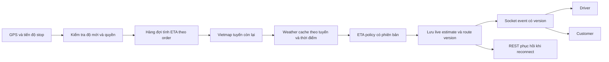

# LEOPARD — Kiểm tra tuyến đường, ETA theo thời tiết và giảm chạy rỗng

Ngày đánh giá: **14/09/2026**. Trạng thái: **Báo cáo kiểm tra và đề xuất; chưa triển khai các thay đổi**.

Phạm vi bằng chứng: working tree hiện tại trên nhánh `feature/mobile-ui-refactor`, gồm cả thay đổi chưa commit; tài liệu chính thức được truy cập trong ngày đánh giá. Không gọi API có tính phí bằng credential của dự án, không thay đổi cấu hình, không kiểm tra chuyến thực địa hay xác nhận trạng thái production.

## 1. Kết luận và quyết định đề xuất

**Có thể kết hợp Vietmap với OpenWeather để tính ETA có xét thời tiết.** Tuy nhiên, độ đúng của tính năng phụ thuộc cả dữ liệu xe, tuyến đã chọn, vị trí hiện tại, tiến độ từng chặng, thời gian phục vụ và cách hiệu chỉnh sai số. Thêm API thời tiết đơn thuần chưa tạo ra dự báo lộ trình đáng tin cậy.

Ba kết luận chính:

1. **Vietmap đã được tích hợp thật ở backend, nhưng chưa đúng đầy đủ theo hợp đồng và nghiệp vụ.** Có sai lệch trọng lượng xe tải, thiếu thời điểm xuất phát theo chặng, và tuyến hiển thị/dẫn đường trên Driver chưa đồng nhất với tuyến backend.
2. **ETA có thời tiết chưa tồn tại trong code.** Nên xây dịch vụ ETA riêng ở backend, dùng Vietmap làm thời gian di chuyển nền và thời tiết làm dữ liệu bổ sung có nguồn, độ mới và phiên bản chính sách. Bắt đầu bằng cảnh báo và chạy đánh giá song song trước khi điều chỉnh ETA cho người dùng.
3. **Giảm chạy rỗng cần cải thiện dispatch, không chỉ routing.** Hệ thống đã có tìm tài xế gần, ping vị trí khi rảnh và phát offer; chưa có xếp hạng theo thời gian đường bộ, quản lý vòng offer bền vững, phân bổ công bằng theo thời gian chờ hay đo km rỗng toàn ca.

Không thể cam kết mọi tài xế luôn có hàng hoặc không chờ quá một số phút nếu cung vượt cầu. Cam kết hợp lý là: không bỏ sót tài xế đủ điều kiện do lỗi kỹ thuật; hạn chế km tới pickup; theo dõi thời gian chờ; minh bạch khi khu vực ít đơn; đo hiệu quả bằng dữ liệu thật.

**Hướng triển khai ưu tiên:** sửa nền dữ liệu và hợp đồng Vietmap → đồng bộ tuyến/ETA Driver → dispatch theo thời gian tới pickup → thời tiết và hiệu chỉnh ETA → gợi ý chuyến tiếp theo/khu vực chờ dựa trên số liệu.

## 2. Ranh giới nghiệp vụ

[SRS FR-03/FR-05/FR-06](D:/leopard/docs/requirements/01-srs.md) yêu cầu một đơn active cho mỗi Driver, tracking có phân quyền và ETA từ provider. [Danh mục ngoài phạm vi](D:/leopard/docs/product/05-out-of-scope.md) loại trừ VRP nhiều đơn phức tạp và dự báo giao thông AI độc quyền.

| Nhóm công việc | Cách xử lý trong pilot |
|---|---|
| Sửa trọng lượng, token, loại xe, tọa độ, nhãn demo, trạng thái ETA | Sửa lỗi của luồng hiện hữu |
| Xếp hạng tài xế theo thời gian đường bộ, retry dispatch, quan sát thời gian chờ | Cải thiện single-order dispatch; cần chốt acceptance criteria |
| Thời tiết ảnh hưởng ETA, thời gian phục vụ từng stop, KPI km rỗng | Bổ sung yêu cầu và thiết kế trước khi triển khai |
| Gợi ý đơn mới sau khi giao xong | Có thể giữ nguyên invariant một đơn active |
| Đặt trước chuyến kế tiếp khi đang BUSY, ghép hàng nhiều đơn, tự tối ưu thứ tự giao | Change Request riêng; chưa đưa vào triển khai mặc định |

Phân biệt ba khái niệm: **routing** chọn đường cho một hành trình; **dispatch** chọn tài xế cho một đơn; **chuyến nối tiếp** chọn công việc tiếp sau. Không gộp tất cả dưới một nhãn “AI ghép tuyến”.

## 3. Hệ thống hiện đang chạy như thế nào

### 3.1. Tuyến và ETA

- `POST /orders/estimate` chỉ dành cho Customer. Backend gọi `VietmapProvider`, nhận các tuyến, sắp xếp theo `durationS`, giới hạn ba tuyến và đánh dấu tuyến đầu là đề xuất.
- `durationS` lấy từ thời gian provider; `estimatedArrivalAt` tính bằng thời điểm phản hồi cộng thời lượng. Demo dùng Haversine × 1,25, tốc độ 30 km/h và 5 phút/stop, không dùng dữ liệu thời tiết.
- Mỗi tuyến có token HMAC, hạn mặc định 10 phút. Tạo đơn đối chiếu token rồi lưu khoảng cách, thời lượng, giá và route snapshot.
- GPS gửi vào tracking được lưu/phát qua socket; chưa có bước tính lại ETA từ điểm mới.
- Driver lấy thời lượng từ order. Nút dẫn đường mở Google Maps đến pickup hoặc dropoff; bản đồ trong app có cơ chế lấy tuyến riêng.

Bằng chứng: [MapsService](D:/leopard/apps/api/src/maps/maps.service.ts:62), [VietmapProvider](D:/leopard/apps/api/src/maps/providers/vietmap.provider.ts:141), [demo](D:/leopard/apps/api/src/maps/domain/demo-route-estimator.ts:17), [token](D:/leopard/apps/api/src/maps/domain/estimate-token.service.ts:78), [TrackingService](D:/leopard/apps/api/src/tracking/tracking.service.ts:19).

### 3.2. Tìm và ghép tài xế

- Dispatch mặc định lấy tối đa **6 Driver trong bán kính 3 km**.
- Truy vấn lọc `AVAILABLE`, loại xe và vị trí được cập nhật trong **90 giây**, rồi xếp theo `ST_Distance` dạng geography. Đây là khoảng cách địa lý, không phải quãng đường lái xe.
- Khi tạo đơn, gateway phát offer đồng thời cho các ứng viên với `timeoutSeconds=25`. Không phải lần lượt giao cho tài xế có ETA tới pickup tốt nhất.
- Driver rảnh đã có ping foreground: kiểm tra mỗi 12 giây, gửi khi di chuyển ít nhất 25 m hoặc heartbeat sau 45 giây. Cơ chế ping đặt ở root layout nên tồn tại qua chuyển màn hình.
- Listener offer lại gắn theo màn hình Orders. Từ chối offer hiện chỉ xóa state client. Sự kiện tạo đơn nằm trong bộ nhớ process; chưa có bản ghi vòng dispatch/offer để phát lại sau restart.
- Accept có transaction cập nhật Driver `AVAILABLE → BUSY` và order `REQUESTED → ACCEPTED`, đồng thời kiểm tra loại xe. Khi giao xong, trả về `AVAILABLE` hoặc `OFFLINE` theo tùy chọn nghỉ.

Bằng chứng: [DispatchService](D:/leopard/apps/api/src/dispatch/dispatch.service.ts:6), [truy vấn ứng viên](D:/leopard/apps/api/src/drivers/drivers.repository.ts:211), [gateway](D:/leopard/apps/api/src/dispatch/dispatch.gateway.ts:46), [idle ping](D:/leopard/apps/driver/src/features/orders/idle-location-ping.ts:35), [listener theo màn hình](D:/leopard/apps/driver/src/features/orders/useDispatchOffer.ts:11), [publisher](D:/leopard/apps/api/src/orders/order-events.publisher.ts:31), [accept](D:/leopard/apps/api/src/orders/accept-order.service.ts:80), [hoàn tất](D:/leopard/apps/api/src/orders/update-order-status.service.ts:100).

## 4. Danh sách thiếu sót và mức ưu tiên

`P1`: cần xử lý trước khi nghiệm thu chức năng vận hành tương ứng. `P2`: cải thiện độ tin cậy/hiệu quả. `Mở rộng`: chưa có trong yêu cầu đã duyệt, không tự coi là bug.

| ID | Mức | Phát hiện và tác động | Đề xuất |
|---|---|---|---|
| R01 | P1 | `capacity` lấy từ `cargoWeightKg`; không biểu diễn đúng trọng lượng xe theo hợp đồng Route v4. Có thể chọn đường không phù hợp xe tải. | Tách trọng lượng hàng, tải trọng cho phép, trọng lượng bản thân và tổng trọng lượng vận hành; lấy dữ liệu xe đã xác minh. |
| R02 | P1 | Tạo đơn bỏ `cargoWeightKg` khỏi `requestedInput`, nhưng token lại đối chiếu trường này. Token estimate có trọng lượng sẽ không khớp. | Chuẩn hóa cùng một input ở estimate/create; regression test xuyên suốt xe tải. |
| R03 | P1 | Tạo đơn không truyền `vehicleType` xuống repository; repository mặc định MOTORBIKE. Loại xe trong offer event và DB có thể khác nhau. | Persist loại xe và cargo fields đồng nhất; kiểm tra cả refresh, load-board và accept. |
| R04 | P1 | Driver không nhận/vẽ trực tiếp tuyến đã chọn. `MissionMapCanvas` truyền label, bản đồ tự gọi tuyến `vehicle=car` hoặc OSRM. | Backend sở hữu tuyến; client nhận geometry/coords/vehicleProfile đã chuẩn hóa. Không để tuyến ô tô thay cho tuyến xe tải. |
| R05 | P1 | ETA hiện là thời lượng snapshot; adapter ưu tiên `durationSeconds` trước `etaSeconds`. Không phản ánh quãng đường còn lại. | Tách quote duration và live remaining ETA; thêm phiên bản, tuổi dữ liệu và trạng thái stale. |
| R06 | P1 | Điểm dừng giữa mất tọa độ trong Driver adapter; chỉ hướng pickup/final dropoff. | Giữ stop IDs/sequence/coords và tiến độ stop; điều hướng đến next actionable stop. |
| R07 | P1 | Driver formatter bỏ qua source; dữ liệu thiếu thành “1 phút”. Offer cũng không truyền đủ provenance. | Thiếu thì hiển thị chưa có ETA; demo ghi rõ; truyền source/calculatedAt cho card/modal/detail. |
| R08 | P1 | GPS chuyến nằm trong detail runtime và chỉ bật `PICKING_UP/IN_TRANSIT`; rời màn hình có cleanup. | Đưa trip tracking lên vòng đời chuyến; chốt tracking từ ACCEPTED; kiểm tra background/khóa máy trên thiết bị thật. |
| D01 | P1 | Dispatch dùng khoảng cách địa lý; tài xế gần bên kia sông/cầu có thể tới pickup lâu hơn. | Lọc địa lý trước, xếp hạng lại bằng thời gian đường bộ có hướng. |
| D02 | P1 | Offer phát một lượt, TTL chỉ nằm trong payload; chưa có vòng retry, persistence, ack/decline/expire phía server. | DispatchAttempt/DispatchOffer, expiry tuyệt đối, outbox và phát vòng tiếp theo có giới hạn. |
| D03 | P1 | Ping rảnh tồn tại toàn app nhưng offer listener chỉ theo Orders; Driver có thể còn trong radar mà không nhận được offer khi màn hình đó unmount. | Listener tại phiên Driver đủ điều kiện; có REST reconcile khi reconnect. |
| D04 | P2 | Radar dựa trên availability/location/vehicle; chưa lọc đầy đủ account status ngay trong candidate query, sức chở, khả năng nhận thông báo. | Dùng eligibility dùng chung cho shortlist và accept; xác minh lại trong transaction. |
| D05 | P2 | Chưa có thời điểm bắt đầu chờ đủ điều kiện, lịch sử vòng offer hay điểm ưu tiên công bằng. | Lưu availableSince, outcomes và reason codes; ưu tiên chờ lâu trong giới hạn pickup SLA. |
| D06 | P2 | Vị trí rảnh chỉ lưu last point/time; chưa có lịch sử đầy đủ để tính km chạy rỗng toàn ca. | Driver work session và segment telemetry tối thiểu, tách dữ liệu không quan sát được. |
| E01 | Mở rộng | Chưa có WeatherProvider, weather snapshot, ETA policy/calibration hay event cập nhật ETA. | Thực hiện thiết kế ở mục 6–7 sau khi sửa nền. |
| E02 | Mở rộng | Chưa có gợi ý chuyến tiếp, khu vực chờ theo cung/cầu và chi phí chuyển vùng. | Thực hiện từng bước ở mục 8; chưa làm VRP nhiều đơn. |

Bằng chứng bổ sung: R01 [capacity mapping](D:/leopard/apps/api/src/maps/providers/vietmap.provider.ts:189); R02–R03 [OrdersService](D:/leopard/apps/api/src/orders/orders.service.ts:41), [persist](D:/leopard/apps/api/src/orders/orders.service.ts:122), [repository default](D:/leopard/apps/api/src/orders/orders.repository.ts:52); R04 [MissionMapCanvas](D:/leopard/apps/driver/src/features/orders/components/detail/MissionMapCanvas.tsx:46), [client routing](D:/leopard/packages/mobile-core/src/ui/RealInteractiveMap.tsx:425); R05–R07 [adapter](D:/leopard/apps/driver/src/features/orders/adapter.ts:124), [route mapping](D:/leopard/apps/driver/src/features/orders/adapter.ts:369); R08 [runtime](D:/leopard/apps/driver/src/features/orders/DriverOrderDetailRuntime.tsx:103), [eligible status](D:/leopard/apps/driver/src/features/orders/tracking-sender.ts:103); D06 [DriverProfile](D:/leopard/apps/api/prisma/schema.prisma:175).

Các phát hiện về “chưa có” giới hạn trong các module/schema/execution path đã kiểm tra. Không suy ra rằng một dịch vụ ngoài repository chắc chắn không tồn tại.

## 5. Gợi ý tuyến đã lấy chuẩn Vietmap chưa?

### 5.1. Đối chiếu hợp đồng công khai

| Hạng mục Route v4 | Hợp đồng | Code LEOPARD |
|---|---|---|
| Endpoint và tọa độ | `/api/route/v4`, `point=lat,lng` | Đúng |
| Thời gian/khoảng cách | Millisecond / meter | Đổi sang giây đúng |
| Tuyến thay thế | `alternative=true` | Có |
| Geometry | Polyline precision 5 | Backend giữ chuỗi |
| Truck capacity | Tổng trọng lượng xe, kg | Đang gửi trọng lượng hàng |
| Xuất phát/hướng xe | Có `time`, `heading` | Chưa truyền |
| Ùn tắc | Metadata theo đoạn; hơn hai điểm có thể thiếu chính xác | Gộp thành mức tệ nhất |
| Thứ tự stop | `optimize` chưa hỗ trợ | Chưa tối ưu thứ tự |

Nguồn: [Vietmap Route v4 — parameters và response](https://maps.vietmap.vn/docs/map-api/route-version/route-v4/).

Vì vậy, **đúng endpoint và đơn vị cơ bản, chưa đủ để kết luận tích hợp chuẩn toàn bộ**. Việc lấy tuyến nhanh nhất trong các path trả về là chính sách của LEOPARD; không chứng minh đó là tuyến tốt nhất theo thời tiết, chi phí hay điều kiện vận tải cụ thể.

### 5.2. Điều chỉnh cần thiết

- R01 phải sửa cùng mô hình xe. Ví dụ giả định xe không tải 2.000 kg và hàng 1.000 kg: chỉ gửi giá trị hàng 1.000 kg là thiếu phần xe. Cần thống nhất cách xác định tổng trọng lượng vận hành và kiểm tra với hồ sơ xe; không tự suy ra từ tên “xe tải 1 tấn”.
- Trước khi có Driver cụ thể, quote dùng cấu hình hạng xe đã được quản trị. Khi assign, kiểm tra lại xe thật có đi được tuyến đó. Nếu cần đổi tuyến làm thay đổi chi phí, phải áp dụng chính sách báo giá được duyệt; không tự tăng tiền sau nhận đơn.
- Với nhiều stop, giữ đúng thứ tự đã thỏa thuận. Khi cần mức ùn tắc/ETA chi tiết, tính từng chặng hai điểm với thời điểm xuất phát nối tiếp và thời gian phục vụ. Đây là thiết kế đề xuất; phải kiểm tra việc nối geometry không làm đổi route ngoài ý muốn.
- Không dùng mức ùn tắc tệ nhất để nhân hệ số lên toàn tuyến: một đoạn ngắn tắc nặng không tương đương toàn bộ đường đều tắc.
- Hợp đồng công khai còn có chỗ mô tả khác nhau về mảng tọa độ khi tắt encoding và hình dạng annotation. Giữ encoded polyline ở boundary hiện tại, bổ sung fixture từ response thật đã khử dữ liệu nhạy cảm và xác nhận schema với provider. [Routing integration guide](https://maps.vietmap.vn/docs/assets/agents/routing.txt)

### 5.3. Matrix cho dispatch

Matrix v4 trả thời gian **giây** hoặc khoảng cách **mét** giữa các cặp origin–destination; không trả geometry. Nó dùng engine v4; cần chọn đúng `sources`, `destinations`, `vehicle` và `annotation`. [Vietmap Matrix v4](https://maps.vietmap.vn/docs/map-api/matrix-version/matrix-v4/)

Đề xuất dùng N Driver → một pickup, không đảo thành pickup → N Driver. Nếu cần cả thời gian và khoảng cách, xác minh chế độ trả về và chi phí theo tài khoản; không giả định một request luôn cung cấp mọi trường.

Tài liệu Matrix đã đọc chưa đủ để khẳng định hỗ trợ tất cả ràng buộc trọng lượng và thời điểm như Route. Với truck, cần xác minh capability; nếu thiếu, dùng Route cho shortlist nhỏ để kiểm tra tính khả thi trước offer. Không giả định Matrix “cùng engine” đồng nghĩa cùng toàn bộ tham số.

### 5.4. Những điểm cần xác minh với Vietmap trước nghiệm thu

- `time` ảnh hưởng dự báo traffic ra sao; horizon, độ mới, vùng phủ và độ trễ dữ liệu tại địa bàn pilot.
- Thời gian trả về có bao hàm tác động thời tiết hay chỉ phản ánh tốc độ giao thông quan sát/mô hình; không tự khẳng định đã hoặc chưa có.
- Quy tắc xe tải: tổng trọng lượng thực tế/đăng kiểm cần dùng thế nào, giới hạn giờ, chiều cao/rộng, tải trục; trường nào API có hỗ trợ, trường nào hệ thống phải kiểm tra bổ sung.
- Multi-stop: annotation, alternatives, tính liên tục giữa các leg và sai số snapping.
- Định dạng chính xác của annotation, handling `ZERO_RESULTS`, `OVER_DAILY_LIMIT`, số điểm tối đa và quota/cách tính phí.
- Quyền hiển thị/cache dữ liệu, attribution và quyền dùng routing key. Không dùng key server trong client routing; tài liệu tích hợp khuyến nghị gọi API từ backend. [Hướng dẫn tích hợp](https://maps.vietmap.vn/docs/assets/agents/routing.txt)

## 6. Tích hợp thời tiết: chọn nguồn và cách tính

### 6.1. So sánh lựa chọn

| Nguồn | Dữ kiện đã xác minh | Đánh giá cho LEOPARD |
|---|---|---|
| OpenWeather One Call 4.0 | Có current, dự báo phút/15 phút/giờ và cảnh báo; API dạng các endpoint riêng | Ứng viên ưu tiên để thử nghiệm; không dùng adapter 3.0 nguyên trạng |
| OpenWeather One Call 3.0 | Có current và forecast; tài liệu 3.0 dẫn sang bản 4.0 | Chỉ chọn nếu tài khoản/chi phí hiện hữu phù hợp |
| Open-Meteo | Có mưa, gió, tầm nhìn; dữ liệu 15 phút tại các vùng ngoài Bắc Mỹ/Trung Âu được nội suy từ giờ | Nguồn đối chứng tốt; không quảng bá là radar mưa 15 phút riêng cho Việt Nam |
| OpenWeather Road Risk | Dữ liệu thời tiết dọc tuyến; các trường mặt đường có giới hạn vùng phủ US/EU trong tài liệu đã đọc | Chỉ đánh giá thêm khi có báo giá và bằng chứng vùng phủ Việt Nam |

Nguồn: [One Call 4.0](https://openweathermap.org/api/one-call-4), [công bố 4.0](https://openweather.co.uk/blog/post/one-call-api-40-now-live), [One Call 3.0](https://openweathermap.org/api/one-call-3), [Open-Meteo forecast](https://open-meteo.com/en/docs), [Road Risk](https://openweather.co.uk/blog/post/safety-every-turn-newly-expanded-road-risk-api-openweather).

OpenWeather 4.0 có pagination, mỗi trang tính một call; tài liệu nêu cập nhật mỗi 10 phút. Các trường dùng cho adapter gồm thời điểm dự báo, lượng mưa, xác suất mưa, gió và tầm nhìn; chuẩn hóa đơn vị tại boundary. [Hợp đồng One Call 4.0](https://openweathermap.org/api/one-call-4)

Open-Meteo phân biệt API miễn phí phi thương mại và endpoint trả phí cho sử dụng thương mại, đồng thời yêu cầu attribution dữ liệu. Không mặc định pilot có khách thật được dùng free tier. [Điều kiện dịch vụ API](https://open-meteo.com/en/pricing)

**Đề xuất:** tạo `WeatherProvider` độc lập; thử OpenWeather 4.0 và Open-Meteo trên cùng các tọa độ/thời điểm pilot. Chọn theo tỷ lệ có dữ liệu, độ mới, chất lượng mưa tại địa phương, latency và chi phí thực tế. Không kết luận OpenWeather chính xác hơn chỉ từ tên hoặc độ phân giải quảng cáo.

### 6.2. Mô hình ETA đề xuất

Đây là thiết kế của LEOPARD, chưa phải chức năng hiện hữu hay công thức được provider bảo đảm.

```text
Trước khi có tài xế:
  hiển thị thời lượng vận chuyển từ pickup; thời gian tìm xe là phần riêng

Đã nhận đơn, chưa lấy hàng:
  ETA tới pickup = now + thời gian từ GPS Driver tới pickup
  ETA hoàn tất = ETA tới pickup + phục vụ pickup
                 + tổng(thời gian các chặng còn lại + phục vụ các stop còn lại)

Đang vận chuyển:
  ETA stop tiếp theo = now + thời gian GPS hiện tại tới stop đó
  ETA hoàn tất = now + tổng(thời gian còn lại + phục vụ còn lại)

Thời gian chặng = thời gian Vietmap theo xe/thời điểm
                 + phần hiệu chỉnh đã được đánh giá trên dữ liệu pilot
```

Quy trình thời tiết cho mỗi tuyến ứng viên:

1. Decode geometry, chọn điểm mẫu dọc tuyến theo độ dài/thời gian và các vùng thời tiết; dùng chung cache cho các tuyến gần nhau.
2. Ước tính thời điểm xe tới mỗi điểm, rồi chọn forecast có thời gian hiệu lực phù hợp. Không lấy thời tiết hiện tại ở pickup áp cho toàn chuyến dài.
3. Giữ riêng thời điểm tải dữ liệu, thời điểm forecast có hiệu lực và thời điểm nguồn phát hành nếu có. Không dùng `fetchedAt` thay cho độ mới thực của forecast.
4. Chuẩn hóa cường độ mưa, gió, tầm nhìn và missing data. `pop` là xác suất, không phải lượng mưa. Không coi null/timeout là trời quang.
5. Trước tiên hiển thị cảnh báo và lưu estimate thử nghiệm ở chế độ shadow; chưa thay ETA khách nhìn thấy.
6. Khi có dữ liệu, hiệu chỉnh **phần sai số còn lại** giữa thời gian thực tế và Vietmap theo loại xe/khung giờ/địa bàn/thời tiết. Không cộng cố định 20% vào mọi tuyến mưa; có thể cộng trùng tác động traffic.
7. Khi sửa ETA làm đổi thời điểm tới các điểm mẫu đáng kể, cập nhật sampling hữu hạn; không lặp gọi API vô hạn để “hội tụ”.

Mưa, gió và tầm nhìn thực sự ảnh hưởng lưu thông, nhưng mức tác động phụ thuộc điều kiện đường và bối cảnh. Không chuyển các hệ số thống kê của Hoa Kỳ thành hệ số mặc định cho TP.HCM. [FHWA — weather effects on roads](https://ops.fhwa.dot.gov/weather/roadimpact.htm)

**Phân biệt rủi ro và thời lượng:** dự báo mưa không chứng minh một đường đã ngập hay bị cấm. Đường đóng/ngập cần nguồn có thẩm quyền hoặc quy trình xác minh incident. Khi không có tuyến khả thi, trả về không thể lập tuyến/đề nghị điều phối xử lý; không chỉ cộng thêm phút rồi cho đi.

### 6.3. Chọn tuyến và biểu diễn độ không chắc chắn

- Loại tuyến không hợp lệ với xe/điểm bắt buộc trước, rồi mới xếp hạng.
- Pilot ưu tiên thời gian hoàn tất dự kiến, sau đó khoảng cách/chi phí đã thống nhất. Không cần tạo điểm số “AI” khó giải thích.
- Có thể hiển thị “Tuyến dự kiến nhanh nhất”, “Ít km hơn”, “Có cảnh báo mưa” nếu từng nhãn có dữ liệu hỗ trợ. Chưa đủ dữ liệu thì không ghi “Tuyến an toàn nhất”.
- Khoảng ETA phải có phương pháp hiệu chỉnh. Khi chưa có tập kiểm định, gọi là khoảng dự phòng theo chính sách thử nghiệm; không gắn “P90” hay “90% chính xác”.
- Khi đã đủ mẫu, kiểm định sai số và độ bao phủ khoảng theo xe/mưa/giờ cao điểm. Chỉ triển khai điều chỉnh thời tiết nếu tốt hơn baseline trong tập holdout và không làm xấu nghiêm trọng nhóm khác.

### 6.4. Chi phí và fallback

Các số dưới đây là **giả định thiết kế để ước lượng**, không phải quota hay SLA đã mua:

- Cache thời tiết theo ô không gian và khoảng thời gian; điểm bắt đầu thử là TTL 10 phút, sau đó điều chỉnh theo cadence/độ mới nguồn.
- Giả sử 20 ô hoạt động, theo dõi 12 giờ/ngày, mỗi ô refresh 10 phút: `20 × 72 = 1.440` lần refresh ô/ngày cho một endpoint/một trang. Alert detail, pagination, retries và endpoint khác sẽ làm tăng số call.
- Không gọi thời tiết mỗi GPS point. Giới hạn concurrency, timeout, retries, daily budget và circuit breaker; log số call/route/driver-hour.
- Weather lỗi: giữ Vietmap ETA còn hợp lệ và ghi “Chưa có dữ liệu thời tiết”; không ngầm thay bằng thời tiết giả.
- Route lỗi: giữ route gần nhất nếu còn dùng được và hiển thị tuổi dữ liệu; không tạo tuyến mới bằng đường thẳng rồi gắn nhãn Vietmap.
- Demo chỉ cho phép theo chính sách môi trường và phải truyền nguồn xuyên suốt API/socket/UI. File `.env` gốc và `apps/api/.env` hiện khác cờ fallback; cần thống nhất deployment source trước nghiệm thu.

## 7. Luồng thời gian thực cần bổ sung



Các quy tắc đề xuất:

- Tách `quotedRoute` bất biến cho giao dịch khỏi `activeRoute/liveEta` thay đổi khi chạy. Giữ routeId/hash, policyVersion và vehicle profile; việc reroute không tự đổi giá đã chốt.
- Tính lại khi accept, bắt đầu chặng, hoàn tất stop, lệch tuyến, có biến động đáng kể hoặc TTL hết. Thử nghiệm ban đầu có thể debounce 30–60 giây và dùng GPS mới nhất; các ngưỡng phải cấu hình và đo trên pilot.
- Chỉ một job ETA đang hiệu lực cho mỗi order; response về trễ không được ghi đè version mới. Job phải kiểm tra lại trạng thái khi commit, không phát ETA mới sau terminal.
- Không dùng một dấu chấm GPS để kết luận lệch tuyến: xét accuracy, độ tuổi, hướng và nhiều điểm liên tiếp; chốt ngưỡng dựa trên dữ liệu thực tế.
- Driver/Customer/Admin/Fleet chỉ nhận phạm vi được phép. ETA endpoint cho Driver phải kiểm tra assignment; không mở rộng vô điều kiện endpoint estimate dành cho Customer.
- Tracking khi app chuyển background/khóa máy cần đánh giá riêng Expo native và PWA. Foreground timer hiện tại không chứng minh hoạt động liên tục khi OS đình chỉ ứng dụng.
- Socket phải có eventId, orderId, estimateVersion, calculatedAt và validUntil. Reconnect đọc REST snapshot rồi tiếp nhận version mới; bỏ bản trùng và bản cũ.
- `RETURNING` và các trạng thái sự cố phải có bảng target/ETA riêng. Không mặc định mọi trạng thái sau pickup đều đi final dropoff; không tự xác nhận giao stop chỉ vì GPS gần đó.
- UI dùng “ETA dự kiến tới điểm lấy hàng/điểm tiếp theo/hoàn tất”, “Cập nhật ...”, nguồn mô phỏng và trạng thái chưa có dữ liệu. Không thay đổi nghĩa của một con số giữa các màn hình.

## 8. Giảm chạy rỗng và thời gian chờ đơn

### 8.1. Đo đúng vấn đề trước

| Đại lượng | Định nghĩa đề xuất |
|---|---|
| Idle waiting | Thời gian online, đủ điều kiện nhận đơn, chưa được assign; tách đang đứng và đang di chuyển |
| Empty pickup km | Quãng đường không hàng từ lúc nhận đơn đến lúc nhận hàng |
| Empty reposition km | Quãng đường không hàng đi tìm đơn/chuyển khu vực trong ca |
| Loaded km | Quãng đường có hàng thực tế; ghi rõ proxy nếu chỉ suy ra từ lifecycle |
| Return km | Chặng hoàn/đưa hàng về; có thể vẫn có hàng, không tự phân loại là rỗng |
| Unknown km/time | Khoảng thiếu GPS, mất quyền hoặc app bị dừng; không tự tính bằng 0 |

`empty_distance_ratio = observed_empty_km / (observed_empty_km + observed_loaded_km)`.

Phải công bố kèm tỷ lệ bao phủ telemetry; số km không biết không được bỏ âm thầm để làm đẹp KPI. Phiên offline/nghỉ có chủ ý không đưa vào idle đủ điều kiện. Cuối ca còn chờ chưa nhận đơn phải được ghi nhận, không chỉ thống kê những người đã thành công nhận chuyến tiếp.

### 8.2. Dispatch hai bước cho pilot

**Bước A — eligibility và shortlist rẻ bằng PostGIS:** Driver ACTIVE, AVAILABLE, không có đơn active/return đang chiếm xe, loại xe và sức chở phù hợp, vị trí mới/đủ chất lượng, đang có kênh nhận offer hoặc cơ chế thông báo phù hợp. Dùng tọa độ đúng chiều, radius cấu hình và giới hạn ứng viên.

**Bước B — xếp hạng bằng thời gian đường bộ:** gọi Matrix/Route cho shortlist; tính thời gian Driver → pickup, km rỗng và chi phí liên quan. Giữ các ứng viên trong pickup SLA; trong nhóm chênh lệch nhỏ, ưu tiên người chờ lâu hơn và chưa bị bỏ qua nhiều vòng.

Không cộng trực tiếp số phút, số km và số lần từ chối vào một score không đơn vị. Dùng xếp thứ tự có ràng buộc hoặc quy đổi trọng số có giải thích; lưu reason codes và phiên bản thuật toán. Không để ưu tiên chờ lâu khiến một đơn bị giao cho xe ở quá xa.

Ví dụ giả định: A cách pickup 1,2 km đường chim bay nhưng cần 14 phút qua cầu; B cách 2 km nhưng chỉ cần 6 phút theo đường hợp lệ. A đứng đầu truy vấn hiện tại; B nên đứng đầu tiêu chí tới pickup. Đây là tình huống minh họa, không phải số liệu pilot.

Việc dùng thời gian đường bộ thay khoảng cách gần nhất phù hợp với bài học matching công bố của Uber. Batching có thể giúp tối ưu nhiều cặp, nhưng không cần bắt đầu bằng hệ thống ML quy mô lớn. [Uber — matching](https://www.uber.com/ae/en/marketplace/matching/)

### 8.3. Vòng offer bền vững

Đề xuất `DispatchAttempt` và `DispatchOffer` với `offerId`, Driver/order, vòng, `expiresAt`, `PENDING/ACCEPTED/DECLINED/EXPIRED/REVOKED`, thời điểm gửi/nhận và lý do.

1. Commit order + outbox event trong cùng transaction; worker có thể chạy lại an toàn.
2. Chọn một hoặc nhóm nhỏ ứng viên, gửi offer; không coi socket emit là tài xế đã nhận thông báo.
3. Theo dõi ack/decline/timeout. Hết vòng thì chọn ứng viên chưa thử hoặc mở radius trong giới hạn pickup SLA.
4. Accept kiểm tra TTL/quyền/order/Driver/xe lần nữa trong transaction; chỉ một bên thắng. Thu hồi offer ở các máy khác.
5. Hết ngân sách vòng mà không có ứng viên: thông báo “Chưa tìm được tài xế phù hợp”, giữ đường phục hồi hợp lý; không để spinner vô hạn.
6. Khi Driver online hoặc vừa hoàn tất chuyến, xem lại backlog phù hợp, không chỉ chờ một sự kiện tạo đơn mới.
7. Giữ rõ khác biệt giữa nhận qua load-board và nhận một offer có TTL; tránh làm hỏng luồng nhận đơn công khai hợp lệ khi thêm offerId.

Các giới hạn vòng/radius/TTL là cấu hình phải nghiệm thu; 3 km/6 người/25 giây hiện tại không được coi là cấu hình tối ưu đã được chứng minh.

### 8.4. Hỗ trợ chuyến kế tiếp và chuyến về

Giai đoạn đầu: ngay sau `DELIVERED` và xác nhận Driver tiếp tục AVAILABLE, xếp các đơn thật đang REQUESTED gần vị trí hiện tại, phù hợp xe. Hiển thị km tới pickup, thời gian dự kiến, điểm giao, doanh thu và các chi phí đã biết. Không hứa có “hàng chiều về” khi chưa có đơn.

Tùy chọn hướng về nhà/kho có thể dùng độ lệch so với hướng Driver mong muốn, nhưng Driver phải tự chọn và biết rằng nó thu hẹp số đơn phù hợp. Không tiết lộ vị trí nhà/kho cho Customer.

Nếu muốn xem trước công việc khi sắp giao xong, chỉ là gợi ý không giữ đơn ở giai đoạn đầu. Giữ chỗ/accept trước khi hoàn tất cần state reservation, expiry, xử lý chuyến trước trễ và Change Request; không phá invariant một đơn active.

Nghiên cứu marketplace cho thấy cần xét cả nơi tài xế kết thúc chuyến và các khoảng không được sử dụng, thay vì chỉ học từ chuyến thành công. Đây là định hướng dài hạn, không phải lý do triển khai reinforcement learning ngay cho pilot. [Uber — marketplace balance](https://www.uber.com/us/en/blog/reinforcement-learning-for-modeling-marketplace-balance/)

### 8.5. Gợi ý đứng chờ hay chuyển vùng

Chỉ làm sau khi có dữ liệu cung/cầu theo khu vực và khung giờ. Khởi đầu bằng số đơn chưa phục vụ, tốc độ phát sinh đơn, Driver rảnh và phân vị thời gian chờ quan sát được; dữ liệu ít thì ghi “Chưa đủ dữ liệu”.

Đánh giá chuyển vùng bằng lợi ích dự kiến trừ chi phí km rỗng, thời gian đi và rủi ro mất cơ hội ở vị trí cũ. “Ở lại” phải là một lựa chọn hợp lệ. Giới hạn số tài xế được gợi ý tới cùng vùng, thêm cooldown và đánh giá sau khi tới; tránh đẩy cả đội xe tới một điểm nóng đã hết nhu cầu.

Tham khảo Uber tách Estimated Time to Request khỏi Earnings per Hour để hỗ trợ quyết định chờ/chuyển vùng. Bối cảnh sân bay của họ không thể áp trực tiếp cho logistics pilot. [Uber — driver availability](https://www.uber.com/us/en/blog/forecasting-models-to-improve-availability-at-airports/)

Không dùng doanh thu gộp như lợi nhuận. Nếu chưa biết nhiên liệu, phí đường, hoa hồng và chi phí vận hành, UI chỉ ghi các thành phần đã biết. Không bảo đảm thu nhập hay ép Driver di chuyển để giữ ưu tiên.

## 9. Dữ liệu, API và module cần bổ sung

Tất cả tên dưới đây là **đề xuất**, chưa phải API/schema hiện hữu.

| Thành phần | Dữ liệu/trách nhiệm |
|---|---|
| Vehicle routing profile | Loại xe, trọng lượng bản thân/tổng trọng lượng/tải trọng cho phép, trạng thái xác minh; capability flags theo provider |
| OrderRouteSnapshot | Route hash/version, geometry, thứ tự stop, input đã chuẩn hóa, xe, thời điểm xuất phát, nguồn và thời điểm tính |
| OrderLiveEstimate | Target stop, remaining distance/duration, arrival time, baseline/adjustment, policyVersion, status, validUntil, source ages |
| StopProgress | Thời điểm đến/bắt đầu phục vụ/hoàn tất; actor; phục vụ dự kiến và thực tế |
| WeatherSnapshot | Ô/điểm mẫu, valid time, fetchedAt, issuedAt nếu có, nguồn, độ phân giải, giá trị chuẩn hóa và trạng thái thiếu |
| DriverWorkSession/segments | Online/offline, eligible waiting, moving empty/loaded/return/unknown, GPS coverage |
| DispatchAttempt/Offer | Candidate set, thời gian đường bộ, nguyên nhân xếp hạng, outcome, TTL, idempotency và audit |
| EtaService / WeatherProvider / MatrixProvider | Điều phối gọi provider và cache phía server; không đưa business rule vào app |

API/event tối thiểu: đọc route/live ETA của order; cập nhật tiến độ stop có assignment guard; nhận/decline/reconcile offer; sự kiện `order:eta-updated`, `order:route-updated`, `dispatch:offer-revoked`. Giữ namespace/contract nhất quán với hệ thống và bổ sung OpenAPI/socket docs.

Chỉ thu telemetry trong phiên làm việc được phép; tách dữ liệu Driver rảnh khỏi tracking room của Customer, đặt retention và kiểm soát Fleet membership. Đây là yêu cầu thiết kế tính năng, chưa phải kết luận tuân thủ pháp lý.

Đối với pilot có thể dùng PostgreSQL outbox + worker thay vì thêm nhiều nền tảng. Nếu tăng nhiều API instance, cần transport/shared adapter cho sự kiện và socket rooms; không coi subscriber trong bộ nhớ là event bus phân tán.

## 10. Kế hoạch kiểm chứng và tiêu chí nghiệm thu

### 10.1. Checklist hành vi bắt buộc

| Test | Tình huống | Kết quả cần đạt |
|---|---|---|
| C01 | Estimate/create MOTORBIKE, VAN, TRUCK có trọng lượng | Token khớp; DB/response/event đúng xe và trọng lượng |
| C02 | Client sửa tọa độ, stop, xe, trọng lượng hoặc token hết hạn | Từ chối đúng lỗi; không tạo order |
| C03 | Xe tải với tổng trọng lượng khác trọng lượng hàng | Provider nhận routing profile đúng; không dùng weight hàng thay xe |
| C04 | Vietmap response thực tế: alternative, polyline, annotation, app-level error | Parser đúng schema/đơn vị; invalid/missing không bị diễn giải thành tuyến tốt |
| C05 | 0, 1, 3 stop; thứ tự cố định; tới/qua/hoàn tất stop | Geometry và next target đồng nhất; không bỏ stop |
| C06 | Accept rồi đứng chờ, đi pickup, bốc dỡ, đi giao | Phân biệt ETA pickup và completion; không luôn hiện duration ban đầu |
| C07 | GPS lệch/già/ngoài thứ tự/accuracy xấu; request ETA về trễ | Không reroute sai; không ghi đè estimate mới |
| C08 | Mưa ở đoạn giữa lúc xe sẽ tới; pickup hiện tại không mưa | Sample đúng không gian và thời gian |
| C09 | Weather thiếu/timeout/quota; provider forecast cũ | Giữ baseline hợp lệ, hiện nguồn/thiếu dữ liệu; không mặc định nắng |
| C10 | Traffic đã chậm trong mưa | Kiểm tra không cộng trùng; so baseline với adjustment shadow |
| C11 | Có cảnh báo nhưng chưa có bằng chứng đường đóng | Cảnh báo đúng mức; không tự ghi đường ngập/cấm |
| C12 | Route/weather demo fallback | Nhãn mô phỏng tới mọi card/modal/detail và socket payload |
| C13 | Driver chuyển tab, rời detail, mở Google Maps, khóa máy, mạng yếu | Đo tracking/offer thực trên thiết bị; stale hiển thị trung thực |
| C14 | Cùng pickup, xe gần địa lý nhưng xa theo đường | Ranking theo hướng Driver → pickup, đúng loại xe |
| C15 | Offer hết hạn/decline/offline; worker restart | Có vòng tiếp; không phát offer cũ như mới; reconcile đúng |
| C16 | Hai Driver accept một order, một Driver accept hai order | Chỉ một assignment hợp lệ; transaction rollback nhất quán |
| C17 | Driver vừa giao xong/online, backlog có đơn cũ phù hợp | Có cơ hội nhận đơn; không cần chờ order mới |
| C18 | Driver chờ lâu, Driver mới online, tắt/bật liên tục | Fairness trong SLA; không gian lận tuổi chờ qua reconnect |
| C19 | Xe RETURNING, tài khoản disabled, hồ sơ không phù hợp | Không bị coi là rảnh đủ điều kiện; API vẫn chặn khi gọi trực tiếp |
| C20 | Mất GPS giữa chặng, tạm nghỉ, ca không có đơn | KPI ghi unknown/censored; không xóa khoảng chờ bất lợi |
| C21 | Nhiều Driver cùng nhận gợi ý chuyển vùng | Không dồn quá mức; giữ lựa chọn đứng chờ |
| C22 | Customer/Driver/Fleet sửa orderId/offerId | Không lộ route, vị trí rảnh hoặc quyền của người khác |

### 10.2. Đánh giá chất lượng ETA

Lưu prediction tại thời điểm phát hành và arrival thực theo cùng target, tách travel khỏi service. So sánh ít nhất ba baseline: snapshot cũ, Vietmap được refresh không weather adjustment, và bản có adjustment. Chia theo xe, khu vực, khung giờ, mưa/không mưa và horizon dự báo.

Đo MAE, phân vị sai số tuyệt đối, bias sớm/muộn, tỷ lệ dữ liệu stale và độ bao phủ khoảng dự báo. Không chỉ dùng MAPE vì chặng rất ngắn dễ làm tỷ lệ sai số méo. Lưu forecast như đã biết lúc dự đoán; không lấy quan sát thời tiết sau chuyến để tạo kết quả kiểm định đẹp hơn.

Chốt mục tiêu phút/% sau khi có baseline và đủ dữ liệu từng nhóm. Không thể xác nhận “ETA chính xác 90%” bằng bộ test đơn vị hoặc vài chuyến demo. Mục tiêu chất lượng phải định nghĩa rõ “đúng trong bao nhiêu phút”, tập chuyến nào và tỷ lệ missing.

### 10.3. Đánh giá giảm chạy rỗng

Theo dõi empty km/trip, empty distance ratio, idle P50/P90, thời gian đến pickup, tỷ lệ đơn được nhận, tỷ lệ từ chối/hủy, thu nhập gộp/giờ đủ điều kiện và chi phí API/chuyến. KPI công bằng gồm phân bố thời gian chờ theo Driver, xe và khu vực.

Trước tiên replay dữ liệu và chạy shadow. Sau đó thử theo khu vực/khung thời gian luân phiên có nhóm so sánh, theo dõi cung/cầu và thời tiết; không so ngày mưa ít đơn với ngày nắng nhiều đơn rồi quy mọi chênh lệch cho thuật toán. Đặt guardrail cho hủy đơn, pickup chậm, km chuyển vùng và nhóm Driver chịu thiệt. Tắt chính sách mới nếu guardrail xấu đi.

### 10.4. Test đã chạy trong đợt kiểm tra

| Thời điểm | Bộ test | Kết quả |
|---|---|---|
| Lượt kiểm tra trước cùng ngày | Backend maps: provider, service, token, pricing, Haversine, demo | 6 suites / 38 tests pass |
| Lượt kiểm tra trước cùng ngày | Driver adapter và navigation audit | 2 suites / 58 tests pass |
| Lượt lập báo cáo này | DispatchService | 1 suite / 3 tests pass |
| Lượt lập báo cáo này | Idle location ping, idle audit, dispatch offer listener | 3 suites / 13 tests pass |

**112 tests pass trong các lượt đã nêu; chưa phải toàn bộ regression.** DispatchService tests hiện kiểm tra delegation/config forwarding, không chứng minh tối ưu matching hoặc độ đúng PostGIS trên DB thật. Chưa chạy load test, kiểm định provider live, weather calibration, background E2E hoặc đo km rỗng thực tế. Báo cáo không thay đổi code nên không coi các checklist đề xuất ở trên là đã đạt.

## 11. Lộ trình cải thiện đề xuất

| Giai đoạn | Công việc | Điều kiện ra khỏi giai đoạn |
|---|---|---|
| A — Sửa lỗi nền | R01–R07; thống nhất quote/create/persist/route geometry/source; capability xe | C01–C05, C12 đạt; xác nhận hợp đồng provider và đối chiếu chuyến mẫu |
| B — Vòng vận hành realtime | Tracking theo chuyến, stop progress, live ETA baseline, reconnect/version; listener offer toàn phiên phù hợp | C06–C07, C13, C19, C22 đạt trên thiết bị mục tiêu |
| C — Dispatch giảm km pickup | Eligibility, Matrix/Route shortlist, offer persistence/retry/revoke, fairness có giới hạn; ghi work sessions | C14–C20 đạt; có baseline empty/idle và quan sát chi phí |
| D — Thời tiết | Provider adapter/cache, warnings, sampling theo tuyến/thời điểm; shadow rồi hiệu chỉnh | C08–C11 đạt; holdout chứng minh lợi ích và không cộng trùng |
| E — Giảm chờ sau chuyến | Gợi ý đơn thật gần điểm kết thúc, backlog rematch, khu vực chờ có kiểm soát | C17, C21 đạt; thử nghiệm không tăng km rỗng tổng thể |
| F — Mở rộng sau pilot | Reservation chuyến kế tiếp, backhaul nâng cao hoặc VRP nhiều đơn | Change Request, thiết kế lifecycle/chi phí và dữ liệu đủ chất lượng |

Không ước lượng lịch cố định khi chưa biết nhân lực, quyền API và mức độ cần background native. Mỗi giai đoạn nên tách thành vertical slice có test, cập nhật docs và feature flag/rollback độc lập.

Các tài liệu phải cập nhật khi triển khai: SRS/acceptance criteria; business process; provider design; data design; REST/socket contract; Driver screen specs; tracking design; test strategy/UAT. Báo cáo này không tự thay thế những nguồn đã duyệt.

## 12. Các quyết định cần chốt khi bắt đầu triển khai

1. Địa bàn, loại xe, khung giờ vận hành và KPI ưu tiên của pilot: pickup nhanh, km rỗng hay thời gian chờ.
2. Nguồn hồ sơ tải trọng/tổng trọng lượng xe; chính sách quote trước khi biết xe cụ thể.
3. Nghĩa chính xác của PICKING_UP, phục vụ tại stop, RETURNING và thời điểm hàng thật sự lên/xuống xe.
4. Nguồn thời tiết, ngân sách và điều kiện sử dụng; test coverage thực tế ở Việt Nam, không suy từ ví dụ nước ngoài.
5. Mức hỗ trợ background của Driver app và cách nhận đơn khi không mở Orders; các giới hạn PWA cần ghi rõ.
6. Quy tắc có được gợi ý/giữ chuyến tiếp trước khi giao xong; quyền từ chối, nghỉ ca và chi phí chuyển vùng.
7. Nguồn xác minh đường ngập/đóng và vai trò Admin; không giao toàn bộ quyết định cho mã thời tiết.

## 13. Nguồn tham khảo và giới hạn nghiên cứu

Nguồn bên ngoài dùng trong báo cáo đều là tài liệu nhà cung cấp hoặc đơn vị công bố nghiên cứu của chính mình, truy cập ngày 14/09/2026:

- [Vietmap Route v4](https://maps.vietmap.vn/docs/map-api/route-version/route-v4/) — hợp đồng routing.
- [Vietmap routing integration guide](https://maps.vietmap.vn/docs/assets/agents/routing.txt) — boundary và định dạng tích hợp.
- [Vietmap Matrix v4](https://maps.vietmap.vn/docs/map-api/matrix-version/matrix-v4/) — thời gian/khoảng cách đường bộ theo cặp.
- [OpenWeather One Call 4.0](https://openweathermap.org/api/one-call-4) và [công bố phiên bản](https://openweather.co.uk/blog/post/one-call-api-40-now-live) — khả năng API thời tiết hiện tại.
- [OpenWeather One Call 3.0](https://openweathermap.org/api/one-call-3) — đối chiếu phiên bản.
- [Open-Meteo forecast](https://open-meteo.com/en/docs) và [API usage/pricing](https://open-meteo.com/en/pricing) — dữ liệu và điều kiện dùng endpoint.
- [OpenWeather Road Risk](https://openweather.co.uk/blog/post/safety-every-turn-newly-expanded-road-risk-api-openweather) — lựa chọn thời tiết dọc tuyến, có giới hạn vùng phủ cho dữ liệu mặt đường.
- [FHWA weather effects](https://ops.fhwa.dot.gov/weather/roadimpact.htm) — cơ sở về ảnh hưởng thời tiết; không dùng hệ số nước ngoài làm cấu hình pilot.
- [Uber matching](https://www.uber.com/ae/en/marketplace/matching/), [marketplace balance](https://www.uber.com/us/en/blog/reinforcement-learning-for-modeling-marketplace-balance/), [driver availability](https://www.uber.com/us/en/blog/forecasting-models-to-improve-availability-at-airports/) — bài học điều phối; không suy ra mức cải thiện tương tự cho LEOPARD.

Một số trang OpenWeather render động nên nội dung kỹ thuật được đối chiếu thêm qua bản được máy tìm kiếm lập chỉ mục và bài công bố chính thức. Chưa xác minh entitlement tài khoản, hóa đơn/quota thực tế hoặc độ chính xác dự báo tại địa bàn pilot. Các ngưỡng, schema/API mới, cách tính score và rollout là đề xuất thiết kế, không phải kết quả benchmark đã đạt.
