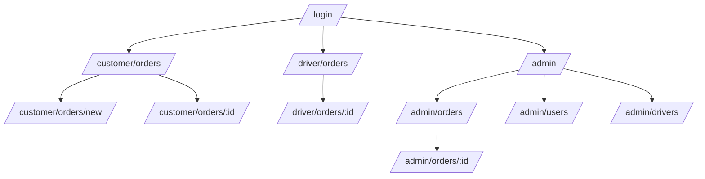

# Navigation map

## Navigation theo role

- Customer: Orders, Create Order, Profile.
- Driver: Available Orders, Active Order, Profile/Availability.
- Admin: Overview, Orders, Users, Drivers.

Sau login, backend profile quyết định route mặc định. Truy cập route sai role hiển thị permission-denied hoặc chuyển về home của role; không để lộ dữ liệu trước khi redirect.

Mobile dùng bottom navigation tối đa 4 mục cho Customer/Driver. Admin dùng sidebar từ 1024 px và drawer ở viewport nhỏ hơn.
