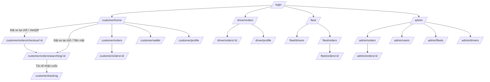

# Navigation map

## Navigation theo role

- Customer: Thanh điều hướng 2026 Liquid Glass nổi (4 tabs):
  - **Trang chủ (`/customer/home`):** Bản đồ điều phối Map-First, đặt xe tại chỗ không chuyển trang, khay chi tiết `BookingDetailsModal`, nổ đơn trực tiếp sang Radar tìm tài xế (`/customer/orders/searching/:id`) hoặc Thanh toán VietQR (`/customer/orders/checkout/:id`).
  - **Đơn hàng (`/customer/orders`):** Quản lý danh sách đơn, lọc theo trạng thái (`Chờ tài xế`, `Đang vận chuyển`, `Đã giao`), xem chi tiết (`/customer/orders/:id`).
  - **Ví (`/customer/wallet`):** Số dư tín dụng, quét mã nạp tiền VietQR payOS, lịch sử giao dịch ví.
  - **Tài khoản (`/customer/profile`):** Thông tin doanh nghiệp/chủ hàng, sổ địa chỉ kho bãi, đăng ký tài xế, cài đặt bảo mật.
- Driver: Thanh điều hướng nổi (4 tabs):
  - **Field Cockpit (`/driver/orders`):** Bản đồ trực chiến, nút gạt On/Off Duty, radar vùng nổ đơn, bảng hàng B2B, modal 15s trượt `SlideToAction`.
  - **Lịch sử (`/driver/history`):** Danh sách các cuốc xe đã hoàn thành, lọc theo ngày.
  - **Thu nhập (`/driver/earnings`):** Thu nhập ròng theo ngày/tuần, ví tài xế, rút tiền ngân hàng tức thì.
  - **Hồ sơ (`/driver/profile`):** Thông tin tài xế, phương tiện, hợp đồng điện tử PDF, cài đặt.
- Fleet Owner: Overview, Drivers, Fleet Orders.
- Admin: Overview, Orders, Users, Fleets, Drivers.

Sau login, backend profile quyết định route mặc định. Truy cập route sai role hiển thị permission-denied hoặc chuyển về home của role; không để lộ dữ liệu trước khi redirect.

Mobile dùng bottom navigation dạng viên nang nổi (Floating Capsule Dock) 4 mục cho Customer/Driver. Fleet Owner và Admin dùng sidebar từ 1024 px và drawer ở viewport nhỏ hơn.
