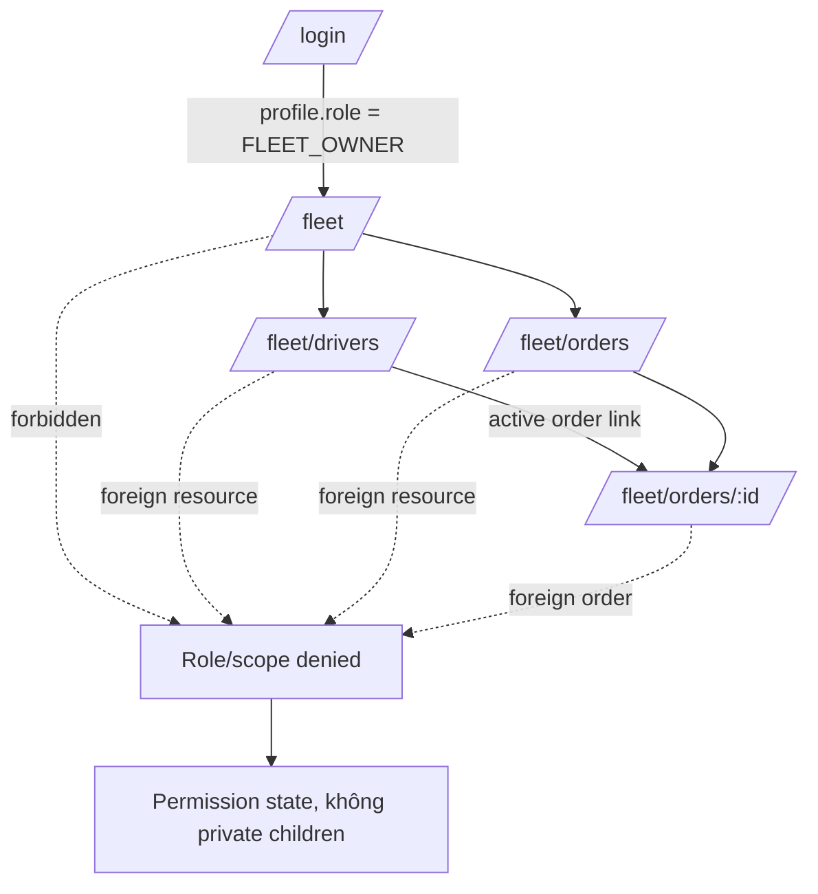
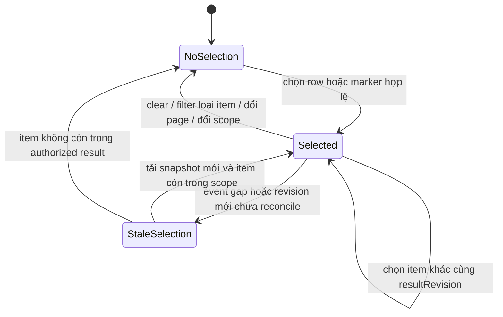

# LEOPARD Fleet Owner Operations System Design

> **Trạng thái:** `VISUAL_REMEDIATION_IN_PROGRESS`
>
> **Lane:** `FLEET_OWNER` Operations Web
>
> **Phạm vi:** Static UI/UX contract cho `/fleet`, chưa nối API/Socket Wave 3
>
> **Core contract:** `docs/ui/04-design-system.md`
>
> **Quality gate:** design-spec self-score `92/100`; runtime score vòng đầu đã bị invalidated
>
> **Dark mode:** `N/A` cho pilot; cấm partial dark mode
>
> **Independent review:** Newton (`01a003b3-75b4-78e1-b97f-c4ca77c799af`),
> 2026-08-15 — không có P0/P1/P2

Tài liệu này định nghĩa hệ thống giao diện Fleet Owner ở mức đủ chi tiết để triển
khai presentation bằng fixture xác định rồi thay bằng adapter thật mà không viết lại
screen. Đây không phải bằng chứng API, Socket, authorization, persistence hoặc E2E
đã hoàn tất; chỉ được ghi `STATIC_GATE_PASSED` sau khi có implementation và evidence
theo `docs/ui/11-ui-quality-scorecard.md`.

## 1. Mục tiêu, người dùng và hướng thiết kế

### 1.1 Design direction

| Thuộc tính       | Quyết định cho Fleet Owner                                                                                                               |
| ---------------- | ---------------------------------------------------------------------------------------------------------------------------------------- |
| Purpose          | Giúp Fleet Owner phát hiện ngoại lệ, kiểm tra Driver và theo dõi order thuộc đúng đội xe trong thời gian ngắn                            |
| Audience         | Người sở hữu đội xe pilot lặp lại workflow giám sát hằng ngày, chủ yếu dùng desktop/tablet và đôi lúc mở nhanh trên mobile web           |
| Tone             | Bình tĩnh, trực tiếp, đáng tin cậy; không dùng ngôn ngữ marketing hoặc báo động quá mức                                                  |
| Density          | Compact/read-only; nhiều dữ liệu nhưng có trật tự, không dồn mọi metadata vào first viewport                                             |
| First scan       | Phạm vi fleet → việc cần chú ý → active orders/Driver availability → dữ liệu hỗ trợ                                                      |
| Memorable detail | `Fleet Scope Rail`: dải scope luôn đứng trước nội dung riêng tư và đi cùng nhãn `Chỉ xem`; `Route Spine` compact tiếp tục biểu đạt tuyến |
| Constraints      | Backend sở hữu authorization, lifecycle, payment, ETA và freshness/exception semantics; UI chỉ phản ánh view model đã được cấp quyền     |

Hướng thiết kế là **exception-first operations**, không phải dashboard KPI để trình
diễn. Một số lớn chỉ xuất hiện khi trả lời được câu hỏi vận hành và có điểm đến rõ
ràng. Không có chart, doanh thu, commission, dispatch, fleet hierarchy hoặc tính năng
ngoài pilot.

#### Visual composition — Scope Ledger

| Screen         | Silhouette và hierarchy bắt buộc                                                                                                   |
| -------------- | ---------------------------------------------------------------------------------------------------------------------------------- |
| Shell          | Ink navigation rail ở desktop, compact utility header ở mobile; work canvas neutral, không phải một trang trắng với các border box |
| Dashboard      | Fleet Scope Rail → exception queue chiếm ưu tiên → compact metrics/data strip → recent operational rows                            |
| Drivers/orders | Scope rail → filter workbench → result ledger; desktop table, tablet chỉ `3–4` priority columns, mobile row-detail                 |
| Order detail   | Read-only status mast → route/tracking split → history/payment/media; không render command dock                                    |

Tại `768–1023 px`, badge không được co theo cột đến mức wrap từng từ. Nếu không còn
đủ chiều rộng cho status + route + owner/context, chuyển sang priority columns hoặc
row-detail thay vì giữ desktop table. Map fallback phải có route schematic và text
alternative, không dùng vùng trắng lớn làm bằng chứng “đã có map”.

### 1.2 Kết quả cần đạt

- Nhìn thấy ngay đang xem đội xe nào, tư cách `FleetMember` nào và quyền `Chỉ xem`.
- Tìm Driver/order thuộc fleet bằng filter, sort và server pagination có thể khôi
  phục từ URL.
- Nhận biết nhanh ngoại lệ do backend/view model cung cấp, đặc biệt active order có
  tracking stale hoặc Driver thiếu vị trí hợp lệ.
- Giữ selection và result scope đồng bộ giữa list/table và map.
- Xem route, lifecycle history, tracking, media và payment summary của order thuộc
  fleet mà không có mutation affordance.
- Dùng được bằng keyboard, screen reader, text zoom 200% và tại năm viewport chuẩn.
- Không render hoặc flash dữ liệu riêng tư khi membership/role/ownership không hợp lệ.

### 1.3 Ngoài phạm vi

- Tạo, sửa, hủy, nhận hoặc cập nhật lifecycle order.
- Gửi tracking, upload media, tạo QR hoặc xác nhận payment.
- Mời/gỡ Driver, sửa Driver availability, sửa fleet membership hoặc disable user.
- Dispatch tự động, tối ưu tuyến, phân ca, doanh thu, hoa hồng, chi nhánh, custom role
  hoặc báo cáo tài chính.
- Client tự tính exception threshold, price, ETA, order transition, payment state hoặc
  fleet ownership.
- API/Socket thật, persistence thật và tuyên bố realtime trong static preview.

## 2. Access, fleet scope và privacy boundary

### 2.1 Quy tắc authorization không thể nới lỏng ở UI

1. Chỉ profile có role chính xác `FLEET_OWNER` mới nhận navigation và query port của
   Fleet Owner. Không dùng so sánh cấp bậc kiểu “role lớn hơn hoặc bằng”.
2. API phải xác nhận `FleetMember.role=OWNER` và `FleetMember.status=ACTIVE` trước khi
   trả fleet profile hoặc bất kỳ child resource nào.
3. Order chỉ được trả khi assigned Driver thuộc membership `ACTIVE` của fleet đang
   được xác thực. URL có UUID hợp lệ không tạo ra quyền truy cập.
4. UI không chứa command port cho lifecycle, tracking, payment confirmation, user
   status hoặc membership. Ẩn nút là chưa đủ; callback và command adapter cũng không
   tồn tại trong Fleet feature boundary.
5. Shared primitive với Admin được phép dùng lại, nhưng Fleet route không import
   Admin feature component, Admin navigation hoặc privileged command composition.
6. API tiếp tục kiểm tra role + membership trên mọi request. Scope marker và route
   guard chỉ truyền đạt quyền, không thay thế authorization server-side.

### 2.2 `FleetScopeRail`

`FleetScopeRail` xuất hiện trong first viewport của cả bốn route và đứng trước mọi
nội dung fleet-private. Trên detail, marker lặp lại ngay dưới breadcrumb/page title để
deep link không mất ngữ cảnh.

| Thành phần       | Nội dung/behavior                                                                                           |
| ---------------- | ----------------------------------------------------------------------------------------------------------- |
| Accessible label | `Phạm vi truy cập đội xe`                                                                                   |
| Scope chính      | `Đội xe {fleetDisplayName}`; tên dài được wrap, không ellipsis khi là thông tin phân biệt scope             |
| Membership       | `Tư cách thành viên: Đang tham gia` ánh xạ riêng từ `FleetMember.status=ACTIVE`                             |
| Capability       | Nhãn text `Chỉ xem`; không chỉ dùng icon khóa hoặc màu                                                      |
| Scope ID         | Short display ID tùy chọn; UUID đầy đủ chỉ lộ khi người dùng chủ động sao chép và contract cho phép         |
| Freshness        | `Phạm vi xác nhận lúc {time}` khi response cung cấp; không dùng client clock để tuyên bố quyền còn hiệu lực |
| Preview          | Banner riêng phía trên: `Bản xem trước giao diện — dữ liệu mô phỏng`                                        |

Copy chuẩn:

```text
Phạm vi truy cập: Đội xe Sao Mai
Tư cách thành viên: Đang tham gia · Chỉ xem
```

Không hiển thị raw enum `ACTIVE` như nhãn người dùng và không dùng global status map:
`FleetMember ACTIVE` là “Đang tham gia”, khác `User ACTIVE` là “Đang hoạt động”.

### 2.3 State access trước khi render private data

Scope resolution dùng discriminated state, không ghép `permissionDenied=true` vào
object vẫn chứa dữ liệu:

- `scope-loading`: chỉ skeleton trung tính, chưa có fleet name, counts hoặc cached row.
- `authorized`: chứa `scope` và payload đã lọc theo fleet.
- `permission-denied`: không chứa private payload; xóa selection, map marker và query
  cache trong memory của scope cũ trước khi render.
- `session-expired`: xóa private view, không persist search text/result rồi chuyển về
  login với thông báo rõ.

Không render authorized children rồi mới redirect. Nếu active membership bị gỡ giữa
phiên, response 403/404 tiếp theo thay toàn bộ private region bằng permission state;
không giữ “dữ liệu cũ” như offline fallback vì quyền đã thay đổi.

### 2.4 Read-only affordance matrix

| Được phép                                                            | Không được render, kể cả disabled               |
| -------------------------------------------------------------------- | ----------------------------------------------- |
| Điều hướng giữa Overview, Drivers, Fleet Orders và order detail      | Tạo/sửa/hủy order                               |
| Search, filter, sort, phân trang và xóa bộ lọc                       | Accept order hoặc cập nhật delivery status      |
| Chọn row/marker, zoom-to-selection và đổi List/Map                   | Bật/tắt Driver availability hoặc gửi tracking   |
| Làm mới query, retry region an toàn và tải snapshot mới khi conflict | Upload/xóa media                                |
| Xem authorized media, route, history, tracking và payment summary    | Tạo QR, xác nhận/refund payment                 |
| Sao chép mã order/fleet khi contract cho phép                        | Mời/gỡ Driver, sửa membership hoặc disable user |

Không dùng disabled Admin button để “giải thích quyền”. Khi cần, đặt một ghi chú ngắn
trong detail: `Bạn đang xem dữ liệu ở chế độ chỉ xem.`

### 2.5 Privacy minimization

- Chỉ hiển thị dữ liệu cần cho giám sát: tên hiển thị Customer/Driver đã được backend
  cho phép, order display ID, route labels, assignment, timestamps và summaries.
- Không mặc định hiển thị số điện thoại đầy đủ, địa chỉ tài khoản, token, signed media
  URL, tọa độ thô hoặc provider payload. Nếu contract sau này cần phone, adapter cung
  cấp chuỗi đã mask và UI không tự mask từ PII đầy đủ.
- Cargo note có thể chứa dữ liệu nhạy cảm: wrap trong detail, không đưa vào KPI, toast,
  URL, analytics hoặc log client.
- Search query có thể chứa PII; không persist qua logout/session expiry và không đưa
  nguyên văn vào telemetry.
- Cache key phải gồm actor/session scope và `fleetId`; logout, permission loss hoặc
  fleet scope change phải xóa cache/selection tương ứng.
- Static fixture dùng danh tính giả rõ ràng, deterministic, không sao chép dữ liệu thật.

## 3. Information architecture và navigation



### 3.1 Navigation chính

| Route               | Nav label         | Job chính                                                  | Primary scan                                                      |
| ------------------- | ----------------- | ---------------------------------------------------------- | ----------------------------------------------------------------- |
| `/fleet`            | Tổng quan         | Phát hiện ngoại lệ và xem sức khỏe vận hành hiện tại       | Scope → cần chú ý → active orders → availability                  |
| `/fleet/drivers`    | Tài xế            | Quét availability, active assignment và vị trí cuối hợp lệ | Scope → filters → results → map/detail                            |
| `/fleet/orders`     | Đơn của đội xe    | Tìm order theo status, Customer, Driver và khoảng ngày     | Scope → filters → results → payment/tracking summary              |
| `/fleet/orders/:id` | Không là nav item | Điều tra một order thuộc fleet ở chế độ chỉ xem            | Scope → exception/status → route/tracking → history/payment/media |

Sidebar cố định từ 1024 px; dưới 1024 px dùng navigation drawer của Operations Web.
Drawer có accessible name, initial focus, focus trap, đóng bằng `Escape` và trả focus
về nút mở. Không có mục Admin hoặc link đến privileged surface.

### 3.2 Breadcrumb và deep link

- List routes: `Đội xe / Tài xế` hoặc `Đội xe / Đơn hàng`.
- Detail: `Đội xe / Đơn hàng / {orderDisplayId}`.
- Breadcrumb dùng `<nav aria-label="Đường dẫn">` và link thật, không dùng text clickable.
- Deep link luôn resolve scope trước detail. Foreign/missing order dùng cùng copy an
  toàn, không xác nhận resource có tồn tại ở fleet khác.
- Back link giữ URL filter/page trước đó; selection map là state tạm thời và không bắt
  buộc ghi vào URL.

## 4. Frontend architecture contract

### 4.1 Feature boundary

Fleet feature tuân theo bốn lớp của Wave 4:

| Lớp           | Trách nhiệm                                                                         | Không được làm                                      |
| ------------- | ----------------------------------------------------------------------------------- | --------------------------------------------------- |
| `model.ts`    | View model đúng nhu cầu render, domain discriminator và formatted-safe fields       | Import draft DTO hoặc giữ provider payload          |
| `port.ts`     | Query/read event interfaces cho scope, dashboard, drivers, orders, detail, tracking | Khai báo mutation command của Admin/Driver/Customer |
| `fixtures.ts` | Scenario immutable, deterministic; factory trả object mới                           | Random data, PII thật hoặc mutation giả persist     |
| `adapter.ts`  | Sau Wave 3 map REST/Socket DTO đã chốt sang view model                              | Để component gọi URL/Socket trực tiếp               |

Routes giữ mỏng: parse/validate search params ở boundary, chọn composition và chuyển
view model xuống feature container. Presentational component chỉ nhận immutable data
và callback read-only qua props; không import HTTP client, Socket.IO hoặc storage SDK.

### 4.2 View model tối thiểu

| View model                | Field trình bày bắt buộc                                                                                                                               |
| ------------------------- | ------------------------------------------------------------------------------------------------------------------------------------------------------ |
| `FleetScopeView`          | `fleetId`, `displayId`, `displayName`, `membershipStatus`, `readOnly`, `verifiedAt`                                                                    |
| `FleetDashboardView`      | server-provided KPI values, `attentionItems`, availability summary, active-order summary, `asOf`                                                       |
| `FleetDriverListItemView` | display ID/name, availability, active order link nếu có, last-known location label/time/freshness, optional exception                                  |
| `FleetOrderListItemView`  | display ID, order status, compact route, Customer/Driver display labels, payment status, updated time, tracking freshness                              |
| `FleetOrderDetailView`    | status, route snapshot, assignee, minimal Customer summary, status history, tracking projection/history, media metadata, payment summary, ETA metadata |
| `FleetResultSetView<T>`   | immutable `items`, page metadata, filter summary, sort, result revision, matching map points và `asOf`                                                 |
| `FleetAttentionView`      | severity semantic, visible reason, affected resource link, source timestamp; không để component suy diễn exception                                     |

Mọi raw `ACTIVE` hoặc `FAILED` phải đi cùng domain discriminator trước khi map copy.
`AttentionView` và freshness state do backend/final adapter cung cấp. Component không
tự quyết định “stale sau N phút”, không biến `UNPAID` thành lỗi nếu response không đánh
dấu cần chú ý và không suy ra active order từ tập status riêng.

### 4.3 Ownership của UI state

| State                                             | Owner                         | Quy tắc                                               |
| ------------------------------------------------- | ----------------------------- | ----------------------------------------------------- |
| Role, membership, fleet scope                     | Backend/API response          | Không lưu như client entitlement độc lập              |
| Filters, sort, page                               | URL search params             | Validate allow-list; filter mới đưa page về 1         |
| Query lifecycle/data                              | Feature query container       | Giữ previous authorized data chỉ khi quyền còn hợp lệ |
| Selected row/marker                               | Local coordinator state       | Clear khi item rời result set hoặc scope đổi          |
| List/Map presentation mode                        | Local UI preference           | Không làm đổi result/filter semantics                 |
| Domain status, ETA, payment, exception, freshness | View model từ backend/adapter | Không tự tính business meaning trong component        |
| Reconnecting/event gap                            | Realtime adapter sau Wave 3   | Reconcile snapshot trước khi gỡ nhãn stale            |

URL state dự kiến cho `/fleet/orders`: `q`, `status`, `customer`, `driverId`, `from`,
`to`, `sort`, `page`, `pageSize`. SRS yêu cầu filter Customer dù REST draft hiện chỉ
nêu `q`; contract handoff Wave 3 phải reconcile field-by-field, adapter chịu trách
nhiệm map, UI không được lặng lẽ bỏ filter này. `/fleet/drivers` dùng `q`,
`availability`, `sort`, `page`, `pageSize` nếu allow-list cuối cùng hỗ trợ.

### 4.4 Fetch/render stability và performance

- Initial loading dùng skeleton đúng shape và giữ chiều cao toolbar/table/map.
- Query cũ bị hủy hoặc kết quả bị bỏ qua theo request generation khi URL đổi; response
  chậm không được ghi đè filter mới.
- Server pagination mặc định 20, tối đa theo API; không tải toàn fleet để sort/filter
  trong browser.
- Map module được lazy-load sau heading/scope/exception content; fallback giữ cùng
  kích thước để không layout shift.
- Chỉ cân nhắc virtualization sau đo đạc; pagination là baseline pilot. Nếu dùng,
  virtual row vẫn phải giữ keyboard/focus và accessible result count.
- Error boundary đặt theo route/region. Map lỗi không làm mất list; payment/media lỗi
  không làm mất order header, scope hoặc route summary.
- Fixture preview chỉ bật ngoài production bằng explicit flag và luôn có preview
  banner. Production phải fail closed nếu cố chọn fixture adapter.

## 5. Operations shell và hierarchy chung

### 5.1 Desktop composition

```text
┌───────────────┬────────────────────────────────────────────────────────────┐
│ Fleet nav     │ Page title · dữ liệu lúc …                                │
│               │ FleetScopeRail: Đội xe … · Đang tham gia · Chỉ xem       │
│ Tổng quan     ├────────────────────────────────────────────────────────────┤
│ Tài xế        │ Exception / system-state region                           │
│ Đơn hàng      ├────────────────────────────────────────────────────────────┤
│               │ Filter / summary / primary operational content            │
│               ├─────────────────────────────┬──────────────────────────────┤
│               │ Table/list                  │ Map/detail companion         │
└───────────────┴─────────────────────────────┴──────────────────────────────┘
```

Thứ tự DOM trùng thứ tự đọc: skip link → header → navigation → main heading → scope
rail → urgent state/exception → controls → results → map/detail companion. Layout
không được dùng CSS order để đảo thứ tự chỉ bằng thị giác.

### 5.2 Page header

- Mỗi route có đúng một `h1`, tối đa hai dòng ở 360 px.
- Dòng phụ chỉ gồm result freshness hoặc context thiết yếu; không có hero copy.
- Không có primary mutation action. `Làm mới dữ liệu` là utility secondary action,
  giữ nguyên kích thước khi pending và có visible label.
- Scope rail không bị biến thành decorative card; dùng border/divider và spacing core.
- System banner (`offline`, `reconnecting`, preview) đứng trước scope/private content
  theo mức ưu tiên nhưng không che heading hoặc focus ring.

### 5.3 Exception hierarchy

1. Permission/session/system blocker.
2. Fleet-level attention summary do response cung cấp.
3. Resource-level exception cạnh row/detail liên quan.
4. Normal KPI/status metadata.

`Danger` chỉ dành cho failure/blocking state thực sự. Stale tracking dùng warning,
reconnecting dùng info và normal active state dùng active/success theo core mapping.
Không dùng red cho mọi “không sẵn sàng”, vì Driver `OFFLINE` là neutral domain state.

## 6. Screen system design

### 6.1 `/fleet` — Tổng quan exception-first

#### Scan order

1. `h1` “Tổng quan đội xe”, timestamp `Dữ liệu lúc …` và `FleetScopeRail`.
2. `AttentionSummary`: số việc cần chú ý và danh sách tối đa 5 item có link đến đúng
   Driver/order; nếu không có thì copy nhỏ `Không có ngoại lệ cần xử lý lúc này`.
3. `OperationalSummary` dạng `<dl>` phẳng, không phải các card khổng lồ:
   - Driver sẵn sàng.
   - Driver đang bận.
   - Driver ngoại tuyến.
   - Order đang thực hiện theo summary do backend cung cấp.
4. Active orders + map projection đồng bộ.
5. Recent orders hoặc payment/tracking note chỉ khi trace được tới requirement và còn
   chỗ; không thêm chart để lấp khoảng trống.

#### KPI behavior

- Count là link/filter shortcut khi có destination hợp lệ; accessible name phải nói
  rõ, ví dụ `Xem 4 tài xế ngoại tuyến`.
- Không animate count và không đổi màu toàn card khi giá trị thay đổi.
- Không tự cộng status ở component để suy ra “active”; nhận summary đã định nghĩa từ
  view model/backend.
- `0` là dữ liệu hợp lệ; khác skeleton/loading và khác “không có dữ liệu”.
- Khi preview, mọi count nằm dưới banner dữ liệu mô phỏng và deterministic.

#### Dashboard states

- Empty: `Đội xe chưa có tài xế đang tham gia hoặc đơn được phân công.` Không có nút
  thêm Driver vì Fleet Owner UI này chỉ xem.
- Partial error: attention hoặc map lỗi giữ các region còn lại; mỗi region có retry
  riêng nếu an toàn.
- Stale: giữ summary nhưng hiện `Dữ liệu có thể đã cũ · cập nhật lần cuối …` ngay cạnh
  region, không gắn một banner chung mơ hồ.

### 6.2 `/fleet/drivers` — Driver list/table + map

#### Filter bar

Một `<form aria-label="Lọc tài xế">` với visible labels:

- `Tìm tài xế` — display name/display ID theo contract, không dùng placeholder thay label.
- `Trạng thái sẵn sàng` — Tất cả, Ngoại tuyến, Sẵn sàng, Đang bận.
- `Sắp xếp` — allow-list server, mặc định theo trạng thái cần chú ý rồi tên nếu backend
  cung cấp; client không tự tái xếp sau pagination.
- `Áp dụng bộ lọc` và `Xóa bộ lọc`; cả hai là button text rõ nghĩa.

Submit cập nhật URL, đưa page về 1 và focus result summary. Enter trong search submit
form; không auto-query mỗi phím. Khi filter panel thu gọn ở mobile, nút ghi
`Bộ lọc, {n} đang áp dụng` và dùng `aria-expanded`/`aria-controls`.

#### Desktop table

| Cột                | Nội dung                                                       | Responsive priority                            |
| ------------------ | -------------------------------------------------------------- | ---------------------------------------------- |
| Tài xế             | Display name + short display ID; button riêng để chọn trên map | Giữ ở mọi table viewport                       |
| Availability       | Canonical badge + text                                         | Giữ                                            |
| Đơn đang thực hiện | Order display ID/status hoặc `Không có`                        | Giữ từ desktop; gộp vào row detail trên tablet |
| Vị trí gần nhất    | Label được phép hiển thị hoặc state không có vị trí            | Desktop                                        |
| Cập nhật vị trí    | `<time>` + freshness text                                      | Desktop                                        |
| Xem                | Link đến active order detail nếu có; không có menu mutation    | Giữ                                            |

Table có `<caption>` hoặc accessible description gồm fleet scope, result count và
map coverage. Sort header là `<button>` trong `<th>`, dùng `aria-sort`; không làm cả
row clickable. Hover chỉ hỗ trợ quét, không thay selection/focus.

#### Driver row-detail fallback

Dưới 768 px, mỗi Driver là một `<li>`/`<article>` phẳng có thứ tự:

1. Tên + availability text.
2. Active order link hoặc `Không có đơn đang thực hiện`.
3. Last-known location label.
4. Freshness/timestamp hoặc `Chưa có vị trí hợp lệ`.
5. Nút `Hiển thị {driverName} trên bản đồ` và link `Xem đơn {orderId}` khi có.

Không dùng card lồng card. Metadata bổ sung mở bằng disclosure button semantic với
`aria-expanded`; không dùng tap toàn row.

#### Location semantics

- Valid/fresh: `Vị trí gần nhất · cập nhật {time}`.
- Stale do view model: `Vị trí cuối · {time} · Dữ liệu có thể đã cũ`.
- Không có point hợp lệ: `Chưa có vị trí hợp lệ`; không đặt marker tại `(0,0)`.
- Map unavailable: list vẫn giữ location label/time; không xóa dữ liệu text.
- Driver `OFFLINE` không đồng nghĩa tracking stale; hai state được trình bày riêng.

### 6.3 `/fleet/orders` — Fleet orders table/list + map

#### Filter bar

`<form aria-label="Lọc đơn của đội xe">` có:

- `Tìm đơn hàng` (`q`) cho display ID/route label theo contract.
- `Trạng thái đơn` dùng canonical OrderStatus.
- `Khách hàng` theo yêu cầu SRS; option/search data phải đến từ authorized port.
- `Tài xế` chỉ liệt kê Driver thuộc scope hiện tại.
- `Từ ngày`, `Đến ngày` với visible labels, locale hint và inline validation shape.
- `Sắp xếp`, `Áp dụng bộ lọc`, `Xóa bộ lọc`.

Filter summary nằm trước results: `24 đơn · Trang 1/2 · 3 bộ lọc đang áp dụng`. Chip
chỉ dùng cho filter đang áp dụng, có nút xóa với accessible name đầy đủ. `no-results`
luôn hiển thị summary và action `Xóa bộ lọc`.

#### Desktop table

| Cột        | Nội dung                                                | Responsive priority                |
| ---------- | ------------------------------------------------------- | ---------------------------------- |
| Đơn hàng   | Display ID, created/updated time phụ                    | Giữ                                |
| Trạng thái | Canonical text badge                                    | Giữ                                |
| Tuyến      | `RouteSpine route-compact`: pickup → số stops → dropoff | Desktop                            |
| Tài xế     | Authorized display label                                | Desktop; tablet đưa vào row detail |
| Khách hàng | Minimal authorized display label                        | Desktop; tablet đưa vào row detail |
| Thanh toán | Canonical payment label + amount VND nếu có quyền       | Desktop; tablet đưa vào row detail |
| Theo dõi   | Fresh/stale/no-location text                            | Desktop                            |
| Xem        | Link `Xem chi tiết {orderId}`                           | Giữ                                |

Tại 768–1023 px chỉ giữ Đơn hàng, Trạng thái và Xem; supplemental summary mở ngay
dưới row bằng semantic disclosure. Dưới 768 px chuyển hoàn toàn sang order row-detail
list, không ép table scroll ngang.

#### Order row-detail dưới 768 px

1. Order ID + status.
2. Compact pickup/dropoff labels; địa chỉ dài wrap.
3. Driver + Customer minimal labels.
4. Payment + tracking freshness.
5. Link `Xem chi tiết đơn {orderId}` và button map selection riêng.

Không đặt action mutations trong overflow menu. Nếu order không có valid tracking
point, map action đổi thành disabled text `Chưa có vị trí để hiển thị` và không tạo
focusable disabled icon vô nghĩa.

### 6.4 `/fleet/orders/:id` — Read-only investigation detail

#### Scan order

1. Breadcrumb, `h1` `Đơn {orderDisplayId}`, OrderStatus và freshness.
2. `FleetScopeRail` + `Chỉ xem`.
3. Resource exception nếu có: stale tracking, provider/map unavailable hoặc payment
   failure do response đánh dấu; không tự biến mọi `UNPAID` thành exception.
4. Summary `<dl>`: Customer tối thiểu, assigned Driver, vehicle, price/amount VND,
   payment status, created/updated timestamps.
5. `RouteSpine route-compact` với pickup, 0–3 stops, dropoff, distance, duration và
   `ETA dự kiến`. Source `DEMO` luôn hiện `Dữ liệu mô phỏng` cạnh ETA.
6. Tracking map + textual tracking history/last-known timestamp.
7. `StatusSpine` lifecycle history theo thứ tự backend trả về.
8. Authorized media strip: cargo/delivery proof metadata và fallback.
9. Payment summary/history chỉ đọc.

#### Detail interaction

- Utility được phép: quay lại list, chọn điểm tracking, zoom map, xem ảnh đã authorized,
  sao chép order ID và retry region.
- Không có action cancel/status/upload/payment confirmation, kể cả trong kebab menu,
  keyboard shortcut hoặc hidden DOM.
- Tracking point selection đồng bộ timeline–map. Selection không thay data freshness.
- Media viewer nếu dùng dialog phải có labelled dialog, initial focus, focus trap,
  `Escape`, close button có accessible name và restore focus về thumbnail trigger.
- Signed URL không xuất hiện trong alt text, toast hoặc client log.

#### Missing/partial data

- Không Driver: chỉ hợp lệ nếu response authorized vẫn trả order; hiển thị
  `Chưa có tài xế được phân công`, không render tracking region giả.
- Không tracking: `Chưa có điểm theo dõi hợp lệ cho đơn này` và giữ route snapshot.
- Không media: tách `Chưa có ảnh hàng hóa` và `Chưa có ảnh xác nhận giao hàng`.
- Không payment history: hiển thị canonical current state `Chưa thanh toán` khi response
  trả `UNPAID`; không đưa CTA tạo QR.
- Map lỗi: giữ Route Spine và tracking text, MapPanel có retry riêng.
- Foreign order/Driver không còn thuộc active fleet: permission-safe state thay toàn
  detail; không hiển thị ID, status, route, marker, media hoặc Customer name.

## 7. List–map synchronization contract

### 7.1 Một result set, một selection

List và map không fetch/derive hai tập dữ liệu độc lập. `FleetResultSetView` mang
`resultRevision`, items, points, pagination và `asOf`; coordinator chỉ ghép map points
có cùng revision với list đang hiển thị.



### 7.2 Behavior chi tiết

- List là nguồn thay thế đầy đủ cho map. Map không chứa thông tin hoặc action duy nhất.
- Button `Hiển thị trên bản đồ` và marker đều cập nhật cùng `selectedId`.
- Selection dùng brand soft background + border + text `Đang chọn`; không chỉ đổi màu.
- Chọn row bằng keyboard không tự cuộn map gây mất focus. Map pan/zoom diễn ra sau
  action rõ; live region báo một lần `Đã chọn {resource}; vị trí cập nhật {time}`.
- Chọn marker bằng pointer/keyboard làm nổi row tương ứng; cung cấp link
  `Đi đến kết quả đã chọn` để đưa focus về heading của row, tránh focus jump bất ngờ.
- Filter, sort, page hoặc scope change clear selection nếu ID không còn trong response
  và announce `Mục đã chọn không còn trong kết quả hiện tại`.
- Browser Back từ order detail khôi phục URL filter/page và scroll anchor khi có thể;
  không phụ thuộc vào cached private row đã mất quyền.
- Marker cluster nếu cần chỉ hiện count + accessible summary; không suy ra status bằng
  màu cluster. Companion list vẫn là source chi tiết.
- Map caption nói rõ coverage, ví dụ `Bản đồ hiển thị 12/20 kết quả trên trang này có
vị trí hợp lệ`; không tạo ấn tượng map đang hiển thị toàn fleet khi chỉ là một page.

### 7.3 Realtime/freshness sau Wave 3

- Trong static preview, tracking là snapshot và banner mô phỏng luôn hiển thị; không
  dùng copy “trực tiếp”.
- Khi nối Socket, marker chỉ chuyển sang fresh sau khi adapter reconcile event/history
  và xác nhận không có gap. `reconnecting` giữ marker cuối cùng cùng timestamp.
- Event mới không tự đổi filter/page hoặc giật focus. Row cập nhật có live summary
  được batch, không announce mỗi GPS point.
- Stale threshold và event validity do backend/adapter cung cấp; UI chỉ render
  `freshness` discriminator.
- Conflict/revision mismatch giữ context, khóa việc tuyên bố dữ liệu mới nhất và cho
  action `Tải dữ liệu mới`.

### 7.4 Map fallback

MapPanel luôn giữ chiều cao tối thiểu 280 px qua loading/error. Khi map/provider lỗi:

- Giữ list, Route Spine, textual location và last-updated time.
- Hiển thị `Bản đồ tạm thời không khả dụng. Danh sách và thông tin vị trí vẫn được giữ.`
- Có button `Thử tải lại bản đồ`; retry map không refetch/mất filters của list.
- Không render broken tile, raw coordinates, provider key/error details hoặc marker cũ
  mà không có nhãn stale.

## 8. Component catalogue và variants

Role composition chỉ consume primitives/tokens của Core và Operations Web. Nếu thiếu
primitive, Fleet lane mở yêu cầu với UI Foundation Owner; không tự fork component.

| Component              | Variants/states bắt buộc                                                         | Contract Fleet Owner                                                         |
| ---------------------- | -------------------------------------------------------------------------------- | ---------------------------------------------------------------------------- |
| `PreviewBanner`        | visible static-preview                                                           | Exact copy dữ liệu mô phỏng; không dismiss làm mất provenance                |
| `FleetScopeRail`       | loading, authorized, permission-denied boundary                                  | Fleet name + membership + `Chỉ xem`; private children chỉ mount ở authorized |
| `PageHeader`           | default, stale, refreshing                                                       | Một h1, freshness, utility refresh; không mutation CTA                       |
| `AttentionSummary`     | none, info, warning, danger, partial-loading/error                               | Chỉ render exception server-provided; link về resource trong scope           |
| `OperationalSummary`   | loading, value, unavailable                                                      | Flat `<dl>`, compact; zero khác unavailable                                  |
| `FilterBar`            | default, dirty, applying, applied, invalid                                       | Visible labels, URL-shaped state, stable buttons, clear all                  |
| `DataTable`            | loading, ready, empty, no-results, error                                         | Semantic table/sort/pagination; tablet reduced columns                       |
| `ResponsiveResultList` | ready, selected, expanded                                                        | Mobile row-detail, no duplicate focusable DOM                                |
| `ListMapCoordinator`   | no-selection, selected, stale-selection                                          | Shared ID/revision, accessible result/selection announcement                 |
| `MapPanel`             | loading, ready, no-location, stale, reconnecting, unavailable, permission-denied | Text alternative, stable size, no private marker on denied                   |
| `RouteSpine`           | `route-compact`, 0–3 stops, long labels, demo ETA                                | No decorative connector motion; ETA copy canonical                           |
| `StatusSpine`          | complete/current/history-gap                                                     | Text + timestamp; server order only                                          |
| `StatusBadge`          | order, payment, availability, fleet-member                                       | Domain discriminator required; text never omitted                            |
| `FreshnessIndicator`   | fresh, stale, unknown, reconnecting                                              | Timestamp + text; no color-only cue                                          |
| `ReadOnlyDetailList`   | value, unavailable, restricted                                                   | `<dl>` semantics; không giả input disabled                                   |
| `MediaStrip`           | loading, ready, empty, broken/expired URL                                        | Authorized thumbnail, meaningful alt, retry URL safely                       |
| `Pagination`           | first, middle, last, loading                                                     | Current/total announcement, disabled boundaries, 44 px on touch              |
| `ScreenState`          | toàn bộ mục 10                                                                   | Copy theo region, focus/live semantics và privacy precedence                 |

### 8.1 Interactive state contract

- Button/link/filter có default, hover/pressed, `:focus-visible`, disabled và loading
  khi phù hợp. Loading không đổi width hoặc cho submit lặp.
- Icon-only utility chỉ dùng khi icon thật sự quen thuộc và luôn có accessible name;
  primary navigation/filter/detail link dùng visible text.
- Selected khác hover; focus khác selected; disabled không được dùng để thay read-only
  explanation.
- Tooltip chỉ bổ sung shortcut/meaning, không chứa ETA source, scope, error hoặc thông
  tin cần ra quyết định.

### 8.2 Canonical domain status

| Domain             | Machine value | Nhãn                   | Semantic role |
| ------------------ | ------------- | ---------------------- | ------------- |
| Order              | `REQUESTED`   | Chờ tài xế             | info          |
| Order              | `ACCEPTED`    | Đã nhận đơn            | active        |
| Order              | `PICKING_UP`  | Đang đến điểm lấy      | warning       |
| Order              | `IN_TRANSIT`  | Đang vận chuyển        | active        |
| Order              | `DELIVERED`   | Đã giao                | success       |
| Order              | `CANCELLED`   | Đã hủy                 | danger        |
| DriverAvailability | `OFFLINE`     | Ngoại tuyến            | neutral       |
| DriverAvailability | `AVAILABLE`   | Sẵn sàng               | success       |
| DriverAvailability | `BUSY`        | Đang bận               | active        |
| Payment            | `UNPAID`      | Chưa thanh toán        | warning       |
| Payment            | `QR_CREATED`  | Đã tạo mã QR           | info          |
| Payment            | `PAID_MANUAL` | Đã xác nhận thanh toán | success       |
| Payment            | `FAILED`      | Thất bại               | danger        |
| FleetMember        | `ACTIVE`      | Đang tham gia          | active        |

Badge luôn có visible text. Icon chỉ là tín hiệu phụ; không dùng emoji status.

## 9. Token mapping và visual rules

### 9.1 Core token consumption

| Concern          | Token/contract                                                 | Fleet use                                                      |
| ---------------- | -------------------------------------------------------------- | -------------------------------------------------------------- |
| Canvas/surface   | `neutral.background`, `neutral.surface`, `neutral.border`      | Canvas yên tĩnh, divider là phân tách mặc định                 |
| Scope/selection  | `brand.softBackground`, `brand.softText`, brand border         | Scope rail và selected result; không nhuộm toàn dashboard xanh |
| Status           | `info.*`, `warning.*`, `active.*`, `success.*`, `danger.*`     | Theo canonical mapping, luôn kèm text                          |
| Text             | `neutral.text`, `neutral.mutedText`                            | Metadata lùi cấp nhưng vẫn AA                                  |
| Type             | `pageTitle`, `sectionTitle`, `bodyCompact`, `label`, `caption` | Compact/scannable, tabular numerals cho count/VND/time         |
| Space            | 4/8/12/16/24/32 px                                             | 8–12 trong row, 16 giữa regions, 24 giữa page sections         |
| Radius           | control/card 6 px; pill chỉ status/filter chip                 | Không bo mọi section, không nested card                        |
| Border/elevation | 1 px neutral; shadow chỉ drawer/popover/dialog                 | Page section không shadow                                      |
| Focus            | 2 px, offset 2 px, contrast đạt AA                             | Không bị header/drawer che                                     |
| Motion           | 120/180 ms; reduced motion 0 ms                                | Hover/disclosure/orientation có mục đích                       |

Không có role-specific color, spacing hoặc shadow deviation. Nếu implementation cần
token mới, UI Foundation/Design System Owner phải duyệt và bổ sung platform contract
trước; Fleet feature không dùng raw hex/arbitrary utility để né review.

### 9.2 Named layout constraints

- Operations content max width: 1440 px theo core.
- `FleetScopeRail` và page header dùng full content width, cho text wrap tự nhiên.
- Table row không khóa chiều cao khi text zoom/địa chỉ dài; baseline padding dùng 8/12.
- Map min-height 280 px; desktop list–map panel ưu tiên 360–480 px tùy content height,
  nhưng không che pagination hoặc tạo page horizontal overflow.
- Split list–map chỉ bật khi **content region** còn ít nhất 1040 px sau sidebar. Đây là
  named container constraint để bảng và map đều usable; không phải breakpoint role mới.
- Khi content region hẹp hơn, dùng presentation switch `Danh sách`/`Bản đồ` và giữ
  selection, filters, result revision như nhau.

### 9.3 Prohibited visual patterns

- Không gradient tím/xanh trang trí, glassmorphism, blob, hero, stock image hoặc one-hue
  dashboard.
- Không card lồng card, shadow nhiều lớp, mọi control dạng pill hoặc badge thay button.
- Không oversized KPI/chart đẩy exception/list khỏi first viewport.
- Không marker pulse, count animation, scroll reveal hoặc Route Spine animation.
- Không raw enum/generic English/lorem ipsum/copy mơ hồ như “Manage”, “View more”.
- Không partial dark class/token/theme toggle.

## 10. State model và state catalogue

### 10.1 Precedence

State được resolve theo thứ tự để tránh private-data flash và message cạnh tranh:

1. `session-expired` — bỏ private content và đi tới login.
2. `permission-denied` — bỏ private content, marker và scoped cache.
3. Initial `loading` hoặc blocking `error` — skeleton/state đúng region.
4. Authorized `success`, `empty` hoặc `no-results`.
5. Overlay không phá context: `offline`, `stale`, `reconnecting`, partial error.
6. `conflict` — giữ snapshot có nhãn, yêu cầu tải lại trước khi tuyên bố fresh.

Domain status tồn tại độc lập với system state. Ví dụ order `IN_TRANSIT` có thể đồng
thời `tracking=stale` và connection `reconnecting`.

### 10.2 Cross-screen state contract

| State               | Presentation/copy chuẩn                                                       | Action                                               | Accessibility/privacy                                                                    |
| ------------------- | ----------------------------------------------------------------------------- | ---------------------------------------------------- | ---------------------------------------------------------------------------------------- |
| `loading`           | Skeleton đúng shape cho scope/header/rows/map; `Đang tải dữ liệu đội xe…`     | Không có retry trước lỗi; chặn submit lặp            | Main/region `aria-busy`; một polite announcement, skeleton ẩn khỏi a11y tree             |
| `empty`             | `Chưa có tài xế đang tham gia hoặc đơn được phân công cho đội xe này.`        | Không tạo mutation CTA; link đổi section khi hữu ích | Heading + description; focus vào state heading sau load                                  |
| `no-results`        | `Không có kết quả phù hợp với bộ lọc hiện tại.` + filter summary              | `Xóa bộ lọc`                                         | Không nhầm với empty; result count được announce                                         |
| `error`             | `Không thể tải {region}. Thử lại sau.`; request ID chỉ khi hỗ trợ             | Retry region an toàn, không reset URL filters        | Blocking error `role=alert`; không lộ stack/details/provider key                         |
| `success`           | Render response mới + `Đã đồng bộ dữ liệu lúc {time}.` sau refresh/reconnect  | Tiếp tục xem                                         | Polite live status, không toast-only, không tuyên bố persist ngoài response              |
| `permission-denied` | `Bạn không có quyền xem dữ liệu trong phạm vi đội xe này.`                    | `Thử lại` khi membership có thể vừa đổi; `Đăng xuất` | Không mount private children; focus heading; 403/404 foreign copy không xác nhận tồn tại |
| `offline`           | `Bạn đang ngoại tuyến. Đang hiển thị dữ liệu lưu lúc {time}.`                 | `Thử kết nối lại`                                    | Chỉ giữ cache của authorized session hiện tại; text + timestamp, không gọi là mới nhất   |
| `stale`             | `Dữ liệu có thể đã cũ · cập nhật lần cuối {time}.` cạnh region                | `Tải dữ liệu mới`                                    | Warning text, không color-only; marker ghi `Vị trí cuối`                                 |
| `reconnecting`      | `Đang kết nối lại dữ liệu theo dõi…`                                          | Không khóa filter/navigation                         | `role=status`, polite, announce một lần mỗi phase; giữ context                           |
| `session-expired`   | `Phiên đăng nhập đã hết hạn. Hãy đăng nhập lại để tiếp tục.`                  | `Đăng nhập lại`                                      | Xóa private content/query text; focus alert/login heading; không redirect loop           |
| `conflict`          | `Dữ liệu đã thay đổi trên hệ thống. Tải bản mới nhất để tiếp tục xem.`        | `Tải dữ liệu mới`                                    | Giữ snapshot có nhãn stale; không merge/suy diễn lifecycle từ fixture cũ                 |
| `map-unavailable`   | `Bản đồ tạm thời không khả dụng. Danh sách và thông tin vị trí vẫn được giữ.` | `Thử tải lại bản đồ`                                 | Region-level state; text alternative còn đầy đủ                                          |
| `no-location`       | `Chưa có vị trí hợp lệ.`                                                      | Không action nếu không thể tự tạo dữ liệu            | Không đặt marker giả; Driver availability vẫn hiển thị riêng                             |

### 10.3 Coverage theo route

| Route               | Happy/success                   | Empty                                  | No-results                                   | Error               | Denied                      | Offline/stale/reconnect                            | Expired/conflict                         |
| ------------------- | ------------------------------- | -------------------------------------- | -------------------------------------------- | ------------------- | --------------------------- | -------------------------------------------------- | ---------------------------------------- |
| `/fleet`            | KPI + attention + active orders | Không Driver/order                     | N/A cho dashboard; filter shortcut sang list | Whole/region retry  | Không private dashboard     | Cached timestamp; stale region; reconnect tracking | Session clear; dashboard revision reload |
| `/fleet/drivers`    | Table/list + matching map       | Không active FleetMember Driver        | Filter summary + clear                       | List/map độc lập    | Scope/foreign denial        | Last-known marker + timestamp                      | Session clear; result revision reload    |
| `/fleet/orders`     | Table/list + pagination/map     | Không order assigned                   | Filter summary + clear                       | List/map độc lập    | Scope denial                | Tracking freshness per row                         | Session clear; page revision reload      |
| `/fleet/orders/:id` | Authorized read-only detail     | Empty dùng cho media/history subregion | Không áp dụng                                | Detail/region retry | Foreign/missing-safe denial | Last marker/history + reconnect                    | Session clear; detail snapshot reload    |

`N/A` trong matrix chỉ mô tả state không có nghĩa nghiệp vụ trên route; không loại bỏ
category khỏi scorecard. Pattern tương đương được kiểm tra qua empty/attention state.

## 11. Interaction và motion

### 11.1 Filter/sort/pagination

- Filter dùng form submit rõ ràng; invalid date được nối với field bằng
  `aria-describedby` và `aria-invalid` trước request.
- Sort header là button, trạng thái được biểu đạt bằng text/`aria-sort`; icon chevron
  là decorative.
- Apply/clear giữ layout khi loading. Request đang chạy có thể hủy; không khóa nav.
- Sau apply/clear, focus đến result summary (`tabindex=-1`) và live region đọc count.
- Pagination dùng link/button thật, có current/total page, disabled boundary và đưa
  focus đến results heading sau response; không tự cuộn trước khi data sẵn sàng.

### 11.2 Refresh, conflict và updates

- `Làm mới dữ liệu` là utility button; pending label `Đang làm mới…`, width ổn định.
- Success dựa trên response query mới, không mutate fixture/list tại chỗ để giả thành công.
- Event update giữ filter/page/selection nếu vẫn hợp lệ; không nhấp nháy row.
- Nếu revision mismatch, chuyển `conflict`/stale, không silently overwrite context.
- Không announce từng tracking point. Batch announcement tối đa theo meaningful state
  change do adapter cung cấp.

### 11.3 Motion

- Hover/focus/pressed color: `motion.fast` 120 ms.
- Disclosure/navigation drawer/presentation switch: `motion.standard` 180 ms.
- Map pan/zoom chỉ sau explicit selection; không auto-pan theo từng tracking event.
- `prefers-reduced-motion: reduce`: transition 0 ms, map jump không fly animation,
  skeleton pulse/spinner trang trí đổi sang progress copy/indicator tĩnh khi có thể.
- Không motion thay đổi layout, count, status badge, marker hoặc Route Spine để trang trí.

## 12. Responsive system

### 12.1 Viewport matrix

| Viewport   | Shell                             | Results                                                                            | List–map                                                                  | Detail/filter behavior                                                           |
| ---------- | --------------------------------- | ---------------------------------------------------------------------------------- | ------------------------------------------------------------------------- | -------------------------------------------------------------------------------- |
| `1440×900` | Sidebar cố định; content max 1440 | Full table columns                                                                 | Split khi content region ≥1040 px                                         | Detail sections 2-column khi semantics cho phép; filter bar một/hai hàng ổn định |
| `1024×768` | Sidebar cố định                   | Reduced table columns, không horizontal page overflow                              | Không ép split; list mặc định, map qua presentation switch hoặc dưới list | Scope wraps; detail ưu tiên một cột cho map/history                              |
| `768×1024` | Nav drawer                        | Table giữ Đơn/Status/Xem hoặc Driver/Availability/Xem; supplemental row disclosure | Danh sách/Bản đồ cùng result state                                        | Filter bar wrap; touch targets ≥44 px                                            |
| `390×844`  | Nav drawer, header compact        | Row-detail list, không semantic table giả                                          | Một presentation tại một thời điểm; map min 280 px                        | Inline filter disclosure; one-column detail; long Vietnamese labels wrap         |
| `360×800`  | Như 390, spacing compact          | Row-detail list, ID/address wrap                                                   | Selection preserved khi đổi view                                          | Không sticky action; pagination và drawer không che content/focus                |

### 12.2 Reflow rules

- Page không horizontal overflow; chỉ cho table container scroll ngang nếu một future
  exception được duyệt. Baseline này không cần scroll ngang dưới 768 vì dùng row-detail.
- Tại 200% text zoom, layout reflow tương đương viewport hẹp; không khóa chiều cao row,
  header, scope rail, badge hoặc button.
- Long fleet name, Driver name, order ID, route label, Customer label và cargo note
  wrap. ID có `overflow-wrap:anywhere`; không truncate dữ liệu cần phân biệt record.
- Scope, preview/offline banner và result summary không sticky chồng nhau. Header/drawer
  phải chừa scroll margin để focus ring 2 px không bị che.
- Mobile list và desktop table có thể là hai semantic compositions nhưng chỉ một bản
  được display/focus tại mỗi breakpoint; IDs duy nhất và hidden composition dùng
  `display:none`, không còn trong accessibility tree.
- Map giữ min-height 280 px qua loading/error/no-location và không đẩy pagination khỏi
  DOM order.

### 12.3 Tablet/mobile row detail

Row-detail là fallback chính thức, không phải table bị thu nhỏ:

- `<ul>` chứa `<li><article>`; heading item là link/display ID.
- Key-value metadata dùng `<dl>`; status badge nằm cạnh heading nhưng vẫn có text.
- Supplemental content dùng native button disclosure; Enter/Space hoạt động, Escape
  không bắt buộc cho inline disclosure.
- Một item chỉ có tối đa hai utility rõ: map selection và detail link.
- Focus không tự chuyển khi disclosure mở; screen reader nhận expanded state.

## 13. Accessibility contract

### 13.1 Semantics và landmarks

- Có skip link `Bỏ qua đến nội dung chính`, `<header>`, labelled `<nav>`, một `<main>`,
  tuần tự `h1 → h2 → h3` và `<aside>` chỉ cho content bổ trợ thật.
- Scope rail dùng labelled region/aside, không giả form control.
- Filters nằm trong `<form>`; nhóm status/date dùng `<fieldset>/<legend>` khi phù hợp.
- Inputs/selects có visible `<label for/id>`; hint/error nối `aria-describedby`; invalid
  dùng `aria-invalid`; placeholder không thay label.
- Tables có caption, `<thead>`, `<th scope>`, sortable button và `aria-sort`.
- Read-only facts dùng `<dl>`, không dùng disabled input để mô phỏng dữ liệu.
- Icon decorative và map tile bị ẩn; icon-only button có accessible name.

### 13.2 Keyboard và focus journeys

Journey bắt buộc kiểm tra không dùng chuột:

1. Skip đến main, đọc `h1` và scope.
2. Mở/đóng nav drawer dưới 1024; focus trap/restore đúng.
3. Điền filter, submit, nghe result count và clear filter.
4. Sort table, phân trang và mở row disclosure.
5. Chọn Driver/order trên list, đổi sang map và quay về selected result.
6. Mở order detail, duyệt Route Spine/history/payment/media rồi quay lại list giữ URL.
7. Mở/đóng media viewer nếu có; focus trả đúng thumbnail.
8. Gặp permission/session/error/conflict và kích hoạt action an toàn.

Tab order theo DOM/scan order; không positive `tabIndex`, không `onClick` trên
`div/span`, không row click-only. Route transition đưa focus tới `h1`; async region
update không cướp focus.

### 13.3 Dynamic content

- `aria-live=polite` cho result count, refresh success, reconnect phase và selection
  summary; `aria-atomic=true` khi câu cần đọc trọn.
- `role=alert` chỉ cho session expiry hoặc blocking error cần phản ứng; không khiến
  warning/stale update ngắt screen reader liên tục.
- Tracking events được batch; không đọc từng tọa độ/marker.
- Loading region dùng `aria-busy`; skeleton shape không có accessible name riêng.
- Permission state focus heading và tuyệt đối không có private child trong DOM.

### 13.4 Perception, target và map alternative

- Core semantic pair phải đạt WCAG AA; normal text tối thiểu 4.5:1, large text 3:1,
  focus/control boundary tối thiểu 3:1 theo gate áp dụng.
- Status/exception/selection dùng text + shape/border/icon phù hợp, không chỉ màu.
- Touch target ít nhất 44×44 px tại touch viewport; desktop controls baseline 40 px.
- UI usable ở text zoom 200%, browser zoom và long Vietnamese copy.
- Map có caption, result count, textual list, last-updated time và selection control
  tương đương; người dùng không cần đọc vị trí chỉ từ marker/color.
- Motion tôn trọng reduced-motion theo mục 11.3.

## 14. Copy, formatting và domain semantics

### 14.1 Copy chuẩn

| Context                | Copy                                                                          |
| ---------------------- | ----------------------------------------------------------------------------- |
| Read-only              | `Bạn đang xem dữ liệu ở chế độ chỉ xem.`                                      |
| Preview                | `Bản xem trước giao diện — dữ liệu mô phỏng`                                  |
| Scope denied           | `Bạn không có quyền xem dữ liệu trong phạm vi đội xe này.`                    |
| Foreign/missing detail | `Không thể mở đơn hàng này trong phạm vi đội xe hiện tại.`                    |
| Driver empty           | `Chưa có tài xế đang tham gia đội xe.`                                        |
| Order empty            | `Chưa có đơn được phân công cho tài xế thuộc đội xe.`                         |
| No results             | `Không có kết quả phù hợp với bộ lọc hiện tại.`                               |
| No tracking            | `Chưa có điểm theo dõi hợp lệ cho đơn này.`                                   |
| Stale                  | `Dữ liệu có thể đã cũ · cập nhật lần cuối {time}.`                            |
| Reconnecting           | `Đang kết nối lại dữ liệu theo dõi…`                                          |
| Conflict               | `Dữ liệu đã thay đổi trên hệ thống. Tải bản mới nhất để tiếp tục xem.`        |
| Map fallback           | `Bản đồ tạm thời không khả dụng. Danh sách và thông tin vị trí vẫn được giữ.` |
| ETA                    | `ETA dự kiến` và, khi source `DEMO`, `Dữ liệu mô phỏng`                       |

Không dùng `real-time`, `trực tiếp`, `đã lưu` hoặc `đã xác nhận` nếu static fixture/
query response chưa chứng minh nghĩa đó.

### 14.2 Formatting

- Tiền: integer VND, locale `vi-VN`, ví dụ `125.000 ₫`; không tự làm tròn business value.
- Distance/duration: map từ meter/second qua view model display; giữ source values cho
  accessible detail nếu cần, không tự tính route.
- Time: API ISO 8601/UTC; UI dùng `<time datetime>` và hiển thị timezone rõ khi dễ gây
  nhầm, ví dụ `14:30, 15/08/2026 (GMT+7)`.
- ID/count/VND/time dùng tabular numerals khi platform hỗ trợ.
- Địa chỉ/cargo note giữ xuống dòng, không đưa full text vào tooltip-only.
- `0` khác missing; missing dùng copy “Chưa có/Không có dữ liệu”, không dùng dấu gạch
  mơ hồ nếu ảnh hưởng quyết định.

## 15. Do / Don’t và implementation gate

| Do                                                                    | Don’t                                                              |
| --------------------------------------------------------------------- | ------------------------------------------------------------------ |
| Đặt scope + `Đang tham gia` + `Chỉ xem` trước private content         | Chỉ ghi fleet name trong sidebar rồi mất scope ở deep link         |
| Nhận exception/freshness/status từ view model có domain discriminator | Tự suy ra stale, active, payment issue hoặc permission ở component |
| Giữ list/table là text alternative đầy đủ cho map                     | Đặt action hoặc thông tin chỉ có trên marker/tooltip               |
| Dùng server pagination và URL-shaped filters                          | Sort/filter toàn fleet từ current page trong browser               |
| Dùng link/button semantic và explicit selection                       | Làm cả row clickable hoặc dùng `div` có `onClick`                  |
| Hiện read-only bằng capability marker và absence of commands          | Render Admin action ở disabled/hidden DOM                          |
| Giữ stale cached data chỉ khi session/scope vẫn authorized            | Hiện cache cũ sau 403, logout hoặc membership removal              |
| Region error cho map/media/payment khi detail header còn usable       | Thay toàn màn hình bằng generic error cho lỗi một region           |
| Dùng Route Spine compact và status text                               | Dùng route/map decoration, pulse hoặc color-only state             |
| Ghi rõ preview fixture, offline và freshness                          | Tạo cảm giác realtime/persisted bằng fake success                  |

Implementation chỉ được mở sau direction + a11y review tài liệu này. Static role gate
cần component/state catalogue chạy qua production composition, deterministic fixture
guard, viewport screenshots, keyboard/screen-reader walkthrough, normal/reduced-motion
comparison, test/lint/typecheck/build và scorecard implementation riêng. Không đánh
dấu PH-12 verified trước real adapters, persistence và E2E.

## 16. Evidence

### 16.1 Requirement traceability

- `FR-04`, `AC-05`, `US-12`, `US-13`: mục 2 khóa active `FleetMember`, fleet-only data,
  read-only port và cấm mutation/Admin inheritance.
- `FR-02` và screen spec `/fleet/orders`: mục 3, 4 và 6.3 định nghĩa Customer/Driver/
  status/date filters, server pagination và route detail.
- `FR-05`, `AC-04`: mục 6.2, 6.4 và 7 giữ last-known tracking, list–map selection và
  scope của assigned Driver.
- Screen specs `/fleet`, `/fleet/drivers`, `/fleet/orders`, `/fleet/orders/:id`: toàn
  bộ anatomy nằm ở mục 6.
- Core design direction/tokens/status/Route Spine: mục 1, 8 và 9 không tạo role palette
  hoặc semantic mapping riêng.
- Loading/empty/error/success/permission cùng offline/stale/reconnecting/
  session-expired/conflict: precedence và copy đầy đủ tại mục 10.
- Responsive 360/390/768/1024/1440, table-to-row-detail và map min-height: mục 12.
- Accessibility/privacy/no-private-flash: mục 2 và 13.
- `frontend-patterns`: thin routes, model/port/fixture/adapter, URL state, immutable
  result sets, stable async rendering và region error boundaries tại mục 4 và 7.
- `frontend-design-direction`: purpose, audience, tone, density, first scan và
  `Fleet Scope Rail` tại mục 1 và 5.
- `design-system`: token/component inventory, canonical status, responsive/state
  contracts và AI-slop guard tại mục 8–12 và 15.
- `frontend-a11y`: semantic filters/tables, keyboard selection, focus restore, live
  regions, map alternative, reduced motion và permission privacy tại mục 11–13.

### 16.2 Deterministic preview scenarios phải tạo ở implementation

- `fleet-overview-success`: active scope, attention items, availability summary và
  active orders; banner mô phỏng visible.
- `fleet-overview-empty`, `fleet-overview-partial-error`, `fleet-scope-denied`.
- `fleet-drivers-mixed`: AVAILABLE/BUSY/OFFLINE, fresh/stale/no location và long names.
- `fleet-drivers-no-results`, `fleet-drivers-map-unavailable`.
- `fleet-orders-mixed`: 0–3 stops, mọi OrderStatus/PaymentStatus cần sample, pagination,
  long route labels và Customer/Driver filters.
- `fleet-orders-no-results`, `fleet-orders-offline`, `fleet-orders-conflict`.
- `fleet-order-detail-success`, `fleet-order-detail-stale-tracking`,
  `fleet-order-detail-no-location`, `fleet-order-detail-media-error`.
- `fleet-order-foreign-denied`: assert private heading/route/Customer/Driver/marker/
  media/payment không mount.
- `fleet-session-expired`, `fleet-reconnecting`, `fleet-refresh-success`.

Mỗi factory phải immutable, deterministic và trả object mới; không dùng tên/số điện
thoại/địa chỉ thật. Scenario preview không phải evidence authorization backend.

### 16.3 Evidence package còn phải thu ở static implementation gate

- Screenshots tại `360×800`, `390×844`, `768×1024`, `1024×768`, `1440×900`, gồm long
  fleet name/order ID/route/cargo copy và table-to-row-detail transition.
- Component catalogue cho ScopeRail, status/freshness, filters, table/list, map,
  Route/Status Spine, media, pagination và toàn bộ ScreenState.
- Keyboard-only recording theo journey mục 13.2; screen reader đọc scope, result count,
  status, stale/reconnect và permission state.
- Contrast report, 200% text zoom/overflow check và target-size evidence.
- Normal/reduced-motion comparison; map/disclosure không animate khi reduced motion.
- Tests cho no-private-flash, absence of mutation callbacks/DOM, URL filters, stale
  response rejection, list–map revision/selection và preview production guard.
- Các lệnh theo script thực tế: `pnpm --filter @leopard/ui test`,
  `pnpm --filter @leopard/ui typecheck`, `pnpm --filter @leopard/ui lint`,
  `pnpm --filter web test`, `pnpm --filter web typecheck`,
  `pnpm --filter web lint`, `pnpm --filter web build` và
  `pnpm --filter web test:e2e`.
- Source scan xác nhận không raw semantic color/spacing, partial dark mode, Admin
  command import, secret/PII hoặc fixture production default.

### 16.4 Evidence kiểm tra tài liệu ở lane này

- Đã đọc đầy đủ bốn skill bắt buộc và toàn bộ source of truth được giao trước khi
  viết contract.
- `pnpm exec prettier --check docs/ui/09-fleet-owner-system-design.md`: pass.
- File là artifact mới, vẫn unstaged; lane không chạy `git add`, `commit` hoặc `push`.
- Không chạy web test/build/E2E vì task chỉ sở hữu system-design Markdown và chưa có
  implementation UI trong phạm vi lane này.

## 17. Self-review

Điểm dưới đây chấm **độ sẵn sàng của system-design contract**, chưa phải điểm cho UI
đã render. Các mục cần screenshot/test được giữ ở evidence backlog mục 16.3; vì vậy
tài liệu này không tự tuyên bố `STATIC_GATE_PASSED`.

| #   | Tiêu chí                |       Điểm | Evidence trong tài liệu                                                             | Residual check ở implementation         |
| --- | ----------------------- | ---------: | ----------------------------------------------------------------------------------- | --------------------------------------- |
| 1   | Color consistency       |       9/10 | Mục 8.2 và 9 khóa semantic tokens/canonical status, không role palette              | Chạy contrast/token scan                |
| 2   | Typography hierarchy    |       9/10 | Mục 5, 9.1, 12.2 và 13.1 khóa một h1, heading tuần tự, wrap/zoom/tabular numbers    | Chụp long-copy + DOM heading tree       |
| 3   | Spacing rhythm          |       9/10 | Mục 9 dùng scale core, divider, named constraints và cấm nested card                | Diff scan arbitrary spacing             |
| 4   | Component consistency   |       9/10 | Mục 8 có catalogue/variants và shared-primitive boundary                            | Component interaction tests             |
| 5   | Responsive behavior     |      10/10 | Mục 12 có đủ năm viewport, split constraint, reduced columns và row-detail          | Screenshot/overflow matrix              |
| 6   | Motion & reduced motion |       8/10 | Mục 11.3 khóa motion token, purpose và fallback                                     | Recording/test chưa có ở design phase   |
| 7   | Accessibility           |      10/10 | Mục 2, 7, 11–13 khóa privacy DOM, semantics, keyboard, focus, live, map alternative | axe/screen-reader/keyboard evidence     |
| 8   | Information density     |      10/10 | Mục 1, 5 và 6 định nghĩa exception-first scan, compact KPI và metadata priority     | Reviewer 5-second scan test             |
| 9   | State completeness      |      10/10 | Mục 10 có precedence, 13 state/fallback và route coverage                           | State catalogue screenshots/tests       |
| 10  | Polish & AI-slop        |       8/10 | Mục 9.3, 14 và 15 khóa copy/fallback/no-slop/no fake realtime                       | Visual diff và edge-case review chưa có |
|     | **Tổng**                | **92/100** | **Đạt ngưỡng thiết kế ≥85; mọi tiêu chí ≥8**                                        | **Implementation gate vẫn pending**     |

Self-review gates:

- **Design-spec readiness:** `PASS` (`92/100`, lowest `8/10`).
- **Accessibility contract:** `PASS`; implementation evidence pending.
- **AI-slop contract:** `PASS`; mọi phát hiện cấm ở scorecard được đặt `false` theo
  thiết kế, cần source/visual scan sau implementation.
- **No-partial-dark contract:** `PASS`; dark mode `N/A` cho pilot.
- **Authorization/privacy contract:** `PASS`; permission state không chứa private
  payload và Fleet port không có mutation command.
- **Blocking issue trong phạm vi tài liệu:** `0`.
- **Milestone claim:** chưa ghi `STATIC_GATE_PASSED`, chưa ghi PH-12 `VERIFIED`.

### Runtime remediation note — 2026-08-15

Implementation vòng đầu đã có bốn Fleet routes, fixtures và automated checks, nhưng
ảnh `768×1024` cho thấy desktop table vẫn giữ quá nhiều cột khiến status badge wrap
từng từ. Điều này vi phạm contract mục 1.1/visual composition dù document self-score
đạt. Runtime score bị invalidated; Fleet chỉ qua gate sau khi priority-column hoặc
row-detail strategy được kiểm tra lại bằng screenshot.
