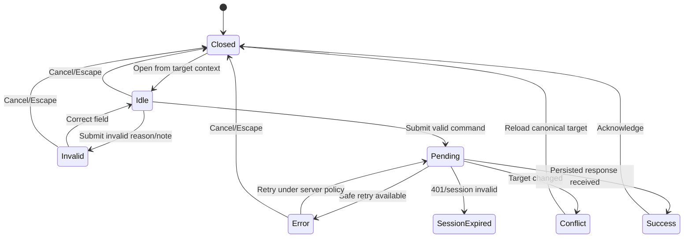

# LEOPARD Admin Operations System Design

> **Artifact:** W4-DS04 — Admin operations system design
>
> **Role:** `ADMIN`
>
> **Trạng thái:** `APPROVED_FOR_STATIC_IMPLEMENTATION`; chưa nối backend Wave 3
>
> **Static milestone:** Chưa ghi `STATIC_GATE_PASSED`; implementation, preview,
> accessibility run, screenshot matrix và E2E vẫn là evidence bắt buộc ở W4-S06/W4-S07
>
> **Independent review:** Pauli (`01a003b3-dbb7-7c91-93b0-2850da5bca18`),
> 2026-08-15 — một P2 về F-11/US-15 log ownership đã được sửa và xác nhận resolved

Tài liệu này định nghĩa presentation contract cho operations web của Admin. Nó mở
rộng LEOPARD Core Design System, không thay thế SRS, API contract, authorization,
business rule hoặc audit policy phía backend. UI tĩnh chỉ nhận dữ liệu và capability
qua view model/port; không tự xác nhận payment, suy diễn lifecycle, quyết định quyền
hoặc giả lập persistence.

## 1. Mục đích, audience và design direction

Admin dùng LEOPARD lặp lại hằng ngày để phát hiện ngoại lệ, thu hẹp tập dữ liệu,
điều tra một entity và thực hiện số ít command đặc quyền có thể truy vết. Màn hình
phải giúp Admin trả lời nhanh bốn câu hỏi:

1. Hệ thống hoặc domain nào đang cần chú ý?
2. Entity nào bị ảnh hưởng và dữ liệu mới đến đâu?
3. Ai sở hữu/được phân công và lịch sử nào giải thích trạng thái hiện tại?
4. Nếu cần command, hậu quả, lý do, kết quả persist và audit evidence là gì?

| Thuộc tính       | Quyết định cho Admin                                                                      |
| ---------------- | ----------------------------------------------------------------------------------------- |
| Purpose          | Monitoring, lọc, điều tra và xử lý ngoại lệ trong phạm vi pilot                           |
| Audience         | Admin nội bộ quen workflow, cần quét nhanh nhưng vẫn phải tránh command nhầm              |
| Tone             | Bình tĩnh, kỹ thuật vừa đủ, trực tiếp; cảnh báo chỉ nổi bật khi có hành động              |
| Density          | Dense và filter-first trên desktop; row-detail có thứ bậc rõ ở viewport hẹp               |
| First scan       | Readiness/connection → exception → filter scope → entity status → ownership → audit       |
| Memorable detail | `Audit Rail`: actor–action–reason–request ID luôn gắn với command đặc quyền               |
| Constraints      | WCAG AA, keyboard-first, privacy by default, responsive, tiếng Việt, dữ liệu tĩnh có nhãn |

Không dùng hero, lời quảng bá, KPI card cỡ lớn, chart trang trí, gradient, glassmorphism
hoặc animation để tạo cảm giác “dashboard”. Density không được đổi thành chữ nhỏ,
hit target nhỏ hoặc thông tin không có thứ bậc.

## 2. Phạm vi và traceability

### 2.1 Trong phạm vi

- `/admin`: readiness warning, compact operational summary, status distribution,
  exception queue và recent orders.
- `/admin/orders`: search/filter/sort/server pagination và clear filters.
- `/admin/orders/:id`: order context, route/status history, tracking, media, payment,
  available audited commands và Audit Rail.
- `/admin/users`, `/admin/fleets`, `/admin/drivers`: list/filter/status cùng inspection
  detail vừa đủ cho vận hành.
- Tracking, media và payment được monitor trong dashboard exception queue và order
  detail; không phát minh route riêng khi navigation/API chưa định nghĩa.
- Command dialog cho cancel order, enable/disable user và manual payment confirmation.
- Toàn bộ system state, accessibility, privacy, responsive và deterministic preview
  contract cần cho W4-S06/W4-S07.

### 2.2 Ngoài phạm vi static UI

- Gọi REST/Socket, upload, signed URL, QR/payment thật hoặc lưu dữ liệu thật.
- Tự quyết định role/ownership, order transition, severity, capability, price, ETA,
  payment state, tracking freshness threshold hoặc audit outcome.
- Thêm Admin command, route, backend enum, operational-log viewer hoặc dashboard
  metric ngoài contract đã duyệt.
- Sửa backend, Prisma, OpenAPI, shared contract, root dependency hoặc lockfile.
- Dark mode; pilot ghi `N/A`, không có partial dark style.

### 2.3 Requirement mapping

| Nguồn               | Contract được đáp ứng                                                                                                               |
| ------------------- | ----------------------------------------------------------------------------------------------------------------------------------- |
| FR-01               | Resolve session/role trước private render; session-expired và permission-denied không flash dữ liệu                                 |
| FR-02               | Admin order list có filter status, Customer, Driver, date, pagination và sort allow-list                                            |
| FR-05               | Tracking chỉ hiện trong authorized order context, có freshness/last-updated/reconnect state                                         |
| FR-07               | Media chỉ hiện metadata/preview được phép; type/size/provider error không lộ storage detail                                         |
| FR-08, US-11, AC-06 | Manual payment dialog có note 5–500 ký tự, pending, persisted result và audit feedback                                              |
| FR-09, US-14        | Monitor users, fleets, drivers, orders, tracking, media và payment state                                                            |
| FR-09               | Liveness/readiness tách biệt; readiness failure thành operational warning                                                           |
| F-11, US-15         | Static UI chỉ đáp ứng phần health; structured operational log chưa có route/API contract và vẫn thuộc backend/observability handoff |
| AC-03               | Admin cancel order đã nhận có reason và không tự suy diễn transition hợp lệ                                                         |
| AC-07               | Main screen có loading, empty, error, success, permission-denied và responsive state                                                |
| W4-DS04             | Filter-first anatomy, exception severity, Audit Rail và command focus/state contract                                                |

## 3. Product và trust boundaries

### 3.1 Backend-owned decisions

UI chỉ render `availableCommands`, labels, current state, validation policy và
capability đã có trong view model. Không tạo command chỉ vì raw status “trông có vẻ”
cho phép. Backend vẫn phải kiểm tra account status, role, ownership/assignment,
transition, payment uniqueness và audit transaction ở mỗi request.

| Boundary      | UI được làm                                              | UI không được làm                                          |
| ------------- | -------------------------------------------------------- | ---------------------------------------------------------- |
| Authorization | Chặn render tới khi role resolved; phản ánh 401/403      | Coi việc ẩn button là authorization                        |
| Lifecycle     | Hiện status/capability từ response; refresh khi conflict | Tự tính next transition hoặc mutate fixture                |
| Payment       | Validate shape của note; gửi command port                | Tự đánh dấu `PAID_MANUAL` trước persisted response         |
| Tracking      | Hiện point/history/freshness view đã map                 | Tự đặt freshness threshold hoặc gọi map provider trực tiếp |
| Media         | Request authorized view URL qua port                     | Giữ signed URL lâu dài hoặc suy diễn proof đã hợp lệ       |
| Audit         | Hiện persisted audit entry/receipt                       | Tạo audit row giả từ click local                           |
| Severity      | Render label/tone/action từ view model                   | Suy severity từ màu, count hoặc enum không có contract     |

### 3.2 Static fixture guard

- Fixture immutable, deterministic và tạo object mới cho mỗi scenario.
- Preview luôn có banner: `Bản xem trước giao diện — dữ liệu mô phỏng`.
- Production fail closed nếu cố bật fixture; component không import fixture trực tiếp.
- Tên, số điện thoại, địa chỉ, tọa độ, ảnh và request ID đều là dữ liệu giả rõ ràng,
  không sao chép log hoặc PII thật.
- Command callback chỉ trả scenario result; không sửa object fixture để tạo “success”.
- Static success phải ghi rõ là scenario presentation, không tuyên bố đã persist thật.

## 4. Information architecture và scan hierarchy

### 4.1 Navigation

Sidebar từ `1024 px`, drawer dưới `1024 px`, theo đúng thứ tự ổn định:

1. Tổng quan
2. Đơn hàng
3. Người dùng
4. Đội xe
5. Tài xế

Tracking, media và payment không trở thành top-level navigation trong pilot. Exception
từ ba domain này mở đúng order detail và đặt focus vào region tương ứng. Active route
có text và current-page semantics; icon chỉ bổ trợ.

### 4.2 Global shell

Thứ tự DOM và visual phải giống nhau:

1. Skip link `Bỏ qua điều hướng`.
2. App header: tên sản phẩm, preview environment nếu có, session menu.
3. Sidebar/drawer navigation.
4. Global connection/readiness region.
5. `<main>` với đúng một `h1`.
6. Page-level status/live region.

Global connection và domain status là hai lớp khác nhau. Ví dụ Driver availability
`OFFLINE` hiển thị “Ngoại tuyến” trong cột “Trạng thái tài xế”, còn browser mất mạng
hiển thị “Mất kết nối hệ thống” ở global region.

### 4.3 First-viewport hierarchy

```text
[Compact page title] [last updated] [refresh]
[Readiness/connection warning — chỉ xuất hiện khi cần]
[Compact status strip — số liệu traceable, không phải hero cards]
[Visible primary filters] [active filter summary] [clear]
[Exception queue hoặc semantic data table]
```

- Page title tối đa một dòng ở desktop, được wrap ở viewport hẹp.
- Compact status strip dùng `<dl>`/list; không dùng donut/chart nếu table count rõ hơn.
- Filter đứng trước result và giữ scope hiện tại nhìn thấy được.
- Alert không đẩy workflow khỏi first viewport khi không có lỗi.
- Metadata hỗ trợ nằm sau entity/status/exception, không cạnh tranh với action.

## 5. Monitoring model theo domain

### 5.1 Coverage matrix

| Domain   | First-scan signal                                                     | List/summary tối thiểu                                                       | Inspection context                                                    | Mutating affordance                                                                 |
| -------- | --------------------------------------------------------------------- | ---------------------------------------------------------------------------- | --------------------------------------------------------------------- | ----------------------------------------------------------------------------------- |
| Users    | `UserStatus`, role, session/account exception                         | Masked identity, role, status, updated time                                  | User ID, status history/audit liên quan khi response có               | Enable/disable chỉ từ `availableCommands`                                           |
| Fleets   | Membership exception, driver/order counts                             | Fleet identity, owner/membership summary, last updated                       | Active `FleetMember`, drivers và related orders                       | Không có command trong pilot contract                                               |
| Drivers  | `DriverAvailability`, `UserStatus`, `FleetMemberStatus` tách cột      | Masked identity, fleet scope, availability, active order, last location time | Assignment, fleet membership, last-known tracking context             | Dẫn tới user-status command khi capability cho phép; không giả command availability |
| Orders   | `OrderStatus`, ownership/assignment, route/payment/tracking exception | Order ID, Customer/Driver, status, route compact, payment, created time      | Full investigation layout và Audit Rail                               | Cancel/order payment commands theo capability                                       |
| Tracking | Freshness/connection label, captured time, accuracy nếu có            | Exception count ở overview; không lộ raw coordinate trong table              | Map + history trong authorized order detail                           | Không có Admin tracking mutation                                                    |
| Media    | Type, view availability, upload/provider exception                    | Count/type/exception gắn với order                                           | Authorized thumbnail/metadata theo yêu cầu; retry signed URL qua port | Không sửa/xóa media trong pilot contract                                            |
| Payment  | Canonical payment status, amount VND, reference/expiry/source khi có  | Payment badge + exception trong order list/detail                            | Intent history, amount, source và Audit Rail                          | Manual confirm khi capability cho phép                                              |
| Health   | Liveness và readiness tách riêng, checked time                        | Compact global warning; không biến thành decorative KPI                      | Dependency label tổng quát + request ID an toàn                       | Refresh check; không có hạ tầng command                                             |

`AuditRail` không phải structured operational log. Source of truth hiện chỉ công bố
`/health/live` và `/health/ready`, chưa có API, retention/redaction policy hoặc screen
spec cho log viewer. Vì vậy W4-S06 chỉ được claim presentation cho phần health của
US-15, có thể đưa request ID an toàn vào luồng điều tra, nhưng không được dựng fake log
stream từ fixture/audit entries. Phần log của F-11/US-15 vẫn do backend/observability
tooling sở hữu và cần contract/change request riêng trước khi thêm Admin surface;
`STATIC_GATE_PASSED` không đồng nghĩa F-11/US-15 đã hoàn tất toàn bộ.

### 5.2 Semantic status rules

Không có global map theo raw string `ACTIVE`, `FAILED` hoặc `OFFLINE`. View model phải
kèm domain discriminator; badge luôn có text.

| Domain discriminator | Machine state | Nhãn                   | Semantic role |
| -------------------- | ------------- | ---------------------- | ------------- |
| `orderStatus`        | `REQUESTED`   | Chờ tài xế             | `info`        |
| `orderStatus`        | `ACCEPTED`    | Đã nhận đơn            | `active`      |
| `orderStatus`        | `PICKING_UP`  | Đang đến điểm lấy      | `warning`     |
| `orderStatus`        | `IN_TRANSIT`  | Đang vận chuyển        | `active`      |
| `orderStatus`        | `DELIVERED`   | Đã giao                | `success`     |
| `orderStatus`        | `CANCELLED`   | Đã hủy                 | `danger`      |
| `paymentStatus`      | `UNPAID`      | Chưa thanh toán        | `warning`     |
| `paymentStatus`      | `QR_CREATED`  | Đã tạo mã QR           | `info`        |
| `paymentStatus`      | `PAID_MANUAL` | Đã xác nhận thanh toán | `success`     |
| `paymentStatus`      | `FAILED`      | Thất bại               | `danger`      |
| `driverAvailability` | `OFFLINE`     | Ngoại tuyến            | `neutral`     |
| `driverAvailability` | `AVAILABLE`   | Sẵn sàng               | `success`     |
| `driverAvailability` | `BUSY`        | Đang bận               | `active`      |
| `fleetMemberStatus`  | `INVITED`     | Đã mời                 | `info`        |
| `fleetMemberStatus`  | `ACTIVE`      | Đang tham gia          | `active`      |
| `fleetMemberStatus`  | `REMOVED`     | Đã gỡ khỏi đội xe      | `neutral`     |
| `userStatus`         | `ACTIVE`      | Đang hoạt động         | `active`      |
| `userStatus`         | `DISABLED`    | Đã vô hiệu hóa         | `danger`      |

Fleet không có lifecycle status trong database contract, vì vậy không hiển thị badge
“Fleet đang hoạt động”. Tracking freshness, media availability, readiness và exception
severity là operational condition do adapter/view model cung cấp, không phải enum persist:

| Operational condition | Copy tối thiểu                         | Presentation rule                                                     |
| --------------------- | -------------------------------------- | --------------------------------------------------------------------- |
| Tracking current      | `Cập nhật lúc {time}`                  | Text + timestamp; không gọi “thời gian thực” nếu source không bảo đảm |
| Tracking stale        | `Vị trí cũ — cập nhật lần cuối {time}` | `warning`; giữ last-known marker, không animate                       |
| Tracking unavailable  | `Chưa có vị trí`                       | `neutral`; map fallback, không đặt marker giả                         |
| Reconnecting          | `Đang kết nối lại dữ liệu tracking`    | Live polite; giữ context hiện có                                      |
| Media unavailable     | `Không thể tải ảnh`                    | `danger` nếu lỗi; retry signed URL, không lộ storage path             |
| Readiness failed      | `Hệ thống chưa sẵn sàng`               | `danger`; liveness vẫn hiển thị riêng nếu có                          |
| Unknown value         | `Trạng thái chưa được hỗ trợ`          | `neutral` + telemetry an toàn; không map mặc định sang success        |

Command feedback dùng semantic role riêng với resultant domain status. Ví dụ “Đã vô
hiệu hóa người dùng” là feedback command thành công, trong khi status mới
`DISABLED` vẫn dùng `danger`.

## 6. Screen anatomy

### 6.1 `/admin` — Operations overview

Thứ tự region:

1. `h1` “Tổng quan vận hành”, checked time và refresh action.
2. Readiness alert chỉ khi failed/degraded; liveness/readiness không gộp thành một số.
3. Compact metric strip: chỉ metric từ `/admin/dashboard`, có label, value, scope và
   updated time; zero là dữ liệu hợp lệ, không bị thay bằng empty placeholder.
4. Order status distribution bằng compact list/`dl`, dùng canonical labels.
5. Exception queue filter theo domain/severity nếu response hỗ trợ; mỗi row có entity,
   condition, updated time và link điều tra.
6. Recent orders semantic table với Order, Status, Payment, Updated và Action.

Không tạo chart hoặc metric ngoài response để lấp khoảng trống. Khi chưa có activity,
render trạng thái “Chưa có hoạt động vận hành” cùng timestamp, không tạo fake trend.

### 6.2 List workbench dùng chung

Áp dụng cho `/admin/orders`, `/admin/users`, `/admin/fleets`, `/admin/drivers`:

```text
[h1 + result count + last updated]
[filter form: primary fields]
[secondary filter disclosure] [active filter chips] [Xóa bộ lọc]
[result status/live region]
[semantic table >=768 | row-detail list <768]
[server pagination]
[optional inspection panel; không che table context]
```

- Filter labels luôn visible; placeholder chỉ là ví dụ.
- Apply, clear, sort và pagination cập nhật một immutable query object.
- Result count chỉ announce sau response, không announce mỗi ký tự.
- Click vào ID/name là link hoặc button có tên; row không trở thành `onClick` target.
- Selection được giữ nếu entity còn trong response; nếu không, close inspection panel
  và trả focus về page heading/result summary.
- Empty và no-results là hai state khác nhau; no-results luôn hiện filter summary và
  `Xóa bộ lọc`.

### 6.3 `/admin/orders`

Primary filters: search/order ID, status, Customer, Driver và khoảng ngày theo API
contract. Secondary controls: sort allow-list, page size trong giới hạn server.

Desktop columns theo thứ tự quét:

1. Order ID + created time
2. Route compact
3. Customer/Driver đã mask khi cần
4. Order status
5. Tracking freshness
6. Payment status/amount
7. Action “Xem chi tiết”

Tablet giữ Order, Status và Action; Payment hoặc exception marker được giữ nếu là lý
do row cần chú ý. Mobile chuyển thành row-detail, không ép bảy cột vào viewport.

### 6.4 `/admin/users`

- Filter theo search, role và `UserStatus` khi filter schema hỗ trợ.
- Primary identity dùng tên hiển thị an toàn + masked phone; UUID ở metadata và wrap.
- Role và User status có heading/cột riêng, không gộp thành một badge.
- Inspection panel cho thấy target context trước khi mở status command.
- Disable/enable chỉ hiện khi `availableCommands` chứa command tương ứng; không render
  nút disabled như một lời hứa nếu Admin không có capability.

### 6.5 `/admin/fleets`

- Hiện Fleet ID/name, owner summary, active membership count, Driver count và last
  updated; không phát minh Fleet status.
- Membership exception liên kết tới inspection detail với từng `FleetMemberStatus`.
- Fleet detail là read-only trong pilot; không có add/remove/disable affordance.
- Empty membership không đồng nghĩa lỗi; copy phân biệt “Chưa có thành viên” và “Không
  tải được thành viên”.

### 6.6 `/admin/drivers`

- Filter theo search, fleet, `DriverAvailability`, account/membership state khi filter
  schema cung cấp.
- Luôn đặt ba trạng thái vào ba label rõ: Tài xế, Tài khoản, Thành viên đội xe.
- Last-known location chỉ hiện timestamp/city-level summary ở list; exact coordinate
  chỉ trong order tracking context được phép.
- Active order là link điều tra; không đặt lifecycle command trong Driver list.

### 6.7 `/admin/orders/:id` — Investigation workspace

Desktop dùng grid 12 cột: investigation column 8 cột và Audit Rail 4 cột. Đây là
layout constraint có tên để giữ rail đủ rộng cho actor/reason/request ID; không thêm
spacing token mới. Dưới `1024 px`, rail chuyển xuống cuối flow.

```text
[Back to scoped orders] [h1 Order ID] [domain statuses] [last updated]
[readiness/stale/conflict alert]

[Order/ownership/assignment context      ][Audit Rail]
[Route Spine + ETA/source                ][actor]
[Map + tracking freshness/history        ][action]
[Status history                          ][reason]
[Media evidence                          ][time]
[Payment history                         ][request ID]
[Available commands                      ][outcome]
```

Contract chi tiết:

- Back link giữ filter/sort/page trước đó nếu privacy serializer cho phép.
- Context header có Order ID, Customer, assigned Driver, order status, payment status,
  updated time và stale indicator; status không thay heading.
- Route dùng `route-compact` hoặc `route-full` theo width. Luôn ghi “ETA dự kiến”; khi
  source `DEMO`, luôn hiện “Dữ liệu mô phỏng” cạnh ETA.
- Map giữ chiều cao ổn định tối thiểu `280 px`; loading/error/stale không làm collapse.
- Tracking point hiển thị captured time; received time chỉ là metadata khi có.
- Status history và Audit Rail là hai timeline khác nhau: lifecycle không được trộn
  với privileged action.
- Media mặc định metadata-first; ảnh chỉ tải khi authorized và có alt mô tả loại proof,
  không đưa địa chỉ/token signed URL vào accessible name.
- Payment dùng integer VND đã format, reference/source/expiry khi response có; không
  suy trạng thái từ việc QR còn nhìn thấy.
- Available commands nằm sau current context nhưng trước lịch sử dài; mỗi trigger ghi
  rõ action + target, không dùng nhãn “Thao tác” hoặc “Xác nhận” chung chung.

## 7. Frontend composition và state ownership

### 7.1 Feature boundary

Route phải mỏng. Component tree đề xuất:

```text
Next route
└── Admin feature container
    ├── URL/query form state adapter
    ├── AdminOperationsPort (query/command/event)
    ├── immutable view model mapper
    └── presentational composition
        ├── shared @leopard/ui primitives
        └── Admin-specific AuditRail/monitoring compositions
```

- Presentational component chỉ nhận immutable data/callback qua props.
- Container/hook là nơi duy nhất biết query lifecycle, abort/cancellation, port và
  realtime reconciliation.
- Không import `httpClient`, Socket.IO, storage SDK hoặc fixture trong component.
- Server result không bị sort/mutate in place; derived rows tạo copy/memo khi cần.
- Server pagination mặc định; không virtualize hoặc thêm dependency khi tối đa 100 row
  và pagination đã đáp ứng.
- Heavy map/media inspection được lazy load theo visible region, nhưng skeleton phải
  giữ kích thước và accessible status.

### 7.2 View-model seam

Các tên dưới đây là shape định hướng, không phải DTO/backend enum mới:

```ts
type AdminCommandKind = 'CANCEL_ORDER' | 'SET_USER_STATUS' | 'CONFIRM_MANUAL_PAYMENT';

type AdminCommandView = Readonly<{
  kind: AdminCommandKind;
  targetId: string;
  targetLabel: string;
  currentStateLabel: string;
  proposedStateLabel: string;
  reasonPolicy: Readonly<{
    label: string;
    required: boolean;
    minLength?: number;
    maxLength?: number;
    hint: string;
  }>;
  consequence: string;
  isIrreversible: boolean;
  contextVersion?: string;
}>;

type AdminOperationalCondition = Readonly<{
  domain: 'health' | 'tracking' | 'media' | 'payment' | 'order' | 'user' | 'fleet' | 'driver';
  label: string;
  tone: 'neutral' | 'info' | 'warning' | 'active' | 'success' | 'danger';
  updatedAt: string;
  targetHref?: string;
}>;
```

Backend/adapter cung cấp `availableCommands` và `reasonPolicy`. UI chỉ làm shape
validation để hỗ trợ form, còn server quyết định command hợp lệ. Unknown command hoặc
status fail closed và hiển thị state không hỗ trợ, không render generic mutation.

### 7.3 State ownership

| State                                      | Owner                       | Persistence/URL rule                                                        |
| ------------------------------------------ | --------------------------- | --------------------------------------------------------------------------- |
| Categorical filters, sort, page, page size | URL + validated query model | Shareable; invalid param về safe default và có test                         |
| Raw search input                           | Filter form                 | Chỉ serialize khi schema đánh dấu `urlSafe`; xem privacy exception bên dưới |
| Query result/loading/error/stale           | Query container/cache       | Không copy vào local mutable rows                                           |
| Socket/tracking connection                 | Realtime adapter            | Reconcile bằng persisted history sau reconnect                              |
| Selected row/inspection panel              | Route-local UI state        | Có thể dùng safe entity ID trong URL; clear khi permission đổi              |
| Command reason/error/pending               | Command dialog form         | Không đưa vào URL; không persist sensitive operational note                 |
| Success receipt/conflict context           | Command result view         | Dựa trên server response; không tạo từ optimistic fixture mutation          |

Privacy exception: URL vẫn là source cho scope/filter/sort/page, nhưng serializer phải
bỏ raw query có phone/contact/address hoặc token nhạy cảm. Form vẫn chuyển full query
trực tiếp cho port trong current session; logout/session-expired xóa state này. Đây là
deviation có chủ đích so với việc serialize mọi search để tránh browser history,
referrer hoặc support screenshot làm lộ PII.

## 8. Component inventory và variants

| Component/composition  | Variants/states bắt buộc                                 | Admin contract                                                        |
| ---------------------- | -------------------------------------------------------- | --------------------------------------------------------------------- |
| `OperationsPageHeader` | default, loading metadata, stale                         | Một `h1`, scope, updated time, refresh; không hero                    |
| `PreviewBanner`        | static preview only                                      | Luôn hiện copy dữ liệu mô phỏng; không đóng vĩnh viễn                 |
| `ReadinessAlert`       | ready-hidden, degraded, failed, retrying                 | Liveness/readiness tách label; request ID khi an toàn                 |
| `CompactMetricStrip`   | loaded, loading, zero/empty, error                       | `<dl>`/list compact; không fake trend hoặc chart                      |
| `ExceptionQueue`       | domain/severity filters, empty, no-results, error        | Label + text severity + target link; timestamp bắt buộc               |
| `AdminFilterBar`       | wrapped, secondary disclosure, active, disabled/applying | Visible labels, clear all, URL summary, stable height                 |
| `AdminDataTable`       | sortable, loading, empty, no-results, error              | Semantic table/caption; button trong `th`, `aria-sort`                |
| `AdminRowDetailList`   | compact, expanded, selected                              | Dưới 768 px; `<ul>`/article + labelled terms, không fake table        |
| `Pagination`           | first/middle/last/loading                                | Current/total announcement; boundary disabled; 44 px trên touch       |
| `StatusBadge`          | canonical domain variants                                | Domain discriminator + text; unknown fails neutral                    |
| `RouteSpine`           | compact, status                                          | Long address/0–3 stops; connector không gradient/loop animation       |
| `MapPanel`             | loading, ready, stale, unavailable, permission-denied    | Stable >=280 px; last-known semantics; no fake marker                 |
| `MediaEvidenceList`    | empty, loading, available, expired URL, error            | Metadata-first, on-demand authorized preview, privacy-safe alt        |
| `PaymentHistory`       | canonical statuses, empty, error                         | Integer VND, source/expiry; manual confirmation capability            |
| `AuditRail`            | loading, entries, empty, error, delayed update           | Actor/action/reason/time/request ID/outcome; append-only presentation |
| `CommandDialog`        | idle, invalid, pending, error, conflict, success         | Context, reason/note, warning, live feedback, focus trap/restore      |
| `ScreenState`          | all states in section 12                                 | Region or page scope; no private child flash                          |

Không duplicate shared primitive chỉ để đổi màu/spacing. Admin-specific component chỉ
được chứa composition và information hierarchy; business rule ở port/backend.

## 9. Core token mapping

Admin consume `docs/ui/04-design-system.md`; không tạo role palette.

| Concern        | Core token/pattern                                             | Admin use                                                                  |
| -------------- | -------------------------------------------------------------- | -------------------------------------------------------------------------- |
| Canvas/surface | `neutral.background`, `neutral.surface`, `neutral.border`      | White canvas, border/divider phân nhóm; không card lồng card               |
| Text           | `neutral.text`, `neutral.mutedText`                            | Primary entity/status rõ; metadata giảm emphasis nhưng vẫn AA              |
| Action         | `brand.background/text`                                        | Một primary command/action ở decision point                                |
| Status         | `info`, `warning`, `active`, `success`, `danger`, `neutral`    | Chỉ qua canonical/domain mapping; luôn có text                             |
| Typography     | `pageTitle`, `sectionTitle`, `bodyCompact`, `label`, `caption` | Dense table không nhỏ hơn `bodyCompact`; ID/VND/time dùng tabular numerals |
| Spacing        | `xxs/xs/sm/md/lg/xl` = 4/8/12/16/24/32                         | `xs–sm` trong filter/table; `md` giữa investigation regions                |
| Radius/border  | `radius.control=6`, `radius.card=6`, border 1 px               | Pill chỉ cho badge/chip; page section không bo/shadow                      |
| Focus          | focus-visible 2 px, offset 2 px                                | Table sort, filter, icon action, drawer/dialog đều nhìn thấy               |
| Motion         | 120/180/240 ms, reduced motion                                 | Chỉ feedback/disclosure/orientation; không pulse số liệu/map marker        |

Named layout constraints, không phải design-token deviation:

- 12-column investigation grid ở `>=1024 px`, Audit Rail chiếm 4 cột để reason và ID
  không bị truncate.
- Operations content max-width `1440 px`.
- Map min-height `280 px` theo responsive core contract.
- Desktop control 40 px; coarse pointer/viewport touch tối thiểu `44 × 44 px`.

**Deviation log:** Không có color, type, spacing, radius, shadow hoặc motion deviation.
Privacy-safe URL serializer là behavior deviation đã có rationale ở mục 7.3.

## 10. Filter, table và investigation interactions

### 10.1 Filter behavior

- `<form role="search">` hoặc form có accessible heading; mỗi control có label nối
  bằng `htmlFor/id`.
- Primary filters luôn thấy; secondary filters dùng disclosure button với
  `aria-expanded`/`aria-controls`.
- `Áp dụng bộ lọc` có pending state và giữ kích thước. Enter trong search submit form.
- Active chips ghi `Tên bộ lọc: Giá trị`; remove button có accessible name đầy đủ.
- `Xóa bộ lọc` reset filter/page nhưng giữ route; chỉ hiện khi có filter active.
- Date range lỗi hiện inline, nối `aria-describedby`; không gửi query sai shape.
- Server error giữ filter values. Retry giữ cùng query; không tự bỏ scope.
- Kết quả về muộn của query cũ không được ghi đè query mới.

### 10.2 Sort và pagination

- Sortable header chứa `<button>` trong `<th scope="col">`, có `aria-sort` tại header.
- Accessible name nêu field và hướng tiếp theo, ví dụ “Sắp xếp theo thời gian tạo,
  mới nhất trước”.
- Chỉ gửi sort field trong allow-list từ adapter contract; UI không đoán field.
- Pagination dùng `<nav aria-label="Phân trang đơn hàng">`; thông báo trang hiện tại,
  tổng trang và số kết quả.
- Khi đổi trang, focus đến result heading/caption, không về đầu document.
- Không dùng infinite scroll cho Admin table; người vận hành cần vị trí và URL ổn định.

### 10.3 Table và row-detail

- Có `<caption>` mô tả scope hiện tại; count visual không thay caption.
- Row action dùng link/button; không click whole row và không phụ thuộc hover.
- ID dài wrap/copy có accessible name; không làm cột Status/Action biến mất.
- Loading dùng skeleton đúng cột, table `aria-busy=true`, một live announcement duy nhất.
- Mobile row-detail giữ thứ tự Entity → Status → Exception → Updated → Action.
- Tablet có thể ẩn metadata phụ nhưng không ẩn status, exception bắt buộc hoặc action.

## 11. Audit Rail contract

Audit Rail là timeline điều tra cho privileged action, không phải activity feed trang trí.

### 11.1 Anatomy một entry

1. Outcome + action label rõ nghĩa.
2. Actor display name/role; contact được mask.
3. Target type + short/full ID có wrap/copy action.
4. Reason/note đã sanitize để hiển thị, giữ line break có kiểm soát.
5. Timestamp local kèm machine-readable `<time datetime="ISO-8601">`.
6. Request ID và audit ID nếu response cung cấp.
7. Metadata allow-list dưới disclosure “Chi tiết kỹ thuật”; không render raw JSON.

Rail mặc định mới nhất trước và ghi rõ “Mới nhất trước”. Dùng ordered list; mỗi entry
có heading/accessibility label độc lập. Action/status timeline không trộn vào rail.

### 11.2 Rail states

- `loading`: skeleton đúng chiều rộng, region busy, không đọc từng line.
- `empty`: “Chưa có thao tác đặc quyền được ghi nhận”; không đồng nghĩa chưa có status
  history.
- `error`: giữ order context, nêu không tải được audit, retry và request ID an toàn.
- `delayed`: command đã persist nhưng audit response/event chưa có thì ghi “Nhật ký
  đang đồng bộ”; không tạo entry giả.
- `success`: prepend/refresh bằng persisted entry và announce một lần.
- `permission-denied`: không mount rail entry hoặc metadata trước denial state.

Reason có thể chứa PII do người vận hành nhập. List preview chỉ hiện đoạn đã mask;
full reason chỉ ở authorized detail. Không đưa reason vào toast, URL, analytics hoặc
live-region announcement.

## 12. Command dialog system

### 12.1 Variants

| Command        | Context bắt buộc                                                | Form                                                       | Warning/action copy                                                             |
| -------------- | --------------------------------------------------------------- | ---------------------------------------------------------- | ------------------------------------------------------------------------------- |
| Cancel order   | Order ID, current status, Customer/Driver summary, updated time | Visible `Lý do hủy`; required policy từ view model         | Irreversible warning; destructive `Hủy đơn hàng`                                |
| Disable user   | User identity đã mask, role, current status, impact summary     | Visible `Lý do vô hiệu hóa`; required policy từ view model | Destructive `Vô hiệu hóa người dùng`                                            |
| Enable user    | User identity đã mask, current status                           | Visible `Lý do kích hoạt lại`; policy từ view model        | `Kích hoạt lại người dùng`; không dùng danger nếu consequence không destructive |
| Manual payment | Order ID, Payment ID, amount VND, current status/reference      | Visible `Ghi chú xác nhận`, required 5–500 ký tự           | `Xác nhận đã thanh toán`; nêu đây là xác nhận thủ công có audit                 |

Không dùng một dialog generic chỉ có “Bạn chắc chưa?”. Target, current/proposed state,
consequence và reason luôn nằm trong dialog, không bị che trong tooltip.

### 12.2 Anatomy

1. `role="dialog"`, `aria-modal="true"`, accessible title duy nhất.
2. Consequence/irreversible warning nối bằng `aria-describedby`.
3. Read-only target context; ID dài wrap, không input giả.
4. Reason/note textarea có visible label, required text alternative, count/hint và
   stable inline error.
5. Error summary cho server/field error, liên kết về field khi liên quan.
6. Secondary cancel và explicit command button; close icon nếu có phải có accessible name.
7. Dedicated polite live region cho pending/success; urgent non-field error dùng alert.

### 12.3 State machine



### 12.4 State behavior

| State           | Visual/interaction                                                                                          | Focus/live behavior                                                                 |
| --------------- | ----------------------------------------------------------------------------------------------------------- | ----------------------------------------------------------------------------------- |
| Idle            | Command context + reason field; submit chạy shape validation, chỉ disabled khi context stale/capability mất | Initial focus vào dialog heading, rồi natural tab order tới reason                  |
| Invalid         | Stable inline error, input preserved                                                                        | Focus first invalid field; `aria-invalid`, `aria-describedby`, error alert once     |
| Pending         | Primary giữ width, label “Đang xử lý…”, block double submit; không mutate row                               | Keep focus; announce polite; backdrop/Escape không đóng khi outcome còn ambiguous   |
| Error           | User-safe message, request ID, retry only if safe; reason preserved                                         | Focus error summary; return to field if validation error                            |
| Conflict        | Nêu target đã đổi và current state từ response; disable stale command                                       | Focus conflict heading; primary action `Tải dữ liệu mới nhất`                       |
| Session expired | Scrub target/private descendants và operational note; chuyển login                                          | Focus session alert/login heading; không restore stale trigger                      |
| Success         | Persisted resultant state + timestamp + request/audit ID khi có; explicit close                             | Announce concise result, focus success heading, close restores trigger if it exists |

Idempotency/retry policy đến từ command port. Với manual payment, stable
`clientRequestId` được giữ cho retry cùng attempt theo API contract; dialog không áp
chính sách này cho command khác nếu handoff Wave 3 chưa xác nhận.

### 12.5 Focus lifecycle

- Lưu trigger trước khi mở; background dùng `inert`/focus trap từ shared dialog.
- Initial focus vào heading `tabIndex=-1` để screen reader nghe context trước action.
- Tab/Shift+Tab không thoát dialog; không dùng positive `tabIndex`.
- Escape đóng ở idle/invalid/error khi an toàn; không đóng trong pending.
- Close thành công/cancel trả focus về trigger còn tồn tại. Nếu row biến mất sau
  persisted update, trả focus về result heading hoặc page `h1`, không về `<body>`.
- Dialog full-width ở mobile vẫn giữ modal semantics; keyboard/text zoom không che
  textarea hoặc footer action.

## 13. State catalogue

System state và domain status có thể đồng thời xuất hiện. Order `IN_TRANSIT` không
ngăn tracking ở state `stale` hoặc connection ở state `reconnecting`.

| State             | Contract copy/hành vi                                                  | Primary recovery                                  | Privacy/focus                                               |
| ----------------- | ---------------------------------------------------------------------- | ------------------------------------------------- | ----------------------------------------------------------- |
| Loading           | “Đang tải dữ liệu vận hành”; skeleton đúng shape, giữ layout           | Chờ; cancel query chỉ khi UI có control rõ        | `aria-busy`, polite once; chưa mount private data           |
| Empty             | “Chưa có {entity}”; zero count là hợp lệ                               | Không có create action nếu Admin không có command | Heading nhận focus khi route vừa load                       |
| No-results        | “Không có kết quả phù hợp với bộ lọc hiện tại” + filter summary        | `Xóa bộ lọc`                                      | Không đọc lại toàn bộ table                                 |
| Error             | Message tiếng Việt + request ID khi an toàn                            | Retry đúng region hoặc về overview                | Alert cho blocking error; không lộ stack/details            |
| Success           | Render persisted source + concise receipt                              | Close/continue investigation                      | Polite live; không chỉ toast                                |
| Permission-denied | “Bạn không có quyền xem dữ liệu này”                                   | `Về tổng quan phù hợp`/login theo auth state      | Không mount/flash private children; focus heading           |
| Offline           | Giữ cache với “Dữ liệu lưu lúc {time}”; không gọi là mới nhất          | Retry connection; command không queue offline     | Status polite; exact sensitive data theo cache policy       |
| Stale             | Inline “Dữ liệu cũ — cập nhật lần cuối {time}”                         | Refresh before privileged command                 | Text + icon, không chỉ màu; command context disabled        |
| Reconnecting      | Giữ map/list context; “Đang kết nối lại…”                              | Tự reconcile history, manual retry nếu timeout    | Live polite một lần; không khóa REST action không liên quan |
| Session-expired   | “Phiên đã hết hạn. Vui lòng đăng nhập lại.”                            | `Đăng nhập lại`                                   | Scrub private UI/reason, focus alert/login heading          |
| Conflict          | “Dữ liệu đã thay đổi trong khi bạn thao tác” + canonical current state | `Tải dữ liệu mới nhất`                            | Không apply fixture/stale status; focus conflict heading    |

### 13.1 Route/state matrix

| Surface        | Happy path                                             | Required exceptional states                                                                                                                                                                       |
| -------------- | ------------------------------------------------------ | ------------------------------------------------------------------------------------------------------------------------------------------------------------------------------------------------- |
| Overview       | Ready metrics, distribution, exceptions, recent orders | loading, empty, partial-region error, readiness failed, offline, stale, reconnecting, permission-denied, session-expired                                                                          |
| Orders list    | Multi-status rows + pagination                         | loading, empty, no-results, error, stale result, offline cache, permission-denied, session-expired                                                                                                |
| Users list     | Role/status rows + inspection                          | loading, empty, no-results, error, command success/error/conflict, permission-denied, session-expired                                                                                             |
| Fleets list    | Membership summaries                                   | loading, empty, no-results, partial membership error, stale, permission-denied                                                                                                                    |
| Drivers list   | Availability/account/membership + active order         | loading, empty, no-results, stale location, tracking reconnect, error, permission-denied                                                                                                          |
| Order detail   | Route, history, tracking, media, payment, audit        | loading, error by region, no tracking, stale tracking, map unavailable, no media, media URL expired/error, unpaid/failed payment, audit empty/error/delayed, permission-denied, offline, conflict |
| Command dialog | Valid context and persisted result                     | invalid reason, pending, provider/server error, permission change, session-expired, 409 conflict, delayed audit feedback                                                                          |

Partial-region error phải giữ các region khác dùng được và chỉ retry phần hỏng. Page
error chỉ dùng khi không còn context an toàn để điều tra.

## 14. Responsive system

Không có horizontal page overflow. Table container có thể scroll ngang có chủ ý ở
`>=768 px`; dưới `768 px` phải dùng row-detail.

| Viewport   | Shell                                                  | Data pattern                                                             | Order detail/Audit Rail                                        | Command dialog                                                              |
| ---------- | ------------------------------------------------------ | ------------------------------------------------------------------------ | -------------------------------------------------------------- | --------------------------------------------------------------------------- |
| `360×800`  | Nav drawer, compact header, search + filter disclosure | Row-detail; Entity/Status/Exception/Action; 44 px targets                | Một cột; rail sau current context/commands; map >=280 px       | Near-full viewport, internal scroll, sticky footer không che field/keyboard |
| `390×844`  | Như 360, thêm active-filter summary nếu fit            | Row-detail với long ID/address wrap                                      | Một cột; media metadata-first                                  | Full-width bounded sheet/dialog semantics, safe focus                       |
| `768×1024` | Nav drawer; filter bar wrap có trật tự                 | Reduced table: primary identity, Status, Action; metadata qua disclosure | Một cột hoặc 8/4 chỉ khi text zoom vẫn fit; mặc định rail dưới | Centered dialog, max height có internal scroll                              |
| `1024×768` | Fixed sidebar, compact toolbar                         | Dense table; cột phụ ẩn theo priority, không giấu exception              | 8/4 grid; sticky rail chỉ khi không che footer/focus           | Centered; heading/textarea/action luôn trong viewport scroll                |
| `1440×900` | Fixed sidebar, max-width 1440                          | Full approved columns, compact spacing                                   | Stable 8/4 grid; long reason/ID wrap                           | Centered, không oversized                                                   |

Rules bổ sung:

- Filter row wrap theo thứ tự primary → secondary → apply → clear; action không nhảy
  vị trí khi label/loading thay đổi.
- 200% text zoom có quyền kích hoạt layout hẹp hơn; không khóa grid theo physical width.
- Sticky header/rail dùng scroll margin để focus ring không bị che.
- Không đặt fixed height cho table, Audit Rail hoặc reason text; long Vietnamese copy
  phải wrap.
- Pointer coarse nâng control từ 40 lên tối thiểu 44 px ngay cả ở viewport desktop.
- Map/list selection giữ đồng bộ khi response cung cấp selection; map không thay thế
  accessible list.

## 15. Accessibility contract

### 15.1 Semantics

- Dùng `header`, `nav`, `main`, `section`, `aside`, `form`, `table`, `ol/ul`, `button`,
  `a`; native semantics trước ARIA.
- Mỗi page có một `h1`; section heading tuần tự, không nhảy cấp vì style.
- Table có caption, scoped headers; sort là button trong `th`, không click-only `th`.
- Icon-only action có accessible name; decorative icon/SVG `aria-hidden=true`.
- Status, severity, map legend và selection luôn có text, không chỉ màu/icon.
- Date dùng `<time>`; VND, IDs và counts dùng tabular numerals khi hỗ trợ.

### 15.2 Forms, filters và errors

- Mỗi input/select/textarea có visible label nối `htmlFor/id`; placeholder không thay
  label.
- Required marker có text alternative; hint/error nối `aria-describedby`.
- Invalid control dùng `aria-invalid`; field error và error summary không announce lặp.
- Filter application/result count dùng polite live region; urgent command failure dùng
  alert. Không đưa PII, reason hoặc exact coordinate vào live text.

### 15.3 Keyboard và focus

- Mọi action chạy bằng keyboard; tab order trùng visual/task order; không positive
  `tabIndex` và không keyboard trap ngoài modal focus trap có lối thoát an toàn.
- Focus-visible ring tối thiểu 2 px/offset 2 px, đạt contrast và không bị sticky region che.
- Route transition đưa focus vào `h1`; filter/pagination đưa focus vào result context,
  không reset vô cớ.
- Drawer/dialog có accessible name, initial focus, trap, safe Escape và restore focus.
- Map có list/text alternative; keyboard user không phải thao tác marker để đọc point.

### 15.4 Perception và motion

- WCAG AA cho text/control/focus/status; kiểm tra canonical status pair trên nền dùng thật.
- Dùng được ở text zoom 200%, long Vietnamese copy và long UUID không overlap.
- `prefers-reduced-motion: reduce` đổi transition về immediate/no-motion; spinner/pulse
  trang trí được thay bằng progress text/indicator tĩnh khi có thể.
- Loading giữ kích thước; không shift primary action hoặc focus target.

Blocking defects: private-data flash, inaccessible command, missing destructive action
name, focus trap lỗi, field error không liên hệ được, status chỉ dựa vào màu, contrast
dưới AA hoặc sticky UI che action đều làm static gate fail.

## 16. Privacy và security presentation

### 16.1 Data minimization

- List mặc định mask phone/contact; chỉ show dữ liệu đủ để phân biệt entity.
- UUID wrap và copy theo explicit action; không đặt private value vào tooltip/title.
- Exact tracking coordinate, address chi tiết và media chỉ trong authorized order
  investigation; overview/list dùng summary + updated time.
- Signed media URL không vào DOM trước request, URL, clipboard mặc định, log hoặc
  persistent cache; expired URL được request lại qua port.
- Audit metadata dùng allow-list; không render token, raw provider payload, stack,
  internal storage key hoặc refresh/session data.
- Copy-to-clipboard action phải nêu field sẽ copy và có non-toast success feedback.

### 16.2 Authorization rendering

- Auth/session/role gate resolve trước query và trước mount private composition.
- 403/foreign resource thay toàn bộ private subtree bằng permission-denied state.
- Khi role/permission đổi trong session, clear query cache, selection, dialog reason,
  media preview và last-known private map state trước navigation.
- Không prefetch private detail từ hover/focus trước capability check.
- Back/forward cache phải revalidate session trước khi reveal protected page.

### 16.3 Safe copy và diagnostics

- Error UI chỉ hiện message được map, stable code/request ID khi an toàn; không hiện
  raw `details`, stack hoặc provider credential.
- Request/audit ID có thể copy; phone, address và reason không tự đưa vào support text.
- Screenshot/visual evidence chỉ dùng deterministic fake PII và preview banner.
- Session-expired không persist command reason. Draft preservation chỉ áp dụng dữ liệu
  đã được phân loại không nhạy cảm; Admin operational note không thuộc nhóm đó.

## 17. Copy rules

- Dùng động từ + target: `Xem đơn hàng`, `Hủy đơn hàng`, `Vô hiệu hóa người dùng`,
  `Xác nhận đã thanh toán`, `Tải dữ liệu mới nhất`; không dùng `Submit`, `Manage`,
  `OK` hoặc `Xác nhận` thiếu ngữ cảnh.
- Luôn dùng “ETA dự kiến”; source `DEMO` luôn hiện “Dữ liệu mô phỏng” cạnh ETA.
- “Không có dữ liệu” chỉ cho empty; “Không có kết quả phù hợp…” cho no-results.
- “Ngoại tuyến” phải có subject: `Tài xế: Ngoại tuyến` hoặc `Mất kết nối hệ thống`.
- Timestamp ghi timezone/ngữ cảnh rõ và dùng relative time chỉ khi có absolute value
  accessible, ví dụ `5 phút trước — 14:20 15/08/2026`.
- Không gọi tracking “live” hoặc payment “đã thanh toán” nếu view model chưa cung cấp
  canonical persisted state.
- Irreversible warning ngắn, cụ thể về hậu quả; không đe dọa hoặc dùng ALL CAPS.

## 18. Motion và interaction polish

- `motion.fast` cho hover/pressed/focus color; `motion.standard` cho disclosure,
  inspection drawer/dialog orientation; `motion.slow` chỉ khi đổi bố cục lớn cần định hướng.
- Không animate metric, status badge, Route Spine connector, Audit Rail append hoặc map
  marker liên tục.
- Pending dùng stable label/progress indicator, không co button và không cho double submit.
- Hover không làm cột/action dịch chuyển; selected row có text/outline semantics.
- Toast chỉ bổ trợ. Persisted row/detail update và command receipt mới là success source.
- Reduced motion không làm mất pending/status feedback.

## 19. Do / Don't

| Do                                                         | Don't                                                            |
| ---------------------------------------------------------- | ---------------------------------------------------------------- |
| Đặt readiness/exception/filter/result trong first viewport | Đặt hero, welcome copy hoặc KPI cards cỡ lớn trước workflow      |
| Dùng compact metric strip và semantic table/list           | Tạo chart chỉ để lấp dashboard hoặc fake trend                   |
| Phân biệt User/Driver/FleetMember/Order/Payment status     | Dùng một `ACTIVE`/`FAILED` color map toàn cục                    |
| Giữ ownership, freshness và audit cạnh target              | Giấu reason/source/timestamp trong tooltip                       |
| Chỉ render command từ backend capability                   | Suy command từ raw status hoặc disable button thay authorization |
| Hiện persisted success + audit feedback                    | Mutate fixture/optimistic row rồi gọi là đã lưu                  |
| Dùng divider/heading/whitespace                            | Card lồng card, mọi region rounded/shadow                        |
| Chuyển table thành row-detail dưới 768 px                  | Ép desktop table vào 360 px hoặc cho page overflow               |
| Mask PII và không mount private subtree                    | Flash data trước redirect hoặc log raw metadata                  |
| Giữ focus rõ, dialog trap/restore                          | Đóng dialog pending, mất reason hoặc trả focus về body           |

## 20. Preview catalogue và verification contract

Mỗi scenario deterministic, có preview banner và không dùng PII thật.

| ID                 | Route/composition           | Evidence bắt buộc                                                      |
| ------------------ | --------------------------- | ---------------------------------------------------------------------- |
| `ADM-OV-READY`     | `/admin` healthy            | Compact metrics, status distribution, exceptions, recent orders        |
| `ADM-OV-READINESS` | `/admin` readiness failed   | Liveness/readiness tách, retry, request ID, keyboard focus             |
| `ADM-OV-OFFLINE`   | `/admin` cached             | Offline/stale timestamps, reconnect announcement, no false-live copy   |
| `ADM-ORD-DENSE`    | `/admin/orders`             | Long UUID/address, all canonical order/payment statuses, pagination    |
| `ADM-ORD-NORESULT` | `/admin/orders`             | Active filter summary + clear, distinguish empty/no-results            |
| `ADM-ORD-DETAIL`   | `/admin/orders/:id`         | Route/ETA/demo label, map, status history, media, payment, Audit Rail  |
| `ADM-TRK-STALE`    | order detail                | Last-known marker/time, reconnecting, accessible list alternative      |
| `ADM-MEDIA-ERROR`  | order detail                | Expired signed URL/provider error, retry without path/token leakage    |
| `ADM-PAY-FAILED`   | order detail                | `FAILED`, amount/source/reference, command capability boundary         |
| `ADM-USR-DENSE`    | `/admin/users`              | Masked identity, role/UserStatus, long copy and inspection panel       |
| `ADM-FLT-EMPTY`    | `/admin/fleets`             | No membership vs error distinction; no Fleet lifecycle badge           |
| `ADM-DRV-MIXED`    | `/admin/drivers`            | Availability/account/membership separated; stale location              |
| `ADM-CMD-INVALID`  | each dialog variant         | Connected reason/note error and explicit target/action                 |
| `ADM-CMD-PENDING`  | each dialog variant         | Stable size, duplicate blocked, pending Escape policy                  |
| `ADM-CMD-ERROR`    | provider/server error       | Preserved reason, safe request ID, retry policy                        |
| `ADM-CMD-CONFLICT` | 409 target changed          | Canonical current state + refresh action, no stale mutation            |
| `ADM-CMD-SUCCESS`  | persisted response fixture  | Result receipt, updated domain state and persisted audit entry fixture |
| `ADM-DENIED`       | every protected composition | No private child mount/flash; focus on denial heading                  |
| `ADM-EXPIRED`      | page + dialog               | Scrub private UI/reason, login focus                                   |

### 20.1 Viewport evidence

Capture `360×800`, `390×844`, `768×1024`, `1024×768`, `1440×900` cho overview,
dense list, order detail/Audit Rail và command dialog. Mỗi capture set có:

- default và long Vietnamese/UUID/address/reason data;
- no horizontal page overflow; table scroll chỉ khi có chủ ý;
- normal và 200% text zoom cho web;
- normal và reduced-motion comparison;
- keyboard-only filter → sort → pagination → detail → command → close journey;
- screen-reader pass cho heading/landmark/table/form/dialog/live result;
- contrast/focus result cho mọi semantic status/action pair.

### 20.2 Test contract cho W4-S06/W4-S07

- Unit/component: domain-discriminated status mapping, URL serializer privacy rule,
  filter clear, sort keyboard, pagination focus, unknown status fail-safe.
- Component: loading/empty/no-results/error/success/permission/offline/stale/reconnect/
  expired/conflict render và live semantics.
- Command dialog: initial focus, trap, Escape rules, restore fallback, required reason,
  manual note 5–500, pending duplicate block, error preservation, conflict refresh,
  persisted success receipt.
- Privacy: permission-denied never renders private marker/media/audit text; logout clears
  cache/selection/reason; fixture guard fails closed in production.
- Responsive: table-to-row-detail boundary, long text fit, dialog keyboard visibility,
  map min-height and no page overflow at all five viewports.
- Quality: lint, typecheck, tests/build and accessibility/visual checks theo Wave 4 plan.

## 21. Evidence list for design review

1. **Direction evidence:** mục 1 khóa purpose, audience, tone, density, first scan,
   Audit Rail motif và anti-marketing constraints.
2. **Requirement evidence:** mục 2.3 map FR-01/02/05/07/08/09, US-11/14/15,
   AC-03/06/07 và W4-DS04 vào contract cụ thể.
3. **Boundary evidence:** mục 3 và 7 giữ authorization/lifecycle/payment/severity ở
   backend, dùng immutable view model/port và production fixture guard.
4. **Monitoring evidence:** mục 5 bao phủ users, fleets, drivers, orders, tracking,
   media, payment và health; status mapping có domain discriminator.
5. **Screen evidence:** mục 6 định nghĩa overview, bốn list workbench và order
   investigation với Route Spine, map, media, payment và Audit Rail.
6. **Component/token evidence:** mục 8–10 map shared primitive, core token, dense
   filter/table behavior và ghi rõ không có visual-token deviation.
7. **Audit/command evidence:** mục 11–12 khóa actor–action–reason–request ID, ba command
   variants, pending/error/conflict/success và focus trap/restore.
8. **State evidence:** mục 13 bao phủ loading, empty, no-results, error, success,
   permission-denied, offline, stale, reconnecting, session-expired và conflict.
9. **Responsive/a11y/privacy evidence:** mục 14–16 có năm viewport, row-detail,
   semantic HTML, keyboard/focus/live-region, WCAG AA và no-private-flash rules.
10. **Verification evidence:** mục 20 có deterministic scenario catalogue, viewport,
    keyboard/screen-reader/reduced-motion và test contract cho implementation lane.

## 22. Self-review theo UI Quality Scorecard

Đây là **self-score cho mức đầy đủ của system-design contract**, chưa phải điểm static
implementation. Screenshot, DOM/runtime a11y, contrast measurement, test/build và
independent reviewer vẫn pending; vì vậy không ghi `STATIC_GATE_PASSED`.

| Metadata                 | Giá trị                                                          |
| ------------------------ | ---------------------------------------------------------------- |
| Role / lane              | `ADMIN` / W4-DS04                                                |
| Commit SHA               | `N/A` — tài liệu để unstaged theo task contract                  |
| Reviewer                 | ECC UI/UX worker self-review                                     |
| Review date              | `2026-08-15`                                                     |
| Preview/build            | Contract only; W4-S06/W4-S07 pending                             |
| Fixture scenarios        | `ADM-*` tại mục 20; deterministic + preview banner required      |
| Viewports                | Đã contract đủ 5 viewport; capture pending implementation        |
| Screen reader / keyboard | Journey đã contract; runtime evidence pending                    |
| Automated checks         | Markdown/diff/scope review trong task này; UI test/build pending |

| #   | Category                |  Score /10 | Evidence trong tài liệu        | Self-review note                                                           |
| --- | ----------------------- | ---------: | ------------------------------ | -------------------------------------------------------------------------- |
| 1   | Color consistency       |          9 | Mục 5.2, 9                     | Canonical domain mapping, no role palette; runtime contrast còn phải đo    |
| 2   | Typography hierarchy    |          9 | Mục 4, 9, 14–15                | Một `h1`, type tokens, wrap/zoom/number rules rõ                           |
| 3   | Spacing rhythm          |          9 | Mục 6.7, 9, 14                 | Core scale, dense rhythm, no nested card; named grid rationale có ghi      |
| 4   | Component consistency   |          9 | Mục 7–10                       | Shared primitive/composition boundary và variants đầy đủ                   |
| 5   | Responsive behavior     |          9 | Mục 14, 20.1                   | Đủ 5 viewport, table→row-detail, text zoom/overflow contract               |
| 6   | Motion & reduced motion |          8 | Mục 9, 15.4, 18, 20.1          | Purpose/reduced-motion contract đủ; runtime recording chưa có              |
| 7   | Accessibility           |         10 | Mục 10–12, 15                  | Semantic table/form/dialog, keyboard/focus/live-region/privacy gate cụ thể |
| 8   | Information density     |         10 | Mục 4–6                        | Filter-first, first-scan hierarchy, dense investigation + Audit Rail       |
| 9   | State completeness      |         10 | Mục 11–13, 20                  | Đủ 11 system states, domain edge cases và command state machine            |
| 10  | Polish & AI-slop        |          9 | Mục 1, 17–20                   | Explicit copy/interaction/anti-pattern gate; visual diff còn pending       |
|     | **Total**               | **92/100** | **Threshold >=85; lowest = 8** | **Đạt design-spec threshold**                                              |

### Gate self-check

- **Accessibility gate (spec-level): PASS.** Không có command thiếu accessible name,
  focus lifecycle, label/error linkage, status text hoặc private-render rule.
- **AI-slop gate (spec-level): PASS.** Tất cả phát hiện ở scorecard là `false`: không
  gradient/glass/hero/oversized KPI/nested card/fake chart/generic English/gratuitous
  motion/dependency flourish/marketing-first composition.
- **No-partial-dark gate: PASS (`N/A` cho pilot).** Không định nghĩa dark token,
  theme toggle hoặc partial dark behavior.
- **Blocking issue trong system-design scope: 0.** Runtime evidence và independent
  review là điều kiện tiếp theo, không được coi là đã pass static implementation gate.
- **Reviewer decision:** `SPEC_READY_FOR_REVIEW`; `STATIC_GATE_PASSED` vẫn **pending**.
